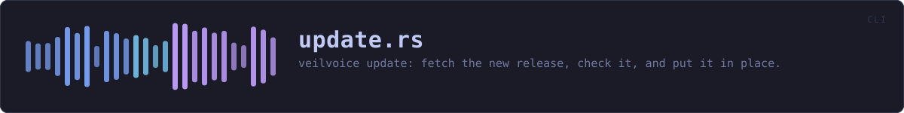
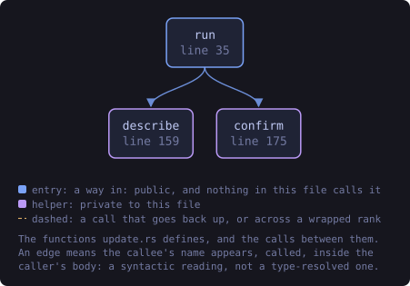
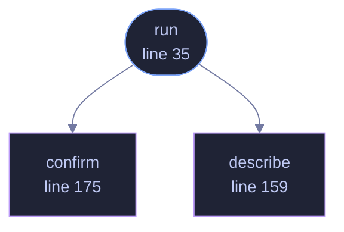

<!-- SPDX-License-Identifier: GPL-3.0-or-later -->
<!-- GENERATED by tools/docs/generate.py from the doc comments in the
     source. Do not edit this file: edit the `//!` and `///` comments in
     the .rs files and run the generator again. CI verifies it with
         python tools/docs/generate.py --check
-->

  

# `crates/veilvoice-cli/src/update.rs`

[`veilvoice-cli`](../../../crates/veilvoice-cli/README.md) &middot; 246 lines &middot; [read the source](https://github.com/tilas01/veilvoice/blob/main/crates/veilvoice-cli/src/update.rs)

## Contents

- [Why it asks before it starts, and only then](#why-it-asks-before-it-starts-and-only-then)
- [--check is the old behaviour, kept](#--check-is-the-old-behaviour-kept)
  - [What this file contains](#what-this-file-contains)
  - [What calls what](#what-calls-what)
  - [Items](#items)

`veilvoice update`: fetch the new release, check it, and put it in place.

**Roadmap item 179.** Everything that decides anything is in
`veilvoice_verify::update`, and this file is the terminal in front of it:
it prints what is happening, asks for the app lock when the machine has one,
and turns the result into an exit status. Nothing here fetches, checks or
replaces, so the window doing the same thing later does not get a second
implementation of any of it.

# Why it asks before it starts, and only then

The passphrase is collected once, before anything is downloaded, because
`veilvoice_verify::update::perform` refuses a locked machine without one
and there is no sense downloading eighty megabytes to be told so. It is
never collected where an app lock is not set: a program that asks for a
passphrase it has no use for is teaching people to type one at whatever
asks.

# `--check` is the old behaviour, kept

`veilvoice update --check` reports the version and does nothing else, which
is exactly what the desktop button did before this existed. Somebody who
wants to know and then decide for themselves is not being made to update,
and the account of what a version number on a page is worth is printed with
it.

## What this file contains

246 lines defining **3 functions** (1 public), **0 types** and **0 constants**. Everything below is read out of the source, so it cannot disagree with the code.

**What happens when it runs.** These are the ways in: public, and nothing else in this file calls them, so they are what an outside caller reaches first.

- `run` (line 35) -- Run the command.
  - reaches: `confirm`, `describe`

## What calls what

The functions this file defines, and the calls between them. Both
are read out of the source: an edge means the callee's name appears,
called, inside the caller's body. It is a syntactic reading, not a
type-resolved one, so a call made through a trait object or a macro
will not appear.

_Colour key: **entry** -- a way in: public, and nothing in this file calls it; **helper** -- private to this file._

  

The same graph as Mermaid source

## Items

| Item | Line | Documentation |
|---|---:|---|
| `run` pub fn | [35](https://github.com/tilas01/veilvoice/blob/main/crates/veilvoice-cli/src/update.rs#L35) | Run the command. |
| `describe` fn | [159](https://github.com/tilas01/veilvoice/blob/main/crates/veilvoice-cli/src/update.rs#L159) | One line per step, in the present participle, because it is printed as the step begins rather than after it. |
| `confirm` fn | [175](https://github.com/tilas01/veilvoice/blob/main/crates/veilvoice-cli/src/update.rs#L175) | Ask before replacing the program the person is running. |

---

Generated from `crates/veilvoice-cli/src/update.rs`. On the website: [`website/reference/veilvoice-cli/update.html`](../../../website/reference/veilvoice-cli/update.html).

Signing key fingerprint `8101FB3BB28D02FB239E0CDF9CC1C7E7A9B5833A`.
