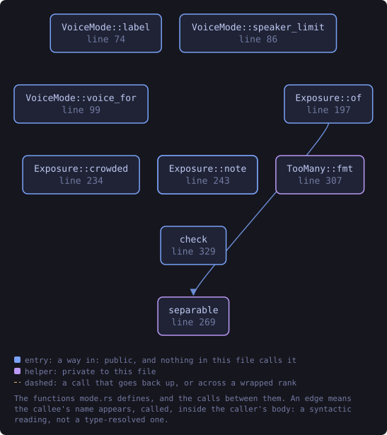

<!-- SPDX-License-Identifier: GPL-3.0-or-later -->
<!-- GENERATED by tools/docs/generate.py from the doc comments in the
     source. Do not edit this file: edit the `//!` and `///` comments in
     the .rs files and run the generator again. CI verifies it with
         python tools/docs/generate.py --check
-->

  

# `crates/veilvoice-conversation/src/mode.rs`

[`veilvoice-conversation`](../../../crates/veilvoice-conversation/README.md) &middot; 592 lines &middot; [read the source](https://github.com/tilas01/veilvoice/blob/main/crates/veilvoice-conversation/src/mode.rs)

## Contents

- [The limit is measured, not chosen](#the-limit-is-measured-not-chosen)
- [Two ways to be told apart, and the second one is safer](#two-ways-to-be-told-apart-and-the-second-one-is-safer)
- [In plain words](#in-plain-words)
  - [What this file contains](#what-this-file-contains)
  - [What calls what](#what-calls-what)
  - [Items](#items)

How many voices a group gets, and the trade between the two answers.

# The limit is measured, not chosen

The engine holds ten destination voices and all ten are different. Only
**eight** are far enough apart that somebody following a conversation can
tell which is which: adding the ninth brings the closest pair to 1.1842 --
two voices with exactly the same rendered pitch and vocal tracts 18 % apart
-- and that is under the three-semitone floor a listener needs when the two
voices are half a minute apart rather than side by side.

`veilvoice_core::voices::clear_voices` computes it from the configuration
in force, because a coarser frame grid collapses registers onto each other
and eight stops being true.

# Two ways to be told apart, and the second one is safer

`VoiceMode::Distinct` gives each speaker their own voice. It is the
obvious arrangement and it is what most recordings want, and it is capped at
the measured limit, because handing two people voices nobody can separate
produces a recording in which two speakers sound like one, discovered only
after the recording exists.

`VoiceMode::Uniform` gives **everybody the same voice**, and the speakers
are told apart by their names in the subtitles and by which circle lights up
in the picture. That has two consequences worth stating plainly, one of each
kind:

* **It is more private.** In distinct mode the output carries one bit of
structure the input had: *this is speaker three*. Anybody who obtains two
recordings of the same group can align them by voice slot. Uniform mode
does not have that structure to leak, because every speaker is the same voice, so
there is nothing to align.
* **It is harder to follow by ear alone.** A listener with no subtitles and
no picture cannot tell who is speaking. That is the price, and it is why
this is not the default.

Uniform mode has **no speaker limit** from voices, because there is no
second voice to collide with. The plan's own ten-speaker limit still
applies, because ten names is already a great deal to follow.

# In plain words

How many people can be in one recording, and the choice between two ways of
handling them.

Give everybody a different voice and a listener can follow the conversation by
ear, but only so many of the available voices are far enough apart to actually
be told apart. That number was measured rather than picked, and the limit is
real: past it, two people would sound like one person and you would only find
out by listening to the finished recording.

Give everybody the *same* voice and there is no limit, and it is more private,
because the result no longer carries even the fact of who was speaker three.
The price is that names and pictures become the only way to tell who is talking.

## What this file contains

592 lines defining **10 functions** (8 public), **3 types** and **0 constants**. Everything below is read out of the source, so it cannot disagree with the code.

**The types it owns.**

- `enum VoiceMode` (line 63) -- Whether speakers get different voices or one voice between them.
- `struct Exposure` (line 167) -- What the finished recording says about who was speaking.
- `enum TooMany` (line 289) -- Why a group cannot be rendered as asked.

**What happens when it runs.** These are the ways in: public, and nothing else in this file calls them, so they are what an outside caller reaches first.

- `VoiceMode::label` (line 74) -- A short name, for a picker.
- `VoiceMode::speaker_limit` (line 86) -- The most speakers this mode can carry under config.
- `VoiceMode::voice_for` (line 99) -- The voice a slot gets in this mode.
- `VoiceMode::note` (line 107) -- What this mode costs and buys, in the words a front end should show.
- `Exposure::of` (line 197) -- What this recording gives away, for speakers people under config.
  - reaches: `separable`
- `Exposure::crowded` (line 234) -- Whether the voices handed out are too close to be told apart.
- `Exposure::note` (line 243) -- One sentence for the interface, saying what the number means here.
- `check` (line 329) -- Whether this many speakers can be rendered in this mode.

## What calls what

The functions this file defines, and the calls between them. Both
are read out of the source: an edge means the callee's name appears,
called, inside the caller's body. It is a syntactic reading, not a
type-resolved one, so a call made through a trait object or a macro
will not appear.

_Colour key: **entry** -- a way in: public, and nothing in this file calls it; **helper** -- private to this file._

  

The same graph as Mermaid source

```mermaid
%%{init: {"theme":"base","themeVariables":{"background":"#1a1b26","primaryColor":"#1f2335","primaryTextColor":"#c0caf5","primaryBorderColor":"#7aa2f7","secondaryColor":"#16161e","tertiaryColor":"#16161e","lineColor":"#737aa2","textColor":"#c0caf5","mainBkg":"#1f2335","nodeBorder":"#7aa2f7","clusterBkg":"#16161e","clusterBorder":"#2f3549","fontFamily":"ui-monospace, SFMono-Regular, Consolas, monospace","fontSize":"14px"}}}%%
flowchart TD
    n_label(["VoiceMode::label<br/>line 74"])
    n_speaker_limit(["VoiceMode::speaker_limit<br/>line 86"])
    n_voice_for(["VoiceMode::voice_for<br/>line 99"])
    n_note(["VoiceMode::note<br/>line 107"])
    n_of(["Exposure::of<br/>line 197"])
    n_crowded(["Exposure::crowded<br/>line 234"])
    n_note(["Exposure::note<br/>line 243"])
    n_separable["separable<br/>line 269"]
    n_fmt["TooMany::fmt<br/>line 307"]
    n_check(["check<br/>line 329"])
    n_of --> n_separable
    click n_label href "https://github.com/tilas01/veilvoice/blob/main/crates/veilvoice-conversation/src/mode.rs#L74" "open the source"
    click n_speaker_limit href "https://github.com/tilas01/veilvoice/blob/main/crates/veilvoice-conversation/src/mode.rs#L86" "open the source"
    click n_voice_for href "https://github.com/tilas01/veilvoice/blob/main/crates/veilvoice-conversation/src/mode.rs#L99" "open the source"
    click n_note href "https://github.com/tilas01/veilvoice/blob/main/crates/veilvoice-conversation/src/mode.rs#L107" "open the source"
    click n_of href "https://github.com/tilas01/veilvoice/blob/main/crates/veilvoice-conversation/src/mode.rs#L197" "open the source"
    click n_crowded href "https://github.com/tilas01/veilvoice/blob/main/crates/veilvoice-conversation/src/mode.rs#L234" "open the source"
    click n_note href "https://github.com/tilas01/veilvoice/blob/main/crates/veilvoice-conversation/src/mode.rs#L243" "open the source"
    click n_separable href "https://github.com/tilas01/veilvoice/blob/main/crates/veilvoice-conversation/src/mode.rs#L269" "open the source"
    click n_fmt href "https://github.com/tilas01/veilvoice/blob/main/crates/veilvoice-conversation/src/mode.rs#L307" "open the source"
    click n_check href "https://github.com/tilas01/veilvoice/blob/main/crates/veilvoice-conversation/src/mode.rs#L329" "open the source"
    classDef entry fill:#1f2335,stroke:#7aa2f7,color:#c0caf5
    class n_label,n_speaker_limit,n_voice_for,n_note,n_of,n_crowded,n_note,n_check entry
    classDef helper fill:#1f2335,stroke:#bb9af7,color:#c0caf5
    class n_separable,n_fmt helper
```

## Items

| Item | Line | Documentation |
|---|---:|---|
| `VoiceMode` pub enum | [63](https://github.com/tilas01/veilvoice/blob/main/crates/veilvoice-conversation/src/mode.rs#L63) | Whether speakers get different voices or one voice between them. |
| `VoiceMode::label` pub fn | [74](https://github.com/tilas01/veilvoice/blob/main/crates/veilvoice-conversation/src/mode.rs#L74) | A short name, for a picker. |
| `VoiceMode::speaker_limit` pub fn | [86](https://github.com/tilas01/veilvoice/blob/main/crates/veilvoice-conversation/src/mode.rs#L86) | The most speakers this mode can carry under config. |
| `VoiceMode::voice_for` pub fn | [99](https://github.com/tilas01/veilvoice/blob/main/crates/veilvoice-conversation/src/mode.rs#L99) | The voice a slot gets in this mode. |
| `VoiceMode::note` pub fn | [107](https://github.com/tilas01/veilvoice/blob/main/crates/veilvoice-conversation/src/mode.rs#L107) | What this mode costs and buys, in the words a front end should show. |
| `Exposure` pub struct | [167](https://github.com/tilas01/veilvoice/blob/main/crates/veilvoice-conversation/src/mode.rs#L167) | What the finished recording says about who was speaking. |
| `Exposure::of` pub fn | [197](https://github.com/tilas01/veilvoice/blob/main/crates/veilvoice-conversation/src/mode.rs#L197) | What this recording gives away, for speakers people under config. |
| `Exposure::crowded` pub fn | [234](https://github.com/tilas01/veilvoice/blob/main/crates/veilvoice-conversation/src/mode.rs#L234) | Whether the voices handed out are too close to be told apart. |
| `Exposure::note` pub fn | [243](https://github.com/tilas01/veilvoice/blob/main/crates/veilvoice-conversation/src/mode.rs#L243) | One sentence for the interface, saying what the number means here. |
| `separable` fn | [269](https://github.com/tilas01/veilvoice/blob/main/crates/veilvoice-conversation/src/mode.rs#L269) | How many of the first count voices a listener can actually separate. |
| `TooMany` pub enum | [289](https://github.com/tilas01/veilvoice/blob/main/crates/veilvoice-conversation/src/mode.rs#L289) | Why a group cannot be rendered as asked. |
| `TooMany::fmt` fn | [307](https://github.com/tilas01/veilvoice/blob/main/crates/veilvoice-conversation/src/mode.rs#L307) |  |
| `check` pub fn | [329](https://github.com/tilas01/veilvoice/blob/main/crates/veilvoice-conversation/src/mode.rs#L329) | Whether this many speakers can be rendered in this mode. |
| `exposure_tests` mod | [450](https://github.com/tilas01/veilvoice/blob/main/crates/veilvoice-conversation/src/mode.rs#L450) |  |

---

Generated from `crates/veilvoice-conversation/src/mode.rs`. On the website: [`website/reference/veilvoice-conversation/mode.html`](../../../website/reference/veilvoice-conversation/mode.html).

Signing key fingerprint `8101FB3BB28D02FB239E0CDF9CC1C7E7A9B5833A`.
