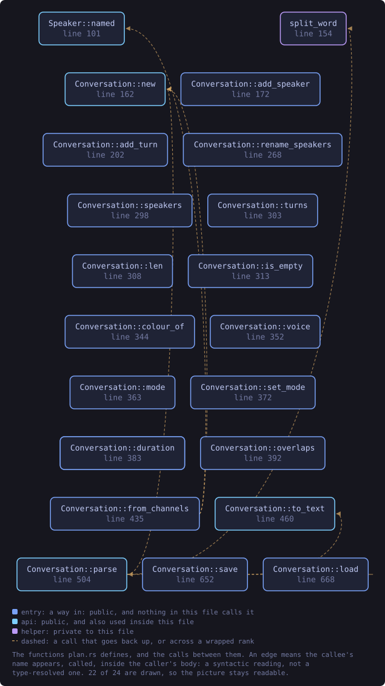

<!-- SPDX-License-Identifier: GPL-3.0-or-later -->
<!-- GENERATED by tools/docs/generate.py from the doc comments in the
     source. Do not edit this file: edit the `//!` and `///` comments in
     the .rs files and run the generator again. CI verifies it with
         python tools/docs/generate.py --check
-->

<p align="center">
  
</p>

# `crates/veilvoice-conversation/src/plan.rs`

[`veilvoice-conversation`](../../../crates/veilvoice-conversation/README.md) &middot; 947 lines &middot; [read the source](https://github.com/tilas01/veilvoice/blob/main/crates/veilvoice-conversation/src/plan.rs)

## Contents

- [VeilVoice does not work out who is talking, and will not guess](#veilvoice-does-not-work-out-who-is-talking-and-will-not-guess)
- [Format](#format)
- [In plain words](#in-plain-words)
  - [What this file contains](#what-this-file-contains)
  - [What calls what](#what-calls-what)
  - [Items](#items)

Who is in the recording, and who is speaking when.

# VeilVoice does not work out who is talking, and will not guess

Deciding which person is speaking at each moment is *speaker diarisation*,
and doing it from the audio alone needs a trained model. This project ships
no model, talks to no server, and is not about to start doing either, so
the turns come from the user, and there are exactly two honest ways to get
them:

* **One microphone each.** If the recording has a channel per person, the
split is already there and is exact. `Conversation::from_channels`
builds the plan from that.
* **A list of turns.** Times and speakers, in a text file, written by
whoever was there or produced by whatever tool they already use for
transcripts.

What would be worse than either is guessing. A wrong guess maps two people
onto one voice, which is a privacy *improvement* and a usability disaster,
or splits one person across two voices, which invites a listener to believe
there was somebody in the room who was not. Neither failure would be visible
in the output, and both would be blamed on the recording rather than on the
tool.

# Format

Text, one record per line, for the same reason everything else here is text:
a file describing who said what is worth more if it can be read, checked and
edited without this program.

```text
VEILCONV1
title  Two people, one microphone
speaker  0  Alex
speaker  1  Sam  portrait.png
turn  0.000  4.200  0  Hello -- how did it go?
turn  4.100  9.050  1
```

Times are seconds with a decimal point. The text on a turn is optional: with
it, subtitles carry the words; without it they carry the speaker's name and
nothing else, which is still enough to follow a conversation whose voices
have all been replaced.

Overlapping turns are allowed, because people talk over each other, and
`crate::render` mixes them rather than picking a winner.

# In plain words

A list of who is in a recording and when each of them speaks.

VeilVoice does not work this out for itself. Deciding who is talking at any
moment is a hard problem that needs a trained model, and this project does not
ship one, so it asks instead. You either write the times down, or you record
each person on their own microphone.

That is less convenient and it is honest. A program that guessed would
sometimes put one person's words in another person's voice, and you would not
find out by listening, because the result would sound perfectly fine.

## What this file contains

947 lines defining **21 functions** (21 public), **3 types** and **1 constant**. Everything below is read out of the source, so it cannot disagree with the code.

**The types it owns.**

- `struct Speaker` (line 71) -- One person in the recording.
- `struct Turn` (line 97) -- A span of the recording belonging to one speaker.
- `struct Conversation` (line 121) -- The whole plan: who is in the recording, and when each of them speaks.

**What happens when it runs.** These are the ways in: public, and nothing else in this file calls them, so they are what an outside caller reaches first.

- `Turn::duration` (line 114) -- How long this turn lasts, in seconds.
- `Conversation::add_speaker` (line 147) -- Add a speaker, and return the index they were given.
- `Conversation::add_turn` (line 169) -- Add a turn.
- `Conversation::rename_speakers` (line 235) -- Rename everybody, in slot order, keeping every turn where it is.
- `Conversation::speakers` (line 265) -- The speakers, in the order they were added.
- `Conversation::turns` (line 270) -- The turns, in time order.
- `Conversation::len` (line 275) -- How many speakers there are.
- `Conversation::is_empty` (line 280) -- Whether there is nobody in the plan.
- `Conversation::voice` (line 285) -- The destination voice for a speaker.
- `Conversation::mode` (line 296) -- Whether every speaker gets their own voice, or one between them.
- `Conversation::set_mode` (line 305) -- Render every speaker as the same voice, or as their own.
- `Conversation::duration` (line 316) -- When the last turn ends, in seconds.
- `Conversation::overlaps` (line 325) -- Turns where two people are speaking at once.
- `Conversation::self_overlaps` (line 346) -- Spans where a speaker's turns overlap their own other turns.
- `Conversation::from_channels` (line 368) -- A plan for a recording with one microphone per person.
  - reaches: `named`, `new`
- `Conversation::save` (line 525) -- Write the plan to path.
  - reaches: `to_text`
- `Conversation::load` (line 536) -- Read a plan written by Conversation::save.
  - reaches: `parse`, `new`

## What calls what

The functions this file defines, and the calls between them. Both
are read out of the source: an edge means the callee's name appears,
called, inside the caller's body. It is a syntactic reading, not a
type-resolved one, so a call made through a trait object or a macro
will not appear.

_Colour key: **entry** -- a way in: public, and nothing in this file calls it; **api** -- public, and also used inside this file._

<p align="center">
  
</p>

<details>
<summary>The same graph as Mermaid source</summary>



</details>

```mermaid
%%{init: {"theme":"base","themeVariables":{"background":"#1a1b26","primaryColor":"#1f2335","primaryTextColor":"#c0caf5","primaryBorderColor":"#7aa2f7","secondaryColor":"#16161e","tertiaryColor":"#16161e","lineColor":"#737aa2","textColor":"#c0caf5","mainBkg":"#1f2335","nodeBorder":"#7aa2f7","clusterBkg":"#16161e","clusterBorder":"#2f3549","fontFamily":"ui-monospace, SFMono-Regular, Consolas, monospace","fontSize":"14px"}}}%%
flowchart TD
    n_named["Speaker::named<br/>line 87"]
    n_duration(["Turn::duration<br/>line 114"])
    n_new["Conversation::new<br/>line 137"]
    n_add_speaker(["Conversation::add_speaker<br/>line 147"])
    n_add_turn(["Conversation::add_turn<br/>line 169"])
    n_rename_speakers(["Conversation::rename_speakers<br/>line 235"])
    n_speakers(["Conversation::speakers<br/>line 265"])
    n_turns(["Conversation::turns<br/>line 270"])
    n_len(["Conversation::len<br/>line 275"])
    n_is_empty(["Conversation::is_empty<br/>line 280"])
    n_voice(["Conversation::voice<br/>line 285"])
    n_mode(["Conversation::mode<br/>line 296"])
    n_set_mode(["Conversation::set_mode<br/>line 305"])
    n_duration(["Conversation::duration<br/>line 316"])
    n_overlaps(["Conversation::overlaps<br/>line 325"])
    n_self_overlaps(["Conversation::self_overlaps<br/>line 346"])
    n_from_channels(["Conversation::from_channels<br/>line 368"])
    n_to_text["Conversation::to_text<br/>line 393"]
    n_parse["Conversation::parse<br/>line 430"]
    n_save(["Conversation::save<br/>line 525"])
    n_load(["Conversation::load<br/>line 536"])
    n_from_channels --> n_named
    n_from_channels --> n_new
    n_load --> n_parse
    n_parse --> n_new
    n_save --> n_to_text
    click n_named href "https://github.com/tilas01/veilvoice/blob/main/crates/veilvoice-conversation/src/plan.rs#L87" "open the source"
    click n_duration href "https://github.com/tilas01/veilvoice/blob/main/crates/veilvoice-conversation/src/plan.rs#L114" "open the source"
    click n_new href "https://github.com/tilas01/veilvoice/blob/main/crates/veilvoice-conversation/src/plan.rs#L137" "open the source"
    click n_add_speaker href "https://github.com/tilas01/veilvoice/blob/main/crates/veilvoice-conversation/src/plan.rs#L147" "open the source"
    click n_add_turn href "https://github.com/tilas01/veilvoice/blob/main/crates/veilvoice-conversation/src/plan.rs#L169" "open the source"
    click n_rename_speakers href "https://github.com/tilas01/veilvoice/blob/main/crates/veilvoice-conversation/src/plan.rs#L235" "open the source"
    click n_speakers href "https://github.com/tilas01/veilvoice/blob/main/crates/veilvoice-conversation/src/plan.rs#L265" "open the source"
    click n_turns href "https://github.com/tilas01/veilvoice/blob/main/crates/veilvoice-conversation/src/plan.rs#L270" "open the source"
    click n_len href "https://github.com/tilas01/veilvoice/blob/main/crates/veilvoice-conversation/src/plan.rs#L275" "open the source"
    click n_is_empty href "https://github.com/tilas01/veilvoice/blob/main/crates/veilvoice-conversation/src/plan.rs#L280" "open the source"
    click n_voice href "https://github.com/tilas01/veilvoice/blob/main/crates/veilvoice-conversation/src/plan.rs#L285" "open the source"
    click n_mode href "https://github.com/tilas01/veilvoice/blob/main/crates/veilvoice-conversation/src/plan.rs#L296" "open the source"
    click n_set_mode href "https://github.com/tilas01/veilvoice/blob/main/crates/veilvoice-conversation/src/plan.rs#L305" "open the source"
    click n_duration href "https://github.com/tilas01/veilvoice/blob/main/crates/veilvoice-conversation/src/plan.rs#L316" "open the source"
    click n_overlaps href "https://github.com/tilas01/veilvoice/blob/main/crates/veilvoice-conversation/src/plan.rs#L325" "open the source"
    click n_self_overlaps href "https://github.com/tilas01/veilvoice/blob/main/crates/veilvoice-conversation/src/plan.rs#L346" "open the source"
    click n_from_channels href "https://github.com/tilas01/veilvoice/blob/main/crates/veilvoice-conversation/src/plan.rs#L368" "open the source"
    click n_to_text href "https://github.com/tilas01/veilvoice/blob/main/crates/veilvoice-conversation/src/plan.rs#L393" "open the source"
    click n_parse href "https://github.com/tilas01/veilvoice/blob/main/crates/veilvoice-conversation/src/plan.rs#L430" "open the source"
    click n_save href "https://github.com/tilas01/veilvoice/blob/main/crates/veilvoice-conversation/src/plan.rs#L525" "open the source"
    click n_load href "https://github.com/tilas01/veilvoice/blob/main/crates/veilvoice-conversation/src/plan.rs#L536" "open the source"
    classDef entry fill:#1f2335,stroke:#7aa2f7,color:#c0caf5
    class n_duration,n_add_speaker,n_add_turn,n_rename_speakers,n_speakers,n_turns,n_len,n_is_empty,n_voice,n_mode,n_set_mode,n_duration,n_overlaps,n_self_overlaps,n_from_channels,n_save,n_load entry
    classDef api fill:#1f2335,stroke:#7dcfff,color:#c0caf5
    class n_named,n_new,n_to_text,n_parse api
```

## Items

| Item | Line | Documentation |
|---|---:|---|
| `MAGIC` <sub>const</sub> | [67](https://github.com/tilas01/veilvoice/blob/main/crates/veilvoice-conversation/src/plan.rs#L67) | Magic first line. |
| `Speaker` <sub>pub struct</sub> | [71](https://github.com/tilas01/veilvoice/blob/main/crates/veilvoice-conversation/src/plan.rs#L71) | One person in the recording. |
| `Speaker::named` <sub>pub fn</sub> | [87](https://github.com/tilas01/veilvoice/blob/main/crates/veilvoice-conversation/src/plan.rs#L87) | A speaker with a name and no picture. |
| `Turn` <sub>pub struct</sub> | [97](https://github.com/tilas01/veilvoice/blob/main/crates/veilvoice-conversation/src/plan.rs#L97) | A span of the recording belonging to one speaker. |
| `Turn::duration` <sub>pub fn</sub> | [114](https://github.com/tilas01/veilvoice/blob/main/crates/veilvoice-conversation/src/plan.rs#L114) | How long this turn lasts, in seconds. |
| `Conversation` <sub>pub struct</sub> | [121](https://github.com/tilas01/veilvoice/blob/main/crates/veilvoice-conversation/src/plan.rs#L121) | The whole plan: who is in the recording, and when each of them speaks. |
| `Conversation::new` <sub>pub fn</sub> | [137](https://github.com/tilas01/veilvoice/blob/main/crates/veilvoice-conversation/src/plan.rs#L137) | An empty plan. |
| `Conversation::add_speaker` <sub>pub fn</sub> | [147](https://github.com/tilas01/veilvoice/blob/main/crates/veilvoice-conversation/src/plan.rs#L147) | Add a speaker, and return the index they were given. |
| `Conversation::add_turn` <sub>pub fn</sub> | [169](https://github.com/tilas01/veilvoice/blob/main/crates/veilvoice-conversation/src/plan.rs#L169) | Add a turn. |
| `Conversation::rename_speakers` <sub>pub fn</sub> | [235](https://github.com/tilas01/veilvoice/blob/main/crates/veilvoice-conversation/src/plan.rs#L235) | Rename everybody, in slot order, keeping every turn where it is. |
| `Conversation::speakers` <sub>pub fn</sub> | [265](https://github.com/tilas01/veilvoice/blob/main/crates/veilvoice-conversation/src/plan.rs#L265) | The speakers, in the order they were added. |
| `Conversation::turns` <sub>pub fn</sub> | [270](https://github.com/tilas01/veilvoice/blob/main/crates/veilvoice-conversation/src/plan.rs#L270) | The turns, in time order. |
| `Conversation::len` <sub>pub fn</sub> | [275](https://github.com/tilas01/veilvoice/blob/main/crates/veilvoice-conversation/src/plan.rs#L275) | How many speakers there are. |
| `Conversation::is_empty` <sub>pub fn</sub> | [280](https://github.com/tilas01/veilvoice/blob/main/crates/veilvoice-conversation/src/plan.rs#L280) | Whether there is nobody in the plan. |
| `Conversation::voice` <sub>pub fn</sub> | [285](https://github.com/tilas01/veilvoice/blob/main/crates/veilvoice-conversation/src/plan.rs#L285) | The destination voice for a speaker. |
| `Conversation::mode` <sub>pub fn</sub> | [296](https://github.com/tilas01/veilvoice/blob/main/crates/veilvoice-conversation/src/plan.rs#L296) | Whether every speaker gets their own voice, or one between them. |
| `Conversation::set_mode` <sub>pub fn</sub> | [305](https://github.com/tilas01/veilvoice/blob/main/crates/veilvoice-conversation/src/plan.rs#L305) | Render every speaker as the same voice, or as their own. |
| `Conversation::duration` <sub>pub fn</sub> | [316](https://github.com/tilas01/veilvoice/blob/main/crates/veilvoice-conversation/src/plan.rs#L316) | When the last turn ends, in seconds. |
| `Conversation::overlaps` <sub>pub fn</sub> | [325](https://github.com/tilas01/veilvoice/blob/main/crates/veilvoice-conversation/src/plan.rs#L325) | Turns where two people are speaking at once. |
| `Conversation::self_overlaps` <sub>pub fn</sub> | [346](https://github.com/tilas01/veilvoice/blob/main/crates/veilvoice-conversation/src/plan.rs#L346) | Spans where a speaker's turns overlap their own other turns. |
| `Conversation::from_channels` <sub>pub fn</sub> | [368](https://github.com/tilas01/veilvoice/blob/main/crates/veilvoice-conversation/src/plan.rs#L368) | A plan for a recording with one microphone per person. |
| `Conversation::to_text` <sub>pub fn</sub> | [393](https://github.com/tilas01/veilvoice/blob/main/crates/veilvoice-conversation/src/plan.rs#L393) | Serialise to the text format described at the top of this module. |
| `Conversation::parse` <sub>pub fn</sub> | [430](https://github.com/tilas01/veilvoice/blob/main/crates/veilvoice-conversation/src/plan.rs#L430) | Parse the text format. |
| `Conversation::save` <sub>pub fn</sub> | [525](https://github.com/tilas01/veilvoice/blob/main/crates/veilvoice-conversation/src/plan.rs#L525) | Write the plan to path. |
| `Conversation::load` <sub>pub fn</sub> | [536](https://github.com/tilas01/veilvoice/blob/main/crates/veilvoice-conversation/src/plan.rs#L536) | Read a plan written by Conversation::save. |

---

Generated from `crates/veilvoice-conversation/src/plan.rs`. On the website: [`website/reference/veilvoice-conversation/plan.html`](../../../website/reference/veilvoice-conversation/plan.html).

Signing key fingerprint `8101FB3BB28D02FB239E0CDF9CC1C7E7A9B5833A`.
