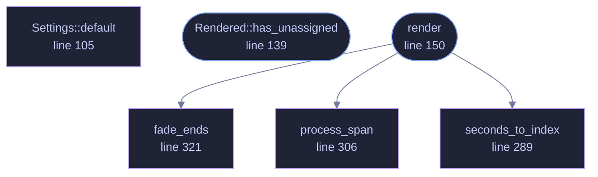

<!-- SPDX-License-Identifier: GPL-3.0-or-later -->
<!-- GENERATED by tools/docs/generate.py from the doc comments in the
     source. Do not edit this file: edit the `//!` and `///` comments in
     the .rs files and run the generator again. CI verifies it with
         python tools/docs/generate.py --check
-->

  

# `crates/veilvoice-conversation/src/render.rs`

[`veilvoice-conversation`](../../../crates/veilvoice-conversation/README.md) &middot; 688 lines &middot; [read the source](https://github.com/tilas01/veilvoice/blob/main/crates/veilvoice-conversation/src/render.rs)

## Contents

- [One engine each, and why that is not merely convenient](#one-engine-each-and-why-that-is-not-merely-convenient)
- [A speaker needs a few seconds before they arrive at their voice](#a-speaker-needs-a-few-seconds-before-they-arrive-at-their-voice)
- [Audio nobody claimed is silenced, and the amount is reported](#audio-nobody-claimed-is-silenced-and-the-amount-is-reported)
- [Latency is removed, so a turn lands where the plan said](#latency-is-removed-so-a-turn-lands-where-the-plan-said)
- [Boundaries are faded, because a splice is a click](#boundaries-are-faded-because-a-splice-is-a-click)
- [Overlaps are mixed, and the mixing is admitted](#overlaps-are-mixed-and-the-mixing-is-admitted)
  - [What this file contains](#what-this-file-contains)
  - [What calls what](#what-calls-what)
  - [Items](#items)

Turning a plan and a recording into veiled audio, one engine per speaker.

# One engine each, and why that is not merely convenient

Every speaker gets their own `veilvoice_core::Deidentifier`, built with
their slot's destination voice and **its own seed**. Three consequences,
and all three are the point:

* Each speaker arrives at their own canonical register and vocal tract, so
the output is followable.
* Each speaker's modulation stream is independent, so the ratchet in one
voice tells an adversary nothing about another.
* Each speaker's engine keeps its state **across their own turns**. The
accent neutraliser needs a few seconds to measure a speaker before its
corrections reach full strength; carrying that across the turns of one
person means it converges once, rather than warming up again every time
they take a breath.

# A speaker needs a few seconds before they arrive at their voice

The accent neutraliser ramps its corrections in over
`veilvoice_core::WARMUP_S` of **voiced** audio, from nothing. Until it has
finished, a speaker is only partly moved toward their destination register --
so a slot that should sound like 187 Hz sounds like something between the
original speaker and 187 Hz.

This was found by measuring the fundamental of a rendered file rather than
by reading the code: ten slots given one second each came out at three
distinct pitches, and the same ten given five seconds each came out at four,
exactly where the table says. Nothing was wrong with the table the second
time; the first measurement was of the ramp.

Keeping one engine per speaker across all of their turns is what makes this
bearable -- the ramp happens **once per speaker for the whole recording**
rather than once per turn. A speaker whose total time is shorter than the
ramp never finishes it, so `Rendered::notes` says so by name.

What is **not** affected: the phase discard and the CSPRNG modulation are
unconditional and full strength from the first frame. Those are the two
reasons the transform is one-way. The ramp weakens the *normalisation onto a
canonical register* early on, which costs distinguishability between
speakers, and leaves some of the original pitch contour in the first couple
of seconds.

# Audio nobody claimed is silenced, and the amount is reported

A gap between turns is a span the plan does not assign to anybody. It is
**silenced**, never passed through.

That is the one decision in this file that is not a trade-off. Passing
unassigned audio through unveiled would put somebody's real voice into a
file whose entire purpose is that it contains no real voice — because of a
gap in a text file, silently, in the middle of an otherwise veiled
recording. Silence loses content and can be seen; a raw voice cannot be
unheard.

`Rendered::unassigned_secs` says how much went, so a plan with a hole in
it is a thing you find out about rather than a thing you notice later.

# Latency is removed, so a turn lands where the plan said

The engine has a fixed algorithmic latency — the STFT cannot emit a sample
until it has a frame around it. Each span is therefore processed with a tail
of silence and the first `latency_samples` of output are dropped, which puts
the veiled audio back exactly where the original was. Without this every
turn would drift later than the subtitle describing it, by about 16 ms at
the default frame size, and a subtitle 16 ms late is a subtitle that looks
wrong.

# Boundaries are faded, because a splice is a click

Cutting audio at an arbitrary sample and starting different audio there
produces a step, and a step is broadband noise. Each rendered span is faded
in and out over a few milliseconds. Short enough not to swallow a syllable,
long enough to remove the click.

# Overlaps are mixed, and the mixing is admitted

Two people talking at once is two engines writing into the same samples, so
their outputs are summed. A sum can exceed full scale; when it does, the
whole output is scaled down by one factor and `Rendered::gain_applied`
records it. One factor for the whole file rather than a limiter that acts
only where it clipped, because a limiter changes the relative loudness of
the speakers and this crate has just spent considerable effort making them
distinguishable.

## What this file contains

688 lines defining **6 functions** (2 public), **2 types** and **0 constants**. Everything below is read out of the source, so it cannot disagree with the code.

**The types it owns.**

- `struct Settings` (line 93) -- How to render.
- `struct Rendered` (line 117) -- What came back.

**What happens when it runs.** These are the ways in: public, and nothing else in this file calls them, so they are what an outside caller reaches first.

- `Rendered::has_unassigned` (line 139) -- Whether some of the recording was silenced because no turn claimed it.
- `render` (line 150) -- Render input according to plan.
  - reaches: `fade_ends`, `process_span`, `seconds_to_index`

## What calls what

The functions this file defines, and the calls between them. Both
are read out of the source: an edge means the callee's name appears,
called, inside the caller's body. It is a syntactic reading, not a
type-resolved one, so a call made through a trait object or a macro
will not appear.

_Colour key: **entry** -- a way in: public, and nothing in this file calls it; **helper** -- private to this file._

## Items

| Item | Line | Documentation |
|---|---:|---|
| `Settings` pub struct | [93](https://github.com/tilas01/veilvoice/blob/main/crates/veilvoice-conversation/src/render.rs#L93) | How to render. |
| `Settings::default` fn | [105](https://github.com/tilas01/veilvoice/blob/main/crates/veilvoice-conversation/src/render.rs#L105) |  |
| `Rendered` pub struct | [117](https://github.com/tilas01/veilvoice/blob/main/crates/veilvoice-conversation/src/render.rs#L117) | What came back. |
| `Rendered::has_unassigned` pub fn | [139](https://github.com/tilas01/veilvoice/blob/main/crates/veilvoice-conversation/src/render.rs#L139) | Whether some of the recording was silenced because no turn claimed it. |
| `render` pub fn | [150](https://github.com/tilas01/veilvoice/blob/main/crates/veilvoice-conversation/src/render.rs#L150) | Render input according to plan. |
| `seconds_to_index` fn | [289](https://github.com/tilas01/veilvoice/blob/main/crates/veilvoice-conversation/src/render.rs#L289) | A time in seconds as a sample index, clamped into the recording. |
| `process_span` fn | [306](https://github.com/tilas01/veilvoice/blob/main/crates/veilvoice-conversation/src/render.rs#L306) | Run one span through one engine and give back audio aligned with the input. |
| `fade_ends` fn | [321](https://github.com/tilas01/veilvoice/blob/main/crates/veilvoice-conversation/src/render.rs#L321) | Fade the first and last fade samples, so a splice is not a click. |

---

Generated from `crates/veilvoice-conversation/src/render.rs`. On the website: [`website/reference/veilvoice-conversation/render.html`](../../../website/reference/veilvoice-conversation/render.html).

Signing key fingerprint `8101FB3BB28D02FB239E0CDF9CC1C7E7A9B5833A`.
