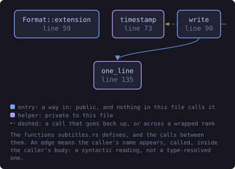
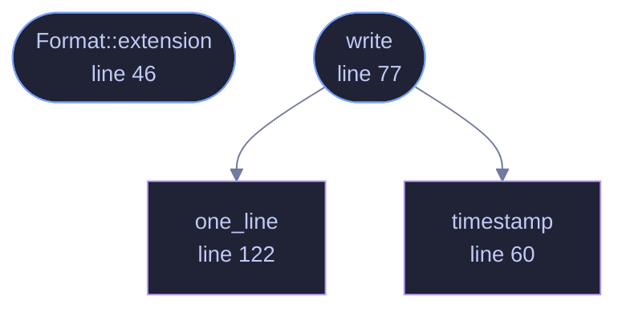

<!-- SPDX-License-Identifier: GPL-3.0-or-later -->
<!-- GENERATED by tools/docs/generate.py from the doc comments in the
     source. Do not edit this file: edit the `//!` and `///` comments in
     the .rs files and run the generator again. CI verifies it with
         python tools/docs/generate.py --check
-->

  

# `crates/veilvoice-conversation/src/subtitles.rs`

[`veilvoice-conversation`](../../../crates/veilvoice-conversation/README.md) &middot; 263 lines &middot; [read the source](https://github.com/tilas01/veilvoice/blob/main/crates/veilvoice-conversation/src/subtitles.rs)

## Contents

- [Two formats, both written out here](#two-formats-both-written-out-here)
- [What goes in a cue when nobody wrote down the words](#what-goes-in-a-cue-when-nobody-wrote-down-the-words)
- [A name in a caption is not veiled](#a-name-in-a-caption-is-not-veiled)
  - [What this file contains](#what-this-file-contains)
  - [What calls what](#what-calls-what)
  - [Items](#items)

Subtitles, from the same plan the audio is rendered from.

# Two formats, both written out here

**WebVTT** is what a browser plays alongside a `<video>`, and it is the one
to use with anything this project renders. **SubRip** (`.srt`) is what every
other player on earth reads. They differ in three small ways — a header, a
cue counter, and a comma instead of a full stop in the timestamp — so both
come from one function with a flag rather than from two that drift.

No library. The workspace carries no subtitle crate and this is forty lines;
adding a dependency to the graph for it would cost more than it saves, and
the `offline` CI job that checks what is in that graph is one of the things
this project is worth trusting for.

# What goes in a cue when nobody wrote down the words

VeilVoice does not transcribe. Where a turn has no text, the cue carries the
**speaker's name and nothing else** — which is still worth having: after
every voice has been replaced, a caption track saying who is talking is
often the only way to follow a recording at all.

# A name in a caption is not veiled

Worth saying twice, because it is the mistake this feature invites. The
audio has had its voiceprints destroyed. The subtitle file is a text file
containing whatever names were typed into it, sitting next to the recording.
If the names matter, use labels rather than names — the plan does not care
which, and `crate::SCOPE` says so where a user will read it.

## What this file contains

263 lines defining **4 functions** (2 public), **1 type** and **0 constants**. Everything below is read out of the source, so it cannot disagree with the code.

**The types it owns.**

- `enum Format` (line 36) -- Which subtitle format to write.

**What happens when it runs.** These are the ways in: public, and nothing else in this file calls them, so they are what an outside caller reaches first.

- `Format::extension` (line 46) -- The conventional file extension, without the dot.
- `write` (line 77) -- Render the plan as subtitles.
  - reaches: `one_line`, `timestamp`

## What calls what

The functions this file defines, and the calls between them. Both
are read out of the source: an edge means the callee's name appears,
called, inside the caller's body. It is a syntactic reading, not a
type-resolved one, so a call made through a trait object or a macro
will not appear.

_Colour key: **entry** -- a way in: public, and nothing in this file calls it; **helper** -- private to this file._

  

The same graph as Mermaid source

## Items

| Item | Line | Documentation |
|---|---:|---|
| `Format` pub enum | [36](https://github.com/tilas01/veilvoice/blob/main/crates/veilvoice-conversation/src/subtitles.rs#L36) | Which subtitle format to write. |
| `Format::extension` pub fn | [46](https://github.com/tilas01/veilvoice/blob/main/crates/veilvoice-conversation/src/subtitles.rs#L46) | The conventional file extension, without the dot. |
| `timestamp` fn | [60](https://github.com/tilas01/veilvoice/blob/main/crates/veilvoice-conversation/src/subtitles.rs#L60) | A timestamp as the subtitle formats want it: HH:MM:SS.mmm. |
| `write` pub fn | [77](https://github.com/tilas01/veilvoice/blob/main/crates/veilvoice-conversation/src/subtitles.rs#L77) | Render the plan as subtitles. |
| `one_line` fn | [122](https://github.com/tilas01/veilvoice/blob/main/crates/veilvoice-conversation/src/subtitles.rs#L122) | Flatten anything that would break a cue into one line. |

---

Generated from `crates/veilvoice-conversation/src/subtitles.rs`. On the website: [`website/reference/veilvoice-conversation/subtitles.html`](../../../website/reference/veilvoice-conversation/subtitles.html).

Signing key fingerprint `8101FB3BB28D02FB239E0CDF9CC1C7E7A9B5833A`.
