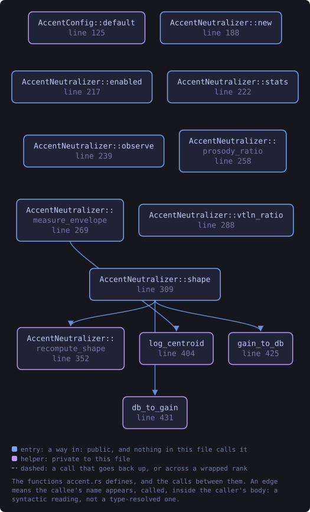

<!-- SPDX-License-Identifier: GPL-3.0-or-later -->
<!-- GENERATED by tools/docs/generate.py from the doc comments in the
     source. Do not edit this file: edit the `//!` and `///` comments in
     the .rs files and run the generator again. CI verifies it with
         python tools/docs/generate.py --check
-->

  

# `crates/veilvoice-core/src/accent.rs`

[`veilvoice-core`](../../../crates/veilvoice-core/README.md) &middot; 696 lines &middot; [read the source](https://github.com/tilas01/veilvoice/blob/main/crates/veilvoice-core/src/accent.rs)

## Contents

- [What an accent is made of, and what a signal-level transform can remove](#what-an-accent-is-made-of-and-what-a-signal-level-transform-can-remove)
- [Why this also strengthens de-identification](#why-this-also-strengthens-de-identification)
- [Preserving intelligibility](#preserving-intelligibility)
- [In plain words](#in-plain-words)
  - [What this file contains](#what-this-file-contains)
  - [What calls what](#what-calls-what)
  - [Items](#items)

Accent and speaker-trait neutralisation.

# What an accent is made of, and what a signal-level transform can remove

Accent is carried by two very different kinds of cue, and they have opposite
answers here:

* **Suprasegmental cues** — intonation contour and pitch range, long-term
voice quality and spectral tilt, and the fixed vocal-tract scale behind a
speaker's vowel space. These are *properties of the signal*, they are
strongly speaker- and region-identifying, and this module removes them by
mapping every speaker onto one canonical target.
* **Segmental cues** — *which phonemes the speaker actually produced*:
rhoticity, vowel mergers, dental-fricative substitution, aspiration
patterns. These are not a colouration laid over the words; at this level
they **are** the words. Removing them means deciding a different phoneme
was said, which no filter can do — it requires recognising the speech and
re-synthesising it (see the planned text-to-speech mode, which sidesteps
this entirely by never carrying the original signal at all).

So this module makes every speaker land on the same pitch register, the same
apparent vocal-tract length and the same long-term spectral tilt, which
removes the accent's melody and colour and a large part of its perceived
origin. It does not, and cannot, re-articulate phonemes.
`docs/WHITEPAPER.md` must state that limit plainly rather than claim accent
removal is total.

# Why this also strengthens de-identification

Every step here is *many-to-one*: a whole population of input f0 contours,
spectral tilts and vocal-tract lengths is collapsed onto a single canonical
value. That destroys information rather than displacing it, so it composes
with the phase discard in `crate::spectral` — the two are independent
one-way steps, and normalising the speaker's *mean* pitch and vocal-tract
length removes two of the strongest biometric features there are.

# Preserving intelligibility

The critical design rule is that every correction is derived from a
**long-term** average, never from the current frame. Per-frame spectral shape
is what distinguishes /i/ from /u/; normalising it frame-by-frame would erase
the vowels along with the accent. Vocal-tract and tilt corrections therefore
use multi-second time constants, so they track the speaker and leave the
phonemes moving freely underneath.

# In plain words

This is the part that works on accent, and it is careful about what it claims.

An accent is two different things at once. Some of it is in the sound: how high
the voice sits, how it rises and falls, the shape of the vowels. That part can
be changed here, and is.

The rest of it is in the words themselves, and in the choices somebody makes
between them. No amount of altering sound touches that, because it is not in
the sound. So VeilVoice says accent removal is **partial**, and means it.

## What this file contains

696 lines defining **13 functions** (8 public), **3 types** and **10 constants**. Everything below is read out of the source, so it cannot disagree with the code.

**The types it owns.**

- `struct AccentConfig` (line 95) -- How aggressively accent and speaker traits are normalised.
- `struct AccentStats` (line 143) -- Live read-out of what the neutraliser is currently doing, for the UI.
- `struct AccentNeutralizer` (line 162) -- Maps any speaker onto one canonical pitch register, vocal-tract scale and long-term spectrum.

**What happens when it runs.** These are the ways in: public, and nothing else in this file calls them, so they are what an outside caller reaches first.

- `AccentNeutralizer::new` (line 188) -- Build for a given spectrum size and sample rate.
- `AccentNeutralizer::enabled` (line 217) -- Whether neutralisation is active.
- `AccentNeutralizer::stats` (line 222) -- Live read-out for the UI.
- `AccentNeutralizer::observe` (line 239) -- Feed this frame's f0 estimate and update the intonation correction.
- `AccentNeutralizer::prosody_ratio` (line 258) -- Pitch ratio to apply to the excitation this frame.
- `AccentNeutralizer::measure_envelope` (line 269) -- Measure the speaker's vocal-tract scale from the *unwarped* envelope and update the VTLN ratio.
  - reaches: `log_centroid`
- `AccentNeutralizer::vtln_ratio` (line 288) -- Formant ratio to apply to the envelope this frame.
- `AccentNeutralizer::shape` (line 308) -- Rotate the already-warped envelope toward the canonical spectral tilt, then fold the result back into the running average.
  - reaches: `db_to_gain`, `gain_to_db`, `recompute_shape`

## What calls what

The functions this file defines, and the calls between them. Both
are read out of the source: an edge means the callee's name appears,
called, inside the caller's body. It is a syntactic reading, not a
type-resolved one, so a call made through a trait object or a macro
will not appear.

_Colour key: **entry** -- a way in: public, and nothing in this file calls it; **helper** -- private to this file._

  

The same graph as Mermaid source

```mermaid
%%{init: {"theme":"base","themeVariables":{"background":"#1a1b26","primaryColor":"#1f2335","primaryTextColor":"#c0caf5","primaryBorderColor":"#7aa2f7","secondaryColor":"#16161e","tertiaryColor":"#16161e","lineColor":"#737aa2","textColor":"#c0caf5","mainBkg":"#1f2335","nodeBorder":"#7aa2f7","clusterBkg":"#16161e","clusterBorder":"#2f3549","fontFamily":"ui-monospace, SFMono-Regular, Consolas, monospace","fontSize":"14px"}}}%%
flowchart TD
    n_default["AccentConfig::default<br/>line 125"]
    n_new(["AccentNeutralizer::new<br/>line 188"])
    n_enabled(["AccentNeutralizer::enabled<br/>line 217"])
    n_stats(["AccentNeutralizer::stats<br/>line 222"])
    n_observe(["AccentNeutralizer::observe<br/>line 239"])
    n_prosody_ratio(["AccentNeutralizer::prosody_ra…<br/>line 258"])
    n_measure_envelope(["AccentNeutralizer::measure_en…<br/>line 269"])
    n_vtln_ratio(["AccentNeutralizer::vtln_ratio<br/>line 288"])
    n_shape(["AccentNeutralizer::shape<br/>line 308"])
    n_recompute_shape["AccentNeutralizer::recompute_…<br/>line 351"]
    n_log_centroid["log_centroid<br/>line 403"]
    n_gain_to_db["gain_to_db<br/>line 422"]
    n_db_to_gain["db_to_gain<br/>line 426"]
    n_measure_envelope --> n_log_centroid
    n_shape --> n_db_to_gain
    n_shape --> n_gain_to_db
    n_shape --> n_recompute_shape
    click n_default href "https://github.com/tilas01/veilvoice/blob/main/crates/veilvoice-core/src/accent.rs#L125" "open the source"
    click n_new href "https://github.com/tilas01/veilvoice/blob/main/crates/veilvoice-core/src/accent.rs#L188" "open the source"
    click n_enabled href "https://github.com/tilas01/veilvoice/blob/main/crates/veilvoice-core/src/accent.rs#L217" "open the source"
    click n_stats href "https://github.com/tilas01/veilvoice/blob/main/crates/veilvoice-core/src/accent.rs#L222" "open the source"
    click n_observe href "https://github.com/tilas01/veilvoice/blob/main/crates/veilvoice-core/src/accent.rs#L239" "open the source"
    click n_prosody_ratio href "https://github.com/tilas01/veilvoice/blob/main/crates/veilvoice-core/src/accent.rs#L258" "open the source"
    click n_measure_envelope href "https://github.com/tilas01/veilvoice/blob/main/crates/veilvoice-core/src/accent.rs#L269" "open the source"
    click n_vtln_ratio href "https://github.com/tilas01/veilvoice/blob/main/crates/veilvoice-core/src/accent.rs#L288" "open the source"
    click n_shape href "https://github.com/tilas01/veilvoice/blob/main/crates/veilvoice-core/src/accent.rs#L308" "open the source"
    click n_recompute_shape href "https://github.com/tilas01/veilvoice/blob/main/crates/veilvoice-core/src/accent.rs#L351" "open the source"
    click n_log_centroid href "https://github.com/tilas01/veilvoice/blob/main/crates/veilvoice-core/src/accent.rs#L403" "open the source"
    click n_gain_to_db href "https://github.com/tilas01/veilvoice/blob/main/crates/veilvoice-core/src/accent.rs#L422" "open the source"
    click n_db_to_gain href "https://github.com/tilas01/veilvoice/blob/main/crates/veilvoice-core/src/accent.rs#L426" "open the source"
    classDef entry fill:#1f2335,stroke:#7aa2f7,color:#c0caf5
    class n_new,n_enabled,n_stats,n_observe,n_prosody_ratio,n_measure_envelope,n_vtln_ratio,n_shape entry
    classDef helper fill:#1f2335,stroke:#bb9af7,color:#c0caf5
    class n_default,n_recompute_shape,n_log_centroid,n_gain_to_db,n_db_to_gain helper
```

## Items

| Item | Line | Documentation |
|---|---:|---|
| `CENTROID_LO_HZ` const | [62](https://github.com/tilas01/veilvoice/blob/main/crates/veilvoice-core/src/accent.rs#L62) | Lower edge of the band used to measure vocal-tract scale, in hertz. |
| `CENTROID_HI_HZ` const | [64](https://github.com/tilas01/veilvoice/blob/main/crates/veilvoice-core/src/accent.rs#L64) | Upper edge of the band used to measure vocal-tract scale, in hertz. |
| `LTAS_LO_HZ` const | [66](https://github.com/tilas01/veilvoice/blob/main/crates/veilvoice-core/src/accent.rs#L66) | Lower edge of the band whose long-term tilt is normalised. |
| `LTAS_HI_HZ` const | [68](https://github.com/tilas01/veilvoice/blob/main/crates/veilvoice-core/src/accent.rs#L68) | Upper edge of the band whose long-term tilt is normalised. |
| `TILT_REF_HZ` const | [70](https://github.com/tilas01/veilvoice/blob/main/crates/veilvoice-core/src/accent.rs#L70) | Reference frequency of the canonical spectral-tilt line, in hertz. |
| `MAX_SHAPE_DB` const | [72](https://github.com/tilas01/veilvoice/blob/main/crates/veilvoice-core/src/accent.rs#L72) | Maximum long-term shaping applied to any bin, in decibels. |
| `TAU_PROSODY_S` const | [74](https://github.com/tilas01/veilvoice/blob/main/crates/veilvoice-core/src/accent.rs#L74) | Time constant for the intonation correction, in seconds. |
| `TAU_VTLN_S` const | [77](https://github.com/tilas01/veilvoice/blob/main/crates/veilvoice-core/src/accent.rs#L77) | Time constant for the vocal-tract estimate, in seconds. |
| `TAU_LTAS_S` const | [79](https://github.com/tilas01/veilvoice/blob/main/crates/veilvoice-core/src/accent.rs#L79) | Time constant for the long-term average spectrum, in seconds. |
| `WARMUP_S` pub const | [88](https://github.com/tilas01/veilvoice/blob/main/crates/veilvoice-core/src/accent.rs#L88) | Seconds of voiced audio over which corrections fade in from nothing. |
| `AccentConfig` pub struct | [95](https://github.com/tilas01/veilvoice/blob/main/crates/veilvoice-core/src/accent.rs#L95) | How aggressively accent and speaker traits are normalised. |
| `AccentConfig::default` fn | [125](https://github.com/tilas01/veilvoice/blob/main/crates/veilvoice-core/src/accent.rs#L125) |  |
| `AccentStats` pub struct | [143](https://github.com/tilas01/veilvoice/blob/main/crates/veilvoice-core/src/accent.rs#L143) | Live read-out of what the neutraliser is currently doing, for the UI. |
| `AccentNeutralizer` pub struct | [162](https://github.com/tilas01/veilvoice/blob/main/crates/veilvoice-core/src/accent.rs#L162) | Maps any speaker onto one canonical pitch register, vocal-tract scale and long-term spectrum. |
| `AccentNeutralizer::new` pub fn | [188](https://github.com/tilas01/veilvoice/blob/main/crates/veilvoice-core/src/accent.rs#L188) | Build for a given spectrum size and sample rate. |
| `AccentNeutralizer::enabled` pub fn | [217](https://github.com/tilas01/veilvoice/blob/main/crates/veilvoice-core/src/accent.rs#L217) | Whether neutralisation is active. |
| `AccentNeutralizer::stats` pub fn | [222](https://github.com/tilas01/veilvoice/blob/main/crates/veilvoice-core/src/accent.rs#L222) | Live read-out for the UI. |
| `AccentNeutralizer::observe` pub fn | [239](https://github.com/tilas01/veilvoice/blob/main/crates/veilvoice-core/src/accent.rs#L239) | Feed this frame's f0 estimate and update the intonation correction. |
| `AccentNeutralizer::prosody_ratio` pub fn | [258](https://github.com/tilas01/veilvoice/blob/main/crates/veilvoice-core/src/accent.rs#L258) | Pitch ratio to apply to the excitation this frame. |
| `AccentNeutralizer::measure_envelope` pub fn | [269](https://github.com/tilas01/veilvoice/blob/main/crates/veilvoice-core/src/accent.rs#L269) | Measure the speaker's vocal-tract scale from the *unwarped* envelope and update the VTLN ratio. |
| `AccentNeutralizer::vtln_ratio` pub fn | [288](https://github.com/tilas01/veilvoice/blob/main/crates/veilvoice-core/src/accent.rs#L288) | Formant ratio to apply to the envelope this frame. |
| `AccentNeutralizer::shape` pub fn | [308](https://github.com/tilas01/veilvoice/blob/main/crates/veilvoice-core/src/accent.rs#L308) | Rotate the already-warped envelope toward the canonical spectral tilt, then fold the result back into the running average. |
| `AccentNeutralizer::recompute_shape` fn | [351](https://github.com/tilas01/veilvoice/blob/main/crates/veilvoice-core/src/accent.rs#L351) | Rebuild the correction curve from the current long-term average. |
| `log_centroid` fn | [403](https://github.com/tilas01/veilvoice/blob/main/crates/veilvoice-core/src/accent.rs#L403) | Energy-weighted geometric-mean frequency of env over lo, hi bins. |
| `gain_to_db` fn | [422](https://github.com/tilas01/veilvoice/blob/main/crates/veilvoice-core/src/accent.rs#L422) |  |
| `db_to_gain` fn | [426](https://github.com/tilas01/veilvoice/blob/main/crates/veilvoice-core/src/accent.rs#L426) |  |

---

Generated from `crates/veilvoice-core/src/accent.rs`. On the website: [`website/reference/veilvoice-core/accent.html`](../../../website/reference/veilvoice-core/accent.html).

Signing key fingerprint `8101FB3BB28D02FB239E0CDF9CC1C7E7A9B5833A`.
