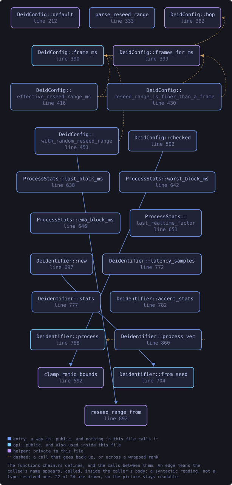

<!-- SPDX-License-Identifier: GPL-3.0-or-later -->
<!-- GENERATED by tools/docs/generate.py from the doc comments in the
     source. Do not edit this file: edit the `//!` and `///` comments in
     the .rs files and run the generator again. CI verifies it with
         python tools/docs/generate.py --check
-->

  

# `crates/veilvoice-core/src/chain.rs`

[`veilvoice-core`](../../../crates/veilvoice-core/README.md) &middot; 1721 lines &middot; [read the source](https://github.com/tilas01/veilvoice/blob/main/crates/veilvoice-core/src/chain.rs)

## Contents

- [The signal path](#the-signal-path)
- [Why it is one-way, in one paragraph](#why-it-is-one-way-in-one-paragraph)
- [Forward secrecy, and what reseedsecs is really for](#forward-secrecy-and-what-reseedsecs-is-really-for)
- [A roll cannot happen faster than a frame, and the interface must say so](#a-roll-cannot-happen-faster-than-a-frame-and-the-interface-must-say-so)
- [Real-time constraints](#real-time-constraints)
- [Configuration is validated in one place](#configuration-is-validated-in-one-place)
- [In plain words](#in-plain-words)
  - [What this file contains](#what-this-file-contains)
  - [What calls what](#what-calls-what)
  - [Items](#items)

The assembled de-identification chain and its live performance statistics.

Every other module in this crate does one job. This is the file that puts
them in order and decides what happens to a block of samples, so it is the
one to read first if you want to know what VeilVoice actually *does* to
audio.

# The signal path

`Deidentifier::process` takes a block of input and writes an equal-length
block of output. Everything below happens inside it, per STFT frame:

1. **Roll the modulation stream** if this frame is the one where the
ratchet fires. See "forward secrecy" below.
2. **Draw this frame's modulation** from the CSPRNG -- a pitch ratio and a
formant ratio, glided toward fresh random targets rather than jumped, so
the scrambling is inaudible as scrambling.
3. **Track the fundamental** from the newest hop of *time-domain* samples.
This cannot be done in the frequency domain: at any frame size with
usable latency, the FFT's bin spacing cannot tell 100 Hz from 140 Hz.
The tracker keeps its own longer history and is fed only what is new.
4. **Let the accent neutraliser observe** that estimate, so its long-term
picture of the speaker stays current.
5. **Transform the spectrum** -- this is the irreversible step, and it lives
in `crate::spectral`. Measured phase is discarded and resynthesised;
pitch, vocal-tract scale and spectral tilt are mapped onto canonical
values.

Then, once per block rather than per frame, a short time-domain tail: soft
clip, chorus, reverb. Those are cosmetic. **They are not what makes the
output unlinkable** and nothing here should be read as though they were.

# Why it is one-way, in one paragraph

Two independent reasons, and both are needed:

* **The mapping is many-to-one.** Every speaker is pushed toward the same
pitch register, the same vocal-tract scale and the same long-term
spectrum. Many different inputs produce the same output, so there is no
inverse to compute -- not "an inverse that is hard to find", none.
* **The phase is gone.** The measured phase of every frame is discarded and
replaced. Phase carries the precise waveform and a speaker's
micro-timing; it is never stored, so nothing downstream can restore it.

The CSPRNG modulation on top means there is not even one fixed transform to
characterise. That is a third reason, and it is the weakest of the three:
randomness alone would be reversible by anyone holding the seed. The seed
never leaves the process and is zeroized on drop, but the argument does not
rest on that.

# Forward secrecy, and what `reseed_secs` is really for

The modulation stream rolls onto a fresh seed every `DeidConfig::reseed_secs`
(two seconds by default), drawing the new seed from the stream it replaces.
ChaCha20 cannot be run backwards, so obtaining the current state tells an
adversary nothing about the modulation that drove any earlier segment: a
long recording is a chain of short independently-sealed streams rather than
one long one.

**This is forward secrecy, not irreversibility.** Rolling more often does
not make the output harder to invert -- the phase discard and the
many-to-one mapping already did that, and they do not depend on the ratchet
at all. Setting `reseed_secs` to `0.0` keeps one stream for the session and
the output is exactly as unlinkable as before.

# A roll cannot happen faster than a frame, and the interface must say so

`DeidConfig::reseed_range_ms` asks for the interval to be drawn fresh from
a range at every roll, in milliseconds, rather than fixed. The gap is drawn
from the modulation stream itself, so it is unpredictable and costs neither
a syscall nor an allocation.

It is **quantised to whole frames**, and the grain is coarser than people
expect. The engine produces one set of modulation parameters per STFT hop:
256 samples at the default frame size, which is 5.33 ms at 48 kHz. There is
nothing between two frames to change, so a request for a 0.7 ms interval
does not roll seven times inside a frame -- it rolls once, at the frame
boundary, exactly as a request for 5 ms would.

Making the frame short enough for a sub-millisecond roll would mean a
128-point transform, which is 375 Hz per bin: too coarse to locate a
formant, and moving formants is the thing being done. The trade is not
available.

So `DeidConfig::effective_reseed_range_ms` reports what a requested range
actually comes to on this configuration, and a front end shows that rather
than the number that was typed. Quietly accepting 0.7 ms and rolling at
5.33 ms would be a setting that lies about itself.

The roll is deliberately cheap: no syscall, no allocation, no lock. It has
to be, because it happens inside an audio callback.

# Real-time constraints

`Deidentifier::process` is allocation-free and safe to call from an audio
callback. That is a property of this file and it is easy to lose: a `Vec`
grown inside the per-frame closure, a lock taken, or a log line written
would each turn a working live path into audible dropouts on somebody
else's machine and not on yours.

`Deidentifier::process_vec` is the convenience form that *does* allocate.
It is for offline processing; do not reach for it in a callback.

`ProcessStats` records what each block cost -- last, worst, and an
exponential moving average -- so a front-end can show a real-time factor
instead of guessing. `worst_block_ms` is the one that matters for live use:
the average being comfortable says nothing about whether the worst block
missed its deadline.

# Configuration is validated in one place

`DeidConfig::checked` is the single funnel, and nothing should bypass it.
Two shipped defects are the reason it exists in that shape: a configuration
value once made every output sample silently `NaN` (F-10), and parameters
read from a file and handed to a library without a bound killed the process
(F-2, F-3). The engine keeps persistent state, so a bad value is not one bad
block -- it is every block from then on.

# In plain words

This is the file to read first if you want to know what VeilVoice actually does
to a voice.

Every other file in the engine does one job. This one puts them in order and
decides what happens to each piece of sound: what is measured, what is thrown
away, what is replaced, and in which order.

It also keeps count of how long the work is taking, which is what live mode
needs in order to tell you honestly if the computer is not keeping up.

## What this file contains

1721 lines defining **24 functions** (17 public), **4 types** and **4 constants**. Everything below is read out of the source, so it cannot disagree with the code.

**The types it owns.**

- `struct DeidConfig` (line 142) -- User-facing configuration for the de-identifier.
- `enum RangeError` (line 256) -- Why a ratchet range typed by a person was not accepted.
- `struct ProcessStats` (line 610) -- Rolling performance statistics, surfaced live to the UI.
- `struct Deidentifier` (line 671) -- The complete, irreversible voice de-identification chain.

**What happens when it runs.** These are the ways in: public, and nothing else in this file calls them, so they are what an outside caller reaches first.

- `parse_reseed_range` (line 333) -- Read a low,high ratchet range in milliseconds, or say why not.
- `DeidConfig::effective_reseed_range_ms` (line 420) -- What DeidConfig::reseed_range_ms actually comes to on this configuration, after quantising to whole frames.
  - reaches: `frame_ms`, `frames_for_ms`, `hop`
- `DeidConfig::reseed_range_is_finer_than_a_frame` (line 434) -- Whether the requested range is finer than one frame, so the whole of it collapses onto a single interval.
  - reaches: `frames_for_ms`, `frame_ms`, `hop`
- `DeidConfig::with_random_reseed_range` (line 455) -- This configuration with a roll range drawn from the OS CSPRNG.
  - reaches: `frame_ms`, `reseed_range_from`, `hop`
- `DeidConfig::checked` (line 506) -- Validate and normalise; returns an error string on impossible values.
  - reaches: `clamp_ratio_bounds`
- `ProcessStats::last_block_ms` (line 642) -- Most recent block processing time in milliseconds.
- `ProcessStats::worst_block_ms` (line 646) -- Worst block processing time in milliseconds.
- `ProcessStats::ema_block_ms` (line 650) -- Smoothed block processing time in milliseconds.
- `ProcessStats::last_realtime_factor` (line 655) -- Processing time divided by the block's real-time duration.
- `Deidentifier::new` (line 701) -- Build with a fresh, unpredictable seed from the OS CSPRNG.
  - reaches: `from_seed`
- `Deidentifier::latency_samples` (line 776) -- Fixed algorithmic latency in samples.
- `Deidentifier::stats` (line 781) -- Live performance statistics (copy).
- `Deidentifier::accent_stats` (line 786) -- Live accent-neutralisation read-out (detected f0, applied ratios).
- `Deidentifier::process_vec` (line 864) -- Convenience: process a whole buffer and return a new Vec.
  - reaches: `process`

## What calls what

The functions this file defines, and the calls between them. Both
are read out of the source: an edge means the callee's name appears,
called, inside the caller's body. It is a syntactic reading, not a
type-resolved one, so a call made through a trait object or a macro
will not appear.

_22 of 24 functions are drawn; the diagram is bounded at 22 so it
stays readable. The full list is in the table below._

_Colour key: **entry** -- a way in: public, and nothing in this file calls it; **api** -- public, and also used inside this file; **helper** -- private to this file._

  

The same graph as Mermaid source

```mermaid
%%{init: {"theme":"base","themeVariables":{"background":"#1a1b26","primaryColor":"#1f2335","primaryTextColor":"#c0caf5","primaryBorderColor":"#7aa2f7","secondaryColor":"#16161e","tertiaryColor":"#16161e","lineColor":"#737aa2","textColor":"#c0caf5","mainBkg":"#1f2335","nodeBorder":"#7aa2f7","clusterBkg":"#16161e","clusterBorder":"#2f3549","fontFamily":"ui-monospace, SFMono-Regular, Consolas, monospace","fontSize":"14px"}}}%%
flowchart TD
    n_default["DeidConfig::default<br/>line 212"]
    n_parse_reseed_range(["parse_reseed_range<br/>line 333"])
    n_hop["DeidConfig::hop<br/>line 386"]
    n_frame_ms["DeidConfig::frame_ms<br/>line 394"]
    n_frames_for_ms["DeidConfig::frames_for_ms<br/>line 403"]
    n_effective_reseed_range_ms(["DeidConfig::<br/>effective_reseed_range_ms<br/>line 420"])
    n_reseed_range_is_finer_than_a_frame(["DeidConfig::<br/>reseed_range_is_finer_than_a_frame<br/>line 434"])
    n_with_random_reseed_range(["DeidConfig::<br/>with_random_reseed_range<br/>line 455"])
    n_checked(["DeidConfig::checked<br/>line 506"])
    n_clamp_ratio_bounds["clamp_ratio_bounds<br/>line 596"]
    n_last_block_ms(["ProcessStats::last_block_ms<br/>line 642"])
    n_worst_block_ms(["ProcessStats::worst_block_ms<br/>line 646"])
    n_ema_block_ms(["ProcessStats::ema_block_ms<br/>line 650"])
    n_last_realtime_factor(["ProcessStats::<br/>last_realtime_factor<br/>line 655"])
    n_new(["Deidentifier::new<br/>line 701"])
    n_from_seed["Deidentifier::from_seed<br/>line 708"]
    n_latency_samples(["Deidentifier::latency_samples<br/>line 776"])
    n_stats(["Deidentifier::stats<br/>line 781"])
    n_accent_stats(["Deidentifier::accent_stats<br/>line 786"])
    n_process["Deidentifier::process<br/>line 792"]
    n_process_vec(["Deidentifier::process_vec<br/>line 864"])
    n_reseed_range_from["reseed_range_from<br/>line 896"]
    n_checked --> n_clamp_ratio_bounds
    n_effective_reseed_range_ms --> n_frame_ms
    n_effective_reseed_range_ms --> n_frames_for_ms
    n_frame_ms --> n_hop
    n_frames_for_ms --> n_frame_ms
    n_new --> n_from_seed
    n_process_vec --> n_process
    n_reseed_range_is_finer_than_a_frame --> n_frames_for_ms
    n_with_random_reseed_range --> n_frame_ms
    n_with_random_reseed_range --> n_reseed_range_from
    click n_default href "https://github.com/tilas01/veilvoice/blob/main/crates/veilvoice-core/src/chain.rs#L212" "open the source"
    click n_parse_reseed_range href "https://github.com/tilas01/veilvoice/blob/main/crates/veilvoice-core/src/chain.rs#L333" "open the source"
    click n_hop href "https://github.com/tilas01/veilvoice/blob/main/crates/veilvoice-core/src/chain.rs#L386" "open the source"
    click n_frame_ms href "https://github.com/tilas01/veilvoice/blob/main/crates/veilvoice-core/src/chain.rs#L394" "open the source"
    click n_frames_for_ms href "https://github.com/tilas01/veilvoice/blob/main/crates/veilvoice-core/src/chain.rs#L403" "open the source"
    click n_effective_reseed_range_ms href "https://github.com/tilas01/veilvoice/blob/main/crates/veilvoice-core/src/chain.rs#L420" "open the source"
    click n_reseed_range_is_finer_than_a_frame href "https://github.com/tilas01/veilvoice/blob/main/crates/veilvoice-core/src/chain.rs#L434" "open the source"
    click n_with_random_reseed_range href "https://github.com/tilas01/veilvoice/blob/main/crates/veilvoice-core/src/chain.rs#L455" "open the source"
    click n_checked href "https://github.com/tilas01/veilvoice/blob/main/crates/veilvoice-core/src/chain.rs#L506" "open the source"
    click n_clamp_ratio_bounds href "https://github.com/tilas01/veilvoice/blob/main/crates/veilvoice-core/src/chain.rs#L596" "open the source"
    click n_last_block_ms href "https://github.com/tilas01/veilvoice/blob/main/crates/veilvoice-core/src/chain.rs#L642" "open the source"
    click n_worst_block_ms href "https://github.com/tilas01/veilvoice/blob/main/crates/veilvoice-core/src/chain.rs#L646" "open the source"
    click n_ema_block_ms href "https://github.com/tilas01/veilvoice/blob/main/crates/veilvoice-core/src/chain.rs#L650" "open the source"
    click n_last_realtime_factor href "https://github.com/tilas01/veilvoice/blob/main/crates/veilvoice-core/src/chain.rs#L655" "open the source"
    click n_new href "https://github.com/tilas01/veilvoice/blob/main/crates/veilvoice-core/src/chain.rs#L701" "open the source"
    click n_from_seed href "https://github.com/tilas01/veilvoice/blob/main/crates/veilvoice-core/src/chain.rs#L708" "open the source"
    click n_latency_samples href "https://github.com/tilas01/veilvoice/blob/main/crates/veilvoice-core/src/chain.rs#L776" "open the source"
    click n_stats href "https://github.com/tilas01/veilvoice/blob/main/crates/veilvoice-core/src/chain.rs#L781" "open the source"
    click n_accent_stats href "https://github.com/tilas01/veilvoice/blob/main/crates/veilvoice-core/src/chain.rs#L786" "open the source"
    click n_process href "https://github.com/tilas01/veilvoice/blob/main/crates/veilvoice-core/src/chain.rs#L792" "open the source"
    click n_process_vec href "https://github.com/tilas01/veilvoice/blob/main/crates/veilvoice-core/src/chain.rs#L864" "open the source"
    click n_reseed_range_from href "https://github.com/tilas01/veilvoice/blob/main/crates/veilvoice-core/src/chain.rs#L896" "open the source"
    classDef entry fill:#1f2335,stroke:#7aa2f7,color:#c0caf5
    class n_parse_reseed_range,n_effective_reseed_range_ms,n_reseed_range_is_finer_than_a_frame,n_with_random_reseed_range,n_checked,n_last_block_ms,n_worst_block_ms,n_ema_block_ms,n_last_realtime_factor,n_new,n_latency_samples,n_stats,n_accent_stats,n_process_vec entry
    classDef api fill:#1f2335,stroke:#7dcfff,color:#c0caf5
    class n_frame_ms,n_from_seed,n_process api
    classDef helper fill:#1f2335,stroke:#bb9af7,color:#c0caf5
    class n_default,n_hop,n_frames_for_ms,n_clamp_ratio_bounds,n_reseed_range_from helper
```

## Items

| Item | Line | Documentation |
|---|---:|---|
| `DeidConfig` pub struct | [142](https://github.com/tilas01/veilvoice/blob/main/crates/veilvoice-core/src/chain.rs#L142) | User-facing configuration for the de-identifier. |
| `DeidConfig::default` fn | [212](https://github.com/tilas01/veilvoice/blob/main/crates/veilvoice-core/src/chain.rs#L212) |  |
| `MIN_RESEED_MS` pub const | [240](https://github.com/tilas01/veilvoice/blob/main/crates/veilvoice-core/src/chain.rs#L240) | The narrowest randomised roll range this engine will accept, in milliseconds. |
| `MAX_RESEED_MS` pub const | [244](https://github.com/tilas01/veilvoice/blob/main/crates/veilvoice-core/src/chain.rs#L244) | The widest, in milliseconds. |
| `RangeError` pub enum | [256](https://github.com/tilas01/veilvoice/blob/main/crates/veilvoice-core/src/chain.rs#L256) | Why a ratchet range typed by a person was not accepted. |
| `RangeError::fmt` fn | [287](https://github.com/tilas01/veilvoice/blob/main/crates/veilvoice-core/src/chain.rs#L287) |  |
| `parse_reseed_range` pub fn | [333](https://github.com/tilas01/veilvoice/blob/main/crates/veilvoice-core/src/chain.rs#L333) | Read a low,high ratchet range in milliseconds, or say why not. |
| `DeidConfig::hop` fn | [386](https://github.com/tilas01/veilvoice/blob/main/crates/veilvoice-core/src/chain.rs#L386) | How far the analysis window moves between frames, in samples. |
| `DeidConfig::frame_ms` pub fn | [394](https://github.com/tilas01/veilvoice/blob/main/crates/veilvoice-core/src/chain.rs#L394) | How long one analysis frame is, in milliseconds. |
| `DeidConfig::frames_for_ms` fn | [403](https://github.com/tilas01/veilvoice/blob/main/crates/veilvoice-core/src/chain.rs#L403) | The number of frames a millisecond interval comes to, at least one. |
| `DeidConfig::effective_reseed_range_ms` pub fn | [420](https://github.com/tilas01/veilvoice/blob/main/crates/veilvoice-core/src/chain.rs#L420) | What DeidConfig::reseed_range_ms actually comes to on this configuration, after quantising to whole frames. |
| `DeidConfig::reseed_range_is_finer_than_a_frame` pub fn | [434](https://github.com/tilas01/veilvoice/blob/main/crates/veilvoice-core/src/chain.rs#L434) | Whether the requested range is finer than one frame, so the whole of it collapses onto a single interval. |
| `DeidConfig::with_random_reseed_range` pub fn | [455](https://github.com/tilas01/veilvoice/blob/main/crates/veilvoice-core/src/chain.rs#L455) | This configuration with a roll range drawn from the OS CSPRNG. |
| `DeidConfig::scaled` fn | [467](https://github.com/tilas01/veilvoice/blob/main/crates/veilvoice-core/src/chain.rs#L467) | Scale a (lo, hi) ratio range toward 1.0 by intensity. |
| `DeidConfig::MAX_SAMPLE_RATE` pub const | [487](https://github.com/tilas01/veilvoice/blob/main/crates/veilvoice-core/src/chain.rs#L487) | The largest sample rate this engine will build for, in Hz. |
| `DeidConfig::MAX_FRAME_SIZE` pub const | [495](https://github.com/tilas01/veilvoice/blob/main/crates/veilvoice-core/src/chain.rs#L495) | The largest FFT size this engine will build for. |
| `DeidConfig::checked` pub fn | [506](https://github.com/tilas01/veilvoice/blob/main/crates/veilvoice-core/src/chain.rs#L506) | Validate and normalise; returns an error string on impossible values. |
| `clamp_ratio_bounds` fn | [596](https://github.com/tilas01/veilvoice/blob/main/crates/veilvoice-core/src/chain.rs#L596) | Keep a (lo, hi) ratio pair inside a range a resampler can act on, and in the right order. |
| `ProcessStats` pub struct | [610](https://github.com/tilas01/veilvoice/blob/main/crates/veilvoice-core/src/chain.rs#L610) | Rolling performance statistics, surfaced live to the UI. |
| `ProcessStats::last_block_ms` pub fn | [642](https://github.com/tilas01/veilvoice/blob/main/crates/veilvoice-core/src/chain.rs#L642) | Most recent block processing time in milliseconds. |
| `ProcessStats::worst_block_ms` pub fn | [646](https://github.com/tilas01/veilvoice/blob/main/crates/veilvoice-core/src/chain.rs#L646) | Worst block processing time in milliseconds. |
| `ProcessStats::ema_block_ms` pub fn | [650](https://github.com/tilas01/veilvoice/blob/main/crates/veilvoice-core/src/chain.rs#L650) | Smoothed block processing time in milliseconds. |
| `ProcessStats::last_realtime_factor` pub fn | [655](https://github.com/tilas01/veilvoice/blob/main/crates/veilvoice-core/src/chain.rs#L655) | Processing time divided by the block's real-time duration. |
| `Deidentifier` pub struct | [671](https://github.com/tilas01/veilvoice/blob/main/crates/veilvoice-core/src/chain.rs#L671) | The complete, irreversible voice de-identification chain. |
| `Deidentifier::new` pub fn | [701](https://github.com/tilas01/veilvoice/blob/main/crates/veilvoice-core/src/chain.rs#L701) | Build with a fresh, unpredictable seed from the OS CSPRNG. |
| `Deidentifier::from_seed` pub fn | [708](https://github.com/tilas01/veilvoice/blob/main/crates/veilvoice-core/src/chain.rs#L708) | Build with an explicit seed (deterministic; for tests or seed-from-key). |
| `Deidentifier::latency_samples` pub fn | [776](https://github.com/tilas01/veilvoice/blob/main/crates/veilvoice-core/src/chain.rs#L776) | Fixed algorithmic latency in samples. |
| `Deidentifier::stats` pub fn | [781](https://github.com/tilas01/veilvoice/blob/main/crates/veilvoice-core/src/chain.rs#L781) | Live performance statistics (copy). |
| `Deidentifier::accent_stats` pub fn | [786](https://github.com/tilas01/veilvoice/blob/main/crates/veilvoice-core/src/chain.rs#L786) | Live accent-neutralisation read-out (detected f0, applied ratios). |
| `Deidentifier::process` pub fn | [792](https://github.com/tilas01/veilvoice/blob/main/crates/veilvoice-core/src/chain.rs#L792) | Process input into output (equal length). |
| `Deidentifier::process_vec` pub fn | [864](https://github.com/tilas01/veilvoice/blob/main/crates/veilvoice-core/src/chain.rs#L864) | Convenience: process a whole buffer and return a new Vec. |
| `reseed_range_from` fn | [896](https://github.com/tilas01/veilvoice/blob/main/crates/veilvoice-core/src/chain.rs#L896) | Turn two ratios in 0.0..=1.0 into a reseed range in milliseconds. |
| `reseed_range_tests` mod | [1507](https://github.com/tilas01/veilvoice/blob/main/crates/veilvoice-core/src/chain.rs#L1507) |  |

---

Generated from `crates/veilvoice-core/src/chain.rs`. On the website: [`website/reference/veilvoice-core/chain.html`](../../../website/reference/veilvoice-core/chain.html).

Signing key fingerprint `8101FB3BB28D02FB239E0CDF9CC1C7E7A9B5833A`.
