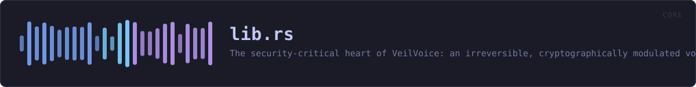

<!-- SPDX-License-Identifier: GPL-3.0-or-later -->
<!-- GENERATED by tools/docs/generate.py from the doc comments in the
     source. Do not edit this file: edit the `//!` and `///` comments in
     the .rs files and run the generator again. CI verifies it with
         python tools/docs/generate.py --check
-->

<p align="center">
  
</p>

# `crates/veilvoice-core/src/lib.rs`

[`veilvoice-core`](../../../crates/veilvoice-core/README.md) &middot; 89 lines &middot; [read the source](https://github.com/tilas01/veilvoice/blob/main/crates/veilvoice-core/src/lib.rs)

## Contents

  - [What it guarantees (and what it deliberately does not)](#what-it-guarantees-and-what-it-deliberately-does-not)
  - [Accent](#accent)
  - [Why it is one-way](#why-it-is-one-way)
  - [Example](#example)
- [In plain words](#in-plain-words)
  - [What calls what](#what-calls-what)
  - [Items](#items)

The security-critical heart of VeilVoice: an **irreversible, cryptographically
modulated voice de-identification** engine.

## What it guarantees (and what it deliberately does not)

VeilVoice destroys the *biometric voiceprint*, meaning fundamental pitch,
formant structure, timbre, accent and micro-timing, so that neither software nor a
human can re-identify the speaker or reconstruct the original waveform. It
does **not** hide the words: intelligibility is preserved on purpose, because
a scrambler you cannot understand or transcribe is useless. "Fill the whole
spectrogram with white noise" and "stay transcribable" are mutually
exclusive; see `docs/WHITEPAPER.md` for the full argument.

## Accent

`AccentConfig` additionally maps every speaker onto one canonical pitch
register, vocal-tract scale and long-term spectrum, so the *melody and
colour* of an accent, along with two of the strongest biometric features
there are, do not survive. What no signal-level transform can remove is the
**segmental** side of an accent: which phonemes were actually produced. At
that level the accent and the words are the same thing, and changing it means
changing what was said. See `AccentConfig` for the full argument and the
limit, which the whitepaper must state rather than overclaim.

## Why it is one-way

Every STFT frame has its **measured phase discarded** and resynthesised from
scratch (see `spectral`). The original excitation phase, which encodes the
precise waveform and a speaker's micro-timing, is never stored and never
reused, so no downstream process can recover it. On top of that, the pitch
and formant shifts are driven every frame by a ChaCha20 CSPRNG
(`modulation`) whose seed never leaves the process and is zeroized on drop,
so there is not even a single fixed transform to invert.

## Example

```
use veilvoice_core::{Deidentifier, DeidConfig};

let mut deid = Deidentifier::new(DeidConfig::default()).unwrap();
let input = vec![0.0f32; 4800];
let output = deid.process_vec(&input);
assert_eq!(output.len(), input.len());
// Live processing cost, e.g. for a latency read-out:
let _ms = deid.stats().last_block_ms();
```

# In plain words

This is the part that actually changes the voice.

A recording goes in and a recording comes out. The words are the same and you
can still understand every one of them; the voice is not yours any more, and
there is no setting, no key and no clever program that turns it back. What made
it recognisably *you* -- the pitch, the shape of your mouth and throat, the
timing, the music of your accent -- is not hidden. It is thrown away, and
everybody who goes through it comes out sounding like the same handful of
people.

What it does not do is keep your words secret. It is not meant to: a voice
nobody can understand would be no use to anyone. If what you said would
identify you, this has not touched that.

## What calls what

This file defines no functions of its own.

## Items

| Item | Line | Documentation |
|---|---:|---|
| `VERSION` <sub>pub const</sub> | [89](https://github.com/tilas01/veilvoice/blob/main/crates/veilvoice-core/src/lib.rs#L89) | Crate version, surfaced in the About panel. |

---

Generated from `crates/veilvoice-core/src/lib.rs`. On the website: [`website/reference/veilvoice-core/lib.html`](../../../website/reference/veilvoice-core/lib.html).

Signing key fingerprint `8101FB3BB28D02FB239E0CDF9CC1C7E7A9B5833A`.
