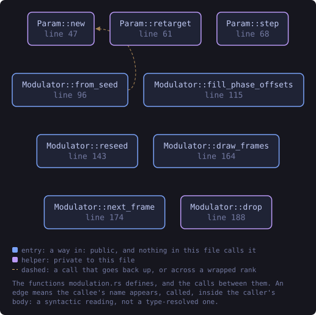

<!-- SPDX-License-Identifier: GPL-3.0-or-later -->
<!-- GENERATED by tools/docs/generate.py from the doc comments in the
     source. Do not edit this file: edit the `//!` and `///` comments in
     the .rs files and run the generator again. CI verifies it with
         python tools/docs/generate.py --check
-->

  

# `crates/veilvoice-core/src/modulation.rs`

[`veilvoice-core`](../../../crates/veilvoice-core/README.md) &middot; 323 lines &middot; [read the source](https://github.com/tilas01/veilvoice/blob/main/crates/veilvoice-core/src/modulation.rs)

## Contents

- [In plain words](#in-plain-words)
  - [What this file contains](#what-this-file-contains)
  - [What calls what](#what-calls-what)
  - [Items](#items)

Cryptographically-seeded modulation of the effect parameters.

The pitch and formant ratios are never constant: a ChaCha20 CSPRNG picks a
new random target every `frames_per_target` STFT frames, and a one-pole
filter glides continuously toward it. Because the transform is therefore
non-stationary and unpredictable, an attacker cannot "undo" it by assuming a
single fixed shift: there is no single shift to undo, and the target
sequence is unknowable without the seed (which never leaves the process and
is zeroized on drop).

The seed does not stay put either. It is rolled forward every couple of
seconds by default (see `Modulator::reseed`), so the stream driving any
given stretch of audio is closed off permanently once that stretch is past.

# In plain words

The amount by which the voice is altered is never held still. It drifts,
constantly and unpredictably.

The drift comes from the same kind of random number generator used for
encryption, so it cannot be guessed, worked out from what came before, or
reproduced by somebody who has the recording. It slides between values rather
than jumping, so nothing about it can be heard.

This is what stops the transform from being reversed by anybody who works out
the settings, because there is no single setting to work out.

## What this file contains

323 lines defining **9 functions** (5 public), **3 types** and **0 constants**. Everything below is read out of the source, so it cannot disagree with the code.

**The types it owns.**

- `struct Param` (line 36) -- One smoothly-varying parameter bounded to lo, hi.
- `struct ModValues` (line 76) -- The values handed to the spectral transform for one frame.
- `struct Modulator` (line 84) -- Non-stationary parameter generator.

**What happens when it runs.** These are the ways in: public, and nothing else in this file calls them, so they are what an outside caller reaches first.

- `Modulator::from_seed` (line 96) -- Build from an explicit 32-byte seed (deterministic; used by tests and by session-key-derived seeding).
  - reaches: `new`
- `Modulator::fill_phase_offsets` (line 115) -- The 32 fixed per-bin phase offsets consumer needs are derived from the same stream; expose a helper that fills out with values in [0, 2π).
- `Modulator::reseed` (line 143) -- Roll onto a fresh seed, drawn from the current stream.
- `Modulator::draw_frames` (line 164) -- Draw a whole number of frames uniformly from lo..=hi.
- `Modulator::next_frame` (line 174) -- Advance one STFT frame and return the parameters to apply.

## What calls what

The functions this file defines, and the calls between them. Both
are read out of the source: an edge means the callee's name appears,
called, inside the caller's body. It is a syntactic reading, not a
type-resolved one, so a call made through a trait object or a macro
will not appear.

_Colour key: **entry** -- a way in: public, and nothing in this file calls it; **helper** -- private to this file._

  

The same graph as Mermaid source

```mermaid
%%{init: {"theme":"base","themeVariables":{"background":"#1a1b26","primaryColor":"#1f2335","primaryTextColor":"#c0caf5","primaryBorderColor":"#7aa2f7","secondaryColor":"#16161e","tertiaryColor":"#16161e","lineColor":"#737aa2","textColor":"#c0caf5","mainBkg":"#1f2335","nodeBorder":"#7aa2f7","clusterBkg":"#16161e","clusterBorder":"#2f3549","fontFamily":"ui-monospace, SFMono-Regular, Consolas, monospace","fontSize":"14px"}}}%%
flowchart TD
    n_new["Param::new<br/>line 47"]
    n_retarget["Param::retarget<br/>line 61"]
    n_step["Param::step<br/>line 68"]
    n_from_seed(["Modulator::from_seed<br/>line 96"])
    n_fill_phase_offsets(["Modulator::fill_phase_offsets<br/>line 115"])
    n_reseed(["Modulator::reseed<br/>line 143"])
    n_draw_frames(["Modulator::draw_frames<br/>line 164"])
    n_next_frame(["Modulator::next_frame<br/>line 174"])
    n_drop["Modulator::drop<br/>line 188"]
    n_from_seed --> n_new
    click n_new href "https://github.com/tilas01/veilvoice/blob/main/crates/veilvoice-core/src/modulation.rs#L47" "open the source"
    click n_retarget href "https://github.com/tilas01/veilvoice/blob/main/crates/veilvoice-core/src/modulation.rs#L61" "open the source"
    click n_step href "https://github.com/tilas01/veilvoice/blob/main/crates/veilvoice-core/src/modulation.rs#L68" "open the source"
    click n_from_seed href "https://github.com/tilas01/veilvoice/blob/main/crates/veilvoice-core/src/modulation.rs#L96" "open the source"
    click n_fill_phase_offsets href "https://github.com/tilas01/veilvoice/blob/main/crates/veilvoice-core/src/modulation.rs#L115" "open the source"
    click n_reseed href "https://github.com/tilas01/veilvoice/blob/main/crates/veilvoice-core/src/modulation.rs#L143" "open the source"
    click n_draw_frames href "https://github.com/tilas01/veilvoice/blob/main/crates/veilvoice-core/src/modulation.rs#L164" "open the source"
    click n_next_frame href "https://github.com/tilas01/veilvoice/blob/main/crates/veilvoice-core/src/modulation.rs#L174" "open the source"
    click n_drop href "https://github.com/tilas01/veilvoice/blob/main/crates/veilvoice-core/src/modulation.rs#L188" "open the source"
    classDef entry fill:#1f2335,stroke:#7aa2f7,color:#c0caf5
    class n_from_seed,n_fill_phase_offsets,n_reseed,n_draw_frames,n_next_frame entry
    classDef helper fill:#1f2335,stroke:#bb9af7,color:#c0caf5
    class n_new,n_retarget,n_step,n_drop helper
```

## Items

| Item | Line | Documentation |
|---|---:|---|
| `Param` struct | [36](https://github.com/tilas01/veilvoice/blob/main/crates/veilvoice-core/src/modulation.rs#L36) | One smoothly-varying parameter bounded to lo, hi. |
| `Param::new` fn | [47](https://github.com/tilas01/veilvoice/blob/main/crates/veilvoice-core/src/modulation.rs#L47) | Start in the middle of the range, so the first frames are not a slide from an edge the caller never asked for. |
| `Param::retarget` fn | [61](https://github.com/tilas01/veilvoice/blob/main/crates/veilvoice-core/src/modulation.rs#L61) | Draw the next value to move towards. |
| `Param::step` fn | [68](https://github.com/tilas01/veilvoice/blob/main/crates/veilvoice-core/src/modulation.rs#L68) | Move one step of the way towards the target and report where that is. |
| `ModValues` pub struct | [76](https://github.com/tilas01/veilvoice/blob/main/crates/veilvoice-core/src/modulation.rs#L76) | The values handed to the spectral transform for one frame. |
| `Modulator` pub struct | [84](https://github.com/tilas01/veilvoice/blob/main/crates/veilvoice-core/src/modulation.rs#L84) | Non-stationary parameter generator. |
| `Modulator::from_seed` pub fn | [96](https://github.com/tilas01/veilvoice/blob/main/crates/veilvoice-core/src/modulation.rs#L96) | Build from an explicit 32-byte seed (deterministic; used by tests and by session-key-derived seeding). |
| `Modulator::fill_phase_offsets` pub fn | [115](https://github.com/tilas01/veilvoice/blob/main/crates/veilvoice-core/src/modulation.rs#L115) | The 32 fixed per-bin phase offsets consumer needs are derived from the same stream; expose a helper that fills out with values in [0, 2π). |
| `Modulator::reseed` pub fn | [143](https://github.com/tilas01/veilvoice/blob/main/crates/veilvoice-core/src/modulation.rs#L143) | Roll onto a fresh seed, drawn from the current stream. |
| `Modulator::draw_frames` pub fn | [164](https://github.com/tilas01/veilvoice/blob/main/crates/veilvoice-core/src/modulation.rs#L164) | Draw a whole number of frames uniformly from lo..=hi. |
| `Modulator::next_frame` pub fn | [174](https://github.com/tilas01/veilvoice/blob/main/crates/veilvoice-core/src/modulation.rs#L174) | Advance one STFT frame and return the parameters to apply. |
| `Modulator::drop` fn | [188](https://github.com/tilas01/veilvoice/blob/main/crates/veilvoice-core/src/modulation.rs#L188) |  |

---

Generated from `crates/veilvoice-core/src/modulation.rs`. On the website: [`website/reference/veilvoice-core/modulation.html`](../../../website/reference/veilvoice-core/modulation.html).

Signing key fingerprint `8101FB3BB28D02FB239E0CDF9CC1C7E7A9B5833A`.
