<!-- SPDX-License-Identifier: GPL-3.0-or-later -->
<!-- GENERATED by tools/docs/generate.py from the doc comments in the
     source. Do not edit this file: edit the `//!` and `///` comments in
     the .rs files and run the generator again. CI verifies it with
         python tools/docs/generate.py --check
-->

  

# `crates/veilvoice-core/tests/hostile_audio.rs`

[`veilvoice-core`](../../../crates/veilvoice-core/README.md) &middot; 353 lines &middot; [read the source](https://github.com/tilas01/veilvoice/blob/main/crates/veilvoice-core/tests/hostile_audio.rs)

## Contents

- [What this file contains](#what-this-file-contains)
- [What calls what](#what-calls-what)
- [Items](#items)

The engine against input that is not well-behaved audio.

A realistic use of VeilVoice is "someone sent me a recording and I want to
veil it before passing it on", so the input file is not necessarily
friendly. A 32-bit-float WAV can legally contain NaN and infinity, and
`symphonia` decodes those faithfully rather than sanitising them.

That matters more than it might sound, because the engine keeps *persistent*
state: the accent neutraliser's long-term spectrum is an exponential moving
average, so a single non-finite sample folded into it never washes out. The
audit found exactly that — one NaN, and every output sample for the rest of
the session was NaN, silently.

## What this file contains

353 lines defining **13 functions** (0 public), **0 types** and **0 constants**. Everything below is read out of the source, so it cannot disagree with the code.

## What calls what

The functions this file defines, and the calls between them. Both
are read out of the source: an edge means the callee's name appears,
called, inside the caller's body. It is a syntactic reading, not a
type-resolved one, so a call made through a trait object or a macro
will not appear.

_Colour key: **helper** -- private to this file._

  

The same graph as Mermaid source

```mermaid
%%{init: {"theme":"base","themeVariables":{"background":"#1a1b26","primaryColor":"#1f2335","primaryTextColor":"#c0caf5","primaryBorderColor":"#7aa2f7","secondaryColor":"#16161e","tertiaryColor":"#16161e","lineColor":"#737aa2","textColor":"#c0caf5","mainBkg":"#1f2335","nodeBorder":"#7aa2f7","clusterBkg":"#16161e","clusterBorder":"#2f3549","fontFamily":"ui-monospace, SFMono-Regular, Consolas, monospace","fontSize":"14px"}}}%%
flowchart TD
    n_speech["speech<br/>line 17"]
    n_engine["engine<br/>line 30"]
    n_a_single_nan_does_not_poison_the_engine_for_ever["a_single_nan_does_not_poison_…<br/>line 36"]
    n_every_flavour_of_non_finite_is_survived["every_flavour_of_non_finite_i…<br/>line 63"]
    n_an_entirely_non_finite_buffer_is_handled["an_entirely_non_finite_buffer…<br/>line 93"]
    n_digital_silence_stays_silent_and_leaves_the_state_usable["digital_silence_stays_silent_…<br/>line 105"]
    n_pathological_but_legal_audio_is_handled["pathological_but_legal_audio_…<br/>line 123"]
    n_hostile_input_is_survived_with_accent_neutralisation_off["hostile_input_is_survived_wit…<br/>line 162"]
    n_a_non_finite_sample_rate_is_refused_rather_than_built["a_non_finite_sample_rate_is_r…<br/>line 200"]
    n_an_absurd_sample_rate_is_refused_rather_than_allocated["an_absurd_sample_rate_is_refu…<br/>line 221"]
    n_an_absurd_frame_size_is_refused["an_absurd_frame_size_is_refus…<br/>line 260"]
    n_non_finite_parameters_are_refused_and_wild_ones_are_clamped["non_finite_parameters_are_ref…<br/>line 288"]
    n_every_configuration_that_builds_produces_finite_audio["every_configuration_that_buil…<br/>line 339"]
    n_a_single_nan_does_not_poison_the_engine_for_ever --> n_engine
    n_a_single_nan_does_not_poison_the_engine_for_ever --> n_speech
    n_an_entirely_non_finite_buffer_is_handled --> n_engine
    n_an_entirely_non_finite_buffer_is_handled --> n_speech
    n_digital_silence_stays_silent_and_leaves_the_state_usable --> n_engine
    n_digital_silence_stays_silent_and_leaves_the_state_usable --> n_speech
    n_every_configuration_that_builds_produces_finite_audio --> n_speech
    n_every_flavour_of_non_finite_is_survived --> n_engine
    n_every_flavour_of_non_finite_is_survived --> n_speech
    n_hostile_input_is_survived_with_accent_neutralisation_off --> n_speech
    n_pathological_but_legal_audio_is_handled --> n_engine
    click n_speech href "https://github.com/tilas01/veilvoice/blob/main/crates/veilvoice-core/tests/hostile_audio.rs#L17" "open the source"
    click n_engine href "https://github.com/tilas01/veilvoice/blob/main/crates/veilvoice-core/tests/hostile_audio.rs#L30" "open the source"
    click n_a_single_nan_does_not_poison_the_engine_for_ever href "https://github.com/tilas01/veilvoice/blob/main/crates/veilvoice-core/tests/hostile_audio.rs#L36" "open the source"
    click n_every_flavour_of_non_finite_is_survived href "https://github.com/tilas01/veilvoice/blob/main/crates/veilvoice-core/tests/hostile_audio.rs#L63" "open the source"
    click n_an_entirely_non_finite_buffer_is_handled href "https://github.com/tilas01/veilvoice/blob/main/crates/veilvoice-core/tests/hostile_audio.rs#L93" "open the source"
    click n_digital_silence_stays_silent_and_leaves_the_state_usable href "https://github.com/tilas01/veilvoice/blob/main/crates/veilvoice-core/tests/hostile_audio.rs#L105" "open the source"
    click n_pathological_but_legal_audio_is_handled href "https://github.com/tilas01/veilvoice/blob/main/crates/veilvoice-core/tests/hostile_audio.rs#L123" "open the source"
    click n_hostile_input_is_survived_with_accent_neutralisation_off href "https://github.com/tilas01/veilvoice/blob/main/crates/veilvoice-core/tests/hostile_audio.rs#L162" "open the source"
    click n_a_non_finite_sample_rate_is_refused_rather_than_built href "https://github.com/tilas01/veilvoice/blob/main/crates/veilvoice-core/tests/hostile_audio.rs#L200" "open the source"
    click n_an_absurd_sample_rate_is_refused_rather_than_allocated href "https://github.com/tilas01/veilvoice/blob/main/crates/veilvoice-core/tests/hostile_audio.rs#L221" "open the source"
    click n_an_absurd_frame_size_is_refused href "https://github.com/tilas01/veilvoice/blob/main/crates/veilvoice-core/tests/hostile_audio.rs#L260" "open the source"
    click n_non_finite_parameters_are_refused_and_wild_ones_are_clamped href "https://github.com/tilas01/veilvoice/blob/main/crates/veilvoice-core/tests/hostile_audio.rs#L288" "open the source"
    click n_every_configuration_that_builds_produces_finite_audio href "https://github.com/tilas01/veilvoice/blob/main/crates/veilvoice-core/tests/hostile_audio.rs#L339" "open the source"
    classDef helper fill:#1f2335,stroke:#bb9af7,color:#c0caf5
    class n_speech,n_engine,n_a_single_nan_does_not_poison_the_engine_for_ever,n_every_flavour_of_non_finite_is_survived,n_an_entirely_non_finite_buffer_is_handled,n_digital_silence_stays_silent_and_leaves_the_state_usable,n_pathological_but_legal_audio_is_handled,n_hostile_input_is_survived_with_accent_neutralisation_off,n_a_non_finite_sample_rate_is_refused_rather_than_built,n_an_absurd_sample_rate_is_refused_rather_than_allocated,n_an_absurd_frame_size_is_refused,n_non_finite_parameters_are_refused_and_wild_ones_are_clamped,n_every_configuration_that_builds_produces_finite_audio helper
```

## Items

| Item | Line | Documentation |
|---|---:|---|
| `speech` fn | [17](https://github.com/tilas01/veilvoice/blob/main/crates/veilvoice-core/tests/hostile_audio.rs#L17) |  |
| `engine` fn | [30](https://github.com/tilas01/veilvoice/blob/main/crates/veilvoice-core/tests/hostile_audio.rs#L30) |  |
| `a_single_nan_does_not_poison_the_engine_for_ever` fn | [36](https://github.com/tilas01/veilvoice/blob/main/crates/veilvoice-core/tests/hostile_audio.rs#L36) | The regression. |
| `every_flavour_of_non_finite_is_survived` fn | [63](https://github.com/tilas01/veilvoice/blob/main/crates/veilvoice-core/tests/hostile_audio.rs#L63) |  |
| `an_entirely_non_finite_buffer_is_handled` fn | [93](https://github.com/tilas01/veilvoice/blob/main/crates/veilvoice-core/tests/hostile_audio.rs#L93) | An input made entirely of poison must not panic, hang, or emit garbage. |
| `digital_silence_stays_silent_and_leaves_the_state_usable` fn | [105](https://github.com/tilas01/veilvoice/blob/main/crates/veilvoice-core/tests/hostile_audio.rs#L105) | Silence must not drive the long-term averages anywhere strange, and must not come out as anything but silence. |
| `pathological_but_legal_audio_is_handled` fn | [123](https://github.com/tilas01/veilvoice/blob/main/crates/veilvoice-core/tests/hostile_audio.rs#L123) | Full-scale square waves and DC are legal audio and unlike anything the engine was tuned on. |
| `hostile_input_is_survived_with_accent_neutralisation_off` fn | [162](https://github.com/tilas01/veilvoice/blob/main/crates/veilvoice-core/tests/hostile_audio.rs#L162) | The same, with accent neutralisation off, since that changes which paths in spectral.rs run. |
| `a_non_finite_sample_rate_is_refused_rather_than_built` fn | [200](https://github.com/tilas01/veilvoice/blob/main/crates/veilvoice-core/tests/hostile_audio.rs#L200) | A non-finite sample rate must be refused, not built. |
| `an_absurd_sample_rate_is_refused_rather_than_allocated` fn | [221](https://github.com/tilas01/veilvoice/blob/main/crates/veilvoice-core/tests/hostile_audio.rs#L221) | A sample rate a file can legally declare, but no hardware produces, sizes the reverb and chorus delay lines. |
| `an_absurd_frame_size_is_refused` fn | [260](https://github.com/tilas01/veilvoice/blob/main/crates/veilvoice-core/tests/hostile_audio.rs#L260) | frame_size had no upper bound at all, and it sizes every internal buffer and the FFT plan. |
| `non_finite_parameters_are_refused_and_wild_ones_are_clamped` fn | [288](https://github.com/tilas01/veilvoice/blob/main/crates/veilvoice-core/tests/hostile_audio.rs#L288) | Every other float is either clamped to something meaningful or refused for being NaN. |
| `every_configuration_that_builds_produces_finite_audio` fn | [339](https://github.com/tilas01/veilvoice/blob/main/crates/veilvoice-core/tests/hostile_audio.rs#L339) | The whole point, checked end to end: a configuration that survives validation must produce finite audio from finite audio. |

---

Generated from `crates/veilvoice-core/tests/hostile_audio.rs`. On the website: [`website/reference/veilvoice-core/tests-hostile_audio.html`](../../../website/reference/veilvoice-core/tests-hostile_audio.html).

Signing key fingerprint `8101FB3BB28D02FB239E0CDF9CC1C7E7A9B5833A`.
