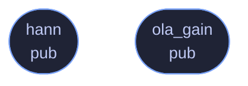

<!-- SPDX-License-Identifier: CC-BY-NC-SA-4.0 -->
<!-- GENERATED by tools/docs/generate.py from the doc comments in the
     source. Do not edit this file: edit the `//!` and `///` comments in
     the .rs files and run the generator again. CI verifies it with
         python tools/docs/generate.py --check
-->

  

# `crates/veilvoice-core/src/window.rs`

[`veilvoice-core`](../../../crates/veilvoice-core/README.md) &middot; 54 lines &middot; [read the source](https://github.com/tilas01/veilvoice/blob/main/crates/veilvoice-core/src/window.rs)

## Contents

- [What calls what](#what-calls-what)
- [Items](#items)

Analysis/synthesis windowing helpers.

## What calls what

The functions this file defines, and the calls between them. Both
are read out of the source: an edge means the callee's name appears,
called, inside the caller's body. It is a syntactic reading, not a
type-resolved one, so a call made through a trait object or a macro
will not appear.

## Items

| Item | Line | Documentation |
|---|---:|---|
| `hann` pub fn | [10](https://github.com/tilas01/veilvoice/blob/main/crates/veilvoice-core/src/window.rs#L10) | Periodic Hann window of length n (the correct variant for STFT overlap-add, as opposed to the symmetric variant used for filter design). |
| `ola_gain` pub fn | [26](https://github.com/tilas01/veilvoice/blob/main/crates/veilvoice-core/src/window.rs#L26) | Overlap-add normalisation for a window applied on both analysis and synthesis at the given hop. |

---

Generated from `crates/veilvoice-core/src/window.rs`. On the website: [`website/reference/veilvoice-core/window.html`](../../../website/reference/veilvoice-core/window.html).

Signing key fingerprint `8101FB3BB28D02FB239E0CDF9CC1C7E7A9B5833A`.
