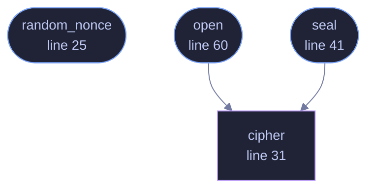

<!-- SPDX-License-Identifier: GPL-3.0-or-later -->
<!-- GENERATED by tools/docs/generate.py from the doc comments in the
     source. Do not edit this file: edit the `//!` and `///` comments in
     the .rs files and run the generator again. CI verifies it with
         python tools/docs/generate.py --check
-->

  

# `crates/veilvoice-crypto/src/aead.rs`

[`veilvoice-crypto`](../../../crates/veilvoice-crypto/README.md) &middot; 168 lines &middot; [read the source](https://github.com/tilas01/veilvoice/blob/main/crates/veilvoice-crypto/src/aead.rs)

## Contents

- [What this file contains](#what-this-file-contains)
- [What calls what](#what-calls-what)
- [Items](#items)

Authenticated encryption with XChaCha20-Poly1305.

XChaCha20 rather than plain ChaCha20 because its 192-bit nonce can be drawn
at random with no practical collision risk. The 96-bit nonce of RFC 8439
ChaCha20-Poly1305 requires a counter and careful state tracking to stay
unique across runs; getting that wrong is catastrophic, and a random
192-bit nonce removes the failure mode entirely.

Every call is authenticated over associated data as well as the plaintext,
which is how the container header in `crate::container` is bound to its
ciphertext: flipping a bit in the stored KDF parameters produces a
decryption failure rather than a silently different key.

## What this file contains

168 lines defining **4 functions** (3 public), **0 types** and **2 constants**. Everything below is read out of the source, so it cannot disagree with the code.

**What happens when it runs.** These are the ways in: public, and nothing else in this file calls them, so they are what an outside caller reaches first.

- `random_nonce` (line 25) -- Draw a fresh random nonce from the OS CSPRNG.
- `seal` (line 41) -- Encrypt plaintext, authenticating aad alongside it.
  - reaches: `cipher`
- `open` (line 60) -- Decrypt and verify.
  - reaches: `cipher`

## What calls what

The functions this file defines, and the calls between them. Both
are read out of the source: an edge means the callee's name appears,
called, inside the caller's body. It is a syntactic reading, not a
type-resolved one, so a call made through a trait object or a macro
will not appear.

_Colour key: **entry** -- a way in: public, and nothing in this file calls it; **helper** -- private to this file._

## Items

| Item | Line | Documentation |
|---|---:|---|
| `NONCE_LEN` pub const | [20](https://github.com/tilas01/veilvoice/blob/main/crates/veilvoice-crypto/src/aead.rs#L20) | Nonce length for XChaCha20-Poly1305, in bytes. |
| `TAG_LEN` pub const | [22](https://github.com/tilas01/veilvoice/blob/main/crates/veilvoice-crypto/src/aead.rs#L22) | Poly1305 authentication tag length, in bytes. |
| `random_nonce` pub fn | [25](https://github.com/tilas01/veilvoice/blob/main/crates/veilvoice-crypto/src/aead.rs#L25) | Draw a fresh random nonce from the OS CSPRNG. |
| `cipher` fn | [31](https://github.com/tilas01/veilvoice/blob/main/crates/veilvoice-crypto/src/aead.rs#L31) |  |
| `seal` pub fn | [41](https://github.com/tilas01/veilvoice/blob/main/crates/veilvoice-crypto/src/aead.rs#L41) | Encrypt plaintext, authenticating aad alongside it. |
| `open` pub fn | [60](https://github.com/tilas01/veilvoice/blob/main/crates/veilvoice-crypto/src/aead.rs#L60) | Decrypt and verify. |

---

Generated from `crates/veilvoice-crypto/src/aead.rs`. On the website: [`website/reference/veilvoice-crypto/aead.html`](../../../website/reference/veilvoice-crypto/aead.html).

Signing key fingerprint `8101FB3BB28D02FB239E0CDF9CC1C7E7A9B5833A`.
