<!-- SPDX-License-Identifier: GPL-3.0-or-later -->
<!-- GENERATED by tools/docs/generate.py from the doc comments in the
     source. Do not edit this file: edit the `//!` and `///` comments in
     the .rs files and run the generator again. CI verifies it with
         python tools/docs/generate.py --check
-->

  

# `crates/veilvoice-crypto/src/amnesia.rs`

[`veilvoice-crypto`](../../../crates/veilvoice-crypto/README.md) &middot; 313 lines &middot; [read the source](https://github.com/tilas01/veilvoice/blob/main/crates/veilvoice-crypto/src/amnesia.rs)

## Contents

- [No unsafe, even here](#no-unsafe-even-here)
- [What locking does and does not buy](#what-locking-does-and-does-not-buy)
- [Why each secret owns whole pages](#why-each-secret-owns-whole-pages)
- [Why the lock is not held by an RAII guard](#why-the-lock-is-not-held-by-an-raii-guard)
  - [What calls what](#what-calls-what)
  - [Items](#items)

Amnesic secret storage: page-locked, zeroized, and never printed.

# No `unsafe`, even here

Locking pages out of the swap file is a raw syscall — `VirtualLock` on
Windows, `mlock` on Unix — and it is the one place a project like this
usually has to reach for `unsafe`. It does not here: the `region` crate
exposes a safe, cross-platform wrapper. VeilVoice therefore contains **no
`unsafe` code at all**, and every crate keeps `#![forbid(unsafe_code)]`.

# What locking does and does not buy

Locking keeps key material out of the page file, so a secret cannot be
recovered later by reading swap off the disk. It does **not** protect against
an attacker who can already read this process's memory, and it does not
survive hibernation, which writes RAM to disk wholesale. Locking can also
fail outright — unprivileged Linux users get a small `RLIMIT_MEMLOCK` budget
— so it is best-effort hardening and never a precondition.
`Secret::is_locked` reports what actually happened, so the UI can tell the
user the truth rather than imply a guarantee that was not obtained.

Zeroization, by contrast, always happens.

# Why each secret owns whole pages

Locking has *page* granularity, not byte granularity. If two secrets share a
4 KiB page, both lock it, and the first one dropped unlocks the page out from
under the second — which is still live and now swappable.

Each `Secret` therefore over-allocates and locks a page-aligned,
page-sized span lying entirely within its own allocation. No other allocation
can occupy those bytes, so none can be inside those pages: lock and unlock
are exact, and locking a secret never drags unrelated data into physical
memory alongside it.

# Why the lock is not held by an RAII guard

`region::lock` hands back a guard that unlocks on drop — but its destructor
**panics** if unlocking fails, and unlocking can fail for reasons that are
nobody's fault: Windows does not reference-count `VirtualLock` and may drop
pages from a process working set on its own, after which `VirtualUnlock`
reports `ERROR_NOT_LOCKED`. A type whose entire job is holding key material
must not abort the process while being dropped. The lock is released
explicitly instead, and a failure to unlock is ignored: it leaves pages
pinned, which is harmless, rather than unwinding out of a destructor.

## What calls what

The functions this file defines, and the calls between them. Both
are read out of the source: an edge means the callee's name appears,
called, inside the caller's body. It is a syntactic reading, not a
type-resolved one, so a call made through a trait object or a macro
will not appear.

```mermaid
%%{init: {"theme":"base","themeVariables":{"background":"#1a1b26","primaryColor":"#1f2335","primaryTextColor":"#c0caf5","primaryBorderColor":"#7aa2f7","secondaryColor":"#16161e","tertiaryColor":"#16161e","lineColor":"#737aa2","textColor":"#c0caf5","mainBkg":"#1f2335","nodeBorder":"#7aa2f7","clusterBkg":"#16161e","clusterBorder":"#2f3549","fontFamily":"ui-monospace, SFMono-Regular, Consolas, monospace","fontSize":"14px"}}}%%
flowchart TD
    n_new(["Secret::new<br/>pub"])
    n_zeroed(["Secret::zeroed<br/>pub"])
    n_random(["Secret::random<br/>pub"])
    n_is_locked(["Secret::is_locked<br/>pub"])
    n_len(["Secret::len<br/>pub"])
    n_is_empty(["Secret::is_empty<br/>pub"])
    n_expose(["Secret::expose<br/>pub"])
    n_expose_mut(["Secret::expose_mut<br/>pub"])
    n_wipe(["Secret::wipe<br/>pub"])
    n_drop["Secret::drop"]
    n_clone["Secret::clone"]
    n_eq["Secret::eq"]
    n_fmt["Secret::fmt"]
    n_clone --> n_expose
    n_clone --> n_zeroed
    n_eq --> n_expose
    n_new --> n_zeroed
    n_random --> n_zeroed
```

## Items

| Item | Line | Documentation |
|---|---:|---|
| `Secret` pub struct | [57](https://github.com/tilas01/veilvoice/blob/main/crates/veilvoice-crypto/src/amnesia.rs#L57) | A byte buffer holding key material. |
| `Secret::new` pub fn | [69](https://github.com/tilas01/veilvoice/blob/main/crates/veilvoice-crypto/src/amnesia.rs#L69) | Wrap bytes, taking ownership and wiping the caller's copy. |
| `Secret::zeroed` pub fn | [77](https://github.com/tilas01/veilvoice/blob/main/crates/veilvoice-crypto/src/amnesia.rs#L77) | Allocate len zero bytes, ready to be filled in place. |
| `Secret::random` pub fn | [113](https://github.com/tilas01/veilvoice/blob/main/crates/veilvoice-crypto/src/amnesia.rs#L113) | Fill len bytes from the operating-system CSPRNG. |
| `Secret::is_locked` pub fn | [124](https://github.com/tilas01/veilvoice/blob/main/crates/veilvoice-crypto/src/amnesia.rs#L124) | Whether the pages were successfully locked out of swap. |
| `Secret::len` pub fn | [129](https://github.com/tilas01/veilvoice/blob/main/crates/veilvoice-crypto/src/amnesia.rs#L129) | Length in bytes. |
| `Secret::is_empty` pub fn | [134](https://github.com/tilas01/veilvoice/blob/main/crates/veilvoice-crypto/src/amnesia.rs#L134) | Whether the secret is empty. |
| `Secret::expose` pub fn | [140](https://github.com/tilas01/veilvoice/blob/main/crates/veilvoice-crypto/src/amnesia.rs#L140) | Borrow the raw bytes. |
| `Secret::expose_mut` pub fn | [145](https://github.com/tilas01/veilvoice/blob/main/crates/veilvoice-crypto/src/amnesia.rs#L145) | Borrow mutably, for filling in place. |
| `Secret::wipe` pub fn | [153](https://github.com/tilas01/veilvoice/blob/main/crates/veilvoice-crypto/src/amnesia.rs#L153) | Wipe the contents now, before the value goes out of scope. |
| `Secret::drop` fn | [159](https://github.com/tilas01/veilvoice/blob/main/crates/veilvoice-crypto/src/amnesia.rs#L159) |  |
| `Secret::clone` fn | [170](https://github.com/tilas01/veilvoice/blob/main/crates/veilvoice-crypto/src/amnesia.rs#L170) |  |
| `Secret::eq` fn | [180](https://github.com/tilas01/veilvoice/blob/main/crates/veilvoice-crypto/src/amnesia.rs#L180) |  |
| `Secret::fmt` fn | [189](https://github.com/tilas01/veilvoice/blob/main/crates/veilvoice-crypto/src/amnesia.rs#L189) |  |

---

Generated from `crates/veilvoice-crypto/src/amnesia.rs`. On the website: [`website/reference/veilvoice-crypto/amnesia.html`](../../../website/reference/veilvoice-crypto/amnesia.html).

Signing key fingerprint `8101FB3BB28D02FB239E0CDF9CC1C7E7A9B5833A`.
