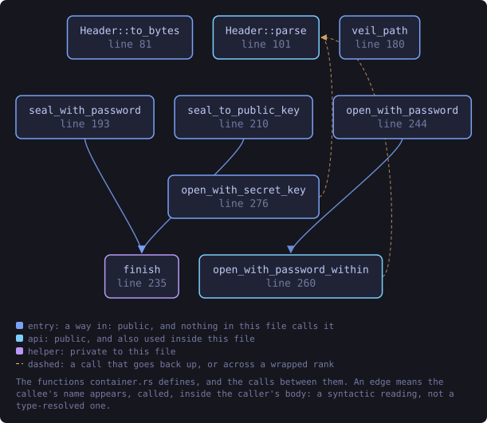

<!-- SPDX-License-Identifier: GPL-3.0-or-later -->
<!-- GENERATED by tools/docs/generate.py from the doc comments in the
     source. Do not edit this file: edit the `//!` and `///` comments in
     the .rs files and run the generator again. CI verifies it with
         python tools/docs/generate.py --check
-->

<p align="center">
  
</p>

# `crates/veilvoice-crypto/src/container.rs`

[`veilvoice-crypto`](../../../crates/veilvoice-crypto/README.md) &middot; 479 lines &middot; [read the source](https://github.com/tilas01/veilvoice/blob/main/crates/veilvoice-crypto/src/container.rs)

## Contents

- [What this file contains](#what-this-file-contains)
- [What calls what](#what-calls-what)
- [Items](#items)

The `.veil` encrypted container format.

A single self-describing blob: everything needed to decrypt except the
password or private key travels with the ciphertext, so a file stays
readable after the default KDF costs are raised.

```text
offset  size  field
0     8  magic "VEILVOX1"
8     1  format version (1)
9     1  mode: 1 = password, 2 = hybrid public key
10     2  reserved, must be zero
12     4  Argon2id m_cost (KiB, little-endian)     password mode only
16     4  Argon2id t_cost                          password mode only
20     4  Argon2id p_cost                          password mode only
24    16  Argon2id salt                            password mode only
40    24  XChaCha20 nonce
64     4  encapsulation length (little-endian)
68     N  encapsulation                            hybrid mode only
68+N     …  ciphertext ‖ Poly1305 tag
```

**The entire header is the AEAD's associated data.** Editing any byte of it
— downgrading the KDF cost, swapping the mode, corrupting the salt — makes
decryption fail rather than silently changing behaviour. Unused fields are
written as zero and are still authenticated, so they cannot be used as a
covert channel or a downgrade vector.

## What this file contains

479 lines defining **9 functions** (8 public), **2 types** and **5 constants**. Everything below is read out of the source, so it cannot disagree with the code.

**The types it owns.**

- `enum Mode` (line 44) -- How a container is locked.
- `struct Header` (line 53) -- A parsed container header.

**What happens when it runs.** These are the ways in: public, and nothing else in this file calls them, so they are what an outside caller reaches first.

- `Header::to_bytes` (line 69) -- Serialise exactly as it appears on disk.
- `veil_path` (line 152) -- The conventional path of the sealed form of path.
- `seal_with_password` (line 159) -- Encrypt plaintext under a password.
  - reaches: `finish`
- `seal_to_public_key` (line 176) -- Encrypt plaintext to a recipient's hybrid public key.
  - reaches: `finish`
- `open_with_password` (line 204) -- Decrypt a password-locked container.
  - reaches: `open_with_password_within`, `parse`
- `open_with_secret_key` (line 236) -- Decrypt a container addressed to recipient.
  - reaches: `parse`

## What calls what

The functions this file defines, and the calls between them. Both
are read out of the source: an edge means the callee's name appears,
called, inside the caller's body. It is a syntactic reading, not a
type-resolved one, so a call made through a trait object or a macro
will not appear.

_Colour key: **entry** -- a way in: public, and nothing in this file calls it; **api** -- public, and also used inside this file; **helper** -- private to this file._

<p align="center">
  
</p>

<details>
<summary>The same graph as Mermaid source</summary>



</details>

```mermaid
%%{init: {"theme":"base","themeVariables":{"background":"#1a1b26","primaryColor":"#1f2335","primaryTextColor":"#c0caf5","primaryBorderColor":"#7aa2f7","secondaryColor":"#16161e","tertiaryColor":"#16161e","lineColor":"#737aa2","textColor":"#c0caf5","mainBkg":"#1f2335","nodeBorder":"#7aa2f7","clusterBkg":"#16161e","clusterBorder":"#2f3549","fontFamily":"ui-monospace, SFMono-Regular, Consolas, monospace","fontSize":"14px"}}}%%
flowchart TD
    n_to_bytes(["Header::to_bytes<br/>line 69"])
    n_parse["Header::parse<br/>line 89"]
    n_veil_path(["veil_path<br/>line 152"])
    n_seal_with_password(["seal_with_password<br/>line 159"])
    n_seal_to_public_key(["seal_to_public_key<br/>line 176"])
    n_finish["finish<br/>line 195"]
    n_open_with_password(["open_with_password<br/>line 204"])
    n_open_with_password_within["open_with_password_within<br/>line 220"]
    n_open_with_secret_key(["open_with_secret_key<br/>line 236"])
    n_open_with_password --> n_open_with_password_within
    n_open_with_password_within --> n_parse
    n_open_with_secret_key --> n_parse
    n_seal_to_public_key --> n_finish
    n_seal_with_password --> n_finish
    click n_to_bytes href "https://github.com/tilas01/veilvoice/blob/main/crates/veilvoice-crypto/src/container.rs#L69" "open the source"
    click n_parse href "https://github.com/tilas01/veilvoice/blob/main/crates/veilvoice-crypto/src/container.rs#L89" "open the source"
    click n_veil_path href "https://github.com/tilas01/veilvoice/blob/main/crates/veilvoice-crypto/src/container.rs#L152" "open the source"
    click n_seal_with_password href "https://github.com/tilas01/veilvoice/blob/main/crates/veilvoice-crypto/src/container.rs#L159" "open the source"
    click n_seal_to_public_key href "https://github.com/tilas01/veilvoice/blob/main/crates/veilvoice-crypto/src/container.rs#L176" "open the source"
    click n_finish href "https://github.com/tilas01/veilvoice/blob/main/crates/veilvoice-crypto/src/container.rs#L195" "open the source"
    click n_open_with_password href "https://github.com/tilas01/veilvoice/blob/main/crates/veilvoice-crypto/src/container.rs#L204" "open the source"
    click n_open_with_password_within href "https://github.com/tilas01/veilvoice/blob/main/crates/veilvoice-crypto/src/container.rs#L220" "open the source"
    click n_open_with_secret_key href "https://github.com/tilas01/veilvoice/blob/main/crates/veilvoice-crypto/src/container.rs#L236" "open the source"
    classDef entry fill:#1f2335,stroke:#7aa2f7,color:#c0caf5
    class n_to_bytes,n_veil_path,n_seal_with_password,n_seal_to_public_key,n_open_with_password,n_open_with_secret_key entry
    classDef api fill:#1f2335,stroke:#7dcfff,color:#c0caf5
    class n_parse,n_open_with_password_within api
    classDef helper fill:#1f2335,stroke:#bb9af7,color:#c0caf5
    class n_finish helper
```

## Items

| Item | Line | Documentation |
|---|---:|---|
| `MAGIC` <sub>pub const</sub> | [33](https://github.com/tilas01/veilvoice/blob/main/crates/veilvoice-crypto/src/container.rs#L33) | Magic bytes at the start of every container. |
| `FORMAT_VERSION` <sub>pub const</sub> | [35](https://github.com/tilas01/veilvoice/blob/main/crates/veilvoice-crypto/src/container.rs#L35) | Format version this build writes. |
| `HEADER_LEN` <sub>pub const</sub> | [37](https://github.com/tilas01/veilvoice/blob/main/crates/veilvoice-crypto/src/container.rs#L37) | Fixed header length in bytes, before any encapsulation. |
| `MODE_PASSWORD` <sub>const</sub> | [39](https://github.com/tilas01/veilvoice/blob/main/crates/veilvoice-crypto/src/container.rs#L39) |  |
| `MODE_HYBRID` <sub>const</sub> | [40](https://github.com/tilas01/veilvoice/blob/main/crates/veilvoice-crypto/src/container.rs#L40) |  |
| `Mode` <sub>pub enum</sub> | [44](https://github.com/tilas01/veilvoice/blob/main/crates/veilvoice-crypto/src/container.rs#L44) | How a container is locked. |
| `Header` <sub>pub struct</sub> | [53](https://github.com/tilas01/veilvoice/blob/main/crates/veilvoice-crypto/src/container.rs#L53) | A parsed container header. |
| `Header::to_bytes` <sub>pub fn</sub> | [69](https://github.com/tilas01/veilvoice/blob/main/crates/veilvoice-crypto/src/container.rs#L69) | Serialise exactly as it appears on disk. |
| `Header::parse` <sub>pub fn</sub> | [89](https://github.com/tilas01/veilvoice/blob/main/crates/veilvoice-crypto/src/container.rs#L89) | Parse a header, returning it with the offset at which ciphertext starts. |
| `veil_path` <sub>pub fn</sub> | [152](https://github.com/tilas01/veilvoice/blob/main/crates/veilvoice-crypto/src/container.rs#L152) | The conventional path of the sealed form of path. |
| `seal_with_password` <sub>pub fn</sub> | [159](https://github.com/tilas01/veilvoice/blob/main/crates/veilvoice-crypto/src/container.rs#L159) | Encrypt plaintext under a password. |
| `seal_to_public_key` <sub>pub fn</sub> | [176](https://github.com/tilas01/veilvoice/blob/main/crates/veilvoice-crypto/src/container.rs#L176) | Encrypt plaintext to a recipient's hybrid public key. |
| `finish` <sub>fn</sub> | [195](https://github.com/tilas01/veilvoice/blob/main/crates/veilvoice-crypto/src/container.rs#L195) |  |
| `open_with_password` <sub>pub fn</sub> | [204](https://github.com/tilas01/veilvoice/blob/main/crates/veilvoice-crypto/src/container.rs#L204) | Decrypt a password-locked container. |
| `open_with_password_within` <sub>pub fn</sub> | [220](https://github.com/tilas01/veilvoice/blob/main/crates/veilvoice-crypto/src/container.rs#L220) | Decrypt a password-locked container, refusing one that declares a memory cost above max_m_cost. |
| `open_with_secret_key` <sub>pub fn</sub> | [236](https://github.com/tilas01/veilvoice/blob/main/crates/veilvoice-crypto/src/container.rs#L236) | Decrypt a container addressed to recipient. |

---

Generated from `crates/veilvoice-crypto/src/container.rs`. On the website: [`website/reference/veilvoice-crypto/container.html`](../../../website/reference/veilvoice-crypto/container.html).

Signing key fingerprint `8101FB3BB28D02FB239E0CDF9CC1C7E7A9B5833A`.
