<!-- SPDX-License-Identifier: GPL-3.0-or-later -->
<!-- GENERATED by tools/docs/generate.py from the doc comments in the
     source. Do not edit this file: edit the `//!` and `///` comments in
     the .rs files and run the generator again. CI verifies it with
         python tools/docs/generate.py --check
-->

<p align="center">
  
</p>

# `crates/veilvoice-crypto/src/container.rs`

[`veilvoice-crypto`](../../../crates/veilvoice-crypto/README.md) &middot; 491 lines &middot; [read the source](https://github.com/tilas01/veilvoice/blob/main/crates/veilvoice-crypto/src/container.rs)

## Contents

- [In plain words](#in-plain-words)
  - [What this file contains](#what-this-file-contains)
  - [What calls what](#what-calls-what)
  - [Items](#items)

The `.veil` encrypted container format.

A single self-describing blob: everything needed to decrypt except the
password or private key travels with the ciphertext, so a file stays
readable after the default KDF costs are raised.

```text
offset  size  field
0     8  magic "VEILVOX1"
8     1  format version (1)
9     1  mode: 1 = password, 2 = hybrid public key
10     2  reserved, must be zero
12     4  Argon2id m_cost (KiB, little-endian)     password mode only
16     4  Argon2id t_cost                          password mode only
20     4  Argon2id p_cost                          password mode only
24    16  Argon2id salt                            password mode only
40    24  XChaCha20 nonce
64     4  encapsulation length (little-endian)
68     N  encapsulation                            hybrid mode only
68+N     …  ciphertext ‖ Poly1305 tag
```

**The entire header is the AEAD's associated data.** Editing any byte of it
— downgrading the KDF cost, swapping the mode, corrupting the salt — makes
decryption fail rather than silently changing behaviour. Unused fields are
written as zero and are still authenticated, so they cannot be used as a
covert channel or a downgrade vector.

# In plain words

The shape of an encrypted `.veil` file.

Everything needed to open it travels inside it, apart from the passphrase or
the key. That means a file made today still opens years later, even after
VeilVoice has changed how hard it makes the encryption by default: the file
remembers what it was made with.

The part at the front that describes the file is itself covered by the tamper
check, so it cannot be edited to make the rest open more easily.

## What this file contains

491 lines defining **9 functions** (8 public), **2 types** and **5 constants**. Everything below is read out of the source, so it cannot disagree with the code.

**The types it owns.**

- `enum Mode` (line 56) -- How a container is locked.
- `struct Header` (line 65) -- A parsed container header.

**What happens when it runs.** These are the ways in: public, and nothing else in this file calls them, so they are what an outside caller reaches first.

- `Header::to_bytes` (line 81) -- Serialise exactly as it appears on disk.
- `veil_path` (line 164) -- The conventional path of the sealed form of path.
- `seal_with_password` (line 171) -- Encrypt plaintext under a password.
  - reaches: `finish`
- `seal_to_public_key` (line 188) -- Encrypt plaintext to a recipient's hybrid public key.
  - reaches: `finish`
- `open_with_password` (line 216) -- Decrypt a password-locked container.
  - reaches: `open_with_password_within`, `parse`
- `open_with_secret_key` (line 248) -- Decrypt a container addressed to recipient.
  - reaches: `parse`

## What calls what

The functions this file defines, and the calls between them. Both
are read out of the source: an edge means the callee's name appears,
called, inside the caller's body. It is a syntactic reading, not a
type-resolved one, so a call made through a trait object or a macro
will not appear.

_Colour key: **entry** -- a way in: public, and nothing in this file calls it; **api** -- public, and also used inside this file; **helper** -- private to this file._

<p align="center">
  
</p>

<details>
<summary>The same graph as Mermaid source</summary>



</details>

```mermaid
%%{init: {"theme":"base","themeVariables":{"background":"#1a1b26","primaryColor":"#1f2335","primaryTextColor":"#c0caf5","primaryBorderColor":"#7aa2f7","secondaryColor":"#16161e","tertiaryColor":"#16161e","lineColor":"#737aa2","textColor":"#c0caf5","mainBkg":"#1f2335","nodeBorder":"#7aa2f7","clusterBkg":"#16161e","clusterBorder":"#2f3549","fontFamily":"ui-monospace, SFMono-Regular, Consolas, monospace","fontSize":"14px"}}}%%
flowchart TD
    n_to_bytes(["Header::to_bytes<br/>line 81"])
    n_parse["Header::parse<br/>line 101"]
    n_veil_path(["veil_path<br/>line 164"])
    n_seal_with_password(["seal_with_password<br/>line 171"])
    n_seal_to_public_key(["seal_to_public_key<br/>line 188"])
    n_finish["finish<br/>line 207"]
    n_open_with_password(["open_with_password<br/>line 216"])
    n_open_with_password_within["open_with_password_within<br/>line 232"]
    n_open_with_secret_key(["open_with_secret_key<br/>line 248"])
    n_open_with_password --> n_open_with_password_within
    n_open_with_password_within --> n_parse
    n_open_with_secret_key --> n_parse
    n_seal_to_public_key --> n_finish
    n_seal_with_password --> n_finish
    click n_to_bytes href "https://github.com/tilas01/veilvoice/blob/main/crates/veilvoice-crypto/src/container.rs#L81" "open the source"
    click n_parse href "https://github.com/tilas01/veilvoice/blob/main/crates/veilvoice-crypto/src/container.rs#L101" "open the source"
    click n_veil_path href "https://github.com/tilas01/veilvoice/blob/main/crates/veilvoice-crypto/src/container.rs#L164" "open the source"
    click n_seal_with_password href "https://github.com/tilas01/veilvoice/blob/main/crates/veilvoice-crypto/src/container.rs#L171" "open the source"
    click n_seal_to_public_key href "https://github.com/tilas01/veilvoice/blob/main/crates/veilvoice-crypto/src/container.rs#L188" "open the source"
    click n_finish href "https://github.com/tilas01/veilvoice/blob/main/crates/veilvoice-crypto/src/container.rs#L207" "open the source"
    click n_open_with_password href "https://github.com/tilas01/veilvoice/blob/main/crates/veilvoice-crypto/src/container.rs#L216" "open the source"
    click n_open_with_password_within href "https://github.com/tilas01/veilvoice/blob/main/crates/veilvoice-crypto/src/container.rs#L232" "open the source"
    click n_open_with_secret_key href "https://github.com/tilas01/veilvoice/blob/main/crates/veilvoice-crypto/src/container.rs#L248" "open the source"
    classDef entry fill:#1f2335,stroke:#7aa2f7,color:#c0caf5
    class n_to_bytes,n_veil_path,n_seal_with_password,n_seal_to_public_key,n_open_with_password,n_open_with_secret_key entry
    classDef api fill:#1f2335,stroke:#7dcfff,color:#c0caf5
    class n_parse,n_open_with_password_within api
    classDef helper fill:#1f2335,stroke:#bb9af7,color:#c0caf5
    class n_finish helper
```

## Items

| Item | Line | Documentation |
|---|---:|---|
| `MAGIC` <sub>pub const</sub> | [45](https://github.com/tilas01/veilvoice/blob/main/crates/veilvoice-crypto/src/container.rs#L45) | Magic bytes at the start of every container. |
| `FORMAT_VERSION` <sub>pub const</sub> | [47](https://github.com/tilas01/veilvoice/blob/main/crates/veilvoice-crypto/src/container.rs#L47) | Format version this build writes. |
| `HEADER_LEN` <sub>pub const</sub> | [49](https://github.com/tilas01/veilvoice/blob/main/crates/veilvoice-crypto/src/container.rs#L49) | Fixed header length in bytes, before any encapsulation. |
| `MODE_PASSWORD` <sub>const</sub> | [51](https://github.com/tilas01/veilvoice/blob/main/crates/veilvoice-crypto/src/container.rs#L51) |  |
| `MODE_HYBRID` <sub>const</sub> | [52](https://github.com/tilas01/veilvoice/blob/main/crates/veilvoice-crypto/src/container.rs#L52) |  |
| `Mode` <sub>pub enum</sub> | [56](https://github.com/tilas01/veilvoice/blob/main/crates/veilvoice-crypto/src/container.rs#L56) | How a container is locked. |
| `Header` <sub>pub struct</sub> | [65](https://github.com/tilas01/veilvoice/blob/main/crates/veilvoice-crypto/src/container.rs#L65) | A parsed container header. |
| `Header::to_bytes` <sub>pub fn</sub> | [81](https://github.com/tilas01/veilvoice/blob/main/crates/veilvoice-crypto/src/container.rs#L81) | Serialise exactly as it appears on disk. |
| `Header::parse` <sub>pub fn</sub> | [101](https://github.com/tilas01/veilvoice/blob/main/crates/veilvoice-crypto/src/container.rs#L101) | Parse a header, returning it with the offset at which ciphertext starts. |
| `veil_path` <sub>pub fn</sub> | [164](https://github.com/tilas01/veilvoice/blob/main/crates/veilvoice-crypto/src/container.rs#L164) | The conventional path of the sealed form of path. |
| `seal_with_password` <sub>pub fn</sub> | [171](https://github.com/tilas01/veilvoice/blob/main/crates/veilvoice-crypto/src/container.rs#L171) | Encrypt plaintext under a password. |
| `seal_to_public_key` <sub>pub fn</sub> | [188](https://github.com/tilas01/veilvoice/blob/main/crates/veilvoice-crypto/src/container.rs#L188) | Encrypt plaintext to a recipient's hybrid public key. |
| `finish` <sub>fn</sub> | [207](https://github.com/tilas01/veilvoice/blob/main/crates/veilvoice-crypto/src/container.rs#L207) |  |
| `open_with_password` <sub>pub fn</sub> | [216](https://github.com/tilas01/veilvoice/blob/main/crates/veilvoice-crypto/src/container.rs#L216) | Decrypt a password-locked container. |
| `open_with_password_within` <sub>pub fn</sub> | [232](https://github.com/tilas01/veilvoice/blob/main/crates/veilvoice-crypto/src/container.rs#L232) | Decrypt a password-locked container, refusing one that declares a memory cost above max_m_cost. |
| `open_with_secret_key` <sub>pub fn</sub> | [248](https://github.com/tilas01/veilvoice/blob/main/crates/veilvoice-crypto/src/container.rs#L248) | Decrypt a container addressed to recipient. |

---

Generated from `crates/veilvoice-crypto/src/container.rs`. On the website: [`website/reference/veilvoice-crypto/container.html`](../../../website/reference/veilvoice-crypto/container.html).

Signing key fingerprint `8101FB3BB28D02FB239E0CDF9CC1C7E7A9B5833A`.
