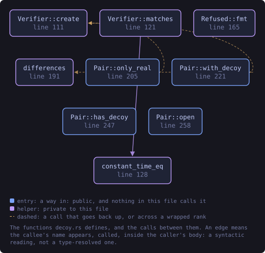

<!-- SPDX-License-Identifier: GPL-3.0-or-later -->
<!-- GENERATED by tools/docs/generate.py from the doc comments in the
     source. Do not edit this file: edit the `//!` and `///` comments in
     the .rs files and run the generator again. CI verifies it with
         python tools/docs/generate.py --check
-->

  

# `crates/veilvoice-crypto/src/decoy.rs`

[`veilvoice-crypto`](../../../crates/veilvoice-crypto/README.md) &middot; 471 lines &middot; [read the source](https://github.com/tilas01/veilvoice/blob/main/crates/veilvoice-crypto/src/decoy.rs)

## Contents

- [What this is for, and what it is honestly worth](#what-this-is-for-and-what-it-is-honestly-worth)
- [The destructive duress passphrase is deliberately not here](#the-destructive-duress-passphrase-is-deliberately-not-here)
- [Typing the wrong one by mistake](#typing-the-wrong-one-by-mistake)
- [Both passphrases are checked the same way](#both-passphrases-are-checked-the-same-way)
- [In plain words](#in-plain-words)
  - [What this file contains](#what-this-file-contains)
  - [What calls what](#what-calls-what)
  - [Items](#items)

A second passphrase that opens a different, empty VeilVoice.

# What this is for, and what it is honestly worth

Somebody can be made to unlock a program. A decoy passphrase gives them
something true to say: it opens VeilVoice, the application works, and there
is nothing in it.

**It does not give you deniability, and anyone who tells you otherwise is
selling something.** VeilVoice is open source. This file is published. An
adversary who knows what they are looking at knows the feature exists, can
read exactly how it works, and can simply ask for the other passphrase. What
a decoy buys is a way to *comply* without revealing; what it does not buy is
any argument that there is nothing more to reveal. `SCOPE` says that in
the words a front end must show, and it is the most important thing this
crate produces.

# The destructive duress passphrase is deliberately not here

The roadmap asked for two things: a decoy, and a duress passphrase that
destroys data. The second is not shipped, and `WHY_NO_DESTRUCTION` is the
reason in full. In short: VeilVoice cannot promise a file is gone.

On flash storage a write does not overwrite. The controller maps a logical
block to a new physical page and leaves the old one holding the data until
it is garbage-collected, which may be minutes or may be never, and no
program running as an ordinary user can reach it. This project already
documents that about its own secure-erase feature and refuses to overstate
it there.

A destructive duress passphrase would be believed in exactly the situation
where being wrong costs the most. Somebody types it expecting the recordings
to be gone; the ciphertext is still in unmapped pages; and they then behave
as though it is not. **A control people rely on and that does not work is
worse than no control at all.** So there is not one.

# Typing the wrong one by mistake

The other failure the roadmap named, and the reason this shape was chosen.
Because the decoy destroys nothing, typing it by accident costs a
relaunch and nothing else. There is no state to recover and no decision that
cannot be taken back. That is not a happy accident; it is why the
destructive design was rejected rather than made safer.

# Both passphrases are checked the same way

Which one matched must not be visible in how long the check took. Both are
derived with the same Argon2id parameters and compared in constant time, and
**both are always derived** even when the first one matches: returning early
would make a real passphrase measurably faster than a decoy, which tells an
observer with a stopwatch which of the two they just watched somebody type.

# In plain words

You can set a second passphrase. Typing it opens VeilVoice normally, except
that it is empty: no recordings, no projects, no history. It is there for
the situation where somebody is standing over you asking you to unlock your
computer.

Two honest warnings, and please read them.

It does **not** hide the fact that a second passphrase might exist. This
program's source code is public and this feature is described in it, so
anybody who recognises VeilVoice can ask you for the other one. It buys you
a way to hand something over. It does not buy you an argument.

And there is **no passphrase that destroys your recordings**, deliberately.
On modern storage, deleting a file does not reliably remove it, so a feature
that claimed to would be lying to you at the worst possible moment.

## What this file contains

471 lines defining **9 functions** (4 public), **4 types** and **3 constants**. Everything below is read out of the source, so it cannot disagree with the code.

**The types it owns.**

- `enum Opened` (line 76) -- Which passphrase was given.
- `struct Pair` (line 90) -- A pair of passphrase verifiers, checked together.
- `struct Verifier` (line 98) -- One passphrase's stored form.
- `enum Refused` (line 148) -- Why a pair was refused.

**What happens when it runs.** These are the ways in: public, and nothing else in this file calls them, so they are what an outside caller reaches first.

- `Pair::only_real` (line 205) -- A real passphrase with no decoy.
  - reaches: `create`
- `Pair::with_decoy` (line 221) -- A real passphrase and a decoy.
  - reaches: `create`, `differences`
- `Pair::has_decoy` (line 247) -- Whether a decoy is set at all.
- `Pair::open` (line 258) -- Which passphrase this is.

## What calls what

The functions this file defines, and the calls between them. Both
are read out of the source: an edge means the callee's name appears,
called, inside the caller's body. It is a syntactic reading, not a
type-resolved one, so a call made through a trait object or a macro
will not appear.

_Colour key: **entry** -- a way in: public, and nothing in this file calls it; **helper** -- private to this file._

  

The same graph as Mermaid source

```mermaid
%%{init: {"theme":"base","themeVariables":{"background":"#1a1b26","primaryColor":"#1f2335","primaryTextColor":"#c0caf5","primaryBorderColor":"#7aa2f7","secondaryColor":"#16161e","tertiaryColor":"#16161e","lineColor":"#737aa2","textColor":"#c0caf5","mainBkg":"#1f2335","nodeBorder":"#7aa2f7","clusterBkg":"#16161e","clusterBorder":"#2f3549","fontFamily":"ui-monospace, SFMono-Regular, Consolas, monospace","fontSize":"14px"}}}%%
flowchart TD
    n_create["Verifier::create<br/>line 111"]
    n_matches["Verifier::matches<br/>line 121"]
    n_constant_time_eq["constant_time_eq<br/>line 128"]
    n_fmt["Refused::fmt<br/>line 165"]
    n_differences["differences<br/>line 191"]
    n_only_real(["Pair::only_real<br/>line 205"])
    n_with_decoy(["Pair::with_decoy<br/>line 221"])
    n_has_decoy(["Pair::has_decoy<br/>line 247"])
    n_open(["Pair::open<br/>line 258"])
    n_matches --> n_constant_time_eq
    n_only_real --> n_create
    n_with_decoy --> n_create
    n_with_decoy --> n_differences
    click n_create href "https://github.com/tilas01/veilvoice/blob/main/crates/veilvoice-crypto/src/decoy.rs#L111" "open the source"
    click n_matches href "https://github.com/tilas01/veilvoice/blob/main/crates/veilvoice-crypto/src/decoy.rs#L121" "open the source"
    click n_constant_time_eq href "https://github.com/tilas01/veilvoice/blob/main/crates/veilvoice-crypto/src/decoy.rs#L128" "open the source"
    click n_fmt href "https://github.com/tilas01/veilvoice/blob/main/crates/veilvoice-crypto/src/decoy.rs#L165" "open the source"
    click n_differences href "https://github.com/tilas01/veilvoice/blob/main/crates/veilvoice-crypto/src/decoy.rs#L191" "open the source"
    click n_only_real href "https://github.com/tilas01/veilvoice/blob/main/crates/veilvoice-crypto/src/decoy.rs#L205" "open the source"
    click n_with_decoy href "https://github.com/tilas01/veilvoice/blob/main/crates/veilvoice-crypto/src/decoy.rs#L221" "open the source"
    click n_has_decoy href "https://github.com/tilas01/veilvoice/blob/main/crates/veilvoice-crypto/src/decoy.rs#L247" "open the source"
    click n_open href "https://github.com/tilas01/veilvoice/blob/main/crates/veilvoice-crypto/src/decoy.rs#L258" "open the source"
    classDef entry fill:#1f2335,stroke:#7aa2f7,color:#c0caf5
    class n_only_real,n_with_decoy,n_has_decoy,n_open entry
    classDef helper fill:#1f2335,stroke:#bb9af7,color:#c0caf5
    class n_create,n_matches,n_constant_time_eq,n_fmt,n_differences helper
```

## Items

| Item | Line | Documentation |
|---|---:|---|
| `Opened` pub enum | [76](https://github.com/tilas01/veilvoice/blob/main/crates/veilvoice-crypto/src/decoy.rs#L76) | Which passphrase was given. |
| `Pair` pub struct | [90](https://github.com/tilas01/veilvoice/blob/main/crates/veilvoice-crypto/src/decoy.rs#L90) | A pair of passphrase verifiers, checked together. |
| `Verifier` struct | [98](https://github.com/tilas01/veilvoice/blob/main/crates/veilvoice-crypto/src/decoy.rs#L98) | One passphrase's stored form. |
| `Verifier::create` fn | [111](https://github.com/tilas01/veilvoice/blob/main/crates/veilvoice-crypto/src/decoy.rs#L111) | Derive from passphrase once and keep what it produced, with the salt that produced it, so a later attempt can be compared against it. |
| `Verifier::matches` fn | [121](https://github.com/tilas01/veilvoice/blob/main/crates/veilvoice-crypto/src/decoy.rs#L121) | Derive and compare. |
| `constant_time_eq` fn | [128](https://github.com/tilas01/veilvoice/blob/main/crates/veilvoice-crypto/src/decoy.rs#L128) | Compare without letting the time taken depend on where they differ. |
| `LEAST_DIFFERENCE` pub const | [144](https://github.com/tilas01/veilvoice/blob/main/crates/veilvoice-crypto/src/decoy.rs#L144) | How similar two passphrases may be before the pair is refused. |
| `Refused` pub enum | [148](https://github.com/tilas01/veilvoice/blob/main/crates/veilvoice-crypto/src/decoy.rs#L148) | Why a pair was refused. |
| `Refused::fmt` fn | [165](https://github.com/tilas01/veilvoice/blob/main/crates/veilvoice-crypto/src/decoy.rs#L165) |  |
| `differences` fn | [191](https://github.com/tilas01/veilvoice/blob/main/crates/veilvoice-crypto/src/decoy.rs#L191) | How many positions two passphrases differ in. |
| `Pair::only_real` pub fn | [205](https://github.com/tilas01/veilvoice/blob/main/crates/veilvoice-crypto/src/decoy.rs#L205) | A real passphrase with no decoy. |
| `Pair::with_decoy` pub fn | [221](https://github.com/tilas01/veilvoice/blob/main/crates/veilvoice-crypto/src/decoy.rs#L221) | A real passphrase and a decoy. |
| `Pair::has_decoy` pub fn | [247](https://github.com/tilas01/veilvoice/blob/main/crates/veilvoice-crypto/src/decoy.rs#L247) | Whether a decoy is set at all. |
| `Pair::open` pub fn | [258](https://github.com/tilas01/veilvoice/blob/main/crates/veilvoice-crypto/src/decoy.rs#L258) | Which passphrase this is. |
| `SCOPE` pub const | [282](https://github.com/tilas01/veilvoice/blob/main/crates/veilvoice-crypto/src/decoy.rs#L282) | What a decoy is worth, in the words a front end must show. |
| `WHY_NO_DESTRUCTION` pub const | [295](https://github.com/tilas01/veilvoice/blob/main/crates/veilvoice-crypto/src/decoy.rs#L295) | Why no passphrase destroys anything, and why that is the honest choice. |

---

Generated from `crates/veilvoice-crypto/src/decoy.rs`. On the website: [`website/reference/veilvoice-crypto/decoy.html`](../../../website/reference/veilvoice-crypto/decoy.html).

Signing key fingerprint `8101FB3BB28D02FB239E0CDF9CC1C7E7A9B5833A`.
