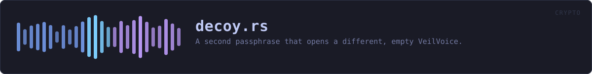
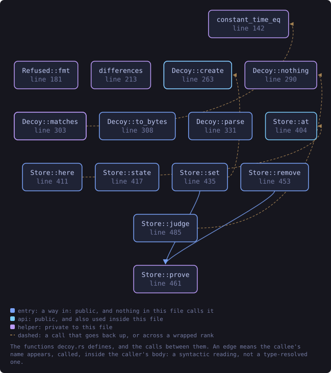

<!-- SPDX-License-Identifier: GPL-3.0-or-later -->
<!-- GENERATED by tools/docs/generate.py from the doc comments in the
     source. Do not edit this file: edit the `//!` and `///` comments in
     the .rs files and run the generator again. CI verifies it with
         python tools/docs/generate.py --check
-->

  

# `crates/veilvoice-crypto/src/decoy.rs`

[`veilvoice-crypto`](../../../crates/veilvoice-crypto/README.md) &middot; 907 lines &middot; [read the source](https://github.com/tilas01/veilvoice/blob/main/crates/veilvoice-crypto/src/decoy.rs)

## Contents

- [What this is for, and what it is honestly worth](#what-this-is-for-and-what-it-is-honestly-worth)
- [The destructive duress passphrase is deliberately not here](#the-destructive-duress-passphrase-is-deliberately-not-here)
- [Typing the wrong one by mistake](#typing-the-wrong-one-by-mistake)
- [Both passphrases are checked the same way](#both-passphrases-are-checked-the-same-way)
- [Where it is kept, and what holds the real passphrase](#where-it-is-kept-and-what-holds-the-real-passphrase)
- [In plain words](#in-plain-words)
  - [What this file contains](#what-this-file-contains)
  - [What calls what](#what-calls-what)
  - [Items](#items)

A second passphrase that opens a different, empty VeilVoice.

# What this is for, and what it is honestly worth

Somebody can be made to unlock a program. A decoy passphrase gives them
something true to say: it opens VeilVoice, the application works, and there
is nothing in it.

**It does not give you deniability, and anyone who tells you otherwise is
selling something.** VeilVoice is open source. This file is published. An
adversary who knows what they are looking at knows the feature exists, can
read exactly how it works, and can simply ask for the other passphrase. What
a decoy buys is a way to *comply* without revealing; what it does not buy is
any argument that there is nothing more to reveal. `SCOPE` says that in
the words a front end must show, and it is the most important thing this
crate produces.

# The destructive duress passphrase is deliberately not here

The roadmap asked for two things: a decoy, and a duress passphrase that
destroys data. The second is not shipped, and `WHY_NO_DESTRUCTION` is the
reason in full. In short: VeilVoice cannot promise a file is gone.

On flash storage a write does not overwrite. The controller maps a logical
block to a new physical page and leaves the old one holding the data until
it is garbage-collected, which may be minutes or may be never, and no
program running as an ordinary user can reach it. This project already
documents that about its own secure-erase feature and refuses to overstate
it there.

A destructive duress passphrase would be believed in exactly the situation
where being wrong costs the most. Somebody types it expecting the recordings
to be gone; the ciphertext is still in unmapped pages; and they then behave
as though it is not. **A control people rely on and that does not work is
worse than no control at all.** So there is not one.

# Typing the wrong one by mistake

The other failure the roadmap named, and the reason this shape was chosen.
Because the decoy destroys nothing, typing it by accident costs a
relaunch and nothing else. There is no state to recover and no decision that
cannot be taken back. That is not a happy accident; it is why the
destructive design was rejected rather than made safer.

# Both passphrases are checked the same way

Which one matched must not be visible in how long the check took. Both are
derived with the same Argon2id parameters and compared in constant time, and
**both are always derived**, in every branch: see `Store::judge`, which is
the one place an unlock goes through. Returning as soon as one matched would
make that answer measurably faster than the other, and tell an observer with
a stopwatch which of the two they had just watched somebody type.

The same applies to having one at all. A copy with no decoy set derives
against a record that nothing opens, so the time an unlock takes does not
answer "is there a decoy on this machine".

# Where it is kept, and what holds the real passphrase

`Store` keeps one file beside the app lock, under a name derived from the
vault's index like the lock's own two copies, so a folder listing does not
say which file it is. What is in it is the decoy's verifier and nothing else.

**The real passphrase is not in it.** It lives in the app lock, once, and
setting or removing a decoy proves it against that. A second copy of it here
would be two places that have to agree about the same secret with no way for
either to notice the other had changed, which is the shape of F-141.

A decoy is not a failed attempt at the real passphrase either. Typing it does
not count towards the rate limit, because the moment somebody uses this
feature is the moment a cooldown would hurt them most.

# In plain words

You can set a second passphrase, from Settings or with `veilvoice decoy set`.
Typing it opens VeilVoice normally, except that it is empty: no recordings,
no projects, no history. It is there for the situation where somebody is
standing over you asking you to unlock your computer.

It has to be properly different from your real one, and VeilVoice refuses a
pair that is nearly the same. Setting or removing it asks for your real
passphrase first, so nobody can do either behind your back at a window you
left unlocked.

Two honest warnings, and please read them.

It does **not** hide the fact that a second passphrase might exist. This
program's source code is public and this feature is described in it, so
anybody who recognises VeilVoice can ask you for the other one. It buys you
a way to hand something over. It does not buy you an argument.

And there is **no passphrase that destroys your recordings**, deliberately.
On modern storage, deleting a file does not reliably remove it, so a feature
that claimed to would be lying to you at the worst possible moment.

## What this file contains

907 lines defining **17 functions** (9 public), **6 types** and **6 constants**. Everything below is read out of the source, so it cannot disagree with the code.

**The types it owns.**

- `enum Opened` (line 101) -- Which passphrase was given.
- `struct Verifier` (line 112) -- One passphrase's stored form.
- `enum Refused` (line 162) -- Why a pair was refused.
- `struct Decoy` (line 238) -- A decoy passphrase's stored form, on its own.
- `enum State` (line 375) -- Whether this machine has a decoy passphrase, and whether it can be read.
- `struct Store` (line 395) -- The decoy passphrase as this machine keeps it.

**What happens when it runs.** These are the ways in: public, and nothing else in this file calls them, so they are what an outside caller reaches first.

- `Decoy::to_bytes` (line 308) -- The record, for writing.
- `Decoy::parse` (line 331) -- Read a record.
- `Store::here` (line 411) -- The store for this copy of VeilVoice.
  - reaches: `at`
- `Store::state` (line 417) -- Whether a decoy is set, and whether it reads.
- `Store::set` (line 435) -- Set or replace the decoy passphrase.
  - reaches: `create`, `prove`
- `Store::remove` (line 453) -- Remove the decoy passphrase, after proving the real one.
  - reaches: `prove`
- `Store::judge` (line 495) -- Which passphrase was typed.
  - reaches: `nothing`

## What calls what

The functions this file defines, and the calls between them. Both
are read out of the source: an edge means the callee's name appears,
called, inside the caller's body. It is a syntactic reading, not a
type-resolved one, so a call made through a trait object or a macro
will not appear.

_Colour key: **entry** -- a way in: public, and nothing in this file calls it; **api** -- public, and also used inside this file; **helper** -- private to this file._

  

The same graph as Mermaid source

```mermaid
%%{init: {"theme":"base","themeVariables":{"background":"#1a1b26","primaryColor":"#1f2335","primaryTextColor":"#c0caf5","primaryBorderColor":"#7aa2f7","secondaryColor":"#16161e","tertiaryColor":"#16161e","lineColor":"#737aa2","textColor":"#c0caf5","mainBkg":"#1f2335","nodeBorder":"#7aa2f7","clusterBkg":"#16161e","clusterBorder":"#2f3549","fontFamily":"ui-monospace, SFMono-Regular, Consolas, monospace","fontSize":"14px"}}}%%
flowchart TD
    n_create["Verifier::create<br/>line 125"]
    n_matches["Verifier::matches<br/>line 135"]
    n_constant_time_eq["constant_time_eq<br/>line 142"]
    n_fmt["Refused::fmt<br/>line 181"]
    n_differences["differences<br/>line 213"]
    n_create["Decoy::create<br/>line 263"]
    n_nothing["Decoy::nothing<br/>line 290"]
    n_matches["Decoy::matches<br/>line 303"]
    n_to_bytes(["Decoy::to_bytes<br/>line 308"])
    n_parse(["Decoy::parse<br/>line 331"])
    n_at["Store::at<br/>line 404"]
    n_here(["Store::here<br/>line 411"])
    n_state(["Store::state<br/>line 417"])
    n_set(["Store::set<br/>line 435"])
    n_remove(["Store::remove<br/>line 453"])
    n_prove["Store::prove<br/>line 461"]
    n_judge(["Store::judge<br/>line 495"])
    n_here --> n_at
    n_judge --> n_nothing
    n_matches --> n_constant_time_eq
    n_remove --> n_prove
    n_set --> n_create
    n_set --> n_prove
    click n_create href "https://github.com/tilas01/veilvoice/blob/main/crates/veilvoice-crypto/src/decoy.rs#L125" "open the source"
    click n_matches href "https://github.com/tilas01/veilvoice/blob/main/crates/veilvoice-crypto/src/decoy.rs#L135" "open the source"
    click n_constant_time_eq href "https://github.com/tilas01/veilvoice/blob/main/crates/veilvoice-crypto/src/decoy.rs#L142" "open the source"
    click n_fmt href "https://github.com/tilas01/veilvoice/blob/main/crates/veilvoice-crypto/src/decoy.rs#L181" "open the source"
    click n_differences href "https://github.com/tilas01/veilvoice/blob/main/crates/veilvoice-crypto/src/decoy.rs#L213" "open the source"
    click n_create href "https://github.com/tilas01/veilvoice/blob/main/crates/veilvoice-crypto/src/decoy.rs#L263" "open the source"
    click n_nothing href "https://github.com/tilas01/veilvoice/blob/main/crates/veilvoice-crypto/src/decoy.rs#L290" "open the source"
    click n_matches href "https://github.com/tilas01/veilvoice/blob/main/crates/veilvoice-crypto/src/decoy.rs#L303" "open the source"
    click n_to_bytes href "https://github.com/tilas01/veilvoice/blob/main/crates/veilvoice-crypto/src/decoy.rs#L308" "open the source"
    click n_parse href "https://github.com/tilas01/veilvoice/blob/main/crates/veilvoice-crypto/src/decoy.rs#L331" "open the source"
    click n_at href "https://github.com/tilas01/veilvoice/blob/main/crates/veilvoice-crypto/src/decoy.rs#L404" "open the source"
    click n_here href "https://github.com/tilas01/veilvoice/blob/main/crates/veilvoice-crypto/src/decoy.rs#L411" "open the source"
    click n_state href "https://github.com/tilas01/veilvoice/blob/main/crates/veilvoice-crypto/src/decoy.rs#L417" "open the source"
    click n_set href "https://github.com/tilas01/veilvoice/blob/main/crates/veilvoice-crypto/src/decoy.rs#L435" "open the source"
    click n_remove href "https://github.com/tilas01/veilvoice/blob/main/crates/veilvoice-crypto/src/decoy.rs#L453" "open the source"
    click n_prove href "https://github.com/tilas01/veilvoice/blob/main/crates/veilvoice-crypto/src/decoy.rs#L461" "open the source"
    click n_judge href "https://github.com/tilas01/veilvoice/blob/main/crates/veilvoice-crypto/src/decoy.rs#L495" "open the source"
    classDef entry fill:#1f2335,stroke:#7aa2f7,color:#c0caf5
    class n_to_bytes,n_parse,n_here,n_state,n_set,n_remove,n_judge entry
    classDef api fill:#1f2335,stroke:#7dcfff,color:#c0caf5
    class n_create,n_at api
    classDef helper fill:#1f2335,stroke:#bb9af7,color:#c0caf5
    class n_create,n_matches,n_constant_time_eq,n_fmt,n_differences,n_nothing,n_matches,n_prove helper
```

## Items

| Item | Line | Documentation |
|---|---:|---|
| `Opened` pub enum | [101](https://github.com/tilas01/veilvoice/blob/main/crates/veilvoice-crypto/src/decoy.rs#L101) | Which passphrase was given. |
| `Verifier` struct | [112](https://github.com/tilas01/veilvoice/blob/main/crates/veilvoice-crypto/src/decoy.rs#L112) | One passphrase's stored form. |
| `Verifier::create` fn | [125](https://github.com/tilas01/veilvoice/blob/main/crates/veilvoice-crypto/src/decoy.rs#L125) | Derive from passphrase once and keep what it produced, with the salt that produced it, so a later attempt can be compared against it. |
| `Verifier::matches` fn | [135](https://github.com/tilas01/veilvoice/blob/main/crates/veilvoice-crypto/src/decoy.rs#L135) | Derive and compare. |
| `constant_time_eq` fn | [142](https://github.com/tilas01/veilvoice/blob/main/crates/veilvoice-crypto/src/decoy.rs#L142) | Compare without letting the time taken depend on where they differ. |
| `LEAST_DIFFERENCE` pub const | [158](https://github.com/tilas01/veilvoice/blob/main/crates/veilvoice-crypto/src/decoy.rs#L158) | How similar two passphrases may be before the pair is refused. |
| `Refused` pub enum | [162](https://github.com/tilas01/veilvoice/blob/main/crates/veilvoice-crypto/src/decoy.rs#L162) | Why a pair was refused. |
| `Refused::fmt` fn | [181](https://github.com/tilas01/veilvoice/blob/main/crates/veilvoice-crypto/src/decoy.rs#L181) |  |
| `differences` fn | [213](https://github.com/tilas01/veilvoice/blob/main/crates/veilvoice-crypto/src/decoy.rs#L213) | How many positions two passphrases differ in. |
| `Decoy` pub struct | [238](https://github.com/tilas01/veilvoice/blob/main/crates/veilvoice-crypto/src/decoy.rs#L238) | A decoy passphrase's stored form, on its own. |
| `MAGIC` const | [244](https://github.com/tilas01/veilvoice/blob/main/crates/veilvoice-crypto/src/decoy.rs#L244) | What a decoy record starts with. |
| `FORMAT_VERSION` const | [247](https://github.com/tilas01/veilvoice/blob/main/crates/veilvoice-crypto/src/decoy.rs#L247) | The only format there is so far. |
| `RECORD_LEN` pub const | [251](https://github.com/tilas01/veilvoice/blob/main/crates/veilvoice-crypto/src/decoy.rs#L251) | Exactly how long a record is: magic, version, three reserved bytes, the three costs, the salt, the derived key. |
| `Decoy::create` pub fn | [263](https://github.com/tilas01/veilvoice/blob/main/crates/veilvoice-crypto/src/decoy.rs#L263) | Make a decoy from the real passphrase and the decoy one. |
| `Decoy::nothing` fn | [290](https://github.com/tilas01/veilvoice/blob/main/crates/veilvoice-crypto/src/decoy.rs#L290) | A record no passphrase opens, for the sake of taking the same time. |
| `Decoy::matches` fn | [303](https://github.com/tilas01/veilvoice/blob/main/crates/veilvoice-crypto/src/decoy.rs#L303) | Derive and compare. |
| `Decoy::to_bytes` pub fn | [308](https://github.com/tilas01/veilvoice/blob/main/crates/veilvoice-crypto/src/decoy.rs#L308) | The record, for writing. |
| `Decoy::parse` pub fn | [331](https://github.com/tilas01/veilvoice/blob/main/crates/veilvoice-crypto/src/decoy.rs#L331) | Read a record. |
| `State` pub enum | [375](https://github.com/tilas01/veilvoice/blob/main/crates/veilvoice-crypto/src/decoy.rs#L375) | Whether this machine has a decoy passphrase, and whether it can be read. |
| `Store` pub struct | [395](https://github.com/tilas01/veilvoice/blob/main/crates/veilvoice-crypto/src/decoy.rs#L395) | The decoy passphrase as this machine keeps it. |
| `Store::at` pub fn | [404](https://github.com/tilas01/veilvoice/blob/main/crates/veilvoice-crypto/src/decoy.rs#L404) | The store under base, which is the folder the app lock lives in. |
| `Store::here` pub fn | [411](https://github.com/tilas01/veilvoice/blob/main/crates/veilvoice-crypto/src/decoy.rs#L411) | The store for this copy of VeilVoice. |
| `Store::state` pub fn | [417](https://github.com/tilas01/veilvoice/blob/main/crates/veilvoice-crypto/src/decoy.rs#L417) | Whether a decoy is set, and whether it reads. |
| `Store::set` pub fn | [435](https://github.com/tilas01/veilvoice/blob/main/crates/veilvoice-crypto/src/decoy.rs#L435) | Set or replace the decoy passphrase. |
| `Store::remove` pub fn | [453](https://github.com/tilas01/veilvoice/blob/main/crates/veilvoice-crypto/src/decoy.rs#L453) | Remove the decoy passphrase, after proving the real one. |
| `Store::prove` fn | [461](https://github.com/tilas01/veilvoice/blob/main/crates/veilvoice-crypto/src/decoy.rs#L461) | That real really is this machine's passphrase. |
| `Store::judge` pub fn | [495](https://github.com/tilas01/veilvoice/blob/main/crates/veilvoice-crypto/src/decoy.rs#L495) | Which passphrase was typed. |
| `SCOPE` pub const | [525](https://github.com/tilas01/veilvoice/blob/main/crates/veilvoice-crypto/src/decoy.rs#L525) | What a decoy is worth, in the words a front end must show. |
| `WHY_NO_DESTRUCTION` pub const | [538](https://github.com/tilas01/veilvoice/blob/main/crates/veilvoice-crypto/src/decoy.rs#L538) | Why no passphrase destroys anything, and why that is the honest choice. |

---

Generated from `crates/veilvoice-crypto/src/decoy.rs`. On the website: [`website/reference/veilvoice-crypto/decoy.html`](../../../website/reference/veilvoice-crypto/decoy.html).

Signing key fingerprint `8101FB3BB28D02FB239E0CDF9CC1C7E7A9B5833A`.
