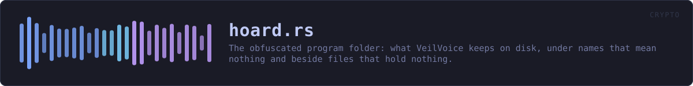
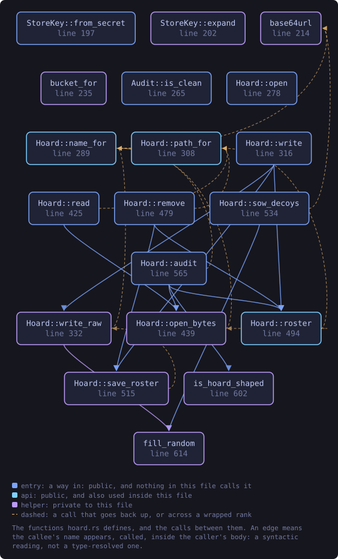

<!-- SPDX-License-Identifier: GPL-3.0-or-later -->
<!-- GENERATED by tools/docs/generate.py from the doc comments in the
     source. Do not edit this file: edit the `//!` and `///` comments in
     the .rs files and run the generator again. CI verifies it with
         python tools/docs/generate.py --check
-->

<p align="center">
  
</p>

# `crates/veilvoice-crypto/src/hoard.rs`

[`veilvoice-crypto`](../../../crates/veilvoice-crypto/README.md) &middot; 691 lines &middot; [read the source](https://github.com/tilas01/veilvoice/blob/main/crates/veilvoice-crypto/src/hoard.rs)

## Contents

- [What this buys, stated before anything else](#what-this-buys-stated-before-anything-else)
- [How a record is found](#how-a-record-is-found)
- [What is inside one](#what-is-inside-one)
- [The roster, and the one deletion claim this can honestly make](#the-roster-and-the-one-deletion-claim-this-can-honestly-make)
- [In plain words](#in-plain-words)
  - [What this file contains](#what-this-file-contains)
  - [What calls what](#what-calls-what)
  - [Items](#items)

The obfuscated program folder: what VeilVoice keeps on disk, under names
that mean nothing and beside files that hold nothing.

# What this buys, stated before anything else

Somebody who opens VeilVoice's folder without the app-lock passphrase sees
a few dozen files with names like `k7Qa1mXv9pLd0RtYbN3zHwFe`, all of them
full of bytes that look random, all of them one of a handful of sizes.
They cannot tell which files hold settings, which hold measurements, which
hold anything at all, and which are junk this module wrote precisely so
that the question has no answer from outside.

That is the whole claim. It is worth having and it is smaller than it
sounds, so here is the other half, in the same breath:

- **It does not hide that you use VeilVoice.** The folder is called
`veilvoice`, the lock file sits in it under its own name, and the
application is on disk. Anybody looking knows.
- **It does not hide how much you have.** File count and the bucket sizes
are visible. Decoys blur that number; they do not erase it.
- **It is not protection from someone who has your passphrase**, and it is
not protection while the application is open and unlocked. At that moment
everything here is readable, because it has to be.
- **It does not stop deletion.** Anybody who can read this folder can empty
it. What they cannot do is empty it *quietly*: see the roster below.
- **Somebody who knows VeilVoice knows what these files are.** The format
is public, this file is the specification, and a forensic examiner who
recognises it will recognise it here. Obfuscation is not steganography
and this module does not pretend otherwise.

What it does buy is the thing the app lock could not previously offer: a
reason to exist beyond a password prompt. Before this, the lock verified a
passphrase and guarded a window; the files behind it sat in the clear under
their own names, and deleting the lock file removed the whole obstacle.
Now the passphrase derives the key that names and opens these records, so
deleting the lock does not reveal them -- it destroys the only copy of the
salt they were derived through, and takes them with it. That is a real
change in what the lock is worth, and also a real way to lose your data,
which is why `crate::lock` keeps a second copy and the interface says so.

# How a record is found

Every record has a *logical* name that only the program uses: `settings`,
`measured`, `tour`. The file it lives in is named

```text
base64url(HMAC-SHA256(store_key, "veilvoice/hoard/name" || logical)[..18])
```

which is twenty-four characters of base64 with no padding and no extension.
Eighteen bytes rather than a round sixteen so the encoding comes out exact:
twenty-four characters with nothing to pad, which is one less thing to tell
a name apart from a decoy.

The derivation is deterministic, so the program does not search: it
computes the name it wants and opens that file. This is what makes the
selection *cryptographic* rather than a lookup table. There is no index
mapping `settings` to a filename, because an index is exactly the thing an
attacker would want. Without the key there is no way to run the derivation,
and with the key there is no need to store it.

# What is inside one

```text
[24-byte nonce][ChaCha20-Poly1305 over: [4-byte length][data][junk]]
```

The junk pads every record up to one of a few fixed sizes, so a file's
length says which bucket it fell in and nothing finer. The additional data
for the AEAD is the filename itself, which binds a record to its name: two
real files cannot be swapped without the swap being detected, because each
one authenticates the name it is supposed to be under.

The per-record key is a separate HKDF branch, so one record's key says
nothing about another's.

# The roster, and the one deletion claim this can honestly make

A record can be modified, and the AEAD catches that: any edit fails to
authenticate and `Hoard::audit` reports the record as tampered with.

Deletion is harder, because a file that is not there looks exactly like a
file that was never written. So the hoard keeps one more record, the
roster, listing the logical names that should exist. It is stored like any
other record, under a derived name, encrypted and padded, so it is not
identifiable from outside either.

That gives a real answer for deletion of *some* of the folder: a record in
the roster whose file is gone was deleted, and audit says so. It gives no
answer for deletion of *all* of it, including the roster, and nothing
stored in this folder ever could -- at that point the only evidence is that
the folder is empty, which you can see for yourself. The roster is missing
while the lock exists is itself reported, which is the closest honest
approximation, and it is stated as what it is rather than dressed up.

# In plain words

VeilVoice's own files are encrypted and given meaningless names, and a pile
of decoy files sits among them so nobody can tell which is which. Only the
program, once you have unlocked it, can work out which file is which.

Anybody looking at the folder still knows you use VeilVoice, and can still
delete the lot. What they cannot do is read any of it, work out how much of
it there is, or change any of it without VeilVoice telling you next time
you unlock.

## What this file contains

691 lines defining **19 functions** (11 public), **3 types** and **6 constants**. Everything below is read out of the source, so it cannot disagree with the code.

**The types it owns.**

- `struct StoreKey` (line 144) -- The key that names and opens everything in the hoard.
- `struct Audit` (line 197) -- What an audit found.
- `struct Hoard` (line 219) -- An obfuscated store rooted at a directory.

**What happens when it runs.** These are the ways in: public, and nothing else in this file calls them, so they are what an outside caller reaches first.

- `StoreKey::from_secret` (line 148) -- Wrap raw key material.
- `Audit::is_clean` (line 213) -- Whether anything was found that a user should be told about.
- `Hoard::open` (line 226) -- Open the hoard in dir.
- `Hoard::write` (line 252) -- Encrypt and store data under logical, padded and named so that neither its content nor its purpose is visible from outside.
  - reaches: `roster`, `save_roster`, `write_raw`, `open_bytes`, `path_for`, `bucket_for`, `fill_random`, `name_for`, `base64url`
- `Hoard::read` (line 292) -- Read a record back, or None if it was never written.
  - reaches: `open_bytes`, `path_for`, `name_for`, `base64url`
- `Hoard::remove` (line 331) -- Remove a record and drop it from the roster.
  - reaches: `path_for`, `roster`, `save_roster`, `name_for`, `open_bytes`, `write_raw`, `base64url`, `bucket_for`, `fill_random`
- `Hoard::sow_decoys` (line 381) -- Write decoy files: names of the same shape, contents of the same character, holding nothing.
  - reaches: `base64url`, `fill_random`
- `Hoard::audit` (line 407) -- Check every record the roster knows about, and count what else is here.
  - reaches: `is_hoard_shaped`, `name_for`, `open_bytes`, `roster`, `base64url`, `path_for`

## What calls what

The functions this file defines, and the calls between them. Both
are read out of the source: an edge means the callee's name appears,
called, inside the caller's body. It is a syntactic reading, not a
type-resolved one, so a call made through a trait object or a macro
will not appear.

_Colour key: **entry** -- a way in: public, and nothing in this file calls it; **api** -- public, and also used inside this file; **helper** -- private to this file._

<p align="center">
  
</p>

<details>
<summary>The same graph as Mermaid source</summary>



</details>

```mermaid
%%{init: {"theme":"base","themeVariables":{"background":"#1a1b26","primaryColor":"#1f2335","primaryTextColor":"#c0caf5","primaryBorderColor":"#7aa2f7","secondaryColor":"#16161e","tertiaryColor":"#16161e","lineColor":"#737aa2","textColor":"#c0caf5","mainBkg":"#1f2335","nodeBorder":"#7aa2f7","clusterBkg":"#16161e","clusterBorder":"#2f3549","fontFamily":"ui-monospace, SFMono-Regular, Consolas, monospace","fontSize":"14px"}}}%%
flowchart TD
    n_from_secret(["StoreKey::from_secret<br/>line 148"])
    n_expand["StoreKey::expand<br/>line 153"]
    n_base64url["base64url<br/>line 165"]
    n_bucket_for["bucket_for<br/>line 186"]
    n_is_clean(["Audit::is_clean<br/>line 213"])
    n_open(["Hoard::open<br/>line 226"])
    n_name_for["Hoard::name_for<br/>line 237"]
    n_path_for["Hoard::path_for<br/>line 244"]
    n_write(["Hoard::write<br/>line 252"])
    n_write_raw["Hoard::write_raw<br/>line 263"]
    n_read(["Hoard::read<br/>line 292"])
    n_open_bytes["Hoard::open_bytes<br/>line 302"]
    n_remove(["Hoard::remove<br/>line 331"])
    n_roster["Hoard::roster<br/>line 346"]
    n_save_roster["Hoard::save_roster<br/>line 362"]
    n_sow_decoys(["Hoard::sow_decoys<br/>line 381"])
    n_audit(["Hoard::audit<br/>line 407"])
    n_is_hoard_shaped["is_hoard_shaped<br/>line 444"]
    n_fill_random["fill_random<br/>line 451"]
    n_audit --> n_is_hoard_shaped
    n_audit --> n_name_for
    n_audit --> n_open_bytes
    n_audit --> n_roster
    n_name_for --> n_base64url
    n_open_bytes --> n_name_for
    n_path_for --> n_name_for
    n_read --> n_open_bytes
    n_read --> n_path_for
    n_remove --> n_path_for
    n_remove --> n_roster
    n_remove --> n_save_roster
    n_roster --> n_open_bytes
    n_roster --> n_path_for
    n_save_roster --> n_write_raw
    n_sow_decoys --> n_base64url
    n_sow_decoys --> n_fill_random
    n_write --> n_roster
    n_write --> n_save_roster
    n_write --> n_write_raw
    n_write_raw --> n_bucket_for
    n_write_raw --> n_fill_random
    n_write_raw --> n_name_for
    click n_from_secret href "https://github.com/tilas01/veilvoice/blob/main/crates/veilvoice-crypto/src/hoard.rs#L148" "open the source"
    click n_expand href "https://github.com/tilas01/veilvoice/blob/main/crates/veilvoice-crypto/src/hoard.rs#L153" "open the source"
    click n_base64url href "https://github.com/tilas01/veilvoice/blob/main/crates/veilvoice-crypto/src/hoard.rs#L165" "open the source"
    click n_bucket_for href "https://github.com/tilas01/veilvoice/blob/main/crates/veilvoice-crypto/src/hoard.rs#L186" "open the source"
    click n_is_clean href "https://github.com/tilas01/veilvoice/blob/main/crates/veilvoice-crypto/src/hoard.rs#L213" "open the source"
    click n_open href "https://github.com/tilas01/veilvoice/blob/main/crates/veilvoice-crypto/src/hoard.rs#L226" "open the source"
    click n_name_for href "https://github.com/tilas01/veilvoice/blob/main/crates/veilvoice-crypto/src/hoard.rs#L237" "open the source"
    click n_path_for href "https://github.com/tilas01/veilvoice/blob/main/crates/veilvoice-crypto/src/hoard.rs#L244" "open the source"
    click n_write href "https://github.com/tilas01/veilvoice/blob/main/crates/veilvoice-crypto/src/hoard.rs#L252" "open the source"
    click n_write_raw href "https://github.com/tilas01/veilvoice/blob/main/crates/veilvoice-crypto/src/hoard.rs#L263" "open the source"
    click n_read href "https://github.com/tilas01/veilvoice/blob/main/crates/veilvoice-crypto/src/hoard.rs#L292" "open the source"
    click n_open_bytes href "https://github.com/tilas01/veilvoice/blob/main/crates/veilvoice-crypto/src/hoard.rs#L302" "open the source"
    click n_remove href "https://github.com/tilas01/veilvoice/blob/main/crates/veilvoice-crypto/src/hoard.rs#L331" "open the source"
    click n_roster href "https://github.com/tilas01/veilvoice/blob/main/crates/veilvoice-crypto/src/hoard.rs#L346" "open the source"
    click n_save_roster href "https://github.com/tilas01/veilvoice/blob/main/crates/veilvoice-crypto/src/hoard.rs#L362" "open the source"
    click n_sow_decoys href "https://github.com/tilas01/veilvoice/blob/main/crates/veilvoice-crypto/src/hoard.rs#L381" "open the source"
    click n_audit href "https://github.com/tilas01/veilvoice/blob/main/crates/veilvoice-crypto/src/hoard.rs#L407" "open the source"
    click n_is_hoard_shaped href "https://github.com/tilas01/veilvoice/blob/main/crates/veilvoice-crypto/src/hoard.rs#L444" "open the source"
    click n_fill_random href "https://github.com/tilas01/veilvoice/blob/main/crates/veilvoice-crypto/src/hoard.rs#L451" "open the source"
    classDef entry fill:#1f2335,stroke:#7aa2f7,color:#c0caf5
    class n_from_secret,n_is_clean,n_open,n_write,n_read,n_remove,n_sow_decoys,n_audit entry
    classDef api fill:#1f2335,stroke:#7dcfff,color:#c0caf5
    class n_name_for,n_path_for,n_roster api
    classDef helper fill:#1f2335,stroke:#bb9af7,color:#c0caf5
    class n_expand,n_base64url,n_bucket_for,n_write_raw,n_open_bytes,n_save_roster,n_is_hoard_shaped,n_fill_random helper
```

## Items

| Item | Line | Documentation |
|---|---:|---|
| `INFO_NAME` <sub>const</sub> | [116](https://github.com/tilas01/veilvoice/blob/main/crates/veilvoice-crypto/src/hoard.rs#L116) | HKDF label for the filename key. |
| `INFO_REC` <sub>const</sub> | [118](https://github.com/tilas01/veilvoice/blob/main/crates/veilvoice-crypto/src/hoard.rs#L118) | HKDF label prefix for a record's own encryption key. |
| `NAME_BYTES` <sub>const</sub> | [125](https://github.com/tilas01/veilvoice/blob/main/crates/veilvoice-crypto/src/hoard.rs#L125) | How many bytes of the name HMAC end up in the filename. |
| `LEN_PREFIX` <sub>const</sub> | [128](https://github.com/tilas01/veilvoice/blob/main/crates/veilvoice-crypto/src/hoard.rs#L128) | The length prefix inside the padded plaintext. |
| `BUCKETS` <sub>const</sub> | [134](https://github.com/tilas01/veilvoice/blob/main/crates/veilvoice-crypto/src/hoard.rs#L134) | The sizes a record is padded up to, in bytes of plaintext. |
| `ROSTER` <sub>const</sub> | [137](https://github.com/tilas01/veilvoice/blob/main/crates/veilvoice-crypto/src/hoard.rs#L137) | The logical name of the roster record. |
| `StoreKey` <sub>pub struct</sub> | [144](https://github.com/tilas01/veilvoice/blob/main/crates/veilvoice-crypto/src/hoard.rs#L144) | The key that names and opens everything in the hoard. |
| `StoreKey::from_secret` <sub>pub fn</sub> | [148](https://github.com/tilas01/veilvoice/blob/main/crates/veilvoice-crypto/src/hoard.rs#L148) | Wrap raw key material. |
| `StoreKey::expand` <sub>fn</sub> | [153](https://github.com/tilas01/veilvoice/blob/main/crates/veilvoice-crypto/src/hoard.rs#L153) | Derive a subkey under a label. |
| `base64url` <sub>fn</sub> | [165](https://github.com/tilas01/veilvoice/blob/main/crates/veilvoice-crypto/src/hoard.rs#L165) | Base64url, no padding. |
| `bucket_for` <sub>fn</sub> | [186](https://github.com/tilas01/veilvoice/blob/main/crates/veilvoice-crypto/src/hoard.rs#L186) | The bucket a payload of this length pads up to. |
| `Audit` <sub>pub struct</sub> | [197](https://github.com/tilas01/veilvoice/blob/main/crates/veilvoice-crypto/src/hoard.rs#L197) | What an audit found. |
| `Audit::is_clean` <sub>pub fn</sub> | [213](https://github.com/tilas01/veilvoice/blob/main/crates/veilvoice-crypto/src/hoard.rs#L213) | Whether anything was found that a user should be told about. |
| `Hoard` <sub>pub struct</sub> | [219](https://github.com/tilas01/veilvoice/blob/main/crates/veilvoice-crypto/src/hoard.rs#L219) | An obfuscated store rooted at a directory. |
| `Hoard::open` <sub>pub fn</sub> | [226](https://github.com/tilas01/veilvoice/blob/main/crates/veilvoice-crypto/src/hoard.rs#L226) | Open the hoard in dir. |
| `Hoard::name_for` <sub>pub fn</sub> | [237](https://github.com/tilas01/veilvoice/blob/main/crates/veilvoice-crypto/src/hoard.rs#L237) | The filename a logical record lives under. |
| `Hoard::path_for` <sub>pub fn</sub> | [244](https://github.com/tilas01/veilvoice/blob/main/crates/veilvoice-crypto/src/hoard.rs#L244) | The full path of a logical record. |
| `Hoard::write` <sub>pub fn</sub> | [252](https://github.com/tilas01/veilvoice/blob/main/crates/veilvoice-crypto/src/hoard.rs#L252) | Encrypt and store data under logical, padded and named so that neither its content nor its purpose is visible from outside. |
| `Hoard::write_raw` <sub>fn</sub> | [263](https://github.com/tilas01/veilvoice/blob/main/crates/veilvoice-crypto/src/hoard.rs#L263) |  |
| `Hoard::read` <sub>pub fn</sub> | [292](https://github.com/tilas01/veilvoice/blob/main/crates/veilvoice-crypto/src/hoard.rs#L292) | Read a record back, or None if it was never written. |
| `Hoard::open_bytes` <sub>fn</sub> | [302](https://github.com/tilas01/veilvoice/blob/main/crates/veilvoice-crypto/src/hoard.rs#L302) |  |
| `Hoard::remove` <sub>pub fn</sub> | [331](https://github.com/tilas01/veilvoice/blob/main/crates/veilvoice-crypto/src/hoard.rs#L331) | Remove a record and drop it from the roster. |
| `Hoard::roster` <sub>pub fn</sub> | [346](https://github.com/tilas01/veilvoice/blob/main/crates/veilvoice-crypto/src/hoard.rs#L346) | The logical names the roster says should exist. |
| `Hoard::save_roster` <sub>fn</sub> | [362](https://github.com/tilas01/veilvoice/blob/main/crates/veilvoice-crypto/src/hoard.rs#L362) |  |
| `Hoard::sow_decoys` <sub>pub fn</sub> | [381](https://github.com/tilas01/veilvoice/blob/main/crates/veilvoice-crypto/src/hoard.rs#L381) | Write decoy files: names of the same shape, contents of the same character, holding nothing. |
| `Hoard::audit` <sub>pub fn</sub> | [407](https://github.com/tilas01/veilvoice/blob/main/crates/veilvoice-crypto/src/hoard.rs#L407) | Check every record the roster knows about, and count what else is here. |
| `is_hoard_shaped` <sub>fn</sub> | [444](https://github.com/tilas01/veilvoice/blob/main/crates/veilvoice-crypto/src/hoard.rs#L444) | Whether a filename has the shape this module writes. |
| `fill_random` <sub>fn</sub> | [451](https://github.com/tilas01/veilvoice/blob/main/crates/veilvoice-crypto/src/hoard.rs#L451) |  |

---

Generated from `crates/veilvoice-crypto/src/hoard.rs`. On the website: [`website/reference/veilvoice-crypto/hoard.html`](../../../website/reference/veilvoice-crypto/hoard.html).

Signing key fingerprint `8101FB3BB28D02FB239E0CDF9CC1C7E7A9B5833A`.
