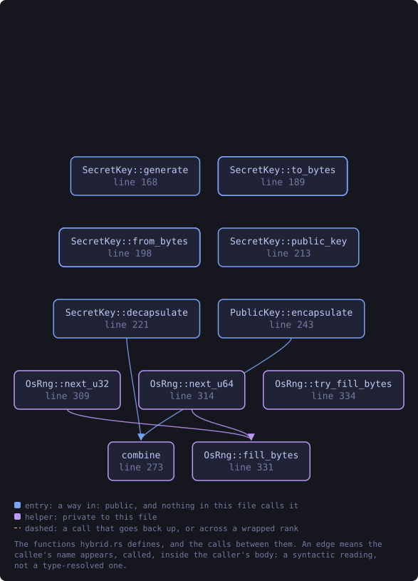

<!-- SPDX-License-Identifier: GPL-3.0-or-later -->
<!-- GENERATED by tools/docs/generate.py from the doc comments in the
     source. Do not edit this file: edit the `//!` and `///` comments in
     the .rs files and run the generator again. CI verifies it with
         python tools/docs/generate.py --check
-->

  

# `crates/veilvoice-crypto/src/hybrid.rs`

[`veilvoice-crypto`](../../../crates/veilvoice-crypto/README.md) &middot; 448 lines &middot; [read the source](https://github.com/tilas01/veilvoice/blob/main/crates/veilvoice-crypto/src/hybrid.rs)

## Contents

- [Why hybrid](#why-hybrid)
- [The combiner](#the-combiner)
- [In plain words](#in-plain-words)
  - [What this file contains](#what-this-file-contains)
  - [What calls what](#what-calls-what)
  - [Items](#items)

Post-quantum hybrid key encapsulation: X25519 + ML-KEM-768.

# Why hybrid

ML-KEM (FIPS 203, formerly Kyber) is believed secure against a quantum
adversary, but it is young, and lattice schemes have had implementation
breaks. X25519 is battle-tested but falls to a cryptographically relevant
quantum computer. Running both and mixing the two shared secrets means an
attacker must break *both*: the construction is at least as strong as the
stronger of the two, and it degrades gracefully if either one is broken.
This is the same reasoning behind the hybrids now deployed in TLS.

It matters here specifically because of *harvest-now-decrypt-later*: a
recording captured today can be stored until quantum hardware exists. A tool
whose whole purpose is protecting who is speaking has to assume the
adversary is patient.

# The combiner

The two shared secrets are mixed with HKDF-SHA256 rather than concatenated
or XORed. Both secrets, both ciphertexts and both public keys go into the
input, which binds the derived key to the exact transcript that produced it
and prevents an attacker who can substitute one half from steering the
result. Feeding the full transcript is what makes the combiner robust when
one KEM's ciphertexts are malleable.

# In plain words

This is for encrypting a recording to somebody else's key rather than to a
passphrase, and it uses two different systems at once.

One is the kind in use everywhere today. The other is designed to resist a
quantum computer, which does not yet exist in a useful form but which somebody
recording traffic now would be counting on later.

Both have to be broken to read the file. Using two means that if the newer one
turns out to have a flaw, you are no worse off than with the old one alone, and
if the old one falls to a quantum computer, the newer one still holds.

## What this file contains

448 lines defining **15 functions** (10 public), **4 types** and **9 constants**. Everything below is read out of the source, so it cannot disagree with the code.

**The types it owns.**

- `struct PublicKey` (line 76) -- A recipient's public key: an X25519 point plus an ML-KEM-768 encapsulation key.
- `struct SecretKey` (line 82) -- A recipient's private key.
- `struct Encapsulation` (line 90) -- The public values a sender transmits so the recipient can recover the shared secret.
- `struct OsRng` (line 284) -- Bridges the OS CSPRNG to the rand_core traits the KEM crates expect.

**What happens when it runs.** These are the ways in: public, and nothing else in this file calls them, so they are what an outside caller reaches first.

- `PublicKey::to_bytes` (line 99) -- Serialise to PUBLIC_KEY_LEN bytes.
- `PublicKey::from_bytes` (line 107) -- Parse from exactly PUBLIC_KEY_LEN bytes.
- `Encapsulation::to_bytes` (line 124) -- Serialise to ENCAPSULATION_LEN bytes.
- `Encapsulation::from_bytes` (line 132) -- Parse from exactly ENCAPSULATION_LEN bytes.
- `SecretKey::generate` (line 149) -- Generate a fresh key pair from the OS CSPRNG.
- `SecretKey::to_bytes` (line 170) -- Serialise to SECRET_KEY_LEN bytes.
- `SecretKey::from_bytes` (line 179) -- Parse from exactly SECRET_KEY_LEN bytes.
- `SecretKey::public_key` (line 194) -- The matching public key.
- `SecretKey::decapsulate` (line 202) -- Recover the shared secret from a sender's Encapsulation.
  - reaches: `combine`
- `PublicKey::encapsulate` (line 224) -- Produce a shared secret for this recipient, plus the public values they need in order to recover it.
  - reaches: `combine`

## What calls what

The functions this file defines, and the calls between them. Both
are read out of the source: an edge means the callee's name appears,
called, inside the caller's body. It is a syntactic reading, not a
type-resolved one, so a call made through a trait object or a macro
will not appear.

_Colour key: **entry** -- a way in: public, and nothing in this file calls it; **helper** -- private to this file._

  

The same graph as Mermaid source

```mermaid
%%{init: {"theme":"base","themeVariables":{"background":"#1a1b26","primaryColor":"#1f2335","primaryTextColor":"#c0caf5","primaryBorderColor":"#7aa2f7","secondaryColor":"#16161e","tertiaryColor":"#16161e","lineColor":"#737aa2","textColor":"#c0caf5","mainBkg":"#1f2335","nodeBorder":"#7aa2f7","clusterBkg":"#16161e","clusterBorder":"#2f3549","fontFamily":"ui-monospace, SFMono-Regular, Consolas, monospace","fontSize":"14px"}}}%%
flowchart TD
    n_to_bytes(["PublicKey::to_bytes<br/>line 99"])
    n_from_bytes(["PublicKey::from_bytes<br/>line 107"])
    n_to_bytes(["Encapsulation::to_bytes<br/>line 124"])
    n_from_bytes(["Encapsulation::from_bytes<br/>line 132"])
    n_generate(["SecretKey::generate<br/>line 149"])
    n_to_bytes(["SecretKey::to_bytes<br/>line 170"])
    n_from_bytes(["SecretKey::from_bytes<br/>line 179"])
    n_public_key(["SecretKey::public_key<br/>line 194"])
    n_decapsulate(["SecretKey::decapsulate<br/>line 202"])
    n_encapsulate(["PublicKey::encapsulate<br/>line 224"])
    n_combine["combine<br/>line 251"]
    n_next_u32["OsRng::next_u32<br/>line 287"]
    n_next_u64["OsRng::next_u64<br/>line 292"]
    n_fill_bytes["OsRng::fill_bytes<br/>line 297"]
    n_try_fill_bytes["OsRng::try_fill_bytes<br/>line 300"]
    n_decapsulate --> n_combine
    n_encapsulate --> n_combine
    n_next_u32 --> n_fill_bytes
    n_next_u64 --> n_fill_bytes
    click n_to_bytes href "https://github.com/tilas01/veilvoice/blob/main/crates/veilvoice-crypto/src/hybrid.rs#L99" "open the source"
    click n_from_bytes href "https://github.com/tilas01/veilvoice/blob/main/crates/veilvoice-crypto/src/hybrid.rs#L107" "open the source"
    click n_to_bytes href "https://github.com/tilas01/veilvoice/blob/main/crates/veilvoice-crypto/src/hybrid.rs#L124" "open the source"
    click n_from_bytes href "https://github.com/tilas01/veilvoice/blob/main/crates/veilvoice-crypto/src/hybrid.rs#L132" "open the source"
    click n_generate href "https://github.com/tilas01/veilvoice/blob/main/crates/veilvoice-crypto/src/hybrid.rs#L149" "open the source"
    click n_to_bytes href "https://github.com/tilas01/veilvoice/blob/main/crates/veilvoice-crypto/src/hybrid.rs#L170" "open the source"
    click n_from_bytes href "https://github.com/tilas01/veilvoice/blob/main/crates/veilvoice-crypto/src/hybrid.rs#L179" "open the source"
    click n_public_key href "https://github.com/tilas01/veilvoice/blob/main/crates/veilvoice-crypto/src/hybrid.rs#L194" "open the source"
    click n_decapsulate href "https://github.com/tilas01/veilvoice/blob/main/crates/veilvoice-crypto/src/hybrid.rs#L202" "open the source"
    click n_encapsulate href "https://github.com/tilas01/veilvoice/blob/main/crates/veilvoice-crypto/src/hybrid.rs#L224" "open the source"
    click n_combine href "https://github.com/tilas01/veilvoice/blob/main/crates/veilvoice-crypto/src/hybrid.rs#L251" "open the source"
    click n_next_u32 href "https://github.com/tilas01/veilvoice/blob/main/crates/veilvoice-crypto/src/hybrid.rs#L287" "open the source"
    click n_next_u64 href "https://github.com/tilas01/veilvoice/blob/main/crates/veilvoice-crypto/src/hybrid.rs#L292" "open the source"
    click n_fill_bytes href "https://github.com/tilas01/veilvoice/blob/main/crates/veilvoice-crypto/src/hybrid.rs#L297" "open the source"
    click n_try_fill_bytes href "https://github.com/tilas01/veilvoice/blob/main/crates/veilvoice-crypto/src/hybrid.rs#L300" "open the source"
    classDef entry fill:#1f2335,stroke:#7aa2f7,color:#c0caf5
    class n_to_bytes,n_from_bytes,n_to_bytes,n_from_bytes,n_generate,n_to_bytes,n_from_bytes,n_public_key,n_decapsulate,n_encapsulate entry
    classDef helper fill:#1f2335,stroke:#bb9af7,color:#c0caf5
    class n_combine,n_next_u32,n_next_u64,n_fill_bytes,n_try_fill_bytes helper
```

## Items

| Item | Line | Documentation |
|---|---:|---|
| `HKDF_INFO` const | [51](https://github.com/tilas01/veilvoice/blob/main/crates/veilvoice-crypto/src/hybrid.rs#L51) | Domain separation string, so keys derived here can never collide with keys derived by any other part of the system. |
| `X25519_PUB_LEN` pub const | [54](https://github.com/tilas01/veilvoice/blob/main/crates/veilvoice-crypto/src/hybrid.rs#L54) | Encoded length of the X25519 public key. |
| `MLKEM_EK_LEN` pub const | [56](https://github.com/tilas01/veilvoice/blob/main/crates/veilvoice-crypto/src/hybrid.rs#L56) | Encoded length of the ML-KEM-768 encapsulation (public) key. |
| `MLKEM_CT_LEN` pub const | [58](https://github.com/tilas01/veilvoice/blob/main/crates/veilvoice-crypto/src/hybrid.rs#L58) | Encoded length of an ML-KEM-768 ciphertext. |
| `MLKEM_DK_LEN` pub const | [60](https://github.com/tilas01/veilvoice/blob/main/crates/veilvoice-crypto/src/hybrid.rs#L60) | Encoded length of the ML-KEM-768 decapsulation (private) key. |
| `X25519_SECRET_LEN` pub const | [62](https://github.com/tilas01/veilvoice/blob/main/crates/veilvoice-crypto/src/hybrid.rs#L62) | Encoded length of the X25519 private scalar. |
| `SECRET_KEY_LEN` pub const | [64](https://github.com/tilas01/veilvoice/blob/main/crates/veilvoice-crypto/src/hybrid.rs#L64) | Total encoded length of a SecretKey. |
| `PUBLIC_KEY_LEN` pub const | [66](https://github.com/tilas01/veilvoice/blob/main/crates/veilvoice-crypto/src/hybrid.rs#L66) | Total encoded length of a PublicKey. |
| `ENCAPSULATION_LEN` pub const | [68](https://github.com/tilas01/veilvoice/blob/main/crates/veilvoice-crypto/src/hybrid.rs#L68) | Total encoded length of an Encapsulation. |
| `MlKemDk` type | [70](https://github.com/tilas01/veilvoice/blob/main/crates/veilvoice-crypto/src/hybrid.rs#L70) |  |
| `MlKemEk` type | [71](https://github.com/tilas01/veilvoice/blob/main/crates/veilvoice-crypto/src/hybrid.rs#L71) |  |
| `PublicKey` pub struct | [76](https://github.com/tilas01/veilvoice/blob/main/crates/veilvoice-crypto/src/hybrid.rs#L76) | A recipient's public key: an X25519 point plus an ML-KEM-768 encapsulation key. |
| `SecretKey` pub struct | [82](https://github.com/tilas01/veilvoice/blob/main/crates/veilvoice-crypto/src/hybrid.rs#L82) | A recipient's private key. |
| `Encapsulation` pub struct | [90](https://github.com/tilas01/veilvoice/blob/main/crates/veilvoice-crypto/src/hybrid.rs#L90) | The public values a sender transmits so the recipient can recover the shared secret. |
| `PublicKey::to_bytes` pub fn | [99](https://github.com/tilas01/veilvoice/blob/main/crates/veilvoice-crypto/src/hybrid.rs#L99) | Serialise to PUBLIC_KEY_LEN bytes. |
| `PublicKey::from_bytes` pub fn | [107](https://github.com/tilas01/veilvoice/blob/main/crates/veilvoice-crypto/src/hybrid.rs#L107) | Parse from exactly PUBLIC_KEY_LEN bytes. |
| `Encapsulation::to_bytes` pub fn | [124](https://github.com/tilas01/veilvoice/blob/main/crates/veilvoice-crypto/src/hybrid.rs#L124) | Serialise to ENCAPSULATION_LEN bytes. |
| `Encapsulation::from_bytes` pub fn | [132](https://github.com/tilas01/veilvoice/blob/main/crates/veilvoice-crypto/src/hybrid.rs#L132) | Parse from exactly ENCAPSULATION_LEN bytes. |
| `SecretKey::generate` pub fn | [149](https://github.com/tilas01/veilvoice/blob/main/crates/veilvoice-crypto/src/hybrid.rs#L149) | Generate a fresh key pair from the OS CSPRNG. |
| `SecretKey::to_bytes` pub fn | [170](https://github.com/tilas01/veilvoice/blob/main/crates/veilvoice-crypto/src/hybrid.rs#L170) | Serialise to SECRET_KEY_LEN bytes. |
| `SecretKey::from_bytes` pub fn | [179](https://github.com/tilas01/veilvoice/blob/main/crates/veilvoice-crypto/src/hybrid.rs#L179) | Parse from exactly SECRET_KEY_LEN bytes. |
| `SecretKey::public_key` pub fn | [194](https://github.com/tilas01/veilvoice/blob/main/crates/veilvoice-crypto/src/hybrid.rs#L194) | The matching public key. |
| `SecretKey::decapsulate` pub fn | [202](https://github.com/tilas01/veilvoice/blob/main/crates/veilvoice-crypto/src/hybrid.rs#L202) | Recover the shared secret from a sender's Encapsulation. |
| `PublicKey::encapsulate` pub fn | [224](https://github.com/tilas01/veilvoice/blob/main/crates/veilvoice-crypto/src/hybrid.rs#L224) | Produce a shared secret for this recipient, plus the public values they need in order to recover it. |
| `combine` fn | [251](https://github.com/tilas01/veilvoice/blob/main/crates/veilvoice-crypto/src/hybrid.rs#L251) | Mix both shared secrets with the full transcript. |
| `OsRng` struct | [284](https://github.com/tilas01/veilvoice/blob/main/crates/veilvoice-crypto/src/hybrid.rs#L284) | Bridges the OS CSPRNG to the rand_core traits the KEM crates expect. |
| `OsRng::next_u32` fn | [287](https://github.com/tilas01/veilvoice/blob/main/crates/veilvoice-crypto/src/hybrid.rs#L287) |  |
| `OsRng::next_u64` fn | [292](https://github.com/tilas01/veilvoice/blob/main/crates/veilvoice-crypto/src/hybrid.rs#L292) |  |
| `OsRng::fill_bytes` fn | [297](https://github.com/tilas01/veilvoice/blob/main/crates/veilvoice-crypto/src/hybrid.rs#L297) |  |
| `OsRng::try_fill_bytes` fn | [300](https://github.com/tilas01/veilvoice/blob/main/crates/veilvoice-crypto/src/hybrid.rs#L300) |  |

---

Generated from `crates/veilvoice-crypto/src/hybrid.rs`. On the website: [`website/reference/veilvoice-crypto/hybrid.html`](../../../website/reference/veilvoice-crypto/hybrid.html).

Signing key fingerprint `8101FB3BB28D02FB239E0CDF9CC1C7E7A9B5833A`.
