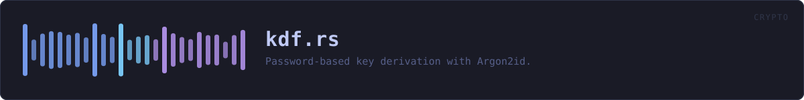
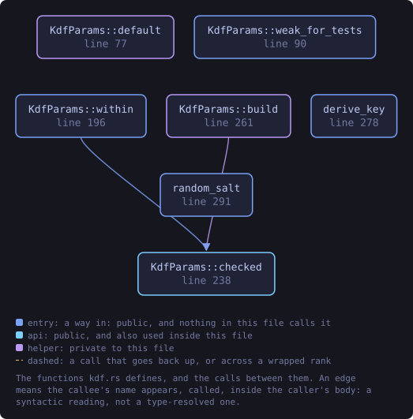

<!-- SPDX-License-Identifier: GPL-3.0-or-later -->
<!-- GENERATED by tools/docs/generate.py from the doc comments in the
     source. Do not edit this file: edit the `//!` and `///` comments in
     the .rs files and run the generator again. CI verifies it with
         python tools/docs/generate.py --check
-->

  

# `crates/veilvoice-crypto/src/kdf.rs`

[`veilvoice-crypto`](../../../crates/veilvoice-crypto/README.md) &middot; 525 lines &middot; [read the source](https://github.com/tilas01/veilvoice/blob/main/crates/veilvoice-crypto/src/kdf.rs)

## Contents

- [Cost parameters arrive from a file, so they are hostile input](#cost-parameters-arrive-from-a-file-so-they-are-hostile-input)
- [Domain separation](#domain-separation)
- [In plain words](#in-plain-words)
  - [What this file contains](#what-this-file-contains)
  - [What calls what](#what-calls-what)
  - [Items](#items)

Password-based key derivation with Argon2id.

Argon2id is the memory-hard KDF recommended by RFC 9106 and the OWASP
password-storage guidance; the `id` variant resists both GPU/ASIC
parallelism and the side-channel exposure of pure Argon2i.

Parameters travel *with* the ciphertext rather than being compiled in, so a
file encrypted today still opens after the defaults are raised, and a user
on a small machine can lower the memory cost without forking the format.

# Cost parameters arrive from a file, so they are hostile input

That flexibility has a sharp edge, and two shipped defects came from it.
`m_cost` and `p_cost` are read verbatim from a `.veil` header -- and from the
app-lock file, **which is parsed before anyone has authenticated**.

* `argon2` 0.5.3 evaluates `m_cost < p_cost * 8` *before* it checks whether
`p_cost` is within range, so a large `p_cost` overflows the multiplication.
With overflow checks on -- every debug build, and any project consuming
this crate as a library -- that is a panic on attacker-controlled input
(F-2).
* `m_cost` is allocated before anything else happens, so a header claiming
`u32::MAX` asks for **4 TiB**. The allocation fails, and a failed
allocation aborts the process. Merely *opening* a hostile container killed
the program (F-3).

Both are bounded in `KdfParams::checked`, in arithmetic that cannot
overflow. **Never bypass that funnel.** It is the single place every
derivation passes through, and it exists because the alternative -- checks
scattered across the call sites -- is how one of them gets missed.

A residual is stated rather than fixed: a container may still declare a
legitimate-but-expensive cost, so an attacker can make opening *their* file
slow. That is inherent to shipping the cost with the file, which is what lets
old files open after defaults rise. Slow is not crashing, and the user chose
to open that file.

# Domain separation

The app-lock password and the recording passphrase are different secrets and
are kept different: they are domain-separated in the derivation, so
unlocking the application does not unseal recordings and one cannot be
derived from the other.

# In plain words

This turns a passphrase into a key.

A passphrase somebody can remember is far too short and too predictable to use
directly, so it is put through a process designed to be slow and to need a
large amount of memory. That does not slow you down noticeably once, but it
makes guessing millions of passphrases enormously expensive for anybody trying.

The settings are stored with each file, so an old recording still opens after
the defaults are made stronger.

## What this file contains

525 lines defining **7 functions** (5 public), **1 type** and **6 constants**. Everything below is read out of the source, so it cannot disagree with the code.

**The types it owns.**

- `struct KdfParams` (line 63) -- Argon2id cost parameters.

**What happens when it runs.** These are the ways in: public, and nothing else in this file calls them, so they are what an outside caller reaches first.

- `KdfParams::weak_for_tests` (line 90) -- A deliberately cheap profile for tests and low-memory devices.
- `KdfParams::within` (line 196) -- Check the costs against a caller-chosen memory ceiling as well as the built-in one.
  - reaches: `checked`
- `derive_key` (line 265) -- Derive a 32-byte key from password and salt.
- `random_salt` (line 278) -- Draw a fresh random salt from the OS CSPRNG.

## What calls what

The functions this file defines, and the calls between them. Both
are read out of the source: an edge means the callee's name appears,
called, inside the caller's body. It is a syntactic reading, not a
type-resolved one, so a call made through a trait object or a macro
will not appear.

_Colour key: **entry** -- a way in: public, and nothing in this file calls it; **api** -- public, and also used inside this file; **helper** -- private to this file._

  

The same graph as Mermaid source

```mermaid
%%{init: {"theme":"base","themeVariables":{"background":"#1a1b26","primaryColor":"#1f2335","primaryTextColor":"#c0caf5","primaryBorderColor":"#7aa2f7","secondaryColor":"#16161e","tertiaryColor":"#16161e","lineColor":"#737aa2","textColor":"#c0caf5","mainBkg":"#1f2335","nodeBorder":"#7aa2f7","clusterBkg":"#16161e","clusterBorder":"#2f3549","fontFamily":"ui-monospace, SFMono-Regular, Consolas, monospace","fontSize":"14px"}}}%%
flowchart TD
    n_default["KdfParams::default<br/>line 77"]
    n_weak_for_tests(["KdfParams::weak_for_tests<br/>line 90"])
    n_within(["KdfParams::within<br/>line 196"])
    n_checked["KdfParams::checked<br/>line 225"]
    n_build["KdfParams::build<br/>line 248"]
    n_derive_key(["derive_key<br/>line 265"])
    n_random_salt(["random_salt<br/>line 278"])
    n_build --> n_checked
    n_within --> n_checked
    click n_default href "https://github.com/tilas01/veilvoice/blob/main/crates/veilvoice-crypto/src/kdf.rs#L77" "open the source"
    click n_weak_for_tests href "https://github.com/tilas01/veilvoice/blob/main/crates/veilvoice-crypto/src/kdf.rs#L90" "open the source"
    click n_within href "https://github.com/tilas01/veilvoice/blob/main/crates/veilvoice-crypto/src/kdf.rs#L196" "open the source"
    click n_checked href "https://github.com/tilas01/veilvoice/blob/main/crates/veilvoice-crypto/src/kdf.rs#L225" "open the source"
    click n_build href "https://github.com/tilas01/veilvoice/blob/main/crates/veilvoice-crypto/src/kdf.rs#L248" "open the source"
    click n_derive_key href "https://github.com/tilas01/veilvoice/blob/main/crates/veilvoice-crypto/src/kdf.rs#L265" "open the source"
    click n_random_salt href "https://github.com/tilas01/veilvoice/blob/main/crates/veilvoice-crypto/src/kdf.rs#L278" "open the source"
    classDef entry fill:#1f2335,stroke:#7aa2f7,color:#c0caf5
    class n_weak_for_tests,n_within,n_derive_key,n_random_salt entry
    classDef api fill:#1f2335,stroke:#7dcfff,color:#c0caf5
    class n_checked api
    classDef helper fill:#1f2335,stroke:#bb9af7,color:#c0caf5
    class n_default,n_build helper
```

## Items

| Item | Line | Documentation |
|---|---:|---|
| `KdfParams` pub struct | [63](https://github.com/tilas01/veilvoice/blob/main/crates/veilvoice-crypto/src/kdf.rs#L63) | Argon2id cost parameters. |
| `KdfParams::default` fn | [77](https://github.com/tilas01/veilvoice/blob/main/crates/veilvoice-crypto/src/kdf.rs#L77) | RFC 9106's "first recommended" profile: 2 GiB is the second option, but 256 MiB with three passes is the sweet spot for an interactive desktop unlock — strong against offline cracking while still opening a file in well under a second on ordinary hardware. |
| `KdfParams::weak_for_tests` pub fn | [90](https://github.com/tilas01/veilvoice/blob/main/crates/veilvoice-crypto/src/kdf.rs#L90) | A deliberately cheap profile for tests and low-memory devices. |
| `KdfParams::MAX_P_COST` const | [99](https://github.com/tilas01/veilvoice/blob/main/crates/veilvoice-crypto/src/kdf.rs#L99) | Argon2's own documented ceiling on parallelism: 2^24 - 1. |
| `KdfParams::MAX_M_COST` pub const | [120](https://github.com/tilas01/veilvoice/blob/main/crates/veilvoice-crypto/src/kdf.rs#L120) | The largest memory cost this build will attempt, in KiB — 4 GiB. |
| `KdfParams::MAX_T_COST` pub const | [160](https://github.com/tilas01/veilvoice/blob/main/crates/veilvoice-crypto/src/kdf.rs#L160) | The largest number of passes this build will attempt. |
| `KdfParams::UNATTENDED_MAX_M_COST` pub const | [176](https://github.com/tilas01/veilvoice/blob/main/crates/veilvoice-crypto/src/kdf.rs#L176) | A ceiling for a caller with nobody watching. |
| `KdfParams::within` pub fn | [196](https://github.com/tilas01/veilvoice/blob/main/crates/veilvoice-crypto/src/kdf.rs#L196) | Check the costs against a caller-chosen memory ceiling as well as the built-in one. |
| `KdfParams::checked` pub fn | [225](https://github.com/tilas01/veilvoice/blob/main/crates/veilvoice-crypto/src/kdf.rs#L225) | Check the costs are ones Argon2 can accept, before handing them to it. |
| `KdfParams::build` fn | [248](https://github.com/tilas01/veilvoice/blob/main/crates/veilvoice-crypto/src/kdf.rs#L248) | Reject values Argon2 cannot accept, so a corrupt header fails loudly rather than panicking deep inside the KDF. |
| `SALT_LEN` pub const | [257](https://github.com/tilas01/veilvoice/blob/main/crates/veilvoice-crypto/src/kdf.rs#L257) | Length of the salt stored in an encrypted container. |
| `KEY_LEN` pub const | [259](https://github.com/tilas01/veilvoice/blob/main/crates/veilvoice-crypto/src/kdf.rs#L259) | Length of a derived symmetric key. |
| `derive_key` pub fn | [265](https://github.com/tilas01/veilvoice/blob/main/crates/veilvoice-crypto/src/kdf.rs#L265) | Derive a 32-byte key from password and salt. |
| `random_salt` pub fn | [278](https://github.com/tilas01/veilvoice/blob/main/crates/veilvoice-crypto/src/kdf.rs#L278) | Draw a fresh random salt from the OS CSPRNG. |

---

Generated from `crates/veilvoice-crypto/src/kdf.rs`. On the website: [`website/reference/veilvoice-crypto/kdf.html`](../../../website/reference/veilvoice-crypto/kdf.html).

Signing key fingerprint `8101FB3BB28D02FB239E0CDF9CC1C7E7A9B5833A`.
