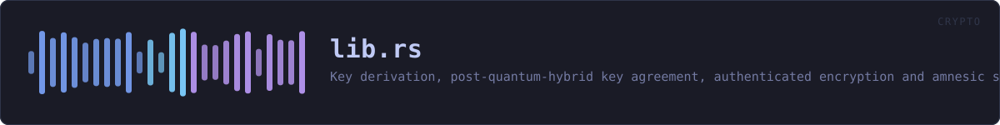
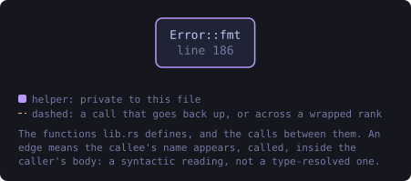

<!-- SPDX-License-Identifier: GPL-3.0-or-later -->
<!-- GENERATED by tools/docs/generate.py from the doc comments in the
     source. Do not edit this file: edit the `//!` and `///` comments in
     the .rs files and run the generator again. CI verifies it with
         python tools/docs/generate.py --check
-->

<p align="center">
  
</p>

# `crates/veilvoice-crypto/src/lib.rs`

[`veilvoice-crypto`](../../../crates/veilvoice-crypto/README.md) &middot; 192 lines &middot; [read the source](https://github.com/tilas01/veilvoice/blob/main/crates/veilvoice-crypto/src/lib.rs)

## Contents

  - [What this crate is for](#what-this-crate-is-for)
  - [Threat model, stated plainly](#threat-model-stated-plainly)
  - [Example](#example)
- [In plain words](#in-plain-words)
  - [What this file contains](#what-this-file-contains)
  - [What calls what](#what-calls-what)
  - [Items](#items)

Key derivation, post-quantum-hybrid key agreement, authenticated encryption
and amnesic secret storage for VeilVoice.

## What this crate is for

[`veilvoice_core`](../../../crates/veilvoice-core/README.md) makes a voice
unrecognisable; it does not hide the *words*, and it is not meant to. When a
recording needs to stay secret as well — at rest on disk, or in transit to
someone else — that is this crate's job.

- `kdf` — Argon2id, for turning a password into a key.
- `hybrid` — X25519 + ML-KEM-768, so a recording captured today is not
readable by a quantum adversary tomorrow.
- `aead` — XChaCha20-Poly1305, with random nonces and authenticated
associated data.
- `container` — the `.veil` file format that ties the three together.
- `amnesia` — page-locked, zeroizing, constant-time-comparable secrets.
- `shred` — secure erasure, and an honest account of what that is worth
on flash storage.
- `privatefile` — writing a file that is owner-only from the moment it
exists, rather than world-readable until a second syscall tightens it.
- `lock` — the application lock: an Argon2id verifier with a rate limit,
which protects against casual access and says so rather than pretending to
be tamper-proof.

## Threat model, stated plainly

This crate protects data **at rest and in transit** against an attacker who
later obtains the file, including one who stores it until quantum hardware
exists. It does **not** protect against an attacker who is already running
code as you, or who can read this process's memory: page-locking keeps keys
out of the swap file, not out of a debugger. Hibernation writes RAM to disk
wholesale and defeats locking entirely.

## Example

```
use veilvoice_crypto::{container, kdf};

# fn main() -> Result<(), veilvoice_crypto::Error> {
// Cheap parameters so the doctest is fast; real callers use the default.
let params = kdf::KdfParams::weak_for_tests();
let sealed = container::seal_with_password(b"pass phrase", b"audio bytes", params)?;
assert_eq!(container::open_with_password(b"pass phrase", &sealed)?, b"audio bytes");
assert!(container::open_with_password(b"wrong", &sealed).is_err());
# Ok(())
# }
```

VeilVoice contains **no `unsafe` code at all** — including the page-locking
in `amnesia`, which goes through a safe wrapper.

# In plain words

This is the locking.

Two separate things use it. Recordings are sealed on your disk so that somebody
who takes the disk cannot listen to them, and the app can be put behind a
password so somebody who picks up your unlocked computer cannot open it.

Those two passwords are deliberately different. Opening the program should not
be the same act as unsealing everything it has ever written.

The maths is chosen to be slow to guess and to still be safe if somebody one
day builds a quantum computer. Nothing is sent anywhere; the sealing happens on
your machine and the key is made from your password each time.

## What this file contains

192 lines defining **1 function** (0 public), **1 type** and **1 constant**. Everything below is read out of the source, so it cannot disagree with the code.

**The types it owns.**

- `enum Error` (line 98) -- Everything that can go wrong in this crate.

## What calls what

The functions this file defines, and the calls between them. Both
are read out of the source: an edge means the callee's name appears,
called, inside the caller's body. It is a syntactic reading, not a
type-resolved one, so a call made through a trait object or a macro
will not appear.

_Colour key: **helper** -- private to this file._

<p align="center">
  
</p>

<details>
<summary>The same graph as Mermaid source</summary>



</details>

```mermaid
%%{init: {"theme":"base","themeVariables":{"background":"#1a1b26","primaryColor":"#1f2335","primaryTextColor":"#c0caf5","primaryBorderColor":"#7aa2f7","secondaryColor":"#16161e","tertiaryColor":"#16161e","lineColor":"#737aa2","textColor":"#c0caf5","mainBkg":"#1f2335","nodeBorder":"#7aa2f7","clusterBkg":"#16161e","clusterBorder":"#2f3549","fontFamily":"ui-monospace, SFMono-Regular, Consolas, monospace","fontSize":"14px"}}}%%
flowchart TD
    n_fmt["Error::fmt<br/>line 153"]
    click n_fmt href "https://github.com/tilas01/veilvoice/blob/main/crates/veilvoice-crypto/src/lib.rs#L153" "open the source"
    classDef helper fill:#1f2335,stroke:#bb9af7,color:#c0caf5
    class n_fmt helper
```

## Items

| Item | Line | Documentation |
|---|---:|---|
| `VERSION` <sub>pub const</sub> | [89](https://github.com/tilas01/veilvoice/blob/main/crates/veilvoice-crypto/src/lib.rs#L89) | Crate version string, surfaced in the About panel. |
| `Error` <sub>pub enum</sub> | [98](https://github.com/tilas01/veilvoice/blob/main/crates/veilvoice-crypto/src/lib.rs#L98) | Everything that can go wrong in this crate. |
| `Error::fmt` <sub>fn</sub> | [153](https://github.com/tilas01/veilvoice/blob/main/crates/veilvoice-crypto/src/lib.rs#L153) |  |

---

Generated from `crates/veilvoice-crypto/src/lib.rs`. On the website: [`website/reference/veilvoice-crypto/lib.html`](../../../website/reference/veilvoice-crypto/lib.html).

Signing key fingerprint `8101FB3BB28D02FB239E0CDF9CC1C7E7A9B5833A`.
