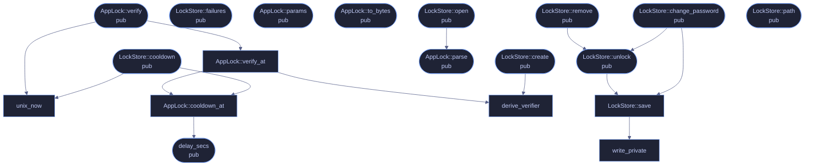

<!-- SPDX-License-Identifier: CC-BY-NC-SA-4.0 -->
<!-- GENERATED by tools/docs/generate.py from the doc comments in the
     source. Do not edit this file: edit the `//!` and `///` comments in
     the .rs files and run the generator again. CI verifies it with
         python tools/docs/generate.py --check
-->

  

# `crates/veilvoice-crypto/src/lock.rs`

[`veilvoice-crypto`](../../../crates/veilvoice-crypto/README.md) &middot; 732 lines &middot; [read the source](https://github.com/tilas01/veilvoice/blob/main/crates/veilvoice-crypto/src/lock.rs)

## Contents

- [What this is worth, stated before anything else](#what-this-is-worth-stated-before-anything-else)
- [Why a verifier and not a key](#why-a-verifier-and-not-a-key)
- [Rate limiting](#rate-limiting)
- [Separate from the recording password](#separate-from-the-recording-password)
  - [What calls what](#what-calls-what)
  - [Items](#items)

The application lock: an Argon2id password verifier with a rate limit.

# What this is worth, stated before anything else

**This is not a security boundary against someone holding the disk.** It
cannot be. A local application has nowhere to hide a secret from the machine
it runs on: whoever can read this file can also delete it, and deleting it
removes the lock. That is not a defect in the implementation, it is what a
local lock *is*.

What it does buy is real and worth having: someone who picks up your unlocked
computer — a flatmate, a colleague, a border officer with your session open —
cannot open VeilVoice, see which files you have processed, or start a live
scramble. That is the threat this defends against, and `SCOPE` says so in
the words the user sees.

If the threat is an attacker with the disk, the answer is full-volume
encryption (LUKS, BitLocker, FileVault) plus `crate::container` for the
recordings themselves. Neither of those is replaced by this module.

# Why a verifier and not a key

The lock stores `Argon2id(domain ‖ password, salt)` and compares it in
constant time. It deliberately does **not** derive a key that encrypts
anything, because there is nothing here it could usefully encrypt: the
recordings have their own password (a *different* one — see
`crate::container`), and pretending the app lock protected them would be
exactly the overclaim this project refuses to make.

The stored verifier is therefore a password hash sitting on disk in the
clear, and must be treated like one. Argon2id at the default cost (256 MiB,
t=3, p=4) makes an offline attack expensive per guess, which matters for a
decent passphrase and does not save a bad one.

# Rate limiting

Wrong attempts are counted and the count is **persisted**, so killing the
process does not hand an attacker a fresh budget. After three free attempts
the wait doubles — 5 s, 10 s, 20 s … capped at fifteen minutes.

The counter is stored in the same unauthenticated file as the verifier, and
the wait is measured against the system clock. Someone who can edit the file
or move the clock defeats both. Again: casual access, not the disk.

# Separate from the recording password

The password that unlocks the app and the password that encrypts recordings
are two different passwords, on purpose, so that unlocking the app is not the
same act as unsealing everything it has ever written. To make that structural
rather than merely conventional, the verifier is derived over a domain-
separated input, so the same passphrase used in both places still produces
unrelated values.

## What calls what

The functions this file defines, and the calls between them. Both
are read out of the source: an edge means the callee's name appears,
called, inside the caller's body. It is a syntactic reading, not a
type-resolved one, so a call made through a trait object or a macro
will not appear.

_22 of 20 functions are drawn; the diagram is bounded at 22 so it
stays readable. The full list is in the table below._

## Items

| Item | Line | Documentation |
|---|---:|---|
| `SCOPE` pub const | [64](https://github.com/tilas01/veilvoice/blob/main/crates/veilvoice-crypto/src/lock.rs#L64) | What the app lock protects against, and what it does not, in the words a front-end should show the user. |
| `MAGIC` pub const | [71](https://github.com/tilas01/veilvoice/blob/main/crates/veilvoice-crypto/src/lock.rs#L71) | Magic bytes at the start of a lock file. |
| `FORMAT_VERSION` pub const | [73](https://github.com/tilas01/veilvoice/blob/main/crates/veilvoice-crypto/src/lock.rs#L73) | Format version this build writes. |
| `LOCK_LEN` pub const | [75](https://github.com/tilas01/veilvoice/blob/main/crates/veilvoice-crypto/src/lock.rs#L75) | Exact size of a lock file, in bytes. |
| `DOMAIN` const | [79](https://github.com/tilas01/veilvoice/blob/main/crates/veilvoice-crypto/src/lock.rs#L79) | Domain separator, so the app-lock verifier can never coincide with a key derived from the same passphrase anywhere else in this crate. |
| `FREE_ATTEMPTS` const | [82](https://github.com/tilas01/veilvoice/blob/main/crates/veilvoice-crypto/src/lock.rs#L82) | Failed attempts allowed before the wait starts. |
| `BASE_DELAY_SECS` const | [84](https://github.com/tilas01/veilvoice/blob/main/crates/veilvoice-crypto/src/lock.rs#L84) | The first enforced wait, in seconds. |
| `MAX_DELAY_SECS` const | [88](https://github.com/tilas01/veilvoice/blob/main/crates/veilvoice-crypto/src/lock.rs#L88) | The longest the wait ever gets. |
| `delay_secs` pub fn | [94](https://github.com/tilas01/veilvoice/blob/main/crates/veilvoice-crypto/src/lock.rs#L94) | How long to refuse the next attempt after failures consecutive failures. |
| `unix_now` fn | [107](https://github.com/tilas01/veilvoice/blob/main/crates/veilvoice-crypto/src/lock.rs#L107) | Seconds since the Unix epoch, negative before it. |
| `AppLock` pub struct | [119](https://github.com/tilas01/veilvoice/blob/main/crates/veilvoice-crypto/src/lock.rs#L119) | A password verifier plus its attempt history. |
| `AppLock::create` pub fn | [133](https://github.com/tilas01/veilvoice/blob/main/crates/veilvoice-crypto/src/lock.rs#L133) | Create a lock for password. |
| `AppLock::verify` pub fn | [150](https://github.com/tilas01/veilvoice/blob/main/crates/veilvoice-crypto/src/lock.rs#L150) | Check password, recording the outcome. |
| `AppLock::verify_at` fn | [154](https://github.com/tilas01/veilvoice/blob/main/crates/veilvoice-crypto/src/lock.rs#L154) |  |
| `AppLock::cooldown` pub fn | [171](https://github.com/tilas01/veilvoice/blob/main/crates/veilvoice-crypto/src/lock.rs#L171) | Seconds still to wait before another attempt is accepted. |
| `AppLock::cooldown_at` fn | [175](https://github.com/tilas01/veilvoice/blob/main/crates/veilvoice-crypto/src/lock.rs#L175) |  |
| `AppLock::failures` pub fn | [188](https://github.com/tilas01/veilvoice/blob/main/crates/veilvoice-crypto/src/lock.rs#L188) | Consecutive failed attempts recorded so far. |
| `AppLock::params` pub fn | [193](https://github.com/tilas01/veilvoice/blob/main/crates/veilvoice-crypto/src/lock.rs#L193) | The Argon2id cost this lock was created with. |
| `AppLock::to_bytes` pub fn | [217](https://github.com/tilas01/veilvoice/blob/main/crates/veilvoice-crypto/src/lock.rs#L217) | Serialise exactly as it appears on disk. |
| `AppLock::parse` pub fn | [234](https://github.com/tilas01/veilvoice/blob/main/crates/veilvoice-crypto/src/lock.rs#L234) | Parse a lock file. |
| `derive_verifier` fn | [291](https://github.com/tilas01/veilvoice/blob/main/crates/veilvoice-crypto/src/lock.rs#L291) | Derive the verifier for password. |
| `LockStore` pub struct | [303](https://github.com/tilas01/veilvoice/blob/main/crates/veilvoice-crypto/src/lock.rs#L303) | An AppLock bound to a file, which is persisted after every attempt. |
| `LockStore::open` pub fn | [314](https://github.com/tilas01/veilvoice/blob/main/crates/veilvoice-crypto/src/lock.rs#L314) | Load the lock at path, or Ok(None) if no lock is configured there. |
| `LockStore::create` pub fn | [335](https://github.com/tilas01/veilvoice/blob/main/crates/veilvoice-crypto/src/lock.rs#L335) | Create a lock at path, refusing to overwrite one already there. |
| `LockStore::unlock` pub fn | [355](https://github.com/tilas01/veilvoice/blob/main/crates/veilvoice-crypto/src/lock.rs#L355) | Check password and persist the outcome. |
| `LockStore::change_password` pub fn | [365](https://github.com/tilas01/veilvoice/blob/main/crates/veilvoice-crypto/src/lock.rs#L365) | Replace the password, after proving the current one. |
| `LockStore::remove` pub fn | [375](https://github.com/tilas01/veilvoice/blob/main/crates/veilvoice-crypto/src/lock.rs#L375) | Remove the lock, after proving the password. |
| `LockStore::cooldown` pub fn | [381](https://github.com/tilas01/veilvoice/blob/main/crates/veilvoice-crypto/src/lock.rs#L381) | Seconds still to wait before another attempt is accepted. |
| `LockStore::failures` pub fn | [386](https://github.com/tilas01/veilvoice/blob/main/crates/veilvoice-crypto/src/lock.rs#L386) | Consecutive failed attempts recorded so far. |
| `LockStore::path` pub fn | [391](https://github.com/tilas01/veilvoice/blob/main/crates/veilvoice-crypto/src/lock.rs#L391) | Where this lock is stored. |
| `LockStore::save` fn | [395](https://github.com/tilas01/veilvoice/blob/main/crates/veilvoice-crypto/src/lock.rs#L395) |  |
| `write_private` fn | [417](https://github.com/tilas01/veilvoice/blob/main/crates/veilvoice-crypto/src/lock.rs#L417) | Write the lock file so it is owner-only from the moment it exists. |
| `default_path` pub fn | [433](https://github.com/tilas01/veilvoice/blob/main/crates/veilvoice-crypto/src/lock.rs#L433) | Where the lock file lives on this platform, if the environment says. |

---

Generated from `crates/veilvoice-crypto/src/lock.rs`. On the website: [`website/reference/veilvoice-crypto/lock.html`](../../../website/reference/veilvoice-crypto/lock.html).

Signing key fingerprint `8101FB3BB28D02FB239E0CDF9CC1C7E7A9B5833A`.
