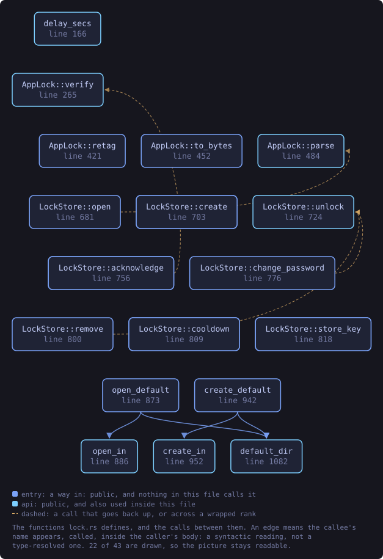

<!-- SPDX-License-Identifier: GPL-3.0-or-later -->
<!-- GENERATED by tools/docs/generate.py from the doc comments in the
     source. Do not edit this file: edit the `//!` and `///` comments in
     the .rs files and run the generator again. CI verifies it with
         python tools/docs/generate.py --check
-->

  

# `crates/veilvoice-crypto/src/lock.rs`

[`veilvoice-crypto`](../../../crates/veilvoice-crypto/README.md) &middot; 1379 lines &middot; [read the source](https://github.com/tilas01/veilvoice/blob/main/crates/veilvoice-crypto/src/lock.rs)

## Contents

- [What this is worth, stated before anything else](#what-this-is-worth-stated-before-anything-else)
- [Why a verifier and not a key](#why-a-verifier-and-not-a-key)
- [The tag, and the one tamper claim this file can honestly make](#the-tag-and-the-one-tamper-claim-this-file-can-honestly-make)
- [Rate limiting](#rate-limiting)
- [Separate from the recording password](#separate-from-the-recording-password)
- [In plain words](#in-plain-words)
  - [What this file contains](#what-this-file-contains)
  - [What calls what](#what-calls-what)
  - [Items](#items)

The application lock: an Argon2id password verifier with a rate limit.

# What this is worth, stated before anything else

**This is not a security boundary against someone holding the disk.** It
cannot be. A local application has nowhere to hide a secret from the machine
it runs on: whoever can read this file can also delete it, and deleting it
removes the lock. That is not a defect in the implementation, it is what a
local lock *is*.

What it does buy is real and worth having: someone who picks up your unlocked
computer — a flatmate, a colleague, a border officer with your session open —
cannot open VeilVoice, see which files you have processed, or start a live
scramble. That is the threat this defends against, and `SCOPE` says so in
the words the user sees.

If the threat is an attacker with the disk, the answer is full-volume
encryption (LUKS, BitLocker, FileVault) plus `crate::container` for the
recordings themselves. Neither of those is replaced by this module.

# Why a verifier and not a key

The lock stores `Argon2id(domain ‖ password, salt)`, split by HKDF into a
verifier and a tag key, and compares the verifier in constant time. It
deliberately does **not** derive a key that encrypts your recordings,
because those have their own password (a *different* one — see
`crate::container`), and pretending the app lock protected them would be
exactly the overclaim this project refuses to make.

The stored verifier is a password hash sitting on disk in the clear, and
must be treated like one. Argon2id at the default cost (256 MiB, t=3, p=4)
makes an offline attack expensive per guess, which matters for a decent
passphrase and does not save a bad one.

# The tag, and the one tamper claim this file can honestly make

Every record carries a 16-byte authentication tag over all the bytes before
it, keyed by a value that exists only while a correct passphrase is in
memory. The tag key is the second half of one Argon2id run, split from the
verifier by HKDF, so publishing the verifier — which the file does, by
sitting on disk — says nothing about the tag key.

That buys exactly one thing, and it is worth naming precisely. Somebody who
edits this file without knowing the passphrase cannot leave the edit
looking authentic. Resetting the failure counter to zero, winding the
last-failure timestamp back to escape a wait, or dropping the Argon2id cost
so that a guess is cheap — all three are edits, and all three are caught at
the next successful unlock, because that is the moment the tag key exists.

It buys nothing at all against the two attacks people expect it to stop.
Deleting the file still removes the lock. Replacing the file wholesale with
a lock the attacker created still lets the attacker in, because their own
record is authentic under *their* passphrase. `crate::vault` answers the
first with a second copy and answers the second not at all.

The tamper flag, once raised, is stored and is cleared only by an unlock
that also proves the passphrase. So the report survives a restart, and the
person who caused it cannot dismiss it.

# Rate limiting

Wrong attempts are counted and the count is **persisted**, so killing the
process does not hand an attacker a fresh budget. After three free attempts
the wait doubles — 5 s, 10 s, 20 s … capped at fifteen minutes.

The counter is stored in the same unauthenticated file as the verifier, and
the wait is measured against the system clock. Someone who can edit the file
or move the clock defeats both. Again: casual access, not the disk.

# Separate from the recording password

The password that unlocks the app and the password that encrypts recordings
are two different passwords, on purpose, so that unlocking the app is not the
same act as unsealing everything it has ever written. To make that structural
rather than merely conventional, the verifier is derived over a domain-
separated input, so the same passphrase used in both places still produces
unrelated values.

# In plain words

The lock on the application window.

It asks for a passphrase before VeilVoice will open, and it slows down after
repeated wrong answers so that guessing is not worth trying.

**It is not protection against somebody who has your disk.** It stops the
person who picks up your unlocked laptop, and that is genuinely worth having,
but anybody who can read the files directly is not stopped by a program
deciding whether to show you a window. Encrypting your recordings is what
protects them; this protects the session.

## What this file contains

1379 lines defining **39 functions** (29 public), **3 types** and **13 constants**. Everything below is read out of the source, so it cannot disagree with the code.

**The types it owns.**

- `struct AppLock` (line 169) -- A password verifier plus its attempt history.
- `struct LockStore` (line 576) -- An AppLock bound to a file, which is persisted after every attempt.
- `enum Backing` (line 592) -- Where a LockStore keeps its record.

**What happens when it runs.** These are the ways in: public, and nothing else in this file calls them, so they are what an outside caller reaches first.

- `AppLock::create` (line 201) -- Create a lock for password.
  - reaches: `derive_pair`
- `AppLock::same_secret_as` (line 269) -- Whether two records hold the same stored password.
- `AppLock::tampered` (line 281) -- Whether a record has been found edited by somebody without the passphrase, at any point since this was last cleared.
- `AppLock::acknowledge` (line 289) -- Clear the tamper report, after proving the passphrase.
  - reaches: `verify`, `unix_now`, `verify_at`, `cooldown_at`, `derive_pair`, `tag_matches`, `delay_secs`, `tag`, `body`
- `AppLock::needs_upgrade` (line 297) -- True when this record predates the authentication tag and should be rewritten once the passphrase is in hand.
- `AppLock::cooldown` (line 329) -- Seconds still to wait before another attempt is accepted.
  - reaches: `cooldown_at`, `unix_now`, `delay_secs`
- `AppLock::failures` (line 346) -- Consecutive failed attempts recorded so far.
- `AppLock::params` (line 351) -- The Argon2id cost this lock was created with.
- `AppLock::retag` (line 389) -- Draw a fresh nonce and re-tag the record under password.
  - reaches: `derive_pair`, `tag`, `body`
- `AppLock::to_bytes` (line 420) -- Serialise exactly as it appears on disk.
  - reaches: `body`
- `LockStore::open` (line 612) -- Load the lock at path, or Ok(None) if no lock is configured there.
  - reaches: `parse`
- `LockStore::create` (line 634) -- Create a lock at path, refusing to overwrite one already there.
  - reaches: `derive_pair`
- `LockStore::tampered` (line 675) -- Whether the stored record has been found edited by somebody without the passphrase.
- `LockStore::acknowledge` (line 687) -- Clear the tamper report, after proving the passphrase, and persist that.
  - reaches: `verify`, `unix_now`, `verify_at`, `cooldown_at`, `derive_pair`, `tag_matches`, `delay_secs`, `tag`, `body`
- `LockStore::report_tamper` (line 702) -- Raise the tamper report from outside, and persist it if the passphrase allows.
- `LockStore::change_password` (line 707) -- Replace the password, after proving the current one.
  - reaches: `save`, `unlock`, `write_private`
- `LockStore::remove` (line 731) -- Remove the lock, after proving the password.
  - reaches: `unlock`, `save`, `write_private`
- `LockStore::cooldown` (line 740) -- Seconds still to wait before another attempt is accepted.
  - reaches: `cooldown_at`, `unix_now`, `delay_secs`
- `LockStore::failures` (line 745) -- Consecutive failed attempts recorded so far.
- `LockStore::path` (line 751) -- Where this lock is stored.
- `LockStore::every_copy_current` (line 778) -- Whether the last write reached every copy.
- `open_default` (line 795) -- Open the lock at the default location, wherever this platform keeps it.
  - reaches: `default_dir`, `default_path`
- `create_default` (line 817) -- Create a lock at the default location, refusing to replace one already there.
  - reaches: `default_dir`, `default_path`

## What calls what

The functions this file defines, and the calls between them. Both
are read out of the source: an edge means the callee's name appears,
called, inside the caller's body. It is a syntactic reading, not a
type-resolved one, so a call made through a trait object or a macro
will not appear.

_22 of 34 functions are drawn; the diagram is bounded at 22 so it
stays readable. The full list is in the table below._

_Colour key: **entry** -- a way in: public, and nothing in this file calls it; **api** -- public, and also used inside this file; **helper** -- private to this file._

  

The same graph as Mermaid source

```mermaid
%%{init: {"theme":"base","themeVariables":{"background":"#1a1b26","primaryColor":"#1f2335","primaryTextColor":"#c0caf5","primaryBorderColor":"#7aa2f7","secondaryColor":"#16161e","tertiaryColor":"#16161e","lineColor":"#737aa2","textColor":"#c0caf5","mainBkg":"#1f2335","nodeBorder":"#7aa2f7","clusterBkg":"#16161e","clusterBorder":"#2f3549","fontFamily":"ui-monospace, SFMono-Regular, Consolas, monospace","fontSize":"14px"}}}%%
flowchart TD
    n_delay_secs["delay_secs<br/>line 144"]
    n_unix_now["unix_now<br/>line 157"]
    n_create(["AppLock::create<br/>line 201"])
    n_verify["AppLock::verify<br/>line 227"]
    n_verify_at["AppLock::verify_at<br/>line 231"]
    n_acknowledge(["AppLock::acknowledge<br/>line 289"])
    n_tag_matches["AppLock::tag_matches<br/>line 301"]
    n_cooldown(["AppLock::cooldown<br/>line 329"])
    n_retag(["AppLock::retag<br/>line 389"])
    n_to_bytes(["AppLock::to_bytes<br/>line 420"])
    n_parse["AppLock::parse<br/>line 452"]
    n_open(["LockStore::open<br/>line 612"])
    n_create(["LockStore::create<br/>line 634"])
    n_unlock["LockStore::unlock<br/>line 655"]
    n_acknowledge(["LockStore::acknowledge<br/>line 687"])
    n_change_password(["LockStore::change_password<br/>line 707"])
    n_remove(["LockStore::remove<br/>line 731"])
    n_cooldown(["LockStore::cooldown<br/>line 740"])
    n_open_default(["open_default<br/>line 795"])
    n_create_default(["create_default<br/>line 817"])
    n_default_dir["default_dir<br/>line 855"]
    n_default_path["default_path<br/>line 872"]
    n_acknowledge --> n_verify
    n_change_password --> n_unlock
    n_cooldown --> n_unix_now
    n_create_default --> n_default_dir
    n_default_dir --> n_default_path
    n_open --> n_parse
    n_open_default --> n_default_dir
    n_remove --> n_unlock
    n_verify --> n_unix_now
    n_verify --> n_verify_at
    n_verify_at --> n_tag_matches
    click n_delay_secs href "https://github.com/tilas01/veilvoice/blob/main/crates/veilvoice-crypto/src/lock.rs#L144" "open the source"
    click n_unix_now href "https://github.com/tilas01/veilvoice/blob/main/crates/veilvoice-crypto/src/lock.rs#L157" "open the source"
    click n_create href "https://github.com/tilas01/veilvoice/blob/main/crates/veilvoice-crypto/src/lock.rs#L201" "open the source"
    click n_verify href "https://github.com/tilas01/veilvoice/blob/main/crates/veilvoice-crypto/src/lock.rs#L227" "open the source"
    click n_verify_at href "https://github.com/tilas01/veilvoice/blob/main/crates/veilvoice-crypto/src/lock.rs#L231" "open the source"
    click n_acknowledge href "https://github.com/tilas01/veilvoice/blob/main/crates/veilvoice-crypto/src/lock.rs#L289" "open the source"
    click n_tag_matches href "https://github.com/tilas01/veilvoice/blob/main/crates/veilvoice-crypto/src/lock.rs#L301" "open the source"
    click n_cooldown href "https://github.com/tilas01/veilvoice/blob/main/crates/veilvoice-crypto/src/lock.rs#L329" "open the source"
    click n_retag href "https://github.com/tilas01/veilvoice/blob/main/crates/veilvoice-crypto/src/lock.rs#L389" "open the source"
    click n_to_bytes href "https://github.com/tilas01/veilvoice/blob/main/crates/veilvoice-crypto/src/lock.rs#L420" "open the source"
    click n_parse href "https://github.com/tilas01/veilvoice/blob/main/crates/veilvoice-crypto/src/lock.rs#L452" "open the source"
    click n_open href "https://github.com/tilas01/veilvoice/blob/main/crates/veilvoice-crypto/src/lock.rs#L612" "open the source"
    click n_create href "https://github.com/tilas01/veilvoice/blob/main/crates/veilvoice-crypto/src/lock.rs#L634" "open the source"
    click n_unlock href "https://github.com/tilas01/veilvoice/blob/main/crates/veilvoice-crypto/src/lock.rs#L655" "open the source"
    click n_acknowledge href "https://github.com/tilas01/veilvoice/blob/main/crates/veilvoice-crypto/src/lock.rs#L687" "open the source"
    click n_change_password href "https://github.com/tilas01/veilvoice/blob/main/crates/veilvoice-crypto/src/lock.rs#L707" "open the source"
    click n_remove href "https://github.com/tilas01/veilvoice/blob/main/crates/veilvoice-crypto/src/lock.rs#L731" "open the source"
    click n_cooldown href "https://github.com/tilas01/veilvoice/blob/main/crates/veilvoice-crypto/src/lock.rs#L740" "open the source"
    click n_open_default href "https://github.com/tilas01/veilvoice/blob/main/crates/veilvoice-crypto/src/lock.rs#L795" "open the source"
    click n_create_default href "https://github.com/tilas01/veilvoice/blob/main/crates/veilvoice-crypto/src/lock.rs#L817" "open the source"
    click n_default_dir href "https://github.com/tilas01/veilvoice/blob/main/crates/veilvoice-crypto/src/lock.rs#L855" "open the source"
    click n_default_path href "https://github.com/tilas01/veilvoice/blob/main/crates/veilvoice-crypto/src/lock.rs#L872" "open the source"
    classDef entry fill:#1f2335,stroke:#7aa2f7,color:#c0caf5
    class n_create,n_acknowledge,n_cooldown,n_retag,n_to_bytes,n_open,n_create,n_acknowledge,n_change_password,n_remove,n_cooldown,n_open_default,n_create_default entry
    classDef api fill:#1f2335,stroke:#7dcfff,color:#c0caf5
    class n_delay_secs,n_verify,n_parse,n_unlock,n_default_dir,n_default_path api
    classDef helper fill:#1f2335,stroke:#bb9af7,color:#c0caf5
    class n_unix_now,n_verify_at,n_tag_matches helper
```

## Items

| Item | Line | Documentation |
|---|---:|---|
| `SCOPE` pub const | [102](https://github.com/tilas01/veilvoice/blob/main/crates/veilvoice-crypto/src/lock.rs#L102) | What the app lock protects against, and what it does not, in the words a front-end should show the user. |
| `MAGIC` pub const | [110](https://github.com/tilas01/veilvoice/blob/main/crates/veilvoice-crypto/src/lock.rs#L110) | Magic bytes at the start of a lock file. |
| `FORMAT_VERSION` pub const | [112](https://github.com/tilas01/veilvoice/blob/main/crates/veilvoice-crypto/src/lock.rs#L112) | Format version this build writes. |
| `LOCK_LEN` pub const | [114](https://github.com/tilas01/veilvoice/blob/main/crates/veilvoice-crypto/src/lock.rs#L114) | Exact size of a version 2 lock file, in bytes. |
| `LOCK_LEN_V1` pub const | [116](https://github.com/tilas01/veilvoice/blob/main/crates/veilvoice-crypto/src/lock.rs#L116) | Exact size of a version 1 lock file, which this build still reads. |
| `DOMAIN` const | [120](https://github.com/tilas01/veilvoice/blob/main/crates/veilvoice-crypto/src/lock.rs#L120) | Domain separator, so the app-lock secret can never coincide with a key derived from the same passphrase anywhere else in this crate. |
| `INFO_VERIFIER` const | [122](https://github.com/tilas01/veilvoice/blob/main/crates/veilvoice-crypto/src/lock.rs#L122) | HKDF label for the half of the derivation that is written to disk. |
| `INFO_TAG` const | [124](https://github.com/tilas01/veilvoice/blob/main/crates/veilvoice-crypto/src/lock.rs#L124) | HKDF label for the half that is not, and that authenticates the record. |
| `TAG_LEN` const | [126](https://github.com/tilas01/veilvoice/blob/main/crates/veilvoice-crypto/src/lock.rs#L126) | Length of the record tag. |
| `BODY_LEN` const | [129](https://github.com/tilas01/veilvoice/blob/main/crates/veilvoice-crypto/src/lock.rs#L129) | Length of the tagged part of a record, which is also the offset of the nonce that follows it. |
| `FREE_ATTEMPTS` const | [132](https://github.com/tilas01/veilvoice/blob/main/crates/veilvoice-crypto/src/lock.rs#L132) | Failed attempts allowed before the wait starts. |
| `BASE_DELAY_SECS` const | [134](https://github.com/tilas01/veilvoice/blob/main/crates/veilvoice-crypto/src/lock.rs#L134) | The first enforced wait, in seconds. |
| `MAX_DELAY_SECS` const | [138](https://github.com/tilas01/veilvoice/blob/main/crates/veilvoice-crypto/src/lock.rs#L138) | The longest the wait ever gets. |
| `delay_secs` pub fn | [144](https://github.com/tilas01/veilvoice/blob/main/crates/veilvoice-crypto/src/lock.rs#L144) | How long to refuse the next attempt after failures consecutive failures. |
| `unix_now` fn | [157](https://github.com/tilas01/veilvoice/blob/main/crates/veilvoice-crypto/src/lock.rs#L157) | Seconds since the Unix epoch, negative before it. |
| `AppLock` pub struct | [169](https://github.com/tilas01/veilvoice/blob/main/crates/veilvoice-crypto/src/lock.rs#L169) | A password verifier plus its attempt history. |
| `AppLock::create` pub fn | [201](https://github.com/tilas01/veilvoice/blob/main/crates/veilvoice-crypto/src/lock.rs#L201) | Create a lock for password. |
| `AppLock::verify` pub fn | [227](https://github.com/tilas01/veilvoice/blob/main/crates/veilvoice-crypto/src/lock.rs#L227) | Check password, recording the outcome. |
| `AppLock::verify_at` fn | [231](https://github.com/tilas01/veilvoice/blob/main/crates/veilvoice-crypto/src/lock.rs#L231) |  |
| `AppLock::same_secret_as` pub fn | [269](https://github.com/tilas01/veilvoice/blob/main/crates/veilvoice-crypto/src/lock.rs#L269) | Whether two records hold the same stored password. |
| `AppLock::tampered` pub fn | [281](https://github.com/tilas01/veilvoice/blob/main/crates/veilvoice-crypto/src/lock.rs#L281) | Whether a record has been found edited by somebody without the passphrase, at any point since this was last cleared. |
| `AppLock::acknowledge` pub fn | [289](https://github.com/tilas01/veilvoice/blob/main/crates/veilvoice-crypto/src/lock.rs#L289) | Clear the tamper report, after proving the passphrase. |
| `AppLock::needs_upgrade` pub fn | [297](https://github.com/tilas01/veilvoice/blob/main/crates/veilvoice-crypto/src/lock.rs#L297) | True when this record predates the authentication tag and should be rewritten once the passphrase is in hand. |
| `AppLock::tag_matches` fn | [301](https://github.com/tilas01/veilvoice/blob/main/crates/veilvoice-crypto/src/lock.rs#L301) |  |
| `AppLock::tag` fn | [318](https://github.com/tilas01/veilvoice/blob/main/crates/veilvoice-crypto/src/lock.rs#L318) | The authentication tag over everything in the record before it. |
| `AppLock::cooldown` pub fn | [329](https://github.com/tilas01/veilvoice/blob/main/crates/veilvoice-crypto/src/lock.rs#L329) | Seconds still to wait before another attempt is accepted. |
| `AppLock::cooldown_at` fn | [333](https://github.com/tilas01/veilvoice/blob/main/crates/veilvoice-crypto/src/lock.rs#L333) |  |
| `AppLock::failures` pub fn | [346](https://github.com/tilas01/veilvoice/blob/main/crates/veilvoice-crypto/src/lock.rs#L346) | Consecutive failed attempts recorded so far. |
| `AppLock::params` pub fn | [351](https://github.com/tilas01/veilvoice/blob/main/crates/veilvoice-crypto/src/lock.rs#L351) | The Argon2id cost this lock was created with. |
| `AppLock::body` fn | [370](https://github.com/tilas01/veilvoice/blob/main/crates/veilvoice-crypto/src/lock.rs#L370) | The bytes the tag covers. |
| `AppLock::retag` pub fn | [389](https://github.com/tilas01/veilvoice/blob/main/crates/veilvoice-crypto/src/lock.rs#L389) | Draw a fresh nonce and re-tag the record under password. |
| `AppLock::to_bytes` pub fn | [420](https://github.com/tilas01/veilvoice/blob/main/crates/veilvoice-crypto/src/lock.rs#L420) | Serialise exactly as it appears on disk. |
| `AppLock::parse` pub fn | [452](https://github.com/tilas01/veilvoice/blob/main/crates/veilvoice-crypto/src/lock.rs#L452) | Parse a lock file, version 1 or version 2. |
| `derive_pair` fn | [551](https://github.com/tilas01/veilvoice/blob/main/crates/veilvoice-crypto/src/lock.rs#L551) | Derive the verifier and the tag key for password. |
| `LockStore` pub struct | [576](https://github.com/tilas01/veilvoice/blob/main/crates/veilvoice-crypto/src/lock.rs#L576) | An AppLock bound to a file, which is persisted after every attempt. |
| `Backing` enum | [592](https://github.com/tilas01/veilvoice/blob/main/crates/veilvoice-crypto/src/lock.rs#L592) | Where a LockStore keeps its record. |
| `Backing::primary` fn | [598](https://github.com/tilas01/veilvoice/blob/main/crates/veilvoice-crypto/src/lock.rs#L598) |  |
| `LockStore::open` pub fn | [612](https://github.com/tilas01/veilvoice/blob/main/crates/veilvoice-crypto/src/lock.rs#L612) | Load the lock at path, or Ok(None) if no lock is configured there. |
| `LockStore::create` pub fn | [634](https://github.com/tilas01/veilvoice/blob/main/crates/veilvoice-crypto/src/lock.rs#L634) | Create a lock at path, refusing to overwrite one already there. |
| `LockStore::unlock` pub fn | [655](https://github.com/tilas01/veilvoice/blob/main/crates/veilvoice-crypto/src/lock.rs#L655) | Check password and persist the outcome. |
| `LockStore::tampered` pub fn | [675](https://github.com/tilas01/veilvoice/blob/main/crates/veilvoice-crypto/src/lock.rs#L675) | Whether the stored record has been found edited by somebody without the passphrase. |
| `LockStore::acknowledge` pub fn | [687](https://github.com/tilas01/veilvoice/blob/main/crates/veilvoice-crypto/src/lock.rs#L687) | Clear the tamper report, after proving the passphrase, and persist that. |
| `LockStore::report_tamper` pub fn | [702](https://github.com/tilas01/veilvoice/blob/main/crates/veilvoice-crypto/src/lock.rs#L702) | Raise the tamper report from outside, and persist it if the passphrase allows. |
| `LockStore::change_password` pub fn | [707](https://github.com/tilas01/veilvoice/blob/main/crates/veilvoice-crypto/src/lock.rs#L707) | Replace the password, after proving the current one. |
| `LockStore::remove` pub fn | [731](https://github.com/tilas01/veilvoice/blob/main/crates/veilvoice-crypto/src/lock.rs#L731) | Remove the lock, after proving the password. |
| `LockStore::cooldown` pub fn | [740](https://github.com/tilas01/veilvoice/blob/main/crates/veilvoice-crypto/src/lock.rs#L740) | Seconds still to wait before another attempt is accepted. |
| `LockStore::failures` pub fn | [745](https://github.com/tilas01/veilvoice/blob/main/crates/veilvoice-crypto/src/lock.rs#L745) | Consecutive failed attempts recorded so far. |
| `LockStore::path` pub fn | [751](https://github.com/tilas01/veilvoice/blob/main/crates/veilvoice-crypto/src/lock.rs#L751) | Where this lock is stored. |
| `LockStore::save` fn | [759](https://github.com/tilas01/veilvoice/blob/main/crates/veilvoice-crypto/src/lock.rs#L759) | Write the record, and say whether every copy of it is now current. |
| `LockStore::every_copy_current` pub fn | [778](https://github.com/tilas01/veilvoice/blob/main/crates/veilvoice-crypto/src/lock.rs#L778) | Whether the last write reached every copy. |
| `open_default` pub fn | [795](https://github.com/tilas01/veilvoice/blob/main/crates/veilvoice-crypto/src/lock.rs#L795) | Open the lock at the default location, wherever this platform keeps it. |
| `create_default` pub fn | [817](https://github.com/tilas01/veilvoice/blob/main/crates/veilvoice-crypto/src/lock.rs#L817) | Create a lock at the default location, refusing to replace one already there. |
| `write_private` fn | [844](https://github.com/tilas01/veilvoice/blob/main/crates/veilvoice-crypto/src/lock.rs#L844) | Write the lock file so it is owner-only from the moment it exists. |
| `default_dir` pub fn | [855](https://github.com/tilas01/veilvoice/blob/main/crates/veilvoice-crypto/src/lock.rs#L855) | The configuration directory the vault keeps its files in, if the environment says where one is. |
| `default_path` pub fn | [872](https://github.com/tilas01/veilvoice/blob/main/crates/veilvoice-crypto/src/lock.rs#L872) | Where the lock file lives on this platform, if the environment says. |

---

Generated from `crates/veilvoice-crypto/src/lock.rs`. On the website: [`website/reference/veilvoice-crypto/lock.html`](../../../website/reference/veilvoice-crypto/lock.html).

Signing key fingerprint `8101FB3BB28D02FB239E0CDF9CC1C7E7A9B5833A`.
