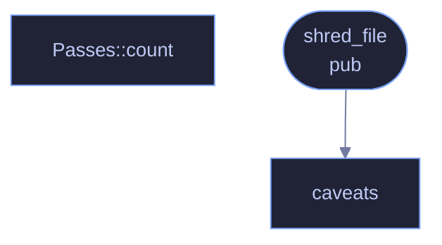

<!-- SPDX-License-Identifier: GPL-3.0-or-later -->
<!-- GENERATED by tools/docs/generate.py from the doc comments in the
     source. Do not edit this file: edit the `//!` and `///` comments in
     the .rs files and run the generator again. CI verifies it with
         python tools/docs/generate.py --check
-->

  

# `crates/veilvoice-crypto/src/shred.rs`

[`veilvoice-crypto`](../../../crates/veilvoice-crypto/README.md) &middot; 401 lines &middot; [read the source](https://github.com/tilas01/veilvoice/blob/main/crates/veilvoice-crypto/src/shred.rs)

## Contents

- [Read this before relying on it](#read-this-before-relying-on-it)
- [Why not 35 passes](#why-not-35-passes)
  - [What calls what](#what-calls-what)
  - [Items](#items)

Secure erasure — the self-destruct.

# Read this before relying on it

Overwriting a file does not reliably destroy it on modern storage, and any
tool that tells you otherwise is selling something. This module does the best
that software can do from userspace, reports honestly what that is worth on
your storage, and points at the thing that actually works.

**On a spinning disk**, overwriting is genuinely effective. The write goes to
the same physical sectors, and the belief that a scanning-microscope recovery
of overwritten magnetic media is practical does not survive contact with the
literature — Gutmann's 1996 paper, whose 35-pass pattern is still cited, says
so himself in its own epilogue about modern drives.

**On an SSD, or any flash media**, it is not reliable and cannot be made so.
Wear levelling means the controller writes your "overwrite" to *different*
physical cells and marks the old ones free. The original data still exists in
flash, out of reach of every write you can issue. The same applies to SD
cards, USB sticks, eMMC and NVMe. It also applies through copy-on-write
filesystems (Btrfs, ZFS, APFS), snapshots, journals and any backup that has
already run.

**The answer that does work is full-disk encryption.** If the volume is
encrypted, destroying the key destroys everything on it at once, wherever the
controller chose to put the blocks. LUKS, BitLocker and FileVault all do
this. Use it, and treat this module as a second line rather than a first.

# Why not 35 passes

Because passes stopped being the interesting variable decades ago. Against a
drive that honours writes, one pass is enough; against one that does not, no
number of passes reaches the retained cells. The default here is three —
random, complement, random — which satisfies the common
three-pass expectation without pretending that thirty-five would be stronger.
Time is better spent enabling disk encryption than on passes 4 through 35.

## What calls what

The functions this file defines, and the calls between them. Both
are read out of the source: an edge means the callee's name appears,
called, inside the caller's body. It is a syntactic reading, not a
type-resolved one, so a call made through a trait object or a macro
will not appear.

## Items

| Item | Line | Documentation |
|---|---:|---|
| `CHUNK` const | [46](https://github.com/tilas01/veilvoice/blob/main/crates/veilvoice-crypto/src/shred.rs#L46) | Bytes written per chunk. |
| `Passes` pub enum | [50](https://github.com/tilas01/veilvoice/blob/main/crates/veilvoice-crypto/src/shred.rs#L50) | How thoroughly to overwrite before unlinking. |
| `Passes::count` fn | [61](https://github.com/tilas01/veilvoice/blob/main/crates/veilvoice-crypto/src/shred.rs#L61) |  |
| `ShredReport` pub struct | [72](https://github.com/tilas01/veilvoice/blob/main/crates/veilvoice-crypto/src/shred.rs#L72) | What actually happened, so the caller can tell the user the truth. |
| `shred_file` pub fn | [91](https://github.com/tilas01/veilvoice/blob/main/crates/veilvoice-crypto/src/shred.rs#L91) | Overwrite a file's contents, then delete it. |
| `caveats` fn | [176](https://github.com/tilas01/veilvoice/blob/main/crates/veilvoice-crypto/src/shred.rs#L176) | The honest limits, phrased for a user rather than a security engineer. |

---

Generated from `crates/veilvoice-crypto/src/shred.rs`. On the website: [`website/reference/veilvoice-crypto/shred.html`](../../../website/reference/veilvoice-crypto/shred.html).

Signing key fingerprint `8101FB3BB28D02FB239E0CDF9CC1C7E7A9B5833A`.
