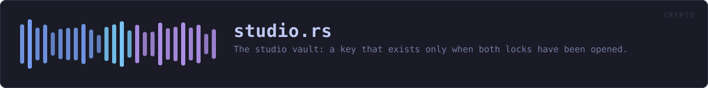
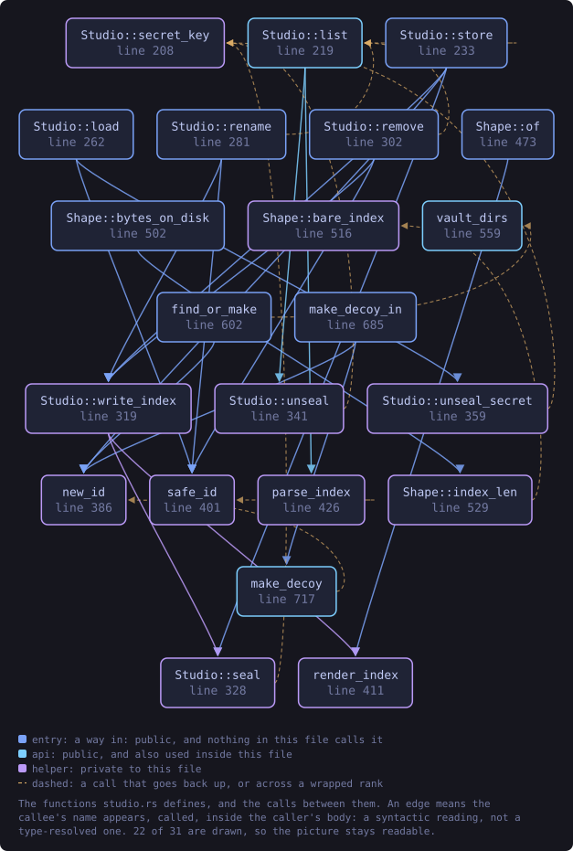

<!-- SPDX-License-Identifier: GPL-3.0-or-later -->
<!-- GENERATED by tools/docs/generate.py from the doc comments in the
     source. Do not edit this file: edit the `//!` and `///` comments in
     the .rs files and run the generator again. CI verifies it with
         python tools/docs/generate.py --check
-->

<p align="center">
  
</p>

# `crates/veilvoice-crypto/src/studio.rs`

[`veilvoice-crypto`](../../../crates/veilvoice-crypto/README.md) &middot; 1494 lines &middot; [read the source](https://github.com/tilas01/veilvoice/blob/main/crates/veilvoice-crypto/src/studio.rs)

## Contents

- [The one thing this adds](#the-one-thing-this-adds)
- [How the two are combined](#how-the-two-are-combined)
- [What it is worth, and what it is not](#what-it-is-worth-and-what-it-is-not)
- [In plain words](#in-plain-words)
  - [What this file contains](#what-this-file-contains)
  - [What calls what](#what-calls-what)
  - [Items](#items)

The studio vault: a key that exists only when both locks have been opened.

# The one thing this adds

Everything else in this crate is protected by one secret. The app lock
guards the window; a sealed recording is opened by its own passphrase. Each
is a single point: whoever has that one secret has the thing it guards.

A `StudioKey` is derived from **both**, and from neither alone. A laptop
stolen with VeilVoice already unlocked opens nothing here, because the
at-rest passphrase was never entered. An at-rest passphrase learned by any
means opens nothing here either, because it is not the app lock. Both, at
the same time, on the same machine, or the vault stays shut.

# How the two are combined

Not concatenated, and not one encrypting the other. Both secrets go into
HKDF-SHA256 as input keying material, under a salt that names this vault and
its version, and the output is the vault key:

```text
ikm  = app_lock_key || at_rest_key
salt = "veilvoice/studio-vault/v1"
key  = HKDF-SHA256(ikm, salt, info)
```

HKDF-Extract mixes the whole of the input, so an attacker holding one half
and guessing the other faces the full cost of the half they are guessing.
Concatenating the two *ciphertexts* instead, or encrypting once with each
key in turn, would let each layer be attacked separately, which is the
mistake this shape exists to avoid.

The length of each half is bound into the info string. Without that,
`("ab", "c")` and `("a", "bc")` would produce the same input keying material
and therefore the same vault key, which is a collision an attacker chooses
rather than finds.

# What it is worth, and what it is not

It raises the cost of a stolen machine and of a leaked passphrase, and it
turns one compromise into two. Both of those are real.

It does **not** defeat somebody who is watching this process while both
secrets are entered: at that moment the derived key exists in memory, and
this crate has never claimed to beat an attacker who is already inside the
process. It is page-locked and zeroized like every other secret here, which
narrows the window and does not close it. The vault is a second lock on the
door, not a guard in the room.

# In plain words

The recordings the studio makes are locked with a key made out of *two* of
your passwords at once. Somebody who learns one of them still cannot open
them, and neither can somebody who walks off with the computer while the app
is open.

What it cannot do is protect you from something already running inside
VeilVoice at the moment you type both.

## What this file contains

1494 lines defining **31 functions** (16 public), **4 types** and **5 constants**. Everything below is read out of the source, so it cannot disagree with the code.

**The types it owns.**

- `struct StudioKey` (line 83) -- A key that exists only while both locks are open.
- `struct Entry` (line 144) -- One recording in the vault.
- `struct Studio` (line 180) -- A directory of recordings, sealed under a StudioKey.
- `struct Shape` (line 442) -- What a decoy vault looks like from outside, so it looks like the real one.

**What happens when it runs.** These are the ways in: public, and nothing else in this file calls them, so they are what an outside caller reaches first.

- `StudioKey::derive` (line 94) -- Derive the vault key from both secrets.
- `StudioKey::expose` (line 124) -- Borrow the key bytes, for sealing and opening the vault.
- `StudioKey::is_locked` (line 134) -- Whether the operating system agreed to keep this key out of swap.
- `Studio::open` (line 192) -- Open the vault in dir, creating the directory if it is not there.
- `Studio::dir` (line 199) -- Where the vault lives.
- `Studio::store` (line 233) -- Seal wav into the vault under name, returning its entry.
  - reaches: `list`, `new_id`, `seal`, `write_index`, `parse_index`, `unseal`, `secret_key`, `render_index`, `safe_id`
- `Studio::load` (line 262) -- Open one recording into locked memory.
  - reaches: `safe_id`, `unseal_secret`, `secret_key`
- `Studio::rename` (line 281) -- Change what a recording is called.
  - reaches: `list`, `safe_id`, `write_index`, `parse_index`, `unseal`, `render_index`, `seal`, `secret_key`
- `Studio::remove` (line 302) -- Remove one recording and its index entry.
  - reaches: `list`, `safe_id`, `write_index`, `parse_index`, `unseal`, `render_index`, `seal`, `secret_key`
- `Shape::of` (line 459) -- Measure a real vault, to build decoys that match it.
  - reaches: `render_index`
- `Shape::bytes_on_disk` (line 488) -- What one vault of this shape occupies, in bytes, as files on a disk.
  - reaches: `index_len`, `bare_index`, `digits`
- `find_or_make` (line 588) -- Open the one vault under parent that key unlocks, making it on a first run.
  - reaches: `migrate_flat`, `new_id`, `vault_dirs`
- `make_decoy_in` (line 671) -- Make one decoy under parent, named the way a real vault is named.
  - reaches: `make_decoy`, `new_id`, `pad_index`, `render_index`

## What calls what

The functions this file defines, and the calls between them. Both
are read out of the source: an edge means the callee's name appears,
called, inside the caller's body. It is a syntactic reading, not a
type-resolved one, so a call made through a trait object or a macro
will not appear.

_22 of 31 functions are drawn; the diagram is bounded at 22 so it
stays readable. The full list is in the table below._

_Colour key: **entry** -- a way in: public, and nothing in this file calls it; **api** -- public, and also used inside this file; **helper** -- private to this file._

<p align="center">
  
</p>

<details>
<summary>The same graph as Mermaid source</summary>



</details>

```mermaid
%%{init: {"theme":"base","themeVariables":{"background":"#1a1b26","primaryColor":"#1f2335","primaryTextColor":"#c0caf5","primaryBorderColor":"#7aa2f7","secondaryColor":"#16161e","tertiaryColor":"#16161e","lineColor":"#737aa2","textColor":"#c0caf5","mainBkg":"#1f2335","nodeBorder":"#7aa2f7","clusterBkg":"#16161e","clusterBorder":"#2f3549","fontFamily":"ui-monospace, SFMono-Regular, Consolas, monospace","fontSize":"14px"}}}%%
flowchart TD
    n_secret_key["Studio::secret_key<br/>line 208"]
    n_list["Studio::list<br/>line 219"]
    n_store(["Studio::store<br/>line 233"])
    n_load(["Studio::load<br/>line 262"])
    n_rename(["Studio::rename<br/>line 281"])
    n_remove(["Studio::remove<br/>line 302"])
    n_write_index["Studio::write_index<br/>line 315"]
    n_seal["Studio::seal<br/>line 324"]
    n_unseal["Studio::unseal<br/>line 333"]
    n_unseal_secret["Studio::unseal_secret<br/>line 351"]
    n_new_id["new_id<br/>line 378"]
    n_safe_id["safe_id<br/>line 393"]
    n_render_index["render_index<br/>line 403"]
    n_parse_index["parse_index<br/>line 412"]
    n_of(["Shape::of<br/>line 459"])
    n_bytes_on_disk(["Shape::bytes_on_disk<br/>line 488"])
    n_bare_index["Shape::bare_index<br/>line 502"]
    n_index_len["Shape::index_len<br/>line 515"]
    n_vault_dirs["vault_dirs<br/>line 545"]
    n_find_or_make(["find_or_make<br/>line 588"])
    n_make_decoy_in(["make_decoy_in<br/>line 671"])
    n_make_decoy["make_decoy<br/>line 703"]
    n_bytes_on_disk --> n_index_len
    n_find_or_make --> n_new_id
    n_find_or_make --> n_vault_dirs
    n_index_len --> n_bare_index
    n_list --> n_parse_index
    n_list --> n_unseal
    n_load --> n_safe_id
    n_load --> n_unseal_secret
    n_make_decoy --> n_new_id
    n_make_decoy_in --> n_make_decoy
    n_make_decoy_in --> n_new_id
    n_of --> n_render_index
    n_parse_index --> n_safe_id
    n_remove --> n_list
    n_remove --> n_safe_id
    n_remove --> n_write_index
    n_rename --> n_list
    n_rename --> n_safe_id
    n_rename --> n_write_index
    n_seal --> n_secret_key
    n_store --> n_list
    n_store --> n_new_id
    n_store --> n_seal
    n_store --> n_write_index
    n_unseal --> n_secret_key
    n_unseal_secret --> n_secret_key
    n_write_index --> n_render_index
    n_write_index --> n_seal
    click n_secret_key href "https://github.com/tilas01/veilvoice/blob/main/crates/veilvoice-crypto/src/studio.rs#L208" "open the source"
    click n_list href "https://github.com/tilas01/veilvoice/blob/main/crates/veilvoice-crypto/src/studio.rs#L219" "open the source"
    click n_store href "https://github.com/tilas01/veilvoice/blob/main/crates/veilvoice-crypto/src/studio.rs#L233" "open the source"
    click n_load href "https://github.com/tilas01/veilvoice/blob/main/crates/veilvoice-crypto/src/studio.rs#L262" "open the source"
    click n_rename href "https://github.com/tilas01/veilvoice/blob/main/crates/veilvoice-crypto/src/studio.rs#L281" "open the source"
    click n_remove href "https://github.com/tilas01/veilvoice/blob/main/crates/veilvoice-crypto/src/studio.rs#L302" "open the source"
    click n_write_index href "https://github.com/tilas01/veilvoice/blob/main/crates/veilvoice-crypto/src/studio.rs#L315" "open the source"
    click n_seal href "https://github.com/tilas01/veilvoice/blob/main/crates/veilvoice-crypto/src/studio.rs#L324" "open the source"
    click n_unseal href "https://github.com/tilas01/veilvoice/blob/main/crates/veilvoice-crypto/src/studio.rs#L333" "open the source"
    click n_unseal_secret href "https://github.com/tilas01/veilvoice/blob/main/crates/veilvoice-crypto/src/studio.rs#L351" "open the source"
    click n_new_id href "https://github.com/tilas01/veilvoice/blob/main/crates/veilvoice-crypto/src/studio.rs#L378" "open the source"
    click n_safe_id href "https://github.com/tilas01/veilvoice/blob/main/crates/veilvoice-crypto/src/studio.rs#L393" "open the source"
    click n_render_index href "https://github.com/tilas01/veilvoice/blob/main/crates/veilvoice-crypto/src/studio.rs#L403" "open the source"
    click n_parse_index href "https://github.com/tilas01/veilvoice/blob/main/crates/veilvoice-crypto/src/studio.rs#L412" "open the source"
    click n_of href "https://github.com/tilas01/veilvoice/blob/main/crates/veilvoice-crypto/src/studio.rs#L459" "open the source"
    click n_bytes_on_disk href "https://github.com/tilas01/veilvoice/blob/main/crates/veilvoice-crypto/src/studio.rs#L488" "open the source"
    click n_bare_index href "https://github.com/tilas01/veilvoice/blob/main/crates/veilvoice-crypto/src/studio.rs#L502" "open the source"
    click n_index_len href "https://github.com/tilas01/veilvoice/blob/main/crates/veilvoice-crypto/src/studio.rs#L515" "open the source"
    click n_vault_dirs href "https://github.com/tilas01/veilvoice/blob/main/crates/veilvoice-crypto/src/studio.rs#L545" "open the source"
    click n_find_or_make href "https://github.com/tilas01/veilvoice/blob/main/crates/veilvoice-crypto/src/studio.rs#L588" "open the source"
    click n_make_decoy_in href "https://github.com/tilas01/veilvoice/blob/main/crates/veilvoice-crypto/src/studio.rs#L671" "open the source"
    click n_make_decoy href "https://github.com/tilas01/veilvoice/blob/main/crates/veilvoice-crypto/src/studio.rs#L703" "open the source"
    classDef entry fill:#1f2335,stroke:#7aa2f7,color:#c0caf5
    class n_store,n_load,n_rename,n_remove,n_of,n_bytes_on_disk,n_find_or_make,n_make_decoy_in entry
    classDef api fill:#1f2335,stroke:#7dcfff,color:#c0caf5
    class n_list,n_vault_dirs,n_make_decoy api
    classDef helper fill:#1f2335,stroke:#bb9af7,color:#c0caf5
    class n_secret_key,n_write_index,n_seal,n_unseal,n_unseal_secret,n_new_id,n_safe_id,n_render_index,n_parse_index,n_bare_index,n_index_len helper
```

## Items

| Item | Line | Documentation |
|---|---:|---|
| `KEY_LEN` <sub>pub const</sub> | [67](https://github.com/tilas01/veilvoice/blob/main/crates/veilvoice-crypto/src/studio.rs#L67) | Bytes in a studio vault key. |
| `SALT` <sub>const</sub> | [73](https://github.com/tilas01/veilvoice/blob/main/crates/veilvoice-crypto/src/studio.rs#L73) | Names this construction and its version in the HKDF salt. |
| `INFO` <sub>const</sub> | [76](https://github.com/tilas01/veilvoice/blob/main/crates/veilvoice-crypto/src/studio.rs#L76) | The HKDF info label. |
| `StudioKey` <sub>pub struct</sub> | [83](https://github.com/tilas01/veilvoice/blob/main/crates/veilvoice-crypto/src/studio.rs#L83) | A key that exists only while both locks are open. |
| `StudioKey::derive` <sub>pub fn</sub> | [94](https://github.com/tilas01/veilvoice/blob/main/crates/veilvoice-crypto/src/studio.rs#L94) | Derive the vault key from both secrets. |
| `StudioKey::expose` <sub>pub fn</sub> | [124](https://github.com/tilas01/veilvoice/blob/main/crates/veilvoice-crypto/src/studio.rs#L124) | Borrow the key bytes, for sealing and opening the vault. |
| `StudioKey::is_locked` <sub>pub fn</sub> | [134](https://github.com/tilas01/veilvoice/blob/main/crates/veilvoice-crypto/src/studio.rs#L134) | Whether the operating system agreed to keep this key out of swap. |
| `Entry` <sub>pub struct</sub> | [144](https://github.com/tilas01/veilvoice/blob/main/crates/veilvoice-crypto/src/studio.rs#L144) | One recording in the vault. |
| `Entry::fmt` <sub>fn</sub> | [159](https://github.com/tilas01/veilvoice/blob/main/crates/veilvoice-crypto/src/studio.rs#L159) |  |
| `Studio` <sub>pub struct</sub> | [180](https://github.com/tilas01/veilvoice/blob/main/crates/veilvoice-crypto/src/studio.rs#L180) | A directory of recordings, sealed under a StudioKey. |
| `INDEX` <sub>const</sub> | [188](https://github.com/tilas01/veilvoice/blob/main/crates/veilvoice-crypto/src/studio.rs#L188) | The index file's name. |
| `Studio::open` <sub>pub fn</sub> | [192](https://github.com/tilas01/veilvoice/blob/main/crates/veilvoice-crypto/src/studio.rs#L192) | Open the vault in dir, creating the directory if it is not there. |
| `Studio::dir` <sub>pub fn</sub> | [199](https://github.com/tilas01/veilvoice/blob/main/crates/veilvoice-crypto/src/studio.rs#L199) | Where the vault lives. |
| `Studio::secret_key` <sub>fn</sub> | [208](https://github.com/tilas01/veilvoice/blob/main/crates/veilvoice-crypto/src/studio.rs#L208) | The vault key as a Secret, for the AEAD. |
| `Studio::list` <sub>pub fn</sub> | [219](https://github.com/tilas01/veilvoice/blob/main/crates/veilvoice-crypto/src/studio.rs#L219) | Every recording in the vault, oldest first. |
| `Studio::store` <sub>pub fn</sub> | [233](https://github.com/tilas01/veilvoice/blob/main/crates/veilvoice-crypto/src/studio.rs#L233) | Seal wav into the vault under name, returning its entry. |
| `Studio::load` <sub>pub fn</sub> | [262](https://github.com/tilas01/veilvoice/blob/main/crates/veilvoice-crypto/src/studio.rs#L262) | Open one recording into locked memory. |
| `Studio::rename` <sub>pub fn</sub> | [281](https://github.com/tilas01/veilvoice/blob/main/crates/veilvoice-crypto/src/studio.rs#L281) | Change what a recording is called. |
| `Studio::remove` <sub>pub fn</sub> | [302](https://github.com/tilas01/veilvoice/blob/main/crates/veilvoice-crypto/src/studio.rs#L302) | Remove one recording and its index entry. |
| `Studio::write_index` <sub>fn</sub> | [315](https://github.com/tilas01/veilvoice/blob/main/crates/veilvoice-crypto/src/studio.rs#L315) |  |
| `Studio::seal` <sub>fn</sub> | [324](https://github.com/tilas01/veilvoice/blob/main/crates/veilvoice-crypto/src/studio.rs#L324) | Seal with a fresh nonce, binding aad so a file cannot be moved to another identity inside the same vault and still open. |
| `Studio::unseal` <sub>fn</sub> | [333](https://github.com/tilas01/veilvoice/blob/main/crates/veilvoice-crypto/src/studio.rs#L333) |  |
| `Studio::unseal_secret` <sub>fn</sub> | [351](https://github.com/tilas01/veilvoice/blob/main/crates/veilvoice-crypto/src/studio.rs#L351) | The same, decrypting straight into locked memory. |
| `ID_LEN` <sub>const</sub> | [367](https://github.com/tilas01/veilvoice/blob/main/crates/veilvoice-crypto/src/studio.rs#L367) | How long an identifier is, in characters. |
| `new_id` <sub>fn</sub> | [378](https://github.com/tilas01/veilvoice/blob/main/crates/veilvoice-crypto/src/studio.rs#L378) | A random, opaque identifier: ID_LEN lower-case letters and digits that say nothing about what they name. |
| `safe_id` <sub>fn</sub> | [393](https://github.com/tilas01/veilvoice/blob/main/crates/veilvoice-crypto/src/studio.rs#L393) | Whether id is one this vault could have produced. |
| `render_index` <sub>fn</sub> | [403](https://github.com/tilas01/veilvoice/blob/main/crates/veilvoice-crypto/src/studio.rs#L403) | The index, as lines. |
| `parse_index` <sub>fn</sub> | [412](https://github.com/tilas01/veilvoice/blob/main/crates/veilvoice-crypto/src/studio.rs#L412) |  |
| `Shape` <sub>pub struct</sub> | [442](https://github.com/tilas01/veilvoice/blob/main/crates/veilvoice-crypto/src/studio.rs#L442) | What a decoy vault looks like from outside, so it looks like the real one. |
| `Shape::of` <sub>pub fn</sub> | [459](https://github.com/tilas01/veilvoice/blob/main/crates/veilvoice-crypto/src/studio.rs#L459) | Measure a real vault, to build decoys that match it. |
| `Shape::bytes_on_disk` <sub>pub fn</sub> | [488](https://github.com/tilas01/veilvoice/blob/main/crates/veilvoice-crypto/src/studio.rs#L488) | What one vault of this shape occupies, in bytes, as files on a disk. |
| `Shape::bare_index` <sub>fn</sub> | [502](https://github.com/tilas01/veilvoice/blob/main/crates/veilvoice-crypto/src/studio.rs#L502) | The shortest index a decoy of this shape can be written with: every entry present and every name empty. |
| `Shape::index_len` <sub>fn</sub> | [515](https://github.com/tilas01/veilvoice/blob/main/crates/veilvoice-crypto/src/studio.rs#L515) | The index length a decoy of this shape will actually be written with. |
| `digits` <sub>fn</sub> | [525](https://github.com/tilas01/veilvoice/blob/main/crates/veilvoice-crypto/src/studio.rs#L525) | How many decimal digits n is written with. |
| `vault_dirs` <sub>pub fn</sub> | [545](https://github.com/tilas01/veilvoice/blob/main/crates/veilvoice-crypto/src/studio.rs#L545) | Every directory under parent that is shaped like a vault. |
| `find_or_make` <sub>pub fn</sub> | [588](https://github.com/tilas01/veilvoice/blob/main/crates/veilvoice-crypto/src/studio.rs#L588) | Open the one vault under parent that key unlocks, making it on a first run. |
| `migrate_flat` <sub>fn</sub> | [631](https://github.com/tilas01/veilvoice/blob/main/crates/veilvoice-crypto/src/studio.rs#L631) | Move a vault written straight into parent down into a directory of its own. |
| `make_decoy_in` <sub>pub fn</sub> | [671](https://github.com/tilas01/veilvoice/blob/main/crates/veilvoice-crypto/src/studio.rs#L671) | Make one decoy under parent, named the way a real vault is named. |
| `make_decoy` <sub>pub fn</sub> | [703](https://github.com/tilas01/veilvoice/blob/main/crates/veilvoice-crypto/src/studio.rs#L703) | Fill dir with a vault that never held anything. |
| `pad_index` <sub>fn</sub> | [756](https://github.com/tilas01/veilvoice/blob/main/crates/veilvoice-crypto/src/studio.rs#L756) | Grow the names until the index is exactly the length a real one was. |

---

Generated from `crates/veilvoice-crypto/src/studio.rs`. On the website: [`website/reference/veilvoice-crypto/studio.html`](../../../website/reference/veilvoice-crypto/studio.html).

Signing key fingerprint `8101FB3BB28D02FB239E0CDF9CC1C7E7A9B5833A`.
