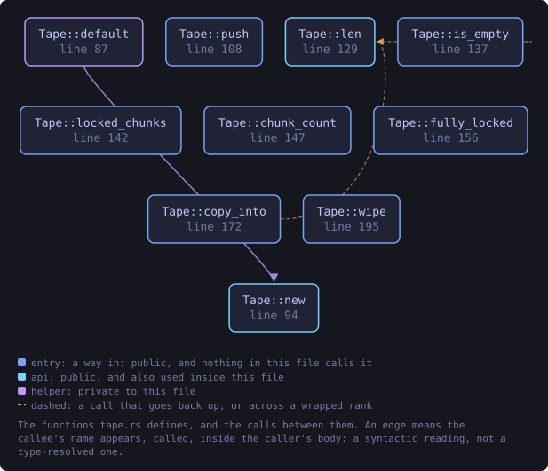

<!-- SPDX-License-Identifier: GPL-3.0-or-later -->
<!-- GENERATED by tools/docs/generate.py from the doc comments in the
     source. Do not edit this file: edit the `//!` and `///` comments in
     the .rs files and run the generator again. CI verifies it with
         python tools/docs/generate.py --check
-->

  

# `crates/veilvoice-crypto/src/tape.rs`

[`veilvoice-crypto`](../../../crates/veilvoice-crypto/README.md) &middot; 350 lines &middot; [read the source](https://github.com/tilas01/veilvoice/blob/main/crates/veilvoice-crypto/src/tape.rs)

## Contents

- [The problem this exists for](#the-problem-this-exists-for)
- [Why chunks, rather than one buffer that grows](#why-chunks-rather-than-one-buffer-that-grows)
- [What this buys, and what it does not](#what-this-buys-and-what-it-does-not)
- [In plain words](#in-plain-words)
  - [What this file contains](#what-this-file-contains)
  - [What calls what](#what-calls-what)
  - [Items](#items)

A recording held in locked, zeroizing memory while it is still being made.

# The problem this exists for

`Secret` holds a passphrase or a key: a few dozen bytes, known in full
before the allocation is made. A recording is neither. It arrives a few
milliseconds at a time, for as long as somebody keeps talking, and nobody
knows at the start how long that will be.

Accumulating it in a `Vec<u8>` would undo the thing this crate is careful
about everywhere else. A `Vec` is not locked, so the operating system may
write it to the page file; it is not zeroized, so its contents outlive it in
freed memory; and it reallocates as it grows, which leaves the *previous*
buffer, still holding the recording so far, somewhere on the heap with
nothing wiping it. Every doubling leaves another copy behind.

A `Tape` is the growable equivalent of a `Secret`: append-only, made of
page-locked chunks that are never reallocated or moved, and zeroized in full
when it goes out of scope.

# Why chunks, rather than one buffer that grows

Growing means reallocating, and reallocating a secret means copying it to a
new address and leaving the old bytes unwiped in memory the allocator is now
free to hand to anybody. The whole point is that no copy is ever left
behind, so nothing here is ever resized. A full chunk is kept exactly where
it is and a new one is added beside it.

Chunks are `CHUNK` bytes, which is a deliberate compromise rather than a
round number picked for looks. Locking is charged against a per-process
budget (`RLIMIT_MEMLOCK` on Linux, often a few megabytes and sometimes far
less), and a chunk is the unit in which that budget is spent. Small chunks
spend it in fine increments, so a tape that outgrows the budget locks as
much as the budget allowed rather than losing a large request wholesale.

# What this buys, and what it does not

It buys the same thing `Secret` buys, over a buffer that grows: the
recording is kept out of the page file where the operating system permits
it, and it is wiped rather than abandoned.

It does not defeat somebody who can already read this process's memory, and
locking does not survive hibernation, which writes RAM to disk wholesale.
Locking can also simply fail: the budget above is small and unprivileged
processes cannot raise it. That is reported rather than hidden.
`Tape::fully_locked` is false the moment one chunk could not be locked,
and `Tape::locked_chunks` says how many were, so a caller can tell the
user what was actually obtained instead of implying a guarantee.

Zeroization, as in `crate::amnesia`, always happens.

# In plain words

Somewhere to keep a recording while it is being made, which asks the
operating system not to write it out to disk and wipes it when it is
finished with.

It is built out of fixed-size pieces so that it never has to move what it is
already holding. Moving it would leave a copy of your recording behind in
memory, which is exactly what this is for avoiding.

## What this file contains

350 lines defining **10 functions** (9 public), **1 type** and **1 constant**. Everything below is read out of the source, so it cannot disagree with the code.

**The types it owns.**

- `struct Tape` (line 79) -- An append-only buffer of locked, zeroizing chunks.

**What happens when it runs.** These are the ways in: public, and nothing else in this file calls them, so they are what an outside caller reaches first.

- `Tape::push` (line 108) -- Append bytes.
- `Tape::is_empty` (line 137) -- Whether nothing has been appended.
  - reaches: `len`
- `Tape::locked_chunks` (line 142) -- How many chunks the operating system agreed to lock out of swap.
- `Tape::chunk_count` (line 147) -- How many chunks the tape holds.
- `Tape::fully_locked` (line 156) -- Whether every chunk is locked.
- `Tape::copy_into` (line 172) -- Copy the whole tape into out, which must be exactly Tape::len.
  - reaches: `len`
- `Tape::wipe` (line 195) -- Wipe and release everything held, leaving an empty tape.

## What calls what

The functions this file defines, and the calls between them. Both
are read out of the source: an edge means the callee's name appears,
called, inside the caller's body. It is a syntactic reading, not a
type-resolved one, so a call made through a trait object or a macro
will not appear.

_Colour key: **entry** -- a way in: public, and nothing in this file calls it; **api** -- public, and also used inside this file; **helper** -- private to this file._

  

The same graph as Mermaid source

```mermaid
%%{init: {"theme":"base","themeVariables":{"background":"#1a1b26","primaryColor":"#1f2335","primaryTextColor":"#c0caf5","primaryBorderColor":"#7aa2f7","secondaryColor":"#16161e","tertiaryColor":"#16161e","lineColor":"#737aa2","textColor":"#c0caf5","mainBkg":"#1f2335","nodeBorder":"#7aa2f7","clusterBkg":"#16161e","clusterBorder":"#2f3549","fontFamily":"ui-monospace, SFMono-Regular, Consolas, monospace","fontSize":"14px"}}}%%
flowchart TD
    n_default["Tape::default<br/>line 87"]
    n_new["Tape::new<br/>line 94"]
    n_push(["Tape::push<br/>line 108"])
    n_len["Tape::len<br/>line 129"]
    n_is_empty(["Tape::is_empty<br/>line 137"])
    n_locked_chunks(["Tape::locked_chunks<br/>line 142"])
    n_chunk_count(["Tape::chunk_count<br/>line 147"])
    n_fully_locked(["Tape::fully_locked<br/>line 156"])
    n_copy_into(["Tape::copy_into<br/>line 172"])
    n_wipe(["Tape::wipe<br/>line 195"])
    n_copy_into --> n_len
    n_default --> n_new
    n_is_empty --> n_len
    click n_default href "https://github.com/tilas01/veilvoice/blob/main/crates/veilvoice-crypto/src/tape.rs#L87" "open the source"
    click n_new href "https://github.com/tilas01/veilvoice/blob/main/crates/veilvoice-crypto/src/tape.rs#L94" "open the source"
    click n_push href "https://github.com/tilas01/veilvoice/blob/main/crates/veilvoice-crypto/src/tape.rs#L108" "open the source"
    click n_len href "https://github.com/tilas01/veilvoice/blob/main/crates/veilvoice-crypto/src/tape.rs#L129" "open the source"
    click n_is_empty href "https://github.com/tilas01/veilvoice/blob/main/crates/veilvoice-crypto/src/tape.rs#L137" "open the source"
    click n_locked_chunks href "https://github.com/tilas01/veilvoice/blob/main/crates/veilvoice-crypto/src/tape.rs#L142" "open the source"
    click n_chunk_count href "https://github.com/tilas01/veilvoice/blob/main/crates/veilvoice-crypto/src/tape.rs#L147" "open the source"
    click n_fully_locked href "https://github.com/tilas01/veilvoice/blob/main/crates/veilvoice-crypto/src/tape.rs#L156" "open the source"
    click n_copy_into href "https://github.com/tilas01/veilvoice/blob/main/crates/veilvoice-crypto/src/tape.rs#L172" "open the source"
    click n_wipe href "https://github.com/tilas01/veilvoice/blob/main/crates/veilvoice-crypto/src/tape.rs#L195" "open the source"
    classDef entry fill:#1f2335,stroke:#7aa2f7,color:#c0caf5
    class n_push,n_is_empty,n_locked_chunks,n_chunk_count,n_fully_locked,n_copy_into,n_wipe entry
    classDef api fill:#1f2335,stroke:#7dcfff,color:#c0caf5
    class n_new,n_len api
    classDef helper fill:#1f2335,stroke:#bb9af7,color:#c0caf5
    class n_default helper
```

## Items

| Item | Line | Documentation |
|---|---:|---|
| `CHUNK` pub const | [72](https://github.com/tilas01/veilvoice/blob/main/crates/veilvoice-crypto/src/tape.rs#L72) | Bytes per chunk. |
| `Tape` pub struct | [79](https://github.com/tilas01/veilvoice/blob/main/crates/veilvoice-crypto/src/tape.rs#L79) | An append-only buffer of locked, zeroizing chunks. |
| `Tape::default` fn | [87](https://github.com/tilas01/veilvoice/blob/main/crates/veilvoice-crypto/src/tape.rs#L87) |  |
| `Tape::new` pub fn | [94](https://github.com/tilas01/veilvoice/blob/main/crates/veilvoice-crypto/src/tape.rs#L94) | An empty tape. |
| `Tape::push` pub fn | [108](https://github.com/tilas01/veilvoice/blob/main/crates/veilvoice-crypto/src/tape.rs#L108) | Append bytes. |
| `Tape::len` pub fn | [129](https://github.com/tilas01/veilvoice/blob/main/crates/veilvoice-crypto/src/tape.rs#L129) | Total bytes held. |
| `Tape::is_empty` pub fn | [137](https://github.com/tilas01/veilvoice/blob/main/crates/veilvoice-crypto/src/tape.rs#L137) | Whether nothing has been appended. |
| `Tape::locked_chunks` pub fn | [142](https://github.com/tilas01/veilvoice/blob/main/crates/veilvoice-crypto/src/tape.rs#L142) | How many chunks the operating system agreed to lock out of swap. |
| `Tape::chunk_count` pub fn | [147](https://github.com/tilas01/veilvoice/blob/main/crates/veilvoice-crypto/src/tape.rs#L147) | How many chunks the tape holds. |
| `Tape::fully_locked` pub fn | [156](https://github.com/tilas01/veilvoice/blob/main/crates/veilvoice-crypto/src/tape.rs#L156) | Whether every chunk is locked. |
| `Tape::copy_into` pub fn | [172](https://github.com/tilas01/veilvoice/blob/main/crates/veilvoice-crypto/src/tape.rs#L172) | Copy the whole tape into out, which must be exactly Tape::len. |
| `Tape::wipe` pub fn | [195](https://github.com/tilas01/veilvoice/blob/main/crates/veilvoice-crypto/src/tape.rs#L195) | Wipe and release everything held, leaving an empty tape. |

---

Generated from `crates/veilvoice-crypto/src/tape.rs`. On the website: [`website/reference/veilvoice-crypto/tape.html`](../../../website/reference/veilvoice-crypto/tape.html).

Signing key fingerprint `8101FB3BB28D02FB239E0CDF9CC1C7E7A9B5833A`.
