<!-- SPDX-License-Identifier: GPL-3.0-or-later -->
<!-- GENERATED by tools/docs/generate.py from the doc comments in the
     source. Do not edit this file: edit the `//!` and `///` comments in
     the .rs files and run the generator again. CI verifies it with
         python tools/docs/generate.py --check
-->

<p align="center">
  
</p>

# `crates/veilvoice-crypto/tests/timing.rs`

[`veilvoice-crypto`](../../../crates/veilvoice-crypto/README.md) &middot; 240 lines &middot; [read the source](https://github.com/tilas01/veilvoice/blob/main/crates/veilvoice-crypto/tests/timing.rs)

## Contents

- [These are ignored by default, and that is deliberate](#these-are-ignored-by-default-and-that-is-deliberate)
  - [What this file contains](#what-this-file-contains)
  - [What calls what](#what-calls-what)
  - [Items](#items)

Timing measurement of the password paths.

`docs/AUDIT.md` listed this as outstanding: Argon2id is inherently
constant-ish, but nobody had measured the code *around* it. The question is
whether the time an attempt takes leaks anything about the password —
classically, whether a byte-by-byte comparison returns early and turns
"how long did that take" into "how many characters were right".

# These are ignored by default, and that is deliberate

A timing test on a shared CI runner measures the neighbours, not the code.
Run them on a quiet machine and read the numbers:

```text
cargo test -p veilvoice-crypto --release --test timing -- --ignored --nocapture
```

The thresholds below are loose on purpose. They are there to catch a
*catastrophic* regression — someone replacing a constant-time comparison
with `==`, which shows up as a difference of orders of magnitude — not to
certify a bound in nanoseconds, which this method cannot honestly do.

## What this file contains

240 lines defining **9 functions** (0 public), **1 type** and **1 constant**. Everything below is read out of the source, so it cannot disagree with the code.

**The types it owns.**

- `struct Stats` (line 49) -- What a run of samples looked like.

## What calls what

The functions this file defines, and the calls between them. Both
are read out of the source: an edge means the callee's name appears,
called, inside the caller's body. It is a syntactic reading, not a
type-resolved one, so a call made through a trait object or a macro
will not appear.

_Colour key: **helper** -- private to this file._

```mermaid
%%{init: {"theme":"base","themeVariables":{"background":"#1a1b26","primaryColor":"#1f2335","primaryTextColor":"#c0caf5","primaryBorderColor":"#7aa2f7","secondaryColor":"#16161e","tertiaryColor":"#16161e","lineColor":"#737aa2","textColor":"#c0caf5","mainBkg":"#1f2335","nodeBorder":"#7aa2f7","clusterBkg":"#16161e","clusterBorder":"#2f3549","fontFamily":"ui-monospace, SFMono-Regular, Consolas, monospace","fontSize":"14px"}}}%%
flowchart TD
    n_params["params<br/>line 31"]
    n_summarise["summarise<br/>line 55"]
    n_show["show<br/>line 65"]
    n_time_it["time_it<br/>line 72"]
    n_time_each["time_each<br/>line 96"]
    n_ratio["ratio<br/>line 109"]
    n_opening_a_container_does_not_leak_how_much_of_the_password_was_right["opening_a_container_does_not_…<br/>line 115"]
    n_the_app_lock_takes_the_same_time_whether_or_not_the_password_is_right["the_app_lock_takes_the_same_t…<br/>line 159"]
    n_a_rate_limited_attempt_is_visibly_cheaper_and_that_is_intended["a_rate_limited_attempt_is_vis…<br/>line 211"]
    n_a_rate_limited_attempt_is_visibly_cheaper_and_that_is_intended --> n_params
    n_a_rate_limited_attempt_is_visibly_cheaper_and_that_is_intended --> n_show
    n_a_rate_limited_attempt_is_visibly_cheaper_and_that_is_intended --> n_time_each
    n_a_rate_limited_attempt_is_visibly_cheaper_and_that_is_intended --> n_time_it
    n_opening_a_container_does_not_leak_how_much_of_the_password_was_right --> n_params
    n_opening_a_container_does_not_leak_how_much_of_the_password_was_right --> n_ratio
    n_opening_a_container_does_not_leak_how_much_of_the_password_was_right --> n_show
    n_opening_a_container_does_not_leak_how_much_of_the_password_was_right --> n_time_it
    n_the_app_lock_takes_the_same_time_whether_or_not_the_password_is_right --> n_params
    n_the_app_lock_takes_the_same_time_whether_or_not_the_password_is_right --> n_ratio
    n_the_app_lock_takes_the_same_time_whether_or_not_the_password_is_right --> n_show
    n_the_app_lock_takes_the_same_time_whether_or_not_the_password_is_right --> n_time_each
    n_time_each --> n_summarise
    n_time_it --> n_summarise
    click n_params href "https://github.com/tilas01/veilvoice/blob/main/crates/veilvoice-crypto/tests/timing.rs#L31" "open the source"
    click n_summarise href "https://github.com/tilas01/veilvoice/blob/main/crates/veilvoice-crypto/tests/timing.rs#L55" "open the source"
    click n_show href "https://github.com/tilas01/veilvoice/blob/main/crates/veilvoice-crypto/tests/timing.rs#L65" "open the source"
    click n_time_it href "https://github.com/tilas01/veilvoice/blob/main/crates/veilvoice-crypto/tests/timing.rs#L72" "open the source"
    click n_time_each href "https://github.com/tilas01/veilvoice/blob/main/crates/veilvoice-crypto/tests/timing.rs#L96" "open the source"
    click n_ratio href "https://github.com/tilas01/veilvoice/blob/main/crates/veilvoice-crypto/tests/timing.rs#L109" "open the source"
    click n_opening_a_container_does_not_leak_how_much_of_the_password_was_right href "https://github.com/tilas01/veilvoice/blob/main/crates/veilvoice-crypto/tests/timing.rs#L115" "open the source"
    click n_the_app_lock_takes_the_same_time_whether_or_not_the_password_is_right href "https://github.com/tilas01/veilvoice/blob/main/crates/veilvoice-crypto/tests/timing.rs#L159" "open the source"
    click n_a_rate_limited_attempt_is_visibly_cheaper_and_that_is_intended href "https://github.com/tilas01/veilvoice/blob/main/crates/veilvoice-crypto/tests/timing.rs#L211" "open the source"
    classDef helper fill:#1f2335,stroke:#bb9af7,color:#c0caf5
    class n_params,n_summarise,n_show,n_time_it,n_time_each,n_ratio,n_opening_a_container_does_not_leak_how_much_of_the_password_was_right,n_the_app_lock_takes_the_same_time_whether_or_not_the_password_is_right,n_a_rate_limited_attempt_is_visibly_cheaper_and_that_is_intended helper
```



## Items

| Item | Line | Documentation |
|---|---:|---|
| `params` <sub>fn</sub> | [31](https://github.com/tilas01/veilvoice/blob/main/crates/veilvoice-crypto/tests/timing.rs#L31) | Cheap parameters on purpose: a fast KDF makes the *comparison* a larger share of the total, so a non-constant-time one is easier to see. |
| `SAMPLES` <sub>const</sub> | [39](https://github.com/tilas01/veilvoice/blob/main/crates/veilvoice-crypto/tests/timing.rs#L39) |  |
| `Stats` <sub>struct</sub> | [49](https://github.com/tilas01/veilvoice/blob/main/crates/veilvoice-crypto/tests/timing.rs#L49) | What a run of samples looked like. |
| `summarise` <sub>fn</sub> | [55](https://github.com/tilas01/veilvoice/blob/main/crates/veilvoice-crypto/tests/timing.rs#L55) |  |
| `show` <sub>fn</sub> | [65](https://github.com/tilas01/veilvoice/blob/main/crates/veilvoice-crypto/tests/timing.rs#L65) |  |
| `time_it` <sub>fn</sub> | [72](https://github.com/tilas01/veilvoice/blob/main/crates/veilvoice-crypto/tests/timing.rs#L72) |  |
| `time_each` <sub>fn</sub> | [96](https://github.com/tilas01/veilvoice/blob/main/crates/veilvoice-crypto/tests/timing.rs#L96) | Time one call each against a batch of values prepared *outside* the clock. |
| `ratio` <sub>fn</sub> | [109](https://github.com/tilas01/veilvoice/blob/main/crates/veilvoice-crypto/tests/timing.rs#L109) |  |
| `opening_a_container_does_not_leak_how_much_of_the_password_was_right` <sub>fn</sub> | [115](https://github.com/tilas01/veilvoice/blob/main/crates/veilvoice-crypto/tests/timing.rs#L115) |  |
| `the_app_lock_takes_the_same_time_whether_or_not_the_password_is_right` <sub>fn</sub> | [159](https://github.com/tilas01/veilvoice/blob/main/crates/veilvoice-crypto/tests/timing.rs#L159) |  |
| `a_rate_limited_attempt_is_visibly_cheaper_and_that_is_intended` <sub>fn</sub> | [211](https://github.com/tilas01/veilvoice/blob/main/crates/veilvoice-crypto/tests/timing.rs#L211) | The rate limiter returns before touching the KDF, so a locked-out attempt is obviously faster than a real one. |

---

Generated from `crates/veilvoice-crypto/tests/timing.rs`. On the website: [`website/reference/veilvoice-crypto/tests-timing.html`](../../../website/reference/veilvoice-crypto/tests-timing.html).

Signing key fingerprint `8101FB3BB28D02FB239E0CDF9CC1C7E7A9B5833A`.
