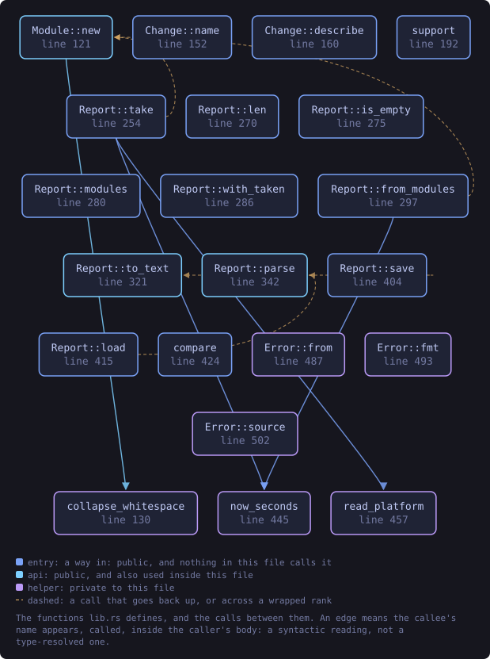

<!-- SPDX-License-Identifier: GPL-3.0-or-later -->
<!-- GENERATED by tools/docs/generate.py from the doc comments in the
     source. Do not edit this file: edit the `//!` and `///` comments in
     the .rs files and run the generator again. CI verifies it with
         python tools/docs/generate.py --check
-->

  

# `crates/veilvoice-drivers/src/lib.rs`

[`veilvoice-drivers`](../../../crates/veilvoice-drivers/README.md) &middot; 748 lines &middot; [read the source](https://github.com/tilas01/veilvoice/blob/main/crates/veilvoice-drivers/src/lib.rs)

## Contents

  - [The limit, stated first](#the-limit-stated-first)
  - [The cross-view check, and what it is actually worth](#the-cross-view-check-and-what-it-is-actually-worth)
  - [A new driver is not by itself a finding](#a-new-driver-is-not-by-itself-a-finding)
  - [Where the answer comes from](#where-the-answer-comes-from)
- [In plain words](#in-plain-words)
  - [What this file contains](#what-this-file-contains)
  - [What calls what](#what-calls-what)
  - [Items](#items)

What is loaded into the kernel, recorded, and compared later. A driver
appearing between two looks is worth knowing about: it is the step almost
everything that wants to watch a microphone from underneath has to take.

## The limit, stated first

**This reads a list the operating system hands out.** Anything able to lie
to that list is not in it. A kernel module that has unlinked itself from the
module list, or a driver that hooks the enumeration this calls, will be
invisible here, and would be invisible to any unprivileged program asking
the same question, which is why the answer is "detect carelessness", not
"detect rootkits". See `SCOPE`.

## The cross-view check, and what it is actually worth

On Linux the kernel publishes the same fact twice: `/proc/modules` and the
directories under `/sys/module`. `Report::discrepancies` lists modules
that appear in one and not the other, which catches something that unlinked
itself from one list and forgot the other. That has been a real mistake in
real rootkits.

It is a check for carelessness and nothing more. Both views come from the
same kernel, so anything with the privilege to edit one has the privilege to
edit both. A quiet cross-view check is not evidence that nothing is hiding,
and this crate never says it is.

No other platform here has two independent views to compare, so
`Report::discrepancies` is empty on them, which is reported as "there was
nothing to cross-check", not as "the check passed".

## A new driver is not by itself a finding

Plugging in a printer loads a driver. So does a graphics update, a VPN
client, a virtual audio cable, which VeilVoice recommends, and a game's
anti-cheat. `Change::Appeared` is a fact about a list, and the question
it raises is "did you install something?", which the person at the keyboard
answers in a second. Nothing here tries to answer it for them.

## Where the answer comes from

| Platform | Source | Needs privilege |
|---|---|---|
| Linux | `/proc/modules`, cross-checked against `/sys/module` | no |
| Windows | `driverquery.exe /FO CSV /NH` | no |
| macOS | `kmutil showloaded`, falling back to `kextstat` | no |
| others | nothing is read, and `support` says so | n/a |

Linux reads two files and spawns nothing. The other two shell out to a tool
the system already ships, for the same reason the rest of this workspace
does: `#![forbid(unsafe_code)]` holds here too, and the native APIs are FFI.

# In plain words

This lists what is loaded deep inside the operating system, and tells you when
that list changes.

Drivers run below almost everything else, so something that gets in there can
see a great deal. Knowing a new one has appeared is worth something.

It asks the system twice, in two different ways, and says so when the two
answers disagree -- which is a hint, not a detection. Anything already down
there can lie to both.

## What this file contains

748 lines defining **21 functions** (15 public), **5 types** and **3 constants**. Everything below is read out of the source, so it cannot disagree with the code.

**The types it owns.**

- `struct Module` (line 98) -- One loaded driver or kernel module.
- `enum Change` (line 136) -- How a module differs from the record.
- `struct Support` (line 178) -- What this platform can and cannot answer.
- `struct Report` (line 233) -- What is loaded right now, and anything odd about how it was found.
- `enum Error` (line 479) -- Everything that can go wrong in this crate.

**What happens when it runs.** These are the ways in: public, and nothing else in this file calls them, so they are what an outside caller reaches first.

- `Change::name` (line 152) -- The module's name, whichever side it came from.
- `Change::describe` (line 160) -- One line for a terminal or a log.
- `support` (line 192) -- Report what this platform can do.
- `Report::take` (line 254) -- Ask the platform what is loaded.
  - reaches: `new`, `now_seconds`, `read_platform`, `collapse_whitespace`
- `Report::len` (line 270) -- How many modules were listed.
- `Report::is_empty` (line 275) -- Whether nothing was listed.
- `Report::modules` (line 280) -- The modules, in a stable order.
- `Report::with_taken` (line 286) -- Replace the recorded time.
- `Report::from_modules` (line 297) -- Build a report from a list, for tests and for another front end that has already obtained one.
  - reaches: `new`, `now_seconds`, `collapse_whitespace`
- `Report::save` (line 404) -- Write the report to path.
  - reaches: `to_text`
- `Report::load` (line 415) -- Read a report written by Report::save.
  - reaches: `parse`
- `compare` (line 424) -- Compare two reports of the same machine.

## What calls what

The functions this file defines, and the calls between them. Both
are read out of the source: an edge means the callee's name appears,
called, inside the caller's body. It is a syntactic reading, not a
type-resolved one, so a call made through a trait object or a macro
will not appear.

_Colour key: **entry** -- a way in: public, and nothing in this file calls it; **api** -- public, and also used inside this file; **helper** -- private to this file._

  

The same graph as Mermaid source

```mermaid
%%{init: {"theme":"base","themeVariables":{"background":"#1a1b26","primaryColor":"#1f2335","primaryTextColor":"#c0caf5","primaryBorderColor":"#7aa2f7","secondaryColor":"#16161e","tertiaryColor":"#16161e","lineColor":"#737aa2","textColor":"#c0caf5","mainBkg":"#1f2335","nodeBorder":"#7aa2f7","clusterBkg":"#16161e","clusterBorder":"#2f3549","fontFamily":"ui-monospace, SFMono-Regular, Consolas, monospace","fontSize":"14px"}}}%%
flowchart TD
    n_new["Module::new<br/>line 121"]
    n_collapse_whitespace["collapse_whitespace<br/>line 130"]
    n_name(["Change::name<br/>line 152"])
    n_describe(["Change::describe<br/>line 160"])
    n_support(["support<br/>line 192"])
    n_take(["Report::take<br/>line 254"])
    n_len(["Report::len<br/>line 270"])
    n_is_empty(["Report::is_empty<br/>line 275"])
    n_modules(["Report::modules<br/>line 280"])
    n_with_taken(["Report::with_taken<br/>line 286"])
    n_from_modules(["Report::from_modules<br/>line 297"])
    n_to_text["Report::to_text<br/>line 321"]
    n_parse["Report::parse<br/>line 342"]
    n_save(["Report::save<br/>line 404"])
    n_load(["Report::load<br/>line 415"])
    n_compare(["compare<br/>line 424"])
    n_now_seconds["now_seconds<br/>line 445"]
    n_read_platform["read_platform<br/>line 457"]
    n_from["Error::from<br/>line 487"]
    n_fmt["Error::fmt<br/>line 493"]
    n_source["Error::source<br/>line 502"]
    n_from_modules --> n_new
    n_from_modules --> n_now_seconds
    n_load --> n_parse
    n_new --> n_collapse_whitespace
    n_save --> n_to_text
    n_take --> n_new
    n_take --> n_now_seconds
    n_take --> n_read_platform
    click n_new href "https://github.com/tilas01/veilvoice/blob/main/crates/veilvoice-drivers/src/lib.rs#L121" "open the source"
    click n_collapse_whitespace href "https://github.com/tilas01/veilvoice/blob/main/crates/veilvoice-drivers/src/lib.rs#L130" "open the source"
    click n_name href "https://github.com/tilas01/veilvoice/blob/main/crates/veilvoice-drivers/src/lib.rs#L152" "open the source"
    click n_describe href "https://github.com/tilas01/veilvoice/blob/main/crates/veilvoice-drivers/src/lib.rs#L160" "open the source"
    click n_support href "https://github.com/tilas01/veilvoice/blob/main/crates/veilvoice-drivers/src/lib.rs#L192" "open the source"
    click n_take href "https://github.com/tilas01/veilvoice/blob/main/crates/veilvoice-drivers/src/lib.rs#L254" "open the source"
    click n_len href "https://github.com/tilas01/veilvoice/blob/main/crates/veilvoice-drivers/src/lib.rs#L270" "open the source"
    click n_is_empty href "https://github.com/tilas01/veilvoice/blob/main/crates/veilvoice-drivers/src/lib.rs#L275" "open the source"
    click n_modules href "https://github.com/tilas01/veilvoice/blob/main/crates/veilvoice-drivers/src/lib.rs#L280" "open the source"
    click n_with_taken href "https://github.com/tilas01/veilvoice/blob/main/crates/veilvoice-drivers/src/lib.rs#L286" "open the source"
    click n_from_modules href "https://github.com/tilas01/veilvoice/blob/main/crates/veilvoice-drivers/src/lib.rs#L297" "open the source"
    click n_to_text href "https://github.com/tilas01/veilvoice/blob/main/crates/veilvoice-drivers/src/lib.rs#L321" "open the source"
    click n_parse href "https://github.com/tilas01/veilvoice/blob/main/crates/veilvoice-drivers/src/lib.rs#L342" "open the source"
    click n_save href "https://github.com/tilas01/veilvoice/blob/main/crates/veilvoice-drivers/src/lib.rs#L404" "open the source"
    click n_load href "https://github.com/tilas01/veilvoice/blob/main/crates/veilvoice-drivers/src/lib.rs#L415" "open the source"
    click n_compare href "https://github.com/tilas01/veilvoice/blob/main/crates/veilvoice-drivers/src/lib.rs#L424" "open the source"
    click n_now_seconds href "https://github.com/tilas01/veilvoice/blob/main/crates/veilvoice-drivers/src/lib.rs#L445" "open the source"
    click n_read_platform href "https://github.com/tilas01/veilvoice/blob/main/crates/veilvoice-drivers/src/lib.rs#L457" "open the source"
    click n_from href "https://github.com/tilas01/veilvoice/blob/main/crates/veilvoice-drivers/src/lib.rs#L487" "open the source"
    click n_fmt href "https://github.com/tilas01/veilvoice/blob/main/crates/veilvoice-drivers/src/lib.rs#L493" "open the source"
    click n_source href "https://github.com/tilas01/veilvoice/blob/main/crates/veilvoice-drivers/src/lib.rs#L502" "open the source"
    classDef entry fill:#1f2335,stroke:#7aa2f7,color:#c0caf5
    class n_name,n_describe,n_support,n_take,n_len,n_is_empty,n_modules,n_with_taken,n_from_modules,n_save,n_load,n_compare entry
    classDef api fill:#1f2335,stroke:#7dcfff,color:#c0caf5
    class n_new,n_to_text,n_parse api
    classDef helper fill:#1f2335,stroke:#bb9af7,color:#c0caf5
    class n_collapse_whitespace,n_now_seconds,n_read_platform,n_from,n_fmt,n_source helper
```

## Items

| Item | Line | Documentation |
|---|---:|---|
| `VERSION` pub const | [77](https://github.com/tilas01/veilvoice/blob/main/crates/veilvoice-drivers/src/lib.rs#L77) | Crate version string, surfaced in the About panel. |
| `SCOPE` pub const | [83](https://github.com/tilas01/veilvoice/blob/main/crates/veilvoice-drivers/src/lib.rs#L83) | What this is worth, in the words a front end should show. |
| `Module` pub struct | [98](https://github.com/tilas01/veilvoice/blob/main/crates/veilvoice-drivers/src/lib.rs#L98) | One loaded driver or kernel module. |
| `Module::new` pub fn | [121](https://github.com/tilas01/veilvoice/blob/main/crates/veilvoice-drivers/src/lib.rs#L121) | A module, with both strings made safe for the record. |
| `collapse_whitespace` fn | [130](https://github.com/tilas01/veilvoice/blob/main/crates/veilvoice-drivers/src/lib.rs#L130) | Every run of whitespace becomes one space, and the ends are trimmed. |
| `Change` pub enum | [136](https://github.com/tilas01/veilvoice/blob/main/crates/veilvoice-drivers/src/lib.rs#L136) | How a module differs from the record. |
| `Change::name` pub fn | [152](https://github.com/tilas01/veilvoice/blob/main/crates/veilvoice-drivers/src/lib.rs#L152) | The module's name, whichever side it came from. |
| `Change::describe` pub fn | [160](https://github.com/tilas01/veilvoice/blob/main/crates/veilvoice-drivers/src/lib.rs#L160) | One line for a terminal or a log. |
| `Support` pub struct | [178](https://github.com/tilas01/veilvoice/blob/main/crates/veilvoice-drivers/src/lib.rs#L178) | What this platform can and cannot answer. |
| `support` pub fn | [192](https://github.com/tilas01/veilvoice/blob/main/crates/veilvoice-drivers/src/lib.rs#L192) | Report what this platform can do. |
| `Report` pub struct | [233](https://github.com/tilas01/veilvoice/blob/main/crates/veilvoice-drivers/src/lib.rs#L233) | What is loaded right now, and anything odd about how it was found. |
| `MAGIC` const | [250](https://github.com/tilas01/veilvoice/blob/main/crates/veilvoice-drivers/src/lib.rs#L250) | Magic first line of a saved report. |
| `Report::take` pub fn | [254](https://github.com/tilas01/veilvoice/blob/main/crates/veilvoice-drivers/src/lib.rs#L254) | Ask the platform what is loaded. |
| `Report::len` pub fn | [270](https://github.com/tilas01/veilvoice/blob/main/crates/veilvoice-drivers/src/lib.rs#L270) | How many modules were listed. |
| `Report::is_empty` pub fn | [275](https://github.com/tilas01/veilvoice/blob/main/crates/veilvoice-drivers/src/lib.rs#L275) | Whether nothing was listed. |
| `Report::modules` pub fn | [280](https://github.com/tilas01/veilvoice/blob/main/crates/veilvoice-drivers/src/lib.rs#L280) | The modules, in a stable order. |
| `Report::with_taken` pub fn | [286](https://github.com/tilas01/veilvoice/blob/main/crates/veilvoice-drivers/src/lib.rs#L286) | Replace the recorded time. |
| `Report::from_modules` pub fn | [297](https://github.com/tilas01/veilvoice/blob/main/crates/veilvoice-drivers/src/lib.rs#L297) | Build a report from a list, for tests and for another front end that has already obtained one. |
| `Report::to_text` pub fn | [321](https://github.com/tilas01/veilvoice/blob/main/crates/veilvoice-drivers/src/lib.rs#L321) | Serialise to a text format, one record per line. |
| `Report::parse` pub fn | [342](https://github.com/tilas01/veilvoice/blob/main/crates/veilvoice-drivers/src/lib.rs#L342) | Parse the text format. |
| `Report::save` pub fn | [404](https://github.com/tilas01/veilvoice/blob/main/crates/veilvoice-drivers/src/lib.rs#L404) | Write the report to path. |
| `Report::load` pub fn | [415](https://github.com/tilas01/veilvoice/blob/main/crates/veilvoice-drivers/src/lib.rs#L415) | Read a report written by Report::save. |
| `compare` pub fn | [424](https://github.com/tilas01/veilvoice/blob/main/crates/veilvoice-drivers/src/lib.rs#L424) | Compare two reports of the same machine. |
| `now_seconds` fn | [445](https://github.com/tilas01/veilvoice/blob/main/crates/veilvoice-drivers/src/lib.rs#L445) |  |
| `read_platform` fn | [457](https://github.com/tilas01/veilvoice/blob/main/crates/veilvoice-drivers/src/lib.rs#L457) | Ask whichever reader this platform has. |
| `Error` pub enum | [479](https://github.com/tilas01/veilvoice/blob/main/crates/veilvoice-drivers/src/lib.rs#L479) | Everything that can go wrong in this crate. |
| `Error::from` fn | [487](https://github.com/tilas01/veilvoice/blob/main/crates/veilvoice-drivers/src/lib.rs#L487) |  |
| `Error::fmt` fn | [493](https://github.com/tilas01/veilvoice/blob/main/crates/veilvoice-drivers/src/lib.rs#L493) |  |
| `Error::source` fn | [502](https://github.com/tilas01/veilvoice/blob/main/crates/veilvoice-drivers/src/lib.rs#L502) |  |

---

Generated from `crates/veilvoice-drivers/src/lib.rs`. On the website: [`website/reference/veilvoice-drivers/lib.html`](../../../website/reference/veilvoice-drivers/lib.html).

Signing key fingerprint `8101FB3BB28D02FB239E0CDF9CC1C7E7A9B5833A`.
