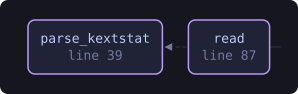
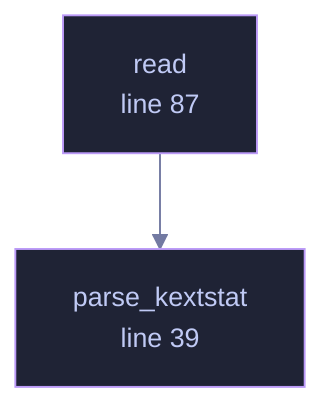

<!-- SPDX-License-Identifier: GPL-3.0-or-later -->
<!-- GENERATED by tools/docs/generate.py from the doc comments in the
     source. Do not edit this file: edit the `//!` and `///` comments in
     the .rs files and run the generator again. CI verifies it with
         python tools/docs/generate.py --check
-->

<p align="center">
  
</p>

# `crates/veilvoice-drivers/src/macos.rs`

[`veilvoice-drivers`](../../../crates/veilvoice-drivers/README.md) &middot; 206 lines &middot; [read the source](https://github.com/tilas01/veilvoice/blob/main/crates/veilvoice-drivers/src/macos.rs)

## Contents

- [Two tools, because Apple is mid-transition](#two-tools-because-apple-is-mid-transition)
- [Why a subprocess](#why-a-subprocess)
  - [What this file contains](#what-this-file-contains)
  - [What calls what](#what-calls-what)
  - [Items](#items)

macOS: `kmutil showloaded`, falling back to `kextstat`.

# Two tools, because Apple is mid-transition

`kextstat` is the old one and is deprecated; `kmutil` is the replacement and
does not exist on older systems. Both are tried, newest first, and if
neither answers the reason is reported rather than an empty list being
passed off as "no kernel extensions" — which would be false on every Mac
ever made.

Both print the same shape, which is why one parser handles both:

```text
Index Refs Address            Size       Wired      Name (Version) UUID <Linked Against>
1   88 0                  0          0          com.apple.kpi.bsd (20.6.0)
134    0 0xffffff7f8312d000 0x9000     0x9000     com.example.driver (1.2.3) <7 5 4 1>
```

The **address is deliberately dropped**, for the same reason as on Linux: it
is zeroed for an unprivileged reader on a machine with kernel-pointer
restriction, and changes at every boot on one without. Recording it would
make every extension look altered after a restart, and a report that is
entirely false positives after every reboot is a report nobody opens twice.

# Why a subprocess

The native answer is IOKit, which is FFI. `#![forbid(unsafe_code)]` holds
here as everywhere else in the workspace, so this asks a tool the system
already ships — the same trade the Windows and Linux readers make.

## What this file contains

206 lines defining **2 functions** (0 public), **0 types** and **0 constants**. Everything below is read out of the source, so it cannot disagree with the code.

## What calls what

The functions this file defines, and the calls between them. Both
are read out of the source: an edge means the callee's name appears,
called, inside the caller's body. It is a syntactic reading, not a
type-resolved one, so a call made through a trait object or a macro
will not appear.

_Colour key: **helper** -- private to this file._

<p align="center">
  
</p>

<details>
<summary>The same graph as Mermaid source</summary>



</details>

## Items

| Item | Line | Documentation |
|---|---:|---|
| `parse_kextstat` <sub>pub(crate) fn</sub> | [39](https://github.com/tilas01/veilvoice/blob/main/crates/veilvoice-drivers/src/macos.rs#L39) | Parse kextstat-style output, which kmutil showloaded also produces. |
| `read` <sub>pub(crate) fn</sub> | [87](https://github.com/tilas01/veilvoice/blob/main/crates/veilvoice-drivers/src/macos.rs#L87) | Ask kmutil, then kextstat. |

---

Generated from `crates/veilvoice-drivers/src/macos.rs`. On the website: [`website/reference/veilvoice-drivers/macos.html`](../../../website/reference/veilvoice-drivers/macos.html).

Signing key fingerprint `8101FB3BB28D02FB239E0CDF9CC1C7E7A9B5833A`.
