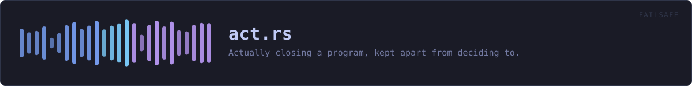
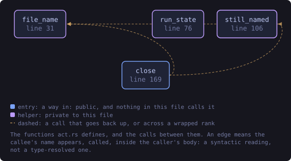
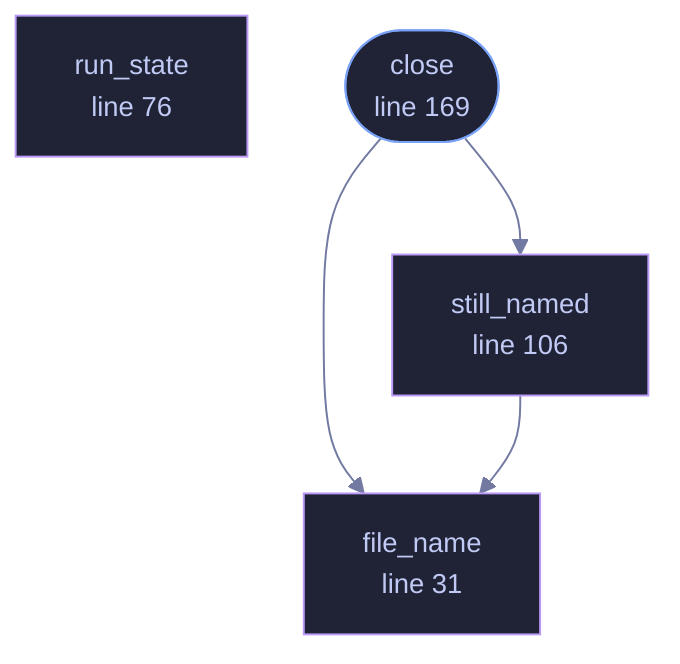

<!-- SPDX-License-Identifier: GPL-3.0-or-later -->
<!-- GENERATED by tools/docs/generate.py from the doc comments in the
     source. Do not edit this file: edit the `//!` and `///` comments in
     the .rs files and run the generator again. CI verifies it with
         python tools/docs/generate.py --check
-->

  

# `crates/veilvoice-failsafe/src/act.rs`

[`veilvoice-failsafe`](../../../crates/veilvoice-failsafe/README.md) &middot; 470 lines &middot; [read the source](https://github.com/tilas01/veilvoice/blob/main/crates/veilvoice-failsafe/src/act.rs)

## Contents

- [Why this is its own file](#why-this-is-its-own-file)
- [The check is made twice, on purpose](#the-check-is-made-twice-on-purpose)
- [In plain words](#in-plain-words)
  - [What this file contains](#what-this-file-contains)
  - [What calls what](#what-calls-what)
  - [Items](#items)

Actually closing a program, kept apart from deciding to.

# Why this is its own file

Everything in `crate` is arithmetic over a list: it decides, and it can be
tested without a machine. This is the only part that reaches out and ends
somebody's program, and separating the two means the decision can be
reasoned about on its own and this can be short enough to read in one go.

# The check is made twice, on purpose

`crate::Guard::look` already worked out whether a program may be closed,
and `close` checks again before it acts. That is not redundancy for its own
sake: the two are reached through different paths, a future caller could
compute `closeable` wrongly or not at all, and the cost of being wrong here
is ending somebody's desktop session. A guard that refuses at the last step
as well as the first is a guard that cannot be talked past by a mistake
upstream.

# In plain words

This is the part that closes a program that picked up your real microphone.
It checks one last time that the program is safe to close — never VeilVoice
itself, never anything belonging to the operating system — and it says what
it did either way.

## What this file contains

470 lines defining **5 functions** (1 public), **0 types** and **0 constants**. Everything below is read out of the source, so it cannot disagree with the code.

**What happens when it runs.** These are the ways in: public, and nothing else in this file calls them, so they are what an outside caller reaches first.

- `close` (line 169) -- Close a program, having decided it should be closed.
  - reaches: `file_name`, `still_named`

## What calls what

The functions this file defines, and the calls between them. Both
are read out of the source: an edge means the callee's name appears,
called, inside the caller's body. It is a syntactic reading, not a
type-resolved one, so a call made through a trait object or a macro
will not appear.

_Colour key: **entry** -- a way in: public, and nothing in this file calls it; **helper** -- private to this file._

  

The same graph as Mermaid source

## Items

| Item | Line | Documentation |
|---|---:|---|
| `file_name` fn | [31](https://github.com/tilas01/veilvoice/blob/main/crates/veilvoice-failsafe/src/act.rs#L31) | A program's own name, without the path it was found at. |
| `still_named` fn | [51](https://github.com/tilas01/veilvoice/blob/main/crates/veilvoice-failsafe/src/act.rs#L51) | Whether this process id still belongs to this program. |
| `run_state` fn | [76](https://github.com/tilas01/veilvoice/blob/main/crates/veilvoice-failsafe/src/act.rs#L76) | The one-letter run state in a line of /proc/<pid>/stat. |
| `still_named` fn | [106](https://github.com/tilas01/veilvoice/blob/main/crates/veilvoice-failsafe/src/act.rs#L106) | Whether this process id still belongs to this program and is running. |
| `close` pub fn | [169](https://github.com/tilas01/veilvoice/blob/main/crates/veilvoice-failsafe/src/act.rs#L169) | Close a program, having decided it should be closed. |

---

Generated from `crates/veilvoice-failsafe/src/act.rs`. On the website: [`website/reference/veilvoice-failsafe/act.html`](../../../website/reference/veilvoice-failsafe/act.html).

Signing key fingerprint `8101FB3BB28D02FB239E0CDF9CC1C7E7A9B5833A`.
