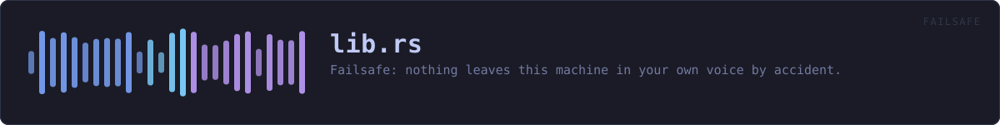
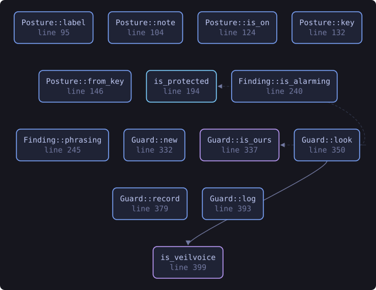

<!-- SPDX-License-Identifier: GPL-3.0-or-later -->
<!-- GENERATED by tools/docs/generate.py from the doc comments in the
     source. Do not edit this file: edit the `//!` and `///` comments in
     the .rs files and run the generator again. CI verifies it with
         python tools/docs/generate.py --check
-->

  

# `crates/veilvoice-failsafe/src/lib.rs`

[`veilvoice-failsafe`](../../../crates/veilvoice-failsafe/README.md) &middot; 682 lines &middot; [read the source](https://github.com/tilas01/veilvoice/blob/main/crates/veilvoice-failsafe/src/lib.rs)

## Contents

- [The accident this exists to stop](#the-accident-this-exists-to-stop)
- [What it can do, and what it cannot](#what-it-can-do-and-what-it-cannot)
- [Killing another program is a serious thing](#killing-another-program-is-a-serious-thing)
- [In plain words](#in-plain-words)
  - [What this file contains](#what-this-file-contains)
  - [What calls what](#what-calls-what)
  - [Items](#items)

Failsafe: nothing leaves this machine in your own voice by accident.

# The accident this exists to stop

You set a calling program to VeilVoice's virtual cable, you start live mode,
and everything is veiled. Then you plug in a headset. Windows offers the new
microphone, the calling program takes it, and from that moment your **real
voice** is going out, with the veiled window still open in front of you,
still showing meters moving, still looking exactly as it did a second ago.

Nobody notices that. It is not a mistake somebody makes through
carelessness; it is a mistake the operating system makes on their behalf.
Failsafe is on by default because the cost of it being off is that the one
thing this whole project exists to prevent happens silently.

# What it can do, and what it cannot

It **watches** which applications hold a microphone, and it knows which
device VeilVoice is veiling. If another program picks up a *real* microphone
while you are veiling, that is the accident, and Failsafe:

1. says so, loudly, because a silent guard is not a guard; and
2. closes that program, if `Posture::CloseIt` is set, which it is by
default, because a warning you have not read yet does not stop your voice
going out.

It **cannot stop the operating system handing a microphone to another
program in the first place.** Doing that needs exclusive-mode capture of
every input device, or a driver, and neither is something this project
ships. See `CANNOT_PREVENT`, which is the wording a front end must show.
What Failsafe does is notice within a second or so and act. That is a real
difference from nothing, and it is a real difference from prevention, and
both halves have to be said.

# Killing another program is a serious thing

So it is bounded rather than general:

* **VeilVoice never closes itself**, which would end the veiling it exists
to protect.
* **It never closes a system process.** `PROTECTED` is a list, checked by
name, and anything on it is reported and left alone.
* **It only closes what is actually holding a microphone**, from the watch
feed, never a name from a guess.
* **Every close is recorded**, because a program that vanishes with nothing
to explain it is indistinguishable from a crash.

# In plain words

Failsafe is on by default and it is the safety catch.

The danger it guards against is this: you are talking through VeilVoice with
your voice disguised, you plug in headphones or a headset, and your computer
quietly switches the call over to the *real* microphone. Your actual voice
goes out and nothing on screen looks any different.

Failsafe watches for exactly that. If another program picks up a real
microphone while you are being veiled, it tells you straight away and closes
that program so your voice stops going out.

What it cannot do is stop your computer from handing the microphone over in
the first place, because that needs a level of access this program does not have,
and it says so rather than letting you believe otherwise. It notices, and it
acts, within about a second.

## What this file contains

682 lines defining **14 functions** (12 public), **5 types** and **4 constants**. Everything below is read out of the source, so it cannot disagree with the code.

**The types it owns.**

- `enum Posture` (line 75) -- How hard Failsafe acts when it finds something.
- `enum Finding` (line 206) -- What Failsafe found.
- `struct Action` (line 284) -- One thing Failsafe did, for the record.
- `struct Holder` (line 301) -- What the watch feed says about one application holding a device.
- `struct Guard` (line 315) -- The state Failsafe needs to decide anything.

**What happens when it runs.** These are the ways in: public, and nothing else in this file calls them, so they are what an outside caller reaches first.

- `Posture::label` (line 95) -- A short name for a picker.
- `Posture::note` (line 104) -- What this choice costs and buys.
- `Posture::is_on` (line 124) -- Whether anything is being watched at all.
- `Posture::key` (line 132) -- The identifier written to the settings file.
- `Posture::from_key` (line 146) -- Read a posture back.
- `Finding::is_alarming` (line 240) -- Whether this needs the reader's attention now.
- `Finding::phrasing` (line 245) -- The sentence to show.
- `Guard::new` (line 332) -- A guard in its default posture, watching nothing yet.
- `Guard::look` (line 350) -- Decide, given who holds a microphone right now.
  - reaches: `is_ours`, `is_protected`, `is_veilvoice`
- `Guard::record` (line 379) -- Record what was done about a finding.
- `Guard::log` (line 393) -- Everything Failsafe has done, oldest first.

## What calls what

The functions this file defines, and the calls between them. Both
are read out of the source: an edge means the callee's name appears,
called, inside the caller's body. It is a syntactic reading, not a
type-resolved one, so a call made through a trait object or a macro
will not appear.

_Colour key: **entry** -- a way in: public, and nothing in this file calls it; **api** -- public, and also used inside this file; **helper** -- private to this file._

  

The same graph as Mermaid source

```mermaid
%%{init: {"theme":"base","themeVariables":{"background":"#1a1b26","primaryColor":"#1f2335","primaryTextColor":"#c0caf5","primaryBorderColor":"#7aa2f7","secondaryColor":"#16161e","tertiaryColor":"#16161e","lineColor":"#737aa2","textColor":"#c0caf5","mainBkg":"#1f2335","nodeBorder":"#7aa2f7","clusterBkg":"#16161e","clusterBorder":"#2f3549","fontFamily":"ui-monospace, SFMono-Regular, Consolas, monospace","fontSize":"14px"}}}%%
flowchart TD
    n_label(["Posture::label<br/>line 95"])
    n_note(["Posture::note<br/>line 104"])
    n_is_on(["Posture::is_on<br/>line 124"])
    n_key(["Posture::key<br/>line 132"])
    n_from_key(["Posture::from_key<br/>line 146"])
    n_is_protected["is_protected<br/>line 194"]
    n_is_alarming(["Finding::is_alarming<br/>line 240"])
    n_phrasing(["Finding::phrasing<br/>line 245"])
    n_new(["Guard::new<br/>line 332"])
    n_is_ours["Guard::is_ours<br/>line 337"]
    n_look(["Guard::look<br/>line 350"])
    n_record(["Guard::record<br/>line 379"])
    n_log(["Guard::log<br/>line 393"])
    n_is_veilvoice["is_veilvoice<br/>line 399"]
    n_look --> n_is_ours
    n_look --> n_is_protected
    n_look --> n_is_veilvoice
    click n_label href "https://github.com/tilas01/veilvoice/blob/main/crates/veilvoice-failsafe/src/lib.rs#L95" "open the source"
    click n_note href "https://github.com/tilas01/veilvoice/blob/main/crates/veilvoice-failsafe/src/lib.rs#L104" "open the source"
    click n_is_on href "https://github.com/tilas01/veilvoice/blob/main/crates/veilvoice-failsafe/src/lib.rs#L124" "open the source"
    click n_key href "https://github.com/tilas01/veilvoice/blob/main/crates/veilvoice-failsafe/src/lib.rs#L132" "open the source"
    click n_from_key href "https://github.com/tilas01/veilvoice/blob/main/crates/veilvoice-failsafe/src/lib.rs#L146" "open the source"
    click n_is_protected href "https://github.com/tilas01/veilvoice/blob/main/crates/veilvoice-failsafe/src/lib.rs#L194" "open the source"
    click n_is_alarming href "https://github.com/tilas01/veilvoice/blob/main/crates/veilvoice-failsafe/src/lib.rs#L240" "open the source"
    click n_phrasing href "https://github.com/tilas01/veilvoice/blob/main/crates/veilvoice-failsafe/src/lib.rs#L245" "open the source"
    click n_new href "https://github.com/tilas01/veilvoice/blob/main/crates/veilvoice-failsafe/src/lib.rs#L332" "open the source"
    click n_is_ours href "https://github.com/tilas01/veilvoice/blob/main/crates/veilvoice-failsafe/src/lib.rs#L337" "open the source"
    click n_look href "https://github.com/tilas01/veilvoice/blob/main/crates/veilvoice-failsafe/src/lib.rs#L350" "open the source"
    click n_record href "https://github.com/tilas01/veilvoice/blob/main/crates/veilvoice-failsafe/src/lib.rs#L379" "open the source"
    click n_log href "https://github.com/tilas01/veilvoice/blob/main/crates/veilvoice-failsafe/src/lib.rs#L393" "open the source"
    click n_is_veilvoice href "https://github.com/tilas01/veilvoice/blob/main/crates/veilvoice-failsafe/src/lib.rs#L399" "open the source"
    classDef entry fill:#1f2335,stroke:#7aa2f7,color:#c0caf5
    class n_label,n_note,n_is_on,n_key,n_from_key,n_is_alarming,n_phrasing,n_new,n_look,n_record,n_log entry
    classDef api fill:#1f2335,stroke:#7dcfff,color:#c0caf5
    class n_is_protected api
    classDef helper fill:#1f2335,stroke:#bb9af7,color:#c0caf5
    class n_is_ours,n_is_veilvoice helper
```

## Items

| Item | Line | Documentation |
|---|---:|---|
| `Posture` pub enum | [75](https://github.com/tilas01/veilvoice/blob/main/crates/veilvoice-failsafe/src/lib.rs#L75) | How hard Failsafe acts when it finds something. |
| `Posture::label` pub fn | [95](https://github.com/tilas01/veilvoice/blob/main/crates/veilvoice-failsafe/src/lib.rs#L95) | A short name for a picker. |
| `Posture::note` pub fn | [104](https://github.com/tilas01/veilvoice/blob/main/crates/veilvoice-failsafe/src/lib.rs#L104) | What this choice costs and buys. |
| `Posture::is_on` pub fn | [124](https://github.com/tilas01/veilvoice/blob/main/crates/veilvoice-failsafe/src/lib.rs#L124) | Whether anything is being watched at all. |
| `Posture::ALL` pub const | [129](https://github.com/tilas01/veilvoice/blob/main/crates/veilvoice-failsafe/src/lib.rs#L129) | Every posture, in the order a picker should offer them. |
| `Posture::key` pub fn | [132](https://github.com/tilas01/veilvoice/blob/main/crates/veilvoice-failsafe/src/lib.rs#L132) | The identifier written to the settings file. |
| `Posture::from_key` pub fn | [146](https://github.com/tilas01/veilvoice/blob/main/crates/veilvoice-failsafe/src/lib.rs#L146) | Read a posture back. |
| `PROTECTED` pub const | [163](https://github.com/tilas01/veilvoice/blob/main/crates/veilvoice-failsafe/src/lib.rs#L163) | Processes Failsafe will never close, whatever they are holding. |
| `is_protected` pub fn | [194](https://github.com/tilas01/veilvoice/blob/main/crates/veilvoice-failsafe/src/lib.rs#L194) | Whether this program is one Failsafe refuses to close. |
| `Finding` pub enum | [206](https://github.com/tilas01/veilvoice/blob/main/crates/veilvoice-failsafe/src/lib.rs#L206) | What Failsafe found. |
| `Finding::is_alarming` pub fn | [240](https://github.com/tilas01/veilvoice/blob/main/crates/veilvoice-failsafe/src/lib.rs#L240) | Whether this needs the reader's attention now. |
| `Finding::phrasing` pub fn | [245](https://github.com/tilas01/veilvoice/blob/main/crates/veilvoice-failsafe/src/lib.rs#L245) | The sentence to show. |
| `Action` pub struct | [284](https://github.com/tilas01/veilvoice/blob/main/crates/veilvoice-failsafe/src/lib.rs#L284) | One thing Failsafe did, for the record. |
| `Holder` pub struct | [301](https://github.com/tilas01/veilvoice/blob/main/crates/veilvoice-failsafe/src/lib.rs#L301) | What the watch feed says about one application holding a device. |
| `Guard` pub struct | [315](https://github.com/tilas01/veilvoice/blob/main/crates/veilvoice-failsafe/src/lib.rs#L315) | The state Failsafe needs to decide anything. |
| `Guard::new` pub fn | [332](https://github.com/tilas01/veilvoice/blob/main/crates/veilvoice-failsafe/src/lib.rs#L332) | A guard in its default posture, watching nothing yet. |
| `Guard::is_ours` fn | [337](https://github.com/tilas01/veilvoice/blob/main/crates/veilvoice-failsafe/src/lib.rs#L337) | Whether a device name is the one being veiled. |
| `Guard::look` pub fn | [350](https://github.com/tilas01/veilvoice/blob/main/crates/veilvoice-failsafe/src/lib.rs#L350) | Decide, given who holds a microphone right now. |
| `Guard::record` pub fn | [379](https://github.com/tilas01/veilvoice/blob/main/crates/veilvoice-failsafe/src/lib.rs#L379) | Record what was done about a finding. |
| `Guard::log` pub fn | [393](https://github.com/tilas01/veilvoice/blob/main/crates/veilvoice-failsafe/src/lib.rs#L393) | Everything Failsafe has done, oldest first. |
| `is_veilvoice` fn | [399](https://github.com/tilas01/veilvoice/blob/main/crates/veilvoice-failsafe/src/lib.rs#L399) | Whether this is one of VeilVoice's own programs. |
| `CANNOT_PREVENT` pub const | [410](https://github.com/tilas01/veilvoice/blob/main/crates/veilvoice-failsafe/src/lib.rs#L410) | What Failsafe cannot do, in the words a front end must show. |
| `NEVER_CLOSES` pub const | [420](https://github.com/tilas01/veilvoice/blob/main/crates/veilvoice-failsafe/src/lib.rs#L420) | What Failsafe refuses to close, and why. |

---

Generated from `crates/veilvoice-failsafe/src/lib.rs`. On the website: [`website/reference/veilvoice-failsafe/lib.html`](../../../website/reference/veilvoice-failsafe/lib.html).

Signing key fingerprint `8101FB3BB28D02FB239E0CDF9CC1C7E7A9B5833A`.
