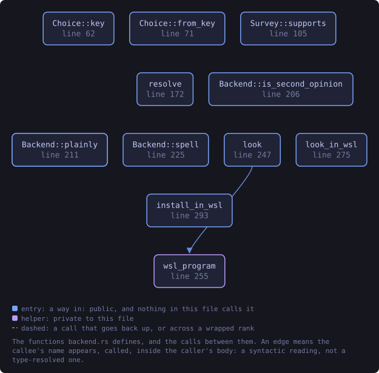

<!-- SPDX-License-Identifier: GPL-3.0-or-later -->
<!-- GENERATED by tools/docs/generate.py from the doc comments in the
     source. Do not edit this file: edit the `//!` and `///` comments in
     the .rs files and run the generator again. CI verifies it with
         python tools/docs/generate.py --check
-->

  

# `crates/veilvoice-gnupg/src/backend.rs`

[`veilvoice-gnupg`](../../../crates/veilvoice-gnupg/README.md) &middot; 469 lines &middot; [read the source](https://github.com/tilas01/veilvoice/blob/main/crates/veilvoice-gnupg/src/backend.rs)

## Contents

- [Why the built-in check is not enough on its own, and why it is the default](#why-the-built-in-check-is-not-enough-on-its-own-and-why-it-is-the-default)
- [What this module does not do](#what-this-module-does-not-do)
  - [What this file contains](#what-this-file-contains)
  - [What calls what](#what-calls-what)
  - [Items](#items)

Which program checks the signature, and who decides.

VeilVoice can check a release signature three ways, and the difference
between them matters more than it looks.

1. **Built in.** The check in this binary, written in Rust, with no
external program involved. It always works, on every platform, with
nothing installed.
2. **A `gpg` on this machine.** GnuPG itself, the reference
implementation, run as a separate program.
3. **A `gpg` inside WSL**, on Windows. The same GnuPG, in a Linux
distribution alongside Windows, reached through `wsl.exe`.

# Why the built-in check is not enough on its own, and why it is the default

Both things are true at once.

The built-in check is the one telling you a download is genuine, and it
came out of that download. A tampered release ships a tampered checker.
That is not a hypothetical objection to fix by writing better code: no
program can vouch for itself, and this one says so on the tab. GnuPG is a
second opinion from software this project did not write, and having one is
the entire point of running it.

And yet nothing here reaches for GnuPG on its own. **An external checker
is used only when the person using VeilVoice has chosen it**, even when one
was already installed long before VeilVoice first ran. Running another
program is a thing a privacy tool should do because it was asked to, not
because it found something on `PATH`; on Windows the WSL route starts a
whole Linux distribution, which is not a side effect to have by accident.

So: the default is the built-in check, the tab says what else is available,
and choosing one is one press. That is the honest arrangement. It is not
the most convenient one.

# What this module does not do

It does not run anything to find out what is here. `Survey` is a value
somebody else fills in, and every decision below is made from it, so the
rules can be tested without a `gpg`, without a WSL, and without a Windows
machine.

## What this file contains

469 lines defining **12 functions** (11 public), **5 types** and **1 constant**. Everything below is read out of the source, so it cannot disagree with the code.

**The types it owns.**

- `enum Choice` (line 51) -- What the person using VeilVoice chose.
- `struct Wsl` (line 86) -- A gpg reached through WSL.
- `struct Survey` (line 96) -- What is on this machine.
- `enum Backend` (line 116) -- Which checker will actually run, and why.
- `enum Because` (line 135) -- Why the built-in check is the one running.

**What happens when it runs.** These are the ways in: public, and nothing else in this file calls them, so they are what an outside caller reaches first.

- `Choice::key` (line 62) -- The name this is stored under, in settings and on the command line.
- `Choice::from_key` (line 71) -- The choice with this name, if it is one.
- `Survey::supports` (line 105) -- Whether a choice could actually be used right now.
- `Because::plainly` (line 146) -- What to tell the reader.
- `resolve` (line 172) -- The checker to use, from what was chosen and what is here.
- `Backend::is_second_opinion` (line 206) -- Whether an OpenPGP implementation other than this one is doing the work.
- `Backend::plainly` (line 211) -- A one-line description for a reader.
- `Backend::spell` (line 225) -- How a command written for gpg is spelled for this backend.
- `look` (line 247) -- What is here, without running anything.
  - reaches: `wsl_program`
- `look_in_wsl` (line 275) -- Ask the WSL distribution where its gpg is.
- `install_in_wsl` (line 293) -- The command that installs GnuPG inside the WSL distribution.

## What calls what

The functions this file defines, and the calls between them. Both
are read out of the source: an edge means the callee's name appears,
called, inside the caller's body. It is a syntactic reading, not a
type-resolved one, so a call made through a trait object or a macro
will not appear.

_Colour key: **entry** -- a way in: public, and nothing in this file calls it; **helper** -- private to this file._

  

The same graph as Mermaid source

```mermaid
%%{init: {"theme":"base","themeVariables":{"background":"#1a1b26","primaryColor":"#1f2335","primaryTextColor":"#c0caf5","primaryBorderColor":"#7aa2f7","secondaryColor":"#16161e","tertiaryColor":"#16161e","lineColor":"#737aa2","textColor":"#c0caf5","mainBkg":"#1f2335","nodeBorder":"#7aa2f7","clusterBkg":"#16161e","clusterBorder":"#2f3549","fontFamily":"ui-monospace, SFMono-Regular, Consolas, monospace","fontSize":"14px"}}}%%
flowchart TD
    n_key(["Choice::key<br/>line 62"])
    n_from_key(["Choice::from_key<br/>line 71"])
    n_supports(["Survey::supports<br/>line 105"])
    n_plainly(["Because::plainly<br/>line 146"])
    n_resolve(["resolve<br/>line 172"])
    n_is_second_opinion(["Backend::is_second_opinion<br/>line 206"])
    n_plainly(["Backend::plainly<br/>line 211"])
    n_spell(["Backend::spell<br/>line 225"])
    n_look(["look<br/>line 247"])
    n_wsl_program["wsl_program<br/>line 255"]
    n_look_in_wsl(["look_in_wsl<br/>line 275"])
    n_install_in_wsl(["install_in_wsl<br/>line 293"])
    n_look --> n_wsl_program
    click n_key href "https://github.com/tilas01/veilvoice/blob/main/crates/veilvoice-gnupg/src/backend.rs#L62" "open the source"
    click n_from_key href "https://github.com/tilas01/veilvoice/blob/main/crates/veilvoice-gnupg/src/backend.rs#L71" "open the source"
    click n_supports href "https://github.com/tilas01/veilvoice/blob/main/crates/veilvoice-gnupg/src/backend.rs#L105" "open the source"
    click n_plainly href "https://github.com/tilas01/veilvoice/blob/main/crates/veilvoice-gnupg/src/backend.rs#L146" "open the source"
    click n_resolve href "https://github.com/tilas01/veilvoice/blob/main/crates/veilvoice-gnupg/src/backend.rs#L172" "open the source"
    click n_is_second_opinion href "https://github.com/tilas01/veilvoice/blob/main/crates/veilvoice-gnupg/src/backend.rs#L206" "open the source"
    click n_plainly href "https://github.com/tilas01/veilvoice/blob/main/crates/veilvoice-gnupg/src/backend.rs#L211" "open the source"
    click n_spell href "https://github.com/tilas01/veilvoice/blob/main/crates/veilvoice-gnupg/src/backend.rs#L225" "open the source"
    click n_look href "https://github.com/tilas01/veilvoice/blob/main/crates/veilvoice-gnupg/src/backend.rs#L247" "open the source"
    click n_wsl_program href "https://github.com/tilas01/veilvoice/blob/main/crates/veilvoice-gnupg/src/backend.rs#L255" "open the source"
    click n_look_in_wsl href "https://github.com/tilas01/veilvoice/blob/main/crates/veilvoice-gnupg/src/backend.rs#L275" "open the source"
    click n_install_in_wsl href "https://github.com/tilas01/veilvoice/blob/main/crates/veilvoice-gnupg/src/backend.rs#L293" "open the source"
    classDef entry fill:#1f2335,stroke:#7aa2f7,color:#c0caf5
    class n_key,n_from_key,n_supports,n_plainly,n_resolve,n_is_second_opinion,n_plainly,n_spell,n_look,n_look_in_wsl,n_install_in_wsl entry
    classDef helper fill:#1f2335,stroke:#bb9af7,color:#c0caf5
    class n_wsl_program helper
```

## Items

| Item | Line | Documentation |
|---|---:|---|
| `Choice` pub enum | [51](https://github.com/tilas01/veilvoice/blob/main/crates/veilvoice-gnupg/src/backend.rs#L51) | What the person using VeilVoice chose. |
| `Choice::key` pub fn | [62](https://github.com/tilas01/veilvoice/blob/main/crates/veilvoice-gnupg/src/backend.rs#L62) | The name this is stored under, in settings and on the command line. |
| `Choice::from_key` pub fn | [71](https://github.com/tilas01/veilvoice/blob/main/crates/veilvoice-gnupg/src/backend.rs#L71) | The choice with this name, if it is one. |
| `Choice::ALL` pub const | [81](https://github.com/tilas01/veilvoice/blob/main/crates/veilvoice-gnupg/src/backend.rs#L81) | Every choice, in the order a front end should offer them. |
| `Wsl` pub struct | [86](https://github.com/tilas01/veilvoice/blob/main/crates/veilvoice-gnupg/src/backend.rs#L86) | A gpg reached through WSL. |
| `Survey` pub struct | [96](https://github.com/tilas01/veilvoice/blob/main/crates/veilvoice-gnupg/src/backend.rs#L96) | What is on this machine. |
| `Survey::supports` pub fn | [105](https://github.com/tilas01/veilvoice/blob/main/crates/veilvoice-gnupg/src/backend.rs#L105) | Whether a choice could actually be used right now. |
| `Backend` pub enum | [116](https://github.com/tilas01/veilvoice/blob/main/crates/veilvoice-gnupg/src/backend.rs#L116) | Which checker will actually run, and why. |
| `Because` pub enum | [135](https://github.com/tilas01/veilvoice/blob/main/crates/veilvoice-gnupg/src/backend.rs#L135) | Why the built-in check is the one running. |
| `Because::plainly` pub fn | [146](https://github.com/tilas01/veilvoice/blob/main/crates/veilvoice-gnupg/src/backend.rs#L146) | What to tell the reader. |
| `resolve` pub fn | [172](https://github.com/tilas01/veilvoice/blob/main/crates/veilvoice-gnupg/src/backend.rs#L172) | The checker to use, from what was chosen and what is here. |
| `Backend::is_second_opinion` pub fn | [206](https://github.com/tilas01/veilvoice/blob/main/crates/veilvoice-gnupg/src/backend.rs#L206) | Whether an OpenPGP implementation other than this one is doing the work. |
| `Backend::plainly` pub fn | [211](https://github.com/tilas01/veilvoice/blob/main/crates/veilvoice-gnupg/src/backend.rs#L211) | A one-line description for a reader. |
| `Backend::spell` pub fn | [225](https://github.com/tilas01/veilvoice/blob/main/crates/veilvoice-gnupg/src/backend.rs#L225) | How a command written for gpg is spelled for this backend. |
| `look` pub fn | [247](https://github.com/tilas01/veilvoice/blob/main/crates/veilvoice-gnupg/src/backend.rs#L247) | What is here, without running anything. |
| `wsl_program` fn | [255](https://github.com/tilas01/veilvoice/blob/main/crates/veilvoice-gnupg/src/backend.rs#L255) | wsl.exe, if this is Windows and it is installed. |
| `look_in_wsl` pub fn | [275](https://github.com/tilas01/veilvoice/blob/main/crates/veilvoice-gnupg/src/backend.rs#L275) | Ask the WSL distribution where its gpg is. |
| `install_in_wsl` pub fn | [293](https://github.com/tilas01/veilvoice/blob/main/crates/veilvoice-gnupg/src/backend.rs#L293) | The command that installs GnuPG inside the WSL distribution. |

---

Generated from `crates/veilvoice-gnupg/src/backend.rs`. On the website: [`website/reference/veilvoice-gnupg/backend.html`](../../../website/reference/veilvoice-gnupg/backend.html).

Signing key fingerprint `8101FB3BB28D02FB239E0CDF9CC1C7E7A9B5833A`.
