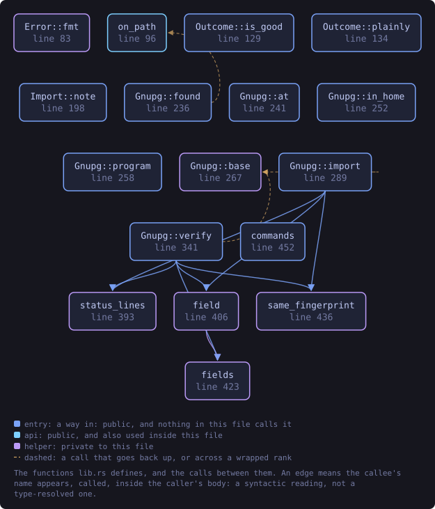

<!-- SPDX-License-Identifier: GPL-3.0-or-later -->
<!-- GENERATED by tools/docs/generate.py from the doc comments in the
     source. Do not edit this file: edit the `//!` and `///` comments in
     the .rs files and run the generator again. CI verifies it with
         python tools/docs/generate.py --check
-->

<p align="center">
  
</p>

# `crates/veilvoice-gnupg/src/lib.rs`

[`veilvoice-gnupg`](../../../crates/veilvoice-gnupg/README.md) &middot; 863 lines &middot; [read the source](https://github.com/tilas01/veilvoice/blob/main/crates/veilvoice-gnupg/src/lib.rs)

## Contents

- [What this does not fix](#what-this-does-not-fix)
- [Why the status lines and not the words](#why-the-status-lines-and-not-the-words)
- [A good signature from some key proves nothing](#a-good-signature-from-some-key-proves-nothing)
- [In plain words](#in-plain-words)
  - [What this file contains](#what-this-file-contains)
  - [What calls what](#what-calls-what)
  - [Items](#items)

Run the GnuPG that is already on this machine.

**Marker 97.** VeilVoice checks a release signature itself, with a key
compiled into the binary, so that somebody with no GnuPG installed is not
stuck. That is a real convenience and it has an obvious circularity: the
program telling you the download is genuine came out of that download.

Until now the answer to that was to print the commands and leave the running
of them to the reader. That is correct, almost nobody does it, and a check
almost nobody runs is a check that is not protecting anybody.

So this runs them. When GnuPG is on the machine, the signature is checked by
**two independent implementations** -- this project's built-in one and
somebody else's -- and both answers are reported. Two implementations
agreeing is worth more than either alone, and two disagreeing is the loudest
thing a verifier can find.

# What this does not fix

Running `gpg` from inside the binary under suspicion does not make the
answer independent of that binary. What it makes independent is the
*implementation*: the packet parsing, the hashing and the signature
arithmetic are somebody else's code. The independent *invocation* is still
the reader typing the commands themselves, and every front end that uses
this goes on printing them for exactly that reason.

# Why the status lines and not the words

`gpg --verify` prints "Good signature from ..." in the reader's own
language. Parsing that would be a verifier whose answer depends on a locale,
and the failure mode is the bad one: an unrecognised string reads as "no
good signature found" in one direction, or matches a translated word in the
other.

`--status-fd` is GnuPG's machine-readable channel and it is not translated.
Measured against GnuPG 2.4.4, which is where these shapes come from rather
than from the manual:

```text
good:      [GNUPG:] GOODSIG <keyid> <uid>
[GNUPG:] VALIDSIG <fingerprint> ...            exit 0
tampered:  [GNUPG:] BADSIG <keyid> <uid>                  exit 1
no key:    [GNUPG:] ERRSIG ... / NO_PUBKEY <keyid>        exit 2
import:    [GNUPG:] IMPORT_OK <flags> <fingerprint>       exit 0
```

# A good signature from *some* key proves nothing

This is the mistake the whole thing exists to avoid making on somebody's
behalf. `gpg --verify` reports success for a valid signature by **any** key
in the keyring, and anybody who can hand you an archive can hand you a
signature by a key they made this morning. So `Gnupg::verify` is given the
fingerprint that is expected and compares `VALIDSIG` against it. A good
signature by a different key is its own outcome, `Outcome::AnotherKey`,
and it is a failure rather than a pass with a note attached.

# In plain words

If you have GnuPG, this uses it, so the answer does not come only from a
program you have just downloaded.

It adds the VeilVoice signing key to your keyring, checks the signature with
your GnuPG, and tells you exactly what your GnuPG said. It also checks that
the signature is by the right key, which is the part that matters and the
part that is easiest to skip.

## What this file contains

863 lines defining **17 functions** (11 public), **6 types** and **0 constants**. Everything below is read out of the source, so it cannot disagree with the code.

**The types it owns.**

- `enum Error` (line 75) -- Something that stopped GnuPG being asked at all.
- `enum Outcome` (line 114) -- What GnuPG made of a signature.
- `struct Run` (line 153) -- One run of GnuPG, and what it said.
- `enum Imported` (line 176) -- Whether the key was already in the keyring.
- `struct Import` (line 185) -- The key, in the keyring.
- `struct Gnupg` (line 232) -- A GnuPG to run, and the keyring to run it against.

**What happens when it runs.** These are the ways in: public, and nothing else in this file calls them, so they are what an outside caller reaches first.

- `Outcome::is_good` (line 132) -- Whether this is the one outcome that means the file is as published.
- `Outcome::plainly` (line 137) -- One line saying what happened, in words a reader can act on.
- `Import::note` (line 201) -- What was done to the reader's keyring, and how to undo it.
- `Gnupg::found` (line 239) -- The GnuPG on PATH, if there is one.
  - reaches: `on_path`
- `Gnupg::at` (line 244) -- A particular GnuPG, using the keyring its owner already has.
- `Gnupg::in_home` (line 255) -- The same GnuPG, against a keyring of its own.
- `Gnupg::program` (line 261) -- Where this GnuPG is.
- `Gnupg::import` (line 292) -- Put a key into the keyring this GnuPG is using.
  - reaches: `base`, `field`, `same_fingerprint`, `status_lines`, `fields`
- `Gnupg::verify` (line 344) -- Check a detached signature with this machine's GnuPG.
  - reaches: `base`, `field`, `fields`, `same_fingerprint`, `status_lines`
- `commands` (line 481) -- The commands a reader can type to get this answer without VeilVoice.

## What calls what

The functions this file defines, and the calls between them. Both
are read out of the source: an edge means the callee's name appears,
called, inside the caller's body. It is a syntactic reading, not a
type-resolved one, so a call made through a trait object or a macro
will not appear.

_Colour key: **entry** -- a way in: public, and nothing in this file calls it; **api** -- public, and also used inside this file; **helper** -- private to this file._

<p align="center">
  
</p>

<details>
<summary>The same graph as Mermaid source</summary>



</details>

```mermaid
%%{init: {"theme":"base","themeVariables":{"background":"#1a1b26","primaryColor":"#1f2335","primaryTextColor":"#c0caf5","primaryBorderColor":"#7aa2f7","secondaryColor":"#16161e","tertiaryColor":"#16161e","lineColor":"#737aa2","textColor":"#c0caf5","mainBkg":"#1f2335","nodeBorder":"#7aa2f7","clusterBkg":"#16161e","clusterBorder":"#2f3549","fontFamily":"ui-monospace, SFMono-Regular, Consolas, monospace","fontSize":"14px"}}}%%
flowchart TD
    n_fmt["Error::fmt<br/>line 83"]
    n_on_path["on_path<br/>line 99"]
    n_is_good(["Outcome::is_good<br/>line 132"])
    n_plainly(["Outcome::plainly<br/>line 137"])
    n_note(["Import::note<br/>line 201"])
    n_found(["Gnupg::found<br/>line 239"])
    n_at(["Gnupg::at<br/>line 244"])
    n_in_home(["Gnupg::in_home<br/>line 255"])
    n_program(["Gnupg::program<br/>line 261"])
    n_base["Gnupg::base<br/>line 270"]
    n_import(["Gnupg::import<br/>line 292"])
    n_verify(["Gnupg::verify<br/>line 344"])
    n_status_lines["status_lines<br/>line 422"]
    n_field["field<br/>line 435"]
    n_fields["fields<br/>line 452"]
    n_same_fingerprint["same_fingerprint<br/>line 465"]
    n_commands(["commands<br/>line 481"])
    n_field --> n_fields
    n_found --> n_on_path
    n_import --> n_base
    n_import --> n_field
    n_import --> n_same_fingerprint
    n_import --> n_status_lines
    n_verify --> n_base
    n_verify --> n_field
    n_verify --> n_fields
    n_verify --> n_same_fingerprint
    n_verify --> n_status_lines
    click n_fmt href "https://github.com/tilas01/veilvoice/blob/main/crates/veilvoice-gnupg/src/lib.rs#L83" "open the source"
    click n_on_path href "https://github.com/tilas01/veilvoice/blob/main/crates/veilvoice-gnupg/src/lib.rs#L99" "open the source"
    click n_is_good href "https://github.com/tilas01/veilvoice/blob/main/crates/veilvoice-gnupg/src/lib.rs#L132" "open the source"
    click n_plainly href "https://github.com/tilas01/veilvoice/blob/main/crates/veilvoice-gnupg/src/lib.rs#L137" "open the source"
    click n_note href "https://github.com/tilas01/veilvoice/blob/main/crates/veilvoice-gnupg/src/lib.rs#L201" "open the source"
    click n_found href "https://github.com/tilas01/veilvoice/blob/main/crates/veilvoice-gnupg/src/lib.rs#L239" "open the source"
    click n_at href "https://github.com/tilas01/veilvoice/blob/main/crates/veilvoice-gnupg/src/lib.rs#L244" "open the source"
    click n_in_home href "https://github.com/tilas01/veilvoice/blob/main/crates/veilvoice-gnupg/src/lib.rs#L255" "open the source"
    click n_program href "https://github.com/tilas01/veilvoice/blob/main/crates/veilvoice-gnupg/src/lib.rs#L261" "open the source"
    click n_base href "https://github.com/tilas01/veilvoice/blob/main/crates/veilvoice-gnupg/src/lib.rs#L270" "open the source"
    click n_import href "https://github.com/tilas01/veilvoice/blob/main/crates/veilvoice-gnupg/src/lib.rs#L292" "open the source"
    click n_verify href "https://github.com/tilas01/veilvoice/blob/main/crates/veilvoice-gnupg/src/lib.rs#L344" "open the source"
    click n_status_lines href "https://github.com/tilas01/veilvoice/blob/main/crates/veilvoice-gnupg/src/lib.rs#L422" "open the source"
    click n_field href "https://github.com/tilas01/veilvoice/blob/main/crates/veilvoice-gnupg/src/lib.rs#L435" "open the source"
    click n_fields href "https://github.com/tilas01/veilvoice/blob/main/crates/veilvoice-gnupg/src/lib.rs#L452" "open the source"
    click n_same_fingerprint href "https://github.com/tilas01/veilvoice/blob/main/crates/veilvoice-gnupg/src/lib.rs#L465" "open the source"
    click n_commands href "https://github.com/tilas01/veilvoice/blob/main/crates/veilvoice-gnupg/src/lib.rs#L481" "open the source"
    classDef entry fill:#1f2335,stroke:#7aa2f7,color:#c0caf5
    class n_is_good,n_plainly,n_note,n_found,n_at,n_in_home,n_program,n_import,n_verify,n_commands entry
    classDef api fill:#1f2335,stroke:#7dcfff,color:#c0caf5
    class n_on_path api
    classDef helper fill:#1f2335,stroke:#bb9af7,color:#c0caf5
    class n_fmt,n_base,n_status_lines,n_field,n_fields,n_same_fingerprint helper
```

## Items

| Item | Line | Documentation |
|---|---:|---|
| `Error` <sub>pub enum</sub> | [75](https://github.com/tilas01/veilvoice/blob/main/crates/veilvoice-gnupg/src/lib.rs#L75) | Something that stopped GnuPG being asked at all. |
| `Error::fmt` <sub>fn</sub> | [83](https://github.com/tilas01/veilvoice/blob/main/crates/veilvoice-gnupg/src/lib.rs#L83) |  |
| `on_path` <sub>pub fn</sub> | [99](https://github.com/tilas01/veilvoice/blob/main/crates/veilvoice-gnupg/src/lib.rs#L99) | Where GnuPG is, if it is on PATH. |
| `Outcome` <sub>pub enum</sub> | [114](https://github.com/tilas01/veilvoice/blob/main/crates/veilvoice-gnupg/src/lib.rs#L114) | What GnuPG made of a signature. |
| `Outcome::is_good` <sub>pub fn</sub> | [132](https://github.com/tilas01/veilvoice/blob/main/crates/veilvoice-gnupg/src/lib.rs#L132) | Whether this is the one outcome that means the file is as published. |
| `Outcome::plainly` <sub>pub fn</sub> | [137](https://github.com/tilas01/veilvoice/blob/main/crates/veilvoice-gnupg/src/lib.rs#L137) | One line saying what happened, in words a reader can act on. |
| `Run` <sub>pub struct</sub> | [153](https://github.com/tilas01/veilvoice/blob/main/crates/veilvoice-gnupg/src/lib.rs#L153) | One run of GnuPG, and what it said. |
| `Imported` <sub>pub enum</sub> | [176](https://github.com/tilas01/veilvoice/blob/main/crates/veilvoice-gnupg/src/lib.rs#L176) | Whether the key was already in the keyring. |
| `Import` <sub>pub struct</sub> | [185](https://github.com/tilas01/veilvoice/blob/main/crates/veilvoice-gnupg/src/lib.rs#L185) | The key, in the keyring. |
| `Import::note` <sub>pub fn</sub> | [201](https://github.com/tilas01/veilvoice/blob/main/crates/veilvoice-gnupg/src/lib.rs#L201) | What was done to the reader's keyring, and how to undo it. |
| `Gnupg` <sub>pub struct</sub> | [232](https://github.com/tilas01/veilvoice/blob/main/crates/veilvoice-gnupg/src/lib.rs#L232) | A GnuPG to run, and the keyring to run it against. |
| `Gnupg::found` <sub>pub fn</sub> | [239](https://github.com/tilas01/veilvoice/blob/main/crates/veilvoice-gnupg/src/lib.rs#L239) | The GnuPG on PATH, if there is one. |
| `Gnupg::at` <sub>pub fn</sub> | [244](https://github.com/tilas01/veilvoice/blob/main/crates/veilvoice-gnupg/src/lib.rs#L244) | A particular GnuPG, using the keyring its owner already has. |
| `Gnupg::in_home` <sub>pub fn</sub> | [255](https://github.com/tilas01/veilvoice/blob/main/crates/veilvoice-gnupg/src/lib.rs#L255) | The same GnuPG, against a keyring of its own. |
| `Gnupg::program` <sub>pub fn</sub> | [261](https://github.com/tilas01/veilvoice/blob/main/crates/veilvoice-gnupg/src/lib.rs#L261) | Where this GnuPG is. |
| `Gnupg::base` <sub>fn</sub> | [270](https://github.com/tilas01/veilvoice/blob/main/crates/veilvoice-gnupg/src/lib.rs#L270) | The arguments every call here shares. |
| `Gnupg::import` <sub>pub fn</sub> | [292](https://github.com/tilas01/veilvoice/blob/main/crates/veilvoice-gnupg/src/lib.rs#L292) | Put a key into the keyring this GnuPG is using. |
| `Gnupg::verify` <sub>pub fn</sub> | [344](https://github.com/tilas01/veilvoice/blob/main/crates/veilvoice-gnupg/src/lib.rs#L344) | Check a detached signature with this machine's GnuPG. |
| `status_lines` <sub>fn</sub> | [422](https://github.com/tilas01/veilvoice/blob/main/crates/veilvoice-gnupg/src/lib.rs#L422) | The GNUPG: lines out of what GnuPG printed, prefix removed. |
| `field` <sub>fn</sub> | [435](https://github.com/tilas01/veilvoice/blob/main/crates/veilvoice-gnupg/src/lib.rs#L435) | The rest of the first status line whose first word is keyword. |
| `fields` <sub>fn</sub> | [452](https://github.com/tilas01/veilvoice/blob/main/crates/veilvoice-gnupg/src/lib.rs#L452) | Every status line whose first word is keyword. |
| `same_fingerprint` <sub>fn</sub> | [465](https://github.com/tilas01/veilvoice/blob/main/crates/veilvoice-gnupg/src/lib.rs#L465) | Whether two fingerprints are the same, ignoring case and spacing. |
| `commands` <sub>pub fn</sub> | [481](https://github.com/tilas01/veilvoice/blob/main/crates/veilvoice-gnupg/src/lib.rs#L481) | The commands a reader can type to get this answer without VeilVoice. |

---

Generated from `crates/veilvoice-gnupg/src/lib.rs`. On the website: [`website/reference/veilvoice-gnupg/lib.html`](../../../website/reference/veilvoice-gnupg/lib.html).

Signing key fingerprint `8101FB3BB28D02FB239E0CDF9CC1C7E7A9B5833A`.
