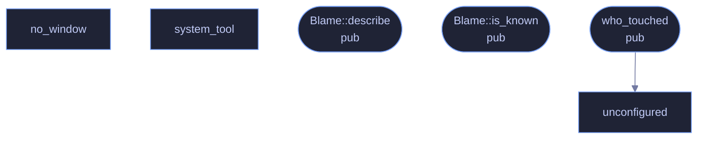

<!-- SPDX-License-Identifier: GPL-3.0-or-later -->
<!-- GENERATED by tools/docs/generate.py from the doc comments in the
     source. Do not edit this file: edit the `//!` and `///` comments in
     the .rs files and run the generator again. CI verifies it with
         python tools/docs/generate.py --check
-->

  

# `crates/veilvoice-guard/src/blame.rs`

[`veilvoice-guard`](../../../crates/veilvoice-guard/README.md) &middot; 401 lines &middot; [read the source](https://github.com/tilas01/veilvoice/blob/main/crates/veilvoice-guard/src/blame.rs)

## Contents

- [Read this before relying on it](#read-this-before-relying-on-it)
- [Where an answer can come from](#where-an-answer-can-come-from)
  - [What calls what](#what-calls-what)
  - [Items](#items)

Best-effort attribution: which program changed a file.

# Read this before relying on it

**Most of the time this cannot answer, and says so.** Neither Windows nor
Linux records who wrote to a file unless auditing has been switched on for
that path in advance, and on a normal desktop it has not been. An
unprivileged program cannot switch it on either.

So the honest design is a function that returns `Blame::Unknown` with a
reason, and tells the user what would have to be configured for a real
answer. A plausible guess would be worse than nothing here: naming the wrong
program to somebody worried about surveillance is not a small error.

# Where an answer can come from

- **Linux** -- the kernel audit subsystem. With a watch in place
(`auditctl -w <path> -p wa -k veilvoice`), `ausearch` reports the syscall,
the pid and the executable name for every write. Reading those records
usually needs root as well.
- **Windows** -- object access auditing. With a SACL on the file and the
"Audit File System" policy enabled, Security event 4663 records the
process that opened it for write. `wevtutil` can query that log, though
reading the Security log needs elevation.

Both are checked for, neither is configured by this crate, and the absence
of either is reported rather than hidden. Setting them up is a deliberate
act by an administrator, and pretending otherwise would misrepresent what a
clean report means.

## What calls what

The functions this file defines, and the calls between them. Both
are read out of the source: an edge means the callee's name appears,
called, inside the caller's body. It is a syntactic reading, not a
type-resolved one, so a call made through a trait object or a macro
will not appear.

## Items

| Item | Line | Documentation |
|---|---:|---|
| `no_window` fn | [48](https://github.com/tilas01/veilvoice/blob/main/crates/veilvoice-guard/src/blame.rs#L48) | Spawn without a console window. |
| `system_tool` fn | [75](https://github.com/tilas01/veilvoice/blob/main/crates/veilvoice-guard/src/blame.rs#L75) | Resolve a system tool to an absolute path, rather than letting the operating system search for it. |
| `Blame` pub enum | [90](https://github.com/tilas01/veilvoice/blob/main/crates/veilvoice-guard/src/blame.rs#L90) | What, if anything, is known about who changed a file. |
| `Blame::describe` pub fn | [111](https://github.com/tilas01/veilvoice/blob/main/crates/veilvoice-guard/src/blame.rs#L111) | A single line for a terminal, an alert or a log. |
| `Blame::is_known` pub fn | [122](https://github.com/tilas01/veilvoice/blob/main/crates/veilvoice-guard/src/blame.rs#L122) | Whether an actual name was found. |
| `unconfigured` fn | [128](https://github.com/tilas01/veilvoice/blob/main/crates/veilvoice-guard/src/blame.rs#L128) | Build the "nobody configured auditing" answer for this platform. |
| `who_touched` pub fn | [147](https://github.com/tilas01/veilvoice/blob/main/crates/veilvoice-guard/src/blame.rs#L147) | Try to name the program that last wrote to path. |
| `linux` mod | [164](https://github.com/tilas01/veilvoice/blob/main/crates/veilvoice-guard/src/blame.rs#L164) |  |
| `windows` mod | [242](https://github.com/tilas01/veilvoice/blob/main/crates/veilvoice-guard/src/blame.rs#L242) |  |

---

Generated from `crates/veilvoice-guard/src/blame.rs`. On the website: [`website/reference/veilvoice-guard/blame.html`](../../../website/reference/veilvoice-guard/blame.html).

Signing key fingerprint `8101FB3BB28D02FB239E0CDF9CC1C7E7A9B5833A`.
