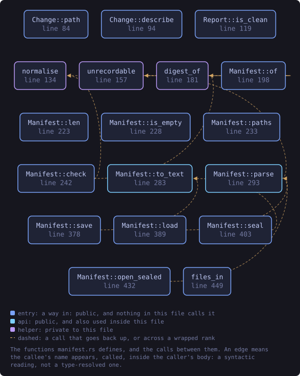

<!-- SPDX-License-Identifier: GPL-3.0-or-later -->
<!-- GENERATED by tools/docs/generate.py from the doc comments in the
     source. Do not edit this file: edit the `//!` and `///` comments in
     the .rs files and run the generator again. CI verifies it with
         python tools/docs/generate.py --check
-->

<p align="center">
  
</p>

# `crates/veilvoice-guard/src/manifest.rs`

[`veilvoice-guard`](../../../crates/veilvoice-guard/README.md) &middot; 730 lines &middot; [read the source](https://github.com/tilas01/veilvoice/blob/main/crates/veilvoice-guard/src/manifest.rs)

## Contents

- [Format](#format)
- [In plain words](#in-plain-words)
  - [What this file contains](#what-this-file-contains)
  - [What calls what](#what-calls-what)
  - [Items](#items)

The integrity manifest: what the files were, and what they are now.

# Format

Deliberately a text format, one record per line:

```text
VEILGUARD1
<sha256 hex>  <size>  <path>
...
```

Text rather than a packed binary layout because the point of the file is to
be checkable. Someone who suspects tampering can read it with `cat` and
compare a digest by hand with `sha256sum`, without this crate and without
trusting it. A binary format would have been marginally smaller and would
have made the honest response to "prove it" be "run my tool again".

Paths are stored with forward slashes so a manifest written on Windows still
reads on Linux, and are rejected if they contain a newline -- otherwise a
filename could forge a record.

# In plain words

The written record of what VeilVoice's files were, so a later check can tell
whether they still are.

It is plain text on purpose: you can read it, diff it and keep a copy
somewhere else. A record you cannot inspect is one you have to take on trust,
which rather defeats the point of having it.

## What this file contains

730 lines defining **18 functions** (15 public), **4 types** and **1 constant**. Everything below is read out of the source, so it cannot disagree with the code.

**The types it owns.**

- `struct Entry` (line 43) -- One recorded file.
- `enum Change` (line 52) -- How a file differs from its record.
- `struct Report` (line 110) -- The result of checking a manifest against the disk.
- `struct Manifest` (line 126) -- A record of a set of files.

**What happens when it runs.** These are the ways in: public, and nothing else in this file calls them, so they are what an outside caller reaches first.

- `Change::path` (line 84) -- The path this change concerns.
- `Change::describe` (line 94) -- A single line for a terminal or a log.
- `Report::is_clean` (line 119) -- Whether anything at all differs.
- `Manifest::of` (line 190) -- Record every readable file in paths.
  - reaches: `digest_of`, `normalise`, `unrecordable`
- `Manifest::len` (line 215) -- How many files are recorded.
- `Manifest::is_empty` (line 220) -- Whether nothing is recorded.
- `Manifest::paths` (line 225) -- The recorded paths, in order.
- `Manifest::check` (line 234) -- Compare the record against what is on disk now.
  - reaches: `digest_of`, `normalise`
- `Manifest::save` (line 370) -- Write the manifest to path in the clear.
  - reaches: `to_text`
- `Manifest::load` (line 381) -- Read a manifest written by Manifest::save.
  - reaches: `parse`, `unrecordable`
- `Manifest::seal` (line 395) -- Seal the manifest under a passphrase.
  - reaches: `to_text`
- `Manifest::open_sealed` (line 424) -- Open a manifest sealed by Manifest::seal.
  - reaches: `parse`, `unrecordable`
- `files_in` (line 441) -- Every file directly inside dir, for use as check's extra argument.

## What calls what

The functions this file defines, and the calls between them. Both
are read out of the source: an edge means the callee's name appears,
called, inside the caller's body. It is a syntactic reading, not a
type-resolved one, so a call made through a trait object or a macro
will not appear.

_Colour key: **entry** -- a way in: public, and nothing in this file calls it; **api** -- public, and also used inside this file; **helper** -- private to this file._

<p align="center">
  
</p>

<details>
<summary>The same graph as Mermaid source</summary>



</details>

```mermaid
%%{init: {"theme":"base","themeVariables":{"background":"#1a1b26","primaryColor":"#1f2335","primaryTextColor":"#c0caf5","primaryBorderColor":"#7aa2f7","secondaryColor":"#16161e","tertiaryColor":"#16161e","lineColor":"#737aa2","textColor":"#c0caf5","mainBkg":"#1f2335","nodeBorder":"#7aa2f7","clusterBkg":"#16161e","clusterBorder":"#2f3549","fontFamily":"ui-monospace, SFMono-Regular, Consolas, monospace","fontSize":"14px"}}}%%
flowchart TD
    n_path(["Change::path<br/>line 84"])
    n_describe(["Change::describe<br/>line 94"])
    n_is_clean(["Report::is_clean<br/>line 119"])
    n_normalise["normalise<br/>line 134"]
    n_unrecordable["unrecordable<br/>line 157"]
    n_digest_of["digest_of<br/>line 173"]
    n_of(["Manifest::of<br/>line 190"])
    n_len(["Manifest::len<br/>line 215"])
    n_is_empty(["Manifest::is_empty<br/>line 220"])
    n_paths(["Manifest::paths<br/>line 225"])
    n_check(["Manifest::check<br/>line 234"])
    n_to_text["Manifest::to_text<br/>line 275"]
    n_parse["Manifest::parse<br/>line 285"]
    n_save(["Manifest::save<br/>line 370"])
    n_load(["Manifest::load<br/>line 381"])
    n_seal(["Manifest::seal<br/>line 395"])
    n_open_sealed(["Manifest::open_sealed<br/>line 424"])
    n_files_in(["files_in<br/>line 441"])
    n_check --> n_digest_of
    n_check --> n_normalise
    n_load --> n_parse
    n_of --> n_digest_of
    n_of --> n_normalise
    n_of --> n_unrecordable
    n_open_sealed --> n_parse
    n_parse --> n_unrecordable
    n_save --> n_to_text
    n_seal --> n_to_text
    click n_path href "https://github.com/tilas01/veilvoice/blob/main/crates/veilvoice-guard/src/manifest.rs#L84" "open the source"
    click n_describe href "https://github.com/tilas01/veilvoice/blob/main/crates/veilvoice-guard/src/manifest.rs#L94" "open the source"
    click n_is_clean href "https://github.com/tilas01/veilvoice/blob/main/crates/veilvoice-guard/src/manifest.rs#L119" "open the source"
    click n_normalise href "https://github.com/tilas01/veilvoice/blob/main/crates/veilvoice-guard/src/manifest.rs#L134" "open the source"
    click n_unrecordable href "https://github.com/tilas01/veilvoice/blob/main/crates/veilvoice-guard/src/manifest.rs#L157" "open the source"
    click n_digest_of href "https://github.com/tilas01/veilvoice/blob/main/crates/veilvoice-guard/src/manifest.rs#L173" "open the source"
    click n_of href "https://github.com/tilas01/veilvoice/blob/main/crates/veilvoice-guard/src/manifest.rs#L190" "open the source"
    click n_len href "https://github.com/tilas01/veilvoice/blob/main/crates/veilvoice-guard/src/manifest.rs#L215" "open the source"
    click n_is_empty href "https://github.com/tilas01/veilvoice/blob/main/crates/veilvoice-guard/src/manifest.rs#L220" "open the source"
    click n_paths href "https://github.com/tilas01/veilvoice/blob/main/crates/veilvoice-guard/src/manifest.rs#L225" "open the source"
    click n_check href "https://github.com/tilas01/veilvoice/blob/main/crates/veilvoice-guard/src/manifest.rs#L234" "open the source"
    click n_to_text href "https://github.com/tilas01/veilvoice/blob/main/crates/veilvoice-guard/src/manifest.rs#L275" "open the source"
    click n_parse href "https://github.com/tilas01/veilvoice/blob/main/crates/veilvoice-guard/src/manifest.rs#L285" "open the source"
    click n_save href "https://github.com/tilas01/veilvoice/blob/main/crates/veilvoice-guard/src/manifest.rs#L370" "open the source"
    click n_load href "https://github.com/tilas01/veilvoice/blob/main/crates/veilvoice-guard/src/manifest.rs#L381" "open the source"
    click n_seal href "https://github.com/tilas01/veilvoice/blob/main/crates/veilvoice-guard/src/manifest.rs#L395" "open the source"
    click n_open_sealed href "https://github.com/tilas01/veilvoice/blob/main/crates/veilvoice-guard/src/manifest.rs#L424" "open the source"
    click n_files_in href "https://github.com/tilas01/veilvoice/blob/main/crates/veilvoice-guard/src/manifest.rs#L441" "open the source"
    classDef entry fill:#1f2335,stroke:#7aa2f7,color:#c0caf5
    class n_path,n_describe,n_is_clean,n_of,n_len,n_is_empty,n_paths,n_check,n_save,n_load,n_seal,n_open_sealed,n_files_in entry
    classDef api fill:#1f2335,stroke:#7dcfff,color:#c0caf5
    class n_to_text,n_parse api
    classDef helper fill:#1f2335,stroke:#bb9af7,color:#c0caf5
    class n_normalise,n_unrecordable,n_digest_of helper
```

## Items

| Item | Line | Documentation |
|---|---:|---|
| `MAGIC` <sub>pub(crate) const</sub> | [39](https://github.com/tilas01/veilvoice/blob/main/crates/veilvoice-guard/src/manifest.rs#L39) | Magic first line. |
| `Entry` <sub>pub struct</sub> | [43](https://github.com/tilas01/veilvoice/blob/main/crates/veilvoice-guard/src/manifest.rs#L43) | One recorded file. |
| `Change` <sub>pub enum</sub> | [52](https://github.com/tilas01/veilvoice/blob/main/crates/veilvoice-guard/src/manifest.rs#L52) | How a file differs from its record. |
| `Change::path` <sub>pub fn</sub> | [84](https://github.com/tilas01/veilvoice/blob/main/crates/veilvoice-guard/src/manifest.rs#L84) | The path this change concerns. |
| `Change::describe` <sub>pub fn</sub> | [94](https://github.com/tilas01/veilvoice/blob/main/crates/veilvoice-guard/src/manifest.rs#L94) | A single line for a terminal or a log. |
| `Report` <sub>pub struct</sub> | [110](https://github.com/tilas01/veilvoice/blob/main/crates/veilvoice-guard/src/manifest.rs#L110) | The result of checking a manifest against the disk. |
| `Report::is_clean` <sub>pub fn</sub> | [119](https://github.com/tilas01/veilvoice/blob/main/crates/veilvoice-guard/src/manifest.rs#L119) | Whether anything at all differs. |
| `Manifest` <sub>pub struct</sub> | [126](https://github.com/tilas01/veilvoice/blob/main/crates/veilvoice-guard/src/manifest.rs#L126) | A record of a set of files. |
| `normalise` <sub>fn</sub> | [134](https://github.com/tilas01/veilvoice/blob/main/crates/veilvoice-guard/src/manifest.rs#L134) | Normalise a path for storage: forward slashes, no leading ./. |
| `unrecordable` <sub>fn</sub> | [157](https://github.com/tilas01/veilvoice/blob/main/crates/veilvoice-guard/src/manifest.rs#L157) | Why this path cannot go in a manifest, if it cannot. |
| `digest_of` <sub>fn</sub> | [173](https://github.com/tilas01/veilvoice/blob/main/crates/veilvoice-guard/src/manifest.rs#L173) |  |
| `Manifest::of` <sub>pub fn</sub> | [190](https://github.com/tilas01/veilvoice/blob/main/crates/veilvoice-guard/src/manifest.rs#L190) | Record every readable file in paths. |
| `Manifest::len` <sub>pub fn</sub> | [215](https://github.com/tilas01/veilvoice/blob/main/crates/veilvoice-guard/src/manifest.rs#L215) | How many files are recorded. |
| `Manifest::is_empty` <sub>pub fn</sub> | [220](https://github.com/tilas01/veilvoice/blob/main/crates/veilvoice-guard/src/manifest.rs#L220) | Whether nothing is recorded. |
| `Manifest::paths` <sub>pub fn</sub> | [225](https://github.com/tilas01/veilvoice/blob/main/crates/veilvoice-guard/src/manifest.rs#L225) | The recorded paths, in order. |
| `Manifest::check` <sub>pub fn</sub> | [234](https://github.com/tilas01/veilvoice/blob/main/crates/veilvoice-guard/src/manifest.rs#L234) | Compare the record against what is on disk now. |
| `Manifest::to_text` <sub>pub fn</sub> | [275](https://github.com/tilas01/veilvoice/blob/main/crates/veilvoice-guard/src/manifest.rs#L275) | Serialise to the text format described at the top of this module. |
| `Manifest::parse` <sub>pub fn</sub> | [285](https://github.com/tilas01/veilvoice/blob/main/crates/veilvoice-guard/src/manifest.rs#L285) | Parse the text format. |
| `Manifest::save` <sub>pub fn</sub> | [370](https://github.com/tilas01/veilvoice/blob/main/crates/veilvoice-guard/src/manifest.rs#L370) | Write the manifest to path in the clear. |
| `Manifest::load` <sub>pub fn</sub> | [381](https://github.com/tilas01/veilvoice/blob/main/crates/veilvoice-guard/src/manifest.rs#L381) | Read a manifest written by Manifest::save. |
| `Manifest::seal` <sub>pub fn</sub> | [395](https://github.com/tilas01/veilvoice/blob/main/crates/veilvoice-guard/src/manifest.rs#L395) | Seal the manifest under a passphrase. |
| `Manifest::open_sealed` <sub>pub fn</sub> | [424](https://github.com/tilas01/veilvoice/blob/main/crates/veilvoice-guard/src/manifest.rs#L424) | Open a manifest sealed by Manifest::seal. |
| `files_in` <sub>pub fn</sub> | [441](https://github.com/tilas01/veilvoice/blob/main/crates/veilvoice-guard/src/manifest.rs#L441) | Every file directly inside dir, for use as check's extra argument. |

---

Generated from `crates/veilvoice-guard/src/manifest.rs`. On the website: [`website/reference/veilvoice-guard/manifest.html`](../../../website/reference/veilvoice-guard/manifest.html).

Signing key fingerprint `8101FB3BB28D02FB239E0CDF9CC1C7E7A9B5833A`.
