<!-- SPDX-License-Identifier: CC-BY-NC-SA-4.0 -->
<!-- GENERATED by tools/docs/generate.py from the doc comments in the
     source. Do not edit this file: edit the `//!` and `///` comments in
     the .rs files and run the generator again. CI verifies it with
         python tools/docs/generate.py --check
-->

<p align="center">
  
</p>

# `crates/veilvoice-guard/src/manifest.rs`

[`veilvoice-guard`](../../../crates/veilvoice-guard/README.md) &middot; 539 lines &middot; [read the source](https://github.com/tilas01/veilvoice/blob/main/crates/veilvoice-guard/src/manifest.rs)

## Contents

- [Format](#format)
  - [What calls what](#what-calls-what)
  - [Items](#items)

The integrity manifest: what the files were, and what they are now.

# Format

Deliberately a text format, one record per line:

```text
VEILGUARD1
<sha256 hex>  <size>  <path>
...
```

Text rather than a packed binary layout because the point of the file is to
be checkable. Someone who suspects tampering can read it with `cat` and
compare a digest by hand with `sha256sum`, without this crate and without
trusting it. A binary format would have been marginally smaller and would
have made the honest response to "prove it" be "run my tool again".

Paths are stored with forward slashes so a manifest written on Windows still
reads on Linux, and are rejected if they contain a newline -- otherwise a
filename could forge a record.

## What calls what

The functions this file defines, and the calls between them. Both
are read out of the source: an edge means the callee's name appears,
called, inside the caller's body. It is a syntactic reading, not a
type-resolved one, so a call made through a trait object or a macro
will not appear.

```mermaid
%%{init: {"theme":"base","themeVariables":{"background":"#1a1b26","primaryColor":"#1f2335","primaryTextColor":"#c0caf5","primaryBorderColor":"#7aa2f7","secondaryColor":"#16161e","tertiaryColor":"#16161e","lineColor":"#737aa2","textColor":"#c0caf5","mainBkg":"#1f2335","nodeBorder":"#7aa2f7","clusterBkg":"#16161e","clusterBorder":"#2f3549","fontFamily":"ui-monospace, SFMono-Regular, Consolas, monospace","fontSize":"14px"}}}%%
flowchart TD
    n_path(["Change::path<br/>pub"])
    n_describe(["Change::describe<br/>pub"])
    n_is_clean(["Report::is_clean<br/>pub"])
    n_normalise["normalise"]
    n_digest_of["digest_of"]
    n_of(["Manifest::of<br/>pub"])
    n_len(["Manifest::len<br/>pub"])
    n_is_empty(["Manifest::is_empty<br/>pub"])
    n_paths(["Manifest::paths<br/>pub"])
    n_check(["Manifest::check<br/>pub"])
    n_to_text(["Manifest::to_text<br/>pub"])
    n_parse(["Manifest::parse<br/>pub"])
    n_save(["Manifest::save<br/>pub"])
    n_load(["Manifest::load<br/>pub"])
    n_seal(["Manifest::seal<br/>pub"])
    n_open_sealed(["Manifest::open_sealed<br/>pub"])
    n_files_in(["files_in<br/>pub"])
    n_check --> n_digest_of
    n_check --> n_normalise
    n_load --> n_parse
    n_of --> n_digest_of
    n_of --> n_normalise
    n_open_sealed --> n_parse
    n_save --> n_to_text
    n_seal --> n_to_text
```



## Items

| Item | Line | Documentation |
|---|---:|---|
| `MAGIC` <sub>pub(crate) const</sub> | [30](https://github.com/tilas01/veilvoice/blob/main/crates/veilvoice-guard/src/manifest.rs#L30) | Magic first line. |
| `Entry` <sub>pub struct</sub> | [34](https://github.com/tilas01/veilvoice/blob/main/crates/veilvoice-guard/src/manifest.rs#L34) | One recorded file. |
| `Change` <sub>pub enum</sub> | [43](https://github.com/tilas01/veilvoice/blob/main/crates/veilvoice-guard/src/manifest.rs#L43) | How a file differs from its record. |
| `Change::path` <sub>pub fn</sub> | [75](https://github.com/tilas01/veilvoice/blob/main/crates/veilvoice-guard/src/manifest.rs#L75) | The path this change concerns. |
| `Change::describe` <sub>pub fn</sub> | [85](https://github.com/tilas01/veilvoice/blob/main/crates/veilvoice-guard/src/manifest.rs#L85) | A single line for a terminal or a log. |
| `Report` <sub>pub struct</sub> | [101](https://github.com/tilas01/veilvoice/blob/main/crates/veilvoice-guard/src/manifest.rs#L101) | The result of checking a manifest against the disk. |
| `Report::is_clean` <sub>pub fn</sub> | [110](https://github.com/tilas01/veilvoice/blob/main/crates/veilvoice-guard/src/manifest.rs#L110) | Whether anything at all differs. |
| `Manifest` <sub>pub struct</sub> | [117](https://github.com/tilas01/veilvoice/blob/main/crates/veilvoice-guard/src/manifest.rs#L117) | A record of a set of files. |
| `normalise` <sub>fn</sub> | [125](https://github.com/tilas01/veilvoice/blob/main/crates/veilvoice-guard/src/manifest.rs#L125) | Normalise a path for storage: forward slashes, no leading ./. |
| `digest_of` <sub>fn</sub> | [129](https://github.com/tilas01/veilvoice/blob/main/crates/veilvoice-guard/src/manifest.rs#L129) |  |
| `Manifest::of` <sub>pub fn</sub> | [146](https://github.com/tilas01/veilvoice/blob/main/crates/veilvoice-guard/src/manifest.rs#L146) | Record every readable file in paths. |
| `Manifest::len` <sub>pub fn</sub> | [171](https://github.com/tilas01/veilvoice/blob/main/crates/veilvoice-guard/src/manifest.rs#L171) | How many files are recorded. |
| `Manifest::is_empty` <sub>pub fn</sub> | [176](https://github.com/tilas01/veilvoice/blob/main/crates/veilvoice-guard/src/manifest.rs#L176) | Whether nothing is recorded. |
| `Manifest::paths` <sub>pub fn</sub> | [181](https://github.com/tilas01/veilvoice/blob/main/crates/veilvoice-guard/src/manifest.rs#L181) | The recorded paths, in order. |
| `Manifest::check` <sub>pub fn</sub> | [190](https://github.com/tilas01/veilvoice/blob/main/crates/veilvoice-guard/src/manifest.rs#L190) | Compare the record against what is on disk now. |
| `Manifest::to_text` <sub>pub fn</sub> | [231](https://github.com/tilas01/veilvoice/blob/main/crates/veilvoice-guard/src/manifest.rs#L231) | Serialise to the text format described at the top of this module. |
| `Manifest::parse` <sub>pub fn</sub> | [241](https://github.com/tilas01/veilvoice/blob/main/crates/veilvoice-guard/src/manifest.rs#L241) | Parse the text format. |
| `Manifest::save` <sub>pub fn</sub> | [297](https://github.com/tilas01/veilvoice/blob/main/crates/veilvoice-guard/src/manifest.rs#L297) | Write the manifest to path in the clear. |
| `Manifest::load` <sub>pub fn</sub> | [308](https://github.com/tilas01/veilvoice/blob/main/crates/veilvoice-guard/src/manifest.rs#L308) | Read a manifest written by Manifest::save. |
| `Manifest::seal` <sub>pub fn</sub> | [322](https://github.com/tilas01/veilvoice/blob/main/crates/veilvoice-guard/src/manifest.rs#L322) | Seal the manifest under a passphrase. |
| `Manifest::open_sealed` <sub>pub fn</sub> | [331](https://github.com/tilas01/veilvoice/blob/main/crates/veilvoice-guard/src/manifest.rs#L331) | Open a manifest sealed by Manifest::seal. |
| `files_in` <sub>pub fn</sub> | [344](https://github.com/tilas01/veilvoice/blob/main/crates/veilvoice-guard/src/manifest.rs#L344) | Every file directly inside dir, for use as check's extra argument. |

---

Generated from `crates/veilvoice-guard/src/manifest.rs`. On the website: [`website/reference/veilvoice-guard/manifest.html`](../../../website/reference/veilvoice-guard/manifest.html).

Signing key fingerprint `8101FB3BB28D02FB239E0CDF9CC1C7E7A9B5833A`.
