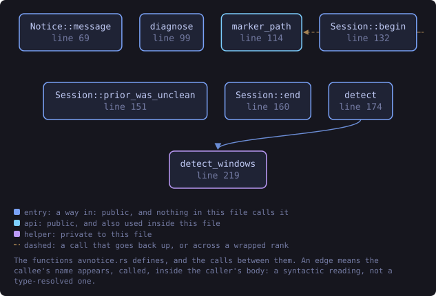

<!-- SPDX-License-Identifier: GPL-3.0-or-later -->
<!-- GENERATED by tools/docs/generate.py from the doc comments in the
     source. Do not edit this file: edit the `//!` and `///` comments in
     the .rs files and run the generator again. CI verifies it with
         python tools/docs/generate.py --check
-->

  

# `crates/veilvoice-gui/src/avnotice.rs`

[`veilvoice-gui`](../../../crates/veilvoice-gui/README.md) &middot; 298 lines &middot; [read the source](https://github.com/tilas01/veilvoice/blob/main/crates/veilvoice-gui/src/avnotice.rs)

## Contents

- [The problem this is for](#the-problem-this-is-for)
- [What this does, and what it does not](#what-this-does-and-what-it-does-not)
- [Why the decision is a pure function](#why-the-decision-is-a-pure-function)
  - [What this file contains](#what-this-file-contains)
  - [What calls what](#what-calls-what)
  - [Items](#items)

Noticing when antivirus software has closed VeilVoice, and saying so kindly.

# The problem this is for

A newly released application that few people have run yet has, in the
language of Windows antivirus, "low reputation". A low-reputation program
that reads the microphone and writes encrypted files is exactly the shape a
heuristic scanner is tuned to be suspicious of, and some of them will close
it -- a false positive, but indistinguishable from a crash to the person
sitting in front of it.

VeilVoice is offline, reproducible and signed, so a user *can* establish
that it is what it says it is. But that is cold comfort if the window just
vanished and they have no idea why.

# What this does, and what it does not

It does **not** try to evade anything, hide from anything, or stop an
antivirus doing its job. That would be both wrong and futile. It does the
opposite: it helps the user understand what happened so they can make their
own decision.

On a clean exit VeilVoice removes a small marker file. So on the next
launch, a marker still present means the previous run ended without getting
to its own shutdown -- and if VeilVoice had crashed, it would have written a
crash report on the way down (see `crate::crashlog`). A marker present
with no crash report is the signature of the process being terminated from
outside.

When that has happened *and* a known antivirus product is on the machine,
the next launch shows a plain notice: which product was found, that a
low-reputation app is sometimes stopped by mistake, that they would normally
have seen an alert from that product, and that adding an exclusion is worth
doing **only** if they are actually seeing the problem. Nothing is changed
on the system and nothing is suppressed; it is one paragraph of context.

# Why the decision is a pure function

Whether to show the notice depends on three facts -- was the last exit
unclean, was there a crash report, is an antivirus present -- and getting
that logic wrong means either crying wolf or staying silent when it would
have helped. `diagnose` takes those three as arguments so every branch is
tested from any machine, and the platform probing that gathers them is kept
separate and thin.

## What this file contains

298 lines defining **8 functions** (7 public), **3 types** and **1 constant**. Everything below is read out of the source, so it cannot disagree with the code.

**The types it owns.**

- `struct Product` (line 51) -- An antivirus product recognised on this machine.
- `struct Notice` (line 58) -- The notice to put in front of the user, once.
- `struct Session` (line 123) -- A session's clean-shutdown marker.

**What happens when it runs.** These are the ways in: public, and nothing else in this file calls them, so they are what an outside caller reaches first.

- `Notice::message` (line 69) -- The message, assembled from the products found.
- `diagnose` (line 99) -- Decide whether to show the notice.
- `Session::begin` (line 132) -- Begin a session: note whether the last one ended cleanly, then claim the marker for this one.
  - reaches: `marker_path`
- `Session::prior_was_unclean` (line 151) -- Whether the previous session ended without a clean shutdown.
- `Session::end` (line 160) -- End the session cleanly, removing the marker.
- `detect` (line 174) -- Look for antivirus products on this machine.
  - reaches: `detect_windows`

## What calls what

The functions this file defines, and the calls between them. Both
are read out of the source: an edge means the callee's name appears,
called, inside the caller's body. It is a syntactic reading, not a
type-resolved one, so a call made through a trait object or a macro
will not appear.

_Colour key: **entry** -- a way in: public, and nothing in this file calls it; **api** -- public, and also used inside this file; **helper** -- private to this file._

  

The same graph as Mermaid source

```mermaid
%%{init: {"theme":"base","themeVariables":{"background":"#1a1b26","primaryColor":"#1f2335","primaryTextColor":"#c0caf5","primaryBorderColor":"#7aa2f7","secondaryColor":"#16161e","tertiaryColor":"#16161e","lineColor":"#737aa2","textColor":"#c0caf5","mainBkg":"#1f2335","nodeBorder":"#7aa2f7","clusterBkg":"#16161e","clusterBorder":"#2f3549","fontFamily":"ui-monospace, SFMono-Regular, Consolas, monospace","fontSize":"14px"}}}%%
flowchart TD
    n_message(["Notice::message<br/>line 69"])
    n_diagnose(["diagnose<br/>line 99"])
    n_marker_path["marker_path<br/>line 114"]
    n_begin(["Session::begin<br/>line 132"])
    n_prior_was_unclean(["Session::prior_was_unclean<br/>line 151"])
    n_end(["Session::end<br/>line 160"])
    n_detect(["detect<br/>line 174"])
    n_detect_windows["detect_windows<br/>line 212"]
    n_begin --> n_marker_path
    n_detect --> n_detect_windows
    click n_message href "https://github.com/tilas01/veilvoice/blob/main/crates/veilvoice-gui/src/avnotice.rs#L69" "open the source"
    click n_diagnose href "https://github.com/tilas01/veilvoice/blob/main/crates/veilvoice-gui/src/avnotice.rs#L99" "open the source"
    click n_marker_path href "https://github.com/tilas01/veilvoice/blob/main/crates/veilvoice-gui/src/avnotice.rs#L114" "open the source"
    click n_begin href "https://github.com/tilas01/veilvoice/blob/main/crates/veilvoice-gui/src/avnotice.rs#L132" "open the source"
    click n_prior_was_unclean href "https://github.com/tilas01/veilvoice/blob/main/crates/veilvoice-gui/src/avnotice.rs#L151" "open the source"
    click n_end href "https://github.com/tilas01/veilvoice/blob/main/crates/veilvoice-gui/src/avnotice.rs#L160" "open the source"
    click n_detect href "https://github.com/tilas01/veilvoice/blob/main/crates/veilvoice-gui/src/avnotice.rs#L174" "open the source"
    click n_detect_windows href "https://github.com/tilas01/veilvoice/blob/main/crates/veilvoice-gui/src/avnotice.rs#L212" "open the source"
    classDef entry fill:#1f2335,stroke:#7aa2f7,color:#c0caf5
    class n_message,n_diagnose,n_begin,n_prior_was_unclean,n_end,n_detect entry
    classDef api fill:#1f2335,stroke:#7dcfff,color:#c0caf5
    class n_marker_path api
    classDef helper fill:#1f2335,stroke:#bb9af7,color:#c0caf5
    class n_detect_windows helper
```

## Items

| Item | Line | Documentation |
|---|---:|---|
| `Product` pub struct | [51](https://github.com/tilas01/veilvoice/blob/main/crates/veilvoice-gui/src/avnotice.rs#L51) | An antivirus product recognised on this machine. |
| `Notice` pub struct | [58](https://github.com/tilas01/veilvoice/blob/main/crates/veilvoice-gui/src/avnotice.rs#L58) | The notice to put in front of the user, once. |
| `Notice::message` pub fn | [69](https://github.com/tilas01/veilvoice/blob/main/crates/veilvoice-gui/src/avnotice.rs#L69) | The message, assembled from the products found. |
| `diagnose` pub fn | [99](https://github.com/tilas01/veilvoice/blob/main/crates/veilvoice-gui/src/avnotice.rs#L99) | Decide whether to show the notice. |
| `marker_path` pub fn | [114](https://github.com/tilas01/veilvoice/blob/main/crates/veilvoice-gui/src/avnotice.rs#L114) | The marker whose presence on startup means the last run did not exit cleanly. |
| `Session` pub struct | [123](https://github.com/tilas01/veilvoice/blob/main/crates/veilvoice-gui/src/avnotice.rs#L123) | A session's clean-shutdown marker. |
| `Session::begin` pub fn | [132](https://github.com/tilas01/veilvoice/blob/main/crates/veilvoice-gui/src/avnotice.rs#L132) | Begin a session: note whether the last one ended cleanly, then claim the marker for this one. |
| `Session::prior_was_unclean` pub fn | [151](https://github.com/tilas01/veilvoice/blob/main/crates/veilvoice-gui/src/avnotice.rs#L151) | Whether the previous session ended without a clean shutdown. |
| `Session::end` pub fn | [160](https://github.com/tilas01/veilvoice/blob/main/crates/veilvoice-gui/src/avnotice.rs#L160) | End the session cleanly, removing the marker. |
| `detect` pub fn | [174](https://github.com/tilas01/veilvoice/blob/main/crates/veilvoice-gui/src/avnotice.rs#L174) | Look for antivirus products on this machine. |
| `WINDOWS_PRODUCTS` const | [192](https://github.com/tilas01/veilvoice/blob/main/crates/veilvoice-gui/src/avnotice.rs#L192) | Known products, and a path whose presence is good evidence of them. |
| `detect_windows` fn | [212](https://github.com/tilas01/veilvoice/blob/main/crates/veilvoice-gui/src/avnotice.rs#L212) |  |

---

Generated from `crates/veilvoice-gui/src/avnotice.rs`. On the website: [`website/reference/veilvoice-gui/avnotice.html`](../../../website/reference/veilvoice-gui/avnotice.html).

Signing key fingerprint `8101FB3BB28D02FB239E0CDF9CC1C7E7A9B5833A`.
