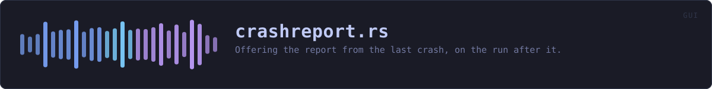
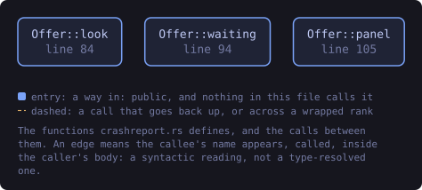
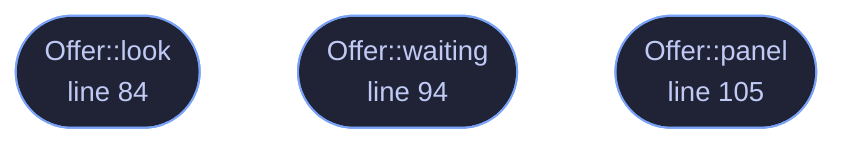

<!-- SPDX-License-Identifier: GPL-3.0-or-later -->
<!-- GENERATED by tools/docs/generate.py from the doc comments in the
     source. Do not edit this file: edit the `//!` and `///` comments in
     the .rs files and run the generator again. CI verifies it with
         python tools/docs/generate.py --check
-->

  

# `crates/veilvoice-gui/src/crashreport.rs`

[`veilvoice-gui`](../../../crates/veilvoice-gui/README.md) &middot; 289 lines &middot; [read the source](https://github.com/tilas01/veilvoice/blob/main/crates/veilvoice-gui/src/crashreport.rs)

## Contents

- [What was wrong with where this used to be](#what-was-wrong-with-where-this-used-to-be)
- [Why it is offered rather than sent](#why-it-is-offered-rather-than-sent)
- [And it says what is in it, without overpromising](#and-it-says-what-is-in-it-without-overpromising)
  - [What this file contains](#what-this-file-contains)
  - [What calls what](#what-calls-what)
  - [Items](#items)

Offering the report from the last crash, on the run after it.

# What was wrong with where this used to be

A report has been written to disk since v0.1.10, and the interface
mentioned it: one line on the About tab saying the previous run ended
unexpectedly and where the file is.

About is the last tab somebody who has just had a crash will open. It is
where you go to read version numbers. The person this notice is for
restarted the application to get back to what they were doing, landed on
the tab they were using, and saw nothing. So the report existed, was
accurate, was written for a person to read, and was never read by one.

It is now shown above whichever tab you land on, once, on the first run
after a crash. That is the panel the application already uses for anything
it needs somebody to see whatever they are looking at.

# Why it is offered rather than sent

Nothing is transmitted, and nothing here could transmit it: this project
contains no network client and CI fails the build if one enters the
dependency graph. A crash reporter that uploads is the ordinary shape of
this feature and it is the wrong shape for this program, because a report
from a tool people use to protect themselves is a report about a person who
was being careful.

So the report is shown, in full, in the window. The whole text, not a
summary of it, because "would you like to send this" is only a real
question if you can read what "this" is. Then two buttons: copy it, and
open the issue tracker in a browser. What happens after that is the
person's decision and their clipboard.

# And it says what is in it, without overpromising

The report carries the version, the operating system and processor, when it
happened, the panic message and the source location. VeilVoice puts in no
file names, no settings, no passphrase and nothing about the audio.

The panel used to say flatly that the report *contains* no file names. That
is a promise about the panic message, and the panic message is the one part
nobody writes in advance. No panic in VeilVoice's own code formats a path --
there is a test for that, in `crashlog`, and it reads the source rather than
trusting the claim -- but a decoder or a toolkit it depends on could put one
there, and this program cannot promise on their behalf.

So the panel says what VeilVoice puts in, names the error message as the
part that is not written in advance, and offers the whole text to read. A
promise that cannot be kept is worse than an accurate description with a
button next to it.

## What this file contains

289 lines defining **3 functions** (3 public), **1 type** and **3 constants**. Everything below is read out of the source, so it cannot disagree with the code.

**The types it owns.**

- `struct Offer` (line 70) -- What the panel is showing, kept across frames.

**What happens when it runs.** These are the ways in: public, and nothing else in this file calls them, so they are what an outside caller reaches first.

- `Offer::look` (line 84) -- Read the previous report, if there is one.
- `Offer::waiting` (line 94) -- Whether there is anything to show.
- `Offer::panel` (line 105) -- Draw the offer.

## What calls what

The functions this file defines, and the calls between them. Both
are read out of the source: an edge means the callee's name appears,
called, inside the caller's body. It is a syntactic reading, not a
type-resolved one, so a call made through a trait object or a macro
will not appear.

_Colour key: **entry** -- a way in: public, and nothing in this file calls it._

  

The same graph as Mermaid source

## Items

| Item | Line | Documentation |
|---|---:|---|
| `NEW_ISSUE` pub const | [60](https://github.com/tilas01/veilvoice/blob/main/crates/veilvoice-gui/src/crashreport.rs#L60) | Where a report goes, if the person wants to file one. |
| `ISSUES` pub const | [63](https://github.com/tilas01/veilvoice/blob/main/crates/veilvoice-gui/src/crashreport.rs#L63) | The issue tracker itself, linked from About whether or not anything crashed. |
| `COPIED_FOR` const | [66](https://github.com/tilas01/veilvoice/blob/main/crates/veilvoice-gui/src/crashreport.rs#L66) | How long the copy button says it copied, in seconds. |
| `Offer` pub struct | [70](https://github.com/tilas01/veilvoice/blob/main/crates/veilvoice-gui/src/crashreport.rs#L70) | What the panel is showing, kept across frames. |
| `Offer::look` pub fn | [84](https://github.com/tilas01/veilvoice/blob/main/crates/veilvoice-gui/src/crashreport.rs#L84) | Read the previous report, if there is one. |
| `Offer::waiting` pub fn | [94](https://github.com/tilas01/veilvoice/blob/main/crates/veilvoice-gui/src/crashreport.rs#L94) | Whether there is anything to show. |
| `Offer::panel` pub fn | [105](https://github.com/tilas01/veilvoice/blob/main/crates/veilvoice-gui/src/crashreport.rs#L105) | Draw the offer. |

---

Generated from `crates/veilvoice-gui/src/crashreport.rs`. On the website: [`website/reference/veilvoice-gui/crashreport.html`](../../../website/reference/veilvoice-gui/crashreport.html).

Signing key fingerprint `8101FB3BB28D02FB239E0CDF9CC1C7E7A9B5833A`.
