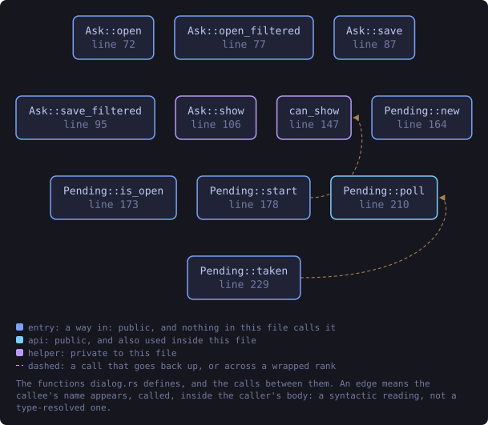

<!-- SPDX-License-Identifier: GPL-3.0-or-later -->
<!-- GENERATED by tools/docs/generate.py from the doc comments in the
     source. Do not edit this file: edit the `//!` and `///` comments in
     the .rs files and run the generator again. CI verifies it with
         python tools/docs/generate.py --check
-->

<p align="center">
  
</p>

# `crates/veilvoice-gui/src/dialog.rs`

[`veilvoice-gui`](../../../crates/veilvoice-gui/README.md) &middot; 369 lines &middot; [read the source](https://github.com/tilas01/veilvoice/blob/main/crates/veilvoice-gui/src/dialog.rs)

## Contents

- [The defect this exists to fix](#the-defect-this-exists-to-fix)
- [How this is avoided, and the one platform where it cannot be](#how-this-is-avoided-and-the-one-platform-where-it-cannot-be)
- [In plain words](#in-plain-words)
  - [What this file contains](#what-this-file-contains)
  - [What calls what](#what-calls-what)
  - [Items](#items)

Asking for a file without stopping the window.

# The defect this exists to fix

Every file picker in this application was opened with `rfd`'s **blocking**
API, straight from the frame that handled the click:

```ignore
if ui.button("choose file…").clicked() {
if let Some(path) = rfd::FileDialog::new().pick_file() { … }
}
```

`pick_file` does not return until the person has chosen a file or cancelled.
It is called from inside `update`, which is the render loop, so for as long
as that dialog is open **VeilVoice draws nothing at all**: the window does
not repaint, animations stop, the meters freeze, and dragging it leaves a
trail of stale pixels. Somebody browsing for a recording for thirty seconds
has a frozen application for thirty seconds.

It is also the answer to "it lags when I select things", which is a real
report and an accurate one. There were seven of these.

# How this is avoided, and the one platform where it cannot be

The dialog runs on a thread of its own and the answer comes back down a
channel, which `Pending::poll` reads without waiting. `update` starts the
ask and returns immediately; the window keeps painting the whole time.

**macOS is the exception, and it is not a shortcut.** `NSOpenPanel` must be
driven from the main thread; opening one anywhere else does not work, and
on some versions it does not fail politely either. So on macOS the ask is
made inline, exactly as before. That platform keeps the old behaviour
because the alternative is a picker that does not appear, and a frozen
window is better than no dialog.

# In plain words

When you click "choose a file", the box that opens used to freeze the rest
of VeilVoice until you picked something. Now it opens beside the
application and everything carries on running while you browse.

On Apple computers it still waits, because macOS insists that file pickers
are opened by the main part of a program and there is no way around that
which actually works.

## What this file contains

369 lines defining **10 functions** (9 public), **2 types** and **0 constants**. Everything below is read out of the source, so it cannot disagree with the code.

**The types it owns.**

- `enum Ask` (line 53) -- What is being asked for.
- `struct Pending` (line 130) -- A file dialog that is open, or has just been answered.

**What happens when it runs.** These are the ways in: public, and nothing else in this file calls them, so they are what an outside caller reaches first.

- `Ask::open` (line 72) -- An open dialog with no filter.
- `Ask::open_filtered` (line 77) -- An open dialog restricted to these extensions.
- `Ask::save` (line 87) -- A save dialog offering this name.
- `Ask::save_filtered` (line 95) -- A save dialog offering this name, restricted to these extensions.
- `Pending::new` (line 136) -- Nothing is being asked.
- `Pending::is_open` (line 145) -- Whether a dialog is open right now.
- `Pending::start` (line 150) -- Start asking.
- `Pending::taken` (line 194) -- The answer, if one arrived and was a path.
  - reaches: `poll`

## What calls what

The functions this file defines, and the calls between them. Both
are read out of the source: an edge means the callee's name appears,
called, inside the caller's body. It is a syntactic reading, not a
type-resolved one, so a call made through a trait object or a macro
will not appear.

_Colour key: **entry** -- a way in: public, and nothing in this file calls it; **api** -- public, and also used inside this file; **helper** -- private to this file._

<p align="center">
  
</p>

<details>
<summary>The same graph as Mermaid source</summary>



</details>

```mermaid
%%{init: {"theme":"base","themeVariables":{"background":"#1a1b26","primaryColor":"#1f2335","primaryTextColor":"#c0caf5","primaryBorderColor":"#7aa2f7","secondaryColor":"#16161e","tertiaryColor":"#16161e","lineColor":"#737aa2","textColor":"#c0caf5","mainBkg":"#1f2335","nodeBorder":"#7aa2f7","clusterBkg":"#16161e","clusterBorder":"#2f3549","fontFamily":"ui-monospace, SFMono-Regular, Consolas, monospace","fontSize":"14px"}}}%%
flowchart TD
    n_open(["Ask::open<br/>line 72"])
    n_open_filtered(["Ask::open_filtered<br/>line 77"])
    n_save(["Ask::save<br/>line 87"])
    n_save_filtered(["Ask::save_filtered<br/>line 95"])
    n_show["Ask::show<br/>line 106"]
    n_new(["Pending::new<br/>line 136"])
    n_is_open(["Pending::is_open<br/>line 145"])
    n_start(["Pending::start<br/>line 150"])
    n_poll["Pending::poll<br/>line 175"]
    n_taken(["Pending::taken<br/>line 194"])
    n_taken --> n_poll
    click n_open href "https://github.com/tilas01/veilvoice/blob/main/crates/veilvoice-gui/src/dialog.rs#L72" "open the source"
    click n_open_filtered href "https://github.com/tilas01/veilvoice/blob/main/crates/veilvoice-gui/src/dialog.rs#L77" "open the source"
    click n_save href "https://github.com/tilas01/veilvoice/blob/main/crates/veilvoice-gui/src/dialog.rs#L87" "open the source"
    click n_save_filtered href "https://github.com/tilas01/veilvoice/blob/main/crates/veilvoice-gui/src/dialog.rs#L95" "open the source"
    click n_show href "https://github.com/tilas01/veilvoice/blob/main/crates/veilvoice-gui/src/dialog.rs#L106" "open the source"
    click n_new href "https://github.com/tilas01/veilvoice/blob/main/crates/veilvoice-gui/src/dialog.rs#L136" "open the source"
    click n_is_open href "https://github.com/tilas01/veilvoice/blob/main/crates/veilvoice-gui/src/dialog.rs#L145" "open the source"
    click n_start href "https://github.com/tilas01/veilvoice/blob/main/crates/veilvoice-gui/src/dialog.rs#L150" "open the source"
    click n_poll href "https://github.com/tilas01/veilvoice/blob/main/crates/veilvoice-gui/src/dialog.rs#L175" "open the source"
    click n_taken href "https://github.com/tilas01/veilvoice/blob/main/crates/veilvoice-gui/src/dialog.rs#L194" "open the source"
    classDef entry fill:#1f2335,stroke:#7aa2f7,color:#c0caf5
    class n_open,n_open_filtered,n_save,n_save_filtered,n_new,n_is_open,n_start,n_taken entry
    classDef api fill:#1f2335,stroke:#7dcfff,color:#c0caf5
    class n_poll api
    classDef helper fill:#1f2335,stroke:#bb9af7,color:#c0caf5
    class n_show helper
```

## Items

| Item | Line | Documentation |
|---|---:|---|
| `Ask` <sub>pub enum</sub> | [53](https://github.com/tilas01/veilvoice/blob/main/crates/veilvoice-gui/src/dialog.rs#L53) | What is being asked for. |
| `Ask::open` <sub>pub fn</sub> | [72](https://github.com/tilas01/veilvoice/blob/main/crates/veilvoice-gui/src/dialog.rs#L72) | An open dialog with no filter. |
| `Ask::open_filtered` <sub>pub fn</sub> | [77](https://github.com/tilas01/veilvoice/blob/main/crates/veilvoice-gui/src/dialog.rs#L77) | An open dialog restricted to these extensions. |
| `Ask::save` <sub>pub fn</sub> | [87](https://github.com/tilas01/veilvoice/blob/main/crates/veilvoice-gui/src/dialog.rs#L87) | A save dialog offering this name. |
| `Ask::save_filtered` <sub>pub fn</sub> | [95](https://github.com/tilas01/veilvoice/blob/main/crates/veilvoice-gui/src/dialog.rs#L95) | A save dialog offering this name, restricted to these extensions. |
| `Ask::show` <sub>fn</sub> | [106](https://github.com/tilas01/veilvoice/blob/main/crates/veilvoice-gui/src/dialog.rs#L106) | Show it, here, now. |
| `Pending` <sub>pub struct</sub> | [130](https://github.com/tilas01/veilvoice/blob/main/crates/veilvoice-gui/src/dialog.rs#L130) | A file dialog that is open, or has just been answered. |
| `Pending::new` <sub>pub fn</sub> | [136](https://github.com/tilas01/veilvoice/blob/main/crates/veilvoice-gui/src/dialog.rs#L136) | Nothing is being asked. |
| `Pending::is_open` <sub>pub fn</sub> | [145](https://github.com/tilas01/veilvoice/blob/main/crates/veilvoice-gui/src/dialog.rs#L145) | Whether a dialog is open right now. |
| `Pending::start` <sub>pub fn</sub> | [150](https://github.com/tilas01/veilvoice/blob/main/crates/veilvoice-gui/src/dialog.rs#L150) | Start asking. |
| `Pending::poll` <sub>pub fn</sub> | [175](https://github.com/tilas01/veilvoice/blob/main/crates/veilvoice-gui/src/dialog.rs#L175) | The answer, if one has arrived. |
| `Pending::taken` <sub>pub fn</sub> | [194](https://github.com/tilas01/veilvoice/blob/main/crates/veilvoice-gui/src/dialog.rs#L194) | The answer, if one arrived and was a path. |
| `house_style` <sub>mod</sub> | [318](https://github.com/tilas01/veilvoice/blob/main/crates/veilvoice-gui/src/dialog.rs#L318) |  |

---

Generated from `crates/veilvoice-gui/src/dialog.rs`. On the website: [`website/reference/veilvoice-gui/dialog.html`](../../../website/reference/veilvoice-gui/dialog.html).

Signing key fingerprint `8101FB3BB28D02FB239E0CDF9CC1C7E7A9B5833A`.
