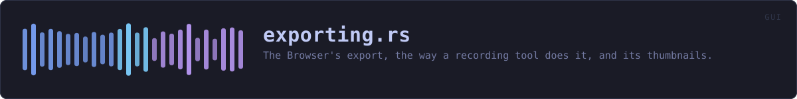
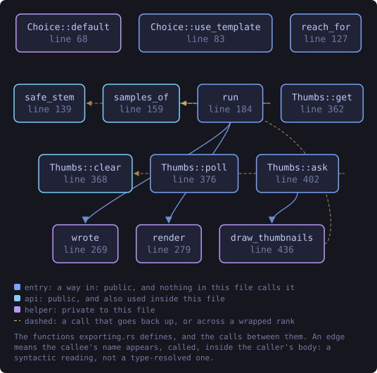

<!-- SPDX-License-Identifier: GPL-3.0-or-later -->
<!-- GENERATED by tools/docs/generate.py from the doc comments in the
     source. Do not edit this file: edit the `//!` and `///` comments in
     the .rs files and run the generator again. CI verifies it with
         python tools/docs/generate.py --check
-->

  

# `crates/veilvoice-gui/src/exporting.rs`

[`veilvoice-gui`](../../../crates/veilvoice-gui/README.md) &middot; 859 lines &middot; [read the source](https://github.com/tilas01/veilvoice/blob/main/crates/veilvoice-gui/src/exporting.rs)

## Contents

- [Nothing here runs on the thread that draws](#nothing-here-runs-on-the-thread-that-draws)
- [The key is held for one recording at a time](#the-key-is-held-for-one-recording-at-a-time)
- [Thumbnails are never written anywhere](#thumbnails-are-never-written-anywhere)
- [In plain words](#in-plain-words)
  - [What this file contains](#what-this-file-contains)
  - [What calls what](#what-calls-what)
  - [Items](#items)

The Browser's export, the way a recording tool does it, and its thumbnails.

**Roadmap item 175.** The questions and the picture live in
`veilvoice_video::export` and `veilvoice_video::motion`, where the command
line can reach them too. This is the window's half: what the person has
chosen, the worker that renders it, and a small picture of every recording
in the list.

# Nothing here runs on the thread that draws

A render is minutes and a thumbnail is a decryption. Both are started from
the Browser and both finish on a worker (`run` and `Thumbs::ask`), which
is the rule roadmap item 167 set for the whole window and a guard in
`crate::draw_path_tests` holds it to.

# The key is held for one recording at a time

The render takes the shared vault, loads one recording and lets go of it
before anything else happens, exactly as the older export does (F-219). The
thumbnails hold a `std::sync::Weak` rather than the vault itself: each
recording is loaded through a strong reference that is dropped straight
after, so shutting the vault while thumbnails are being drawn stops them at
the next recording rather than keeping the key alive until the list ends.

# Thumbnails are never written anywhere

They are pictures of the veiled audio, and they are still drawn from what is
in the vault. They exist as textures while the vault is open and nowhere
else: no cache on the disk, nothing that survives `Thumbs::clear`.

# In plain words

The export button in the Browser: which kind of file, how good, how it
looks, and then the work done in the background with a bar that counts the
frames. And a little picture of each recording in the list, drawn in the
same style the video will be.

## What this file contains

859 lines defining **16 functions** (10 public), **4 types** and **3 constants**. Everything below is read out of the source, so it cannot disagree with the code.

**The types it owns.**

- `struct Choice` (line 55) -- Everything the person has chosen about an export.
- `enum Outcome` (line 93) -- How a finished export reads: good, worth a second look, or failed.
- `struct Job` (line 103) -- Everything one export needs, taken at the moment the folder was chosen.
- `struct Thumbs` (line 586) -- A small picture of every recording in the list.

**What happens when it runs.** These are the ways in: public, and nothing else in this file calls them, so they are what an outside caller reaches first.

- `Choice::use_template` (line 83) -- Start again from a template, keeping the file settings.
- `reach_for` (line 127) -- How far an export with this choice can say it has got.
- `run` (line 184) -- Do the export.
  - reaches: `render`, `safe_stem`, `samples_of`, `wrote`
- `form` (line 360) -- The export form, drawn under the recording it is for.
  - reaches: `look`, `fill`
- `Thumbs::get` (line 595) -- The picture for a recording, once it has been drawn.
- `Thumbs::poll` (line 609) -- Take whatever pictures have arrived.
- `Thumbs::ask` (line 635) -- Draw the pictures nobody has asked for yet, on a worker.
  - reaches: `clear`, `draw_thumbnails`, `samples_of`

## What calls what

The functions this file defines, and the calls between them. Both
are read out of the source: an edge means the callee's name appears,
called, inside the caller's body. It is a syntactic reading, not a
type-resolved one, so a call made through a trait object or a macro
will not appear.

_Colour key: **entry** -- a way in: public, and nothing in this file calls it; **api** -- public, and also used inside this file; **helper** -- private to this file._

  

The same graph as Mermaid source

```mermaid
%%{init: {"theme":"base","themeVariables":{"background":"#1a1b26","primaryColor":"#1f2335","primaryTextColor":"#c0caf5","primaryBorderColor":"#7aa2f7","secondaryColor":"#16161e","tertiaryColor":"#16161e","lineColor":"#737aa2","textColor":"#c0caf5","mainBkg":"#1f2335","nodeBorder":"#7aa2f7","clusterBkg":"#16161e","clusterBorder":"#2f3549","fontFamily":"ui-monospace, SFMono-Regular, Consolas, monospace","fontSize":"14px"}}}%%
flowchart TD
    n_default["Choice::default<br/>line 68"]
    n_use_template(["Choice::use_template<br/>line 83"])
    n_reach_for(["reach_for<br/>line 127"])
    n_safe_stem["safe_stem<br/>line 139"]
    n_samples_of["samples_of<br/>line 159"]
    n_run(["run<br/>line 184"])
    n_wrote["wrote<br/>line 269"]
    n_render["render<br/>line 279"]
    n_form(["form<br/>line 360"])
    n_look["look<br/>line 487"]
    n_fill["fill<br/>line 535"]
    n_get(["Thumbs::get<br/>line 595"])
    n_clear["Thumbs::clear<br/>line 601"]
    n_poll(["Thumbs::poll<br/>line 609"])
    n_ask(["Thumbs::ask<br/>line 635"])
    n_draw_thumbnails["draw_thumbnails<br/>line 669"]
    n_ask --> n_clear
    n_ask --> n_draw_thumbnails
    n_draw_thumbnails --> n_samples_of
    n_form --> n_look
    n_look --> n_fill
    n_run --> n_render
    n_run --> n_safe_stem
    n_run --> n_samples_of
    n_run --> n_wrote
    click n_default href "https://github.com/tilas01/veilvoice/blob/main/crates/veilvoice-gui/src/exporting.rs#L68" "open the source"
    click n_use_template href "https://github.com/tilas01/veilvoice/blob/main/crates/veilvoice-gui/src/exporting.rs#L83" "open the source"
    click n_reach_for href "https://github.com/tilas01/veilvoice/blob/main/crates/veilvoice-gui/src/exporting.rs#L127" "open the source"
    click n_safe_stem href "https://github.com/tilas01/veilvoice/blob/main/crates/veilvoice-gui/src/exporting.rs#L139" "open the source"
    click n_samples_of href "https://github.com/tilas01/veilvoice/blob/main/crates/veilvoice-gui/src/exporting.rs#L159" "open the source"
    click n_run href "https://github.com/tilas01/veilvoice/blob/main/crates/veilvoice-gui/src/exporting.rs#L184" "open the source"
    click n_wrote href "https://github.com/tilas01/veilvoice/blob/main/crates/veilvoice-gui/src/exporting.rs#L269" "open the source"
    click n_render href "https://github.com/tilas01/veilvoice/blob/main/crates/veilvoice-gui/src/exporting.rs#L279" "open the source"
    click n_form href "https://github.com/tilas01/veilvoice/blob/main/crates/veilvoice-gui/src/exporting.rs#L360" "open the source"
    click n_look href "https://github.com/tilas01/veilvoice/blob/main/crates/veilvoice-gui/src/exporting.rs#L487" "open the source"
    click n_fill href "https://github.com/tilas01/veilvoice/blob/main/crates/veilvoice-gui/src/exporting.rs#L535" "open the source"
    click n_get href "https://github.com/tilas01/veilvoice/blob/main/crates/veilvoice-gui/src/exporting.rs#L595" "open the source"
    click n_clear href "https://github.com/tilas01/veilvoice/blob/main/crates/veilvoice-gui/src/exporting.rs#L601" "open the source"
    click n_poll href "https://github.com/tilas01/veilvoice/blob/main/crates/veilvoice-gui/src/exporting.rs#L609" "open the source"
    click n_ask href "https://github.com/tilas01/veilvoice/blob/main/crates/veilvoice-gui/src/exporting.rs#L635" "open the source"
    click n_draw_thumbnails href "https://github.com/tilas01/veilvoice/blob/main/crates/veilvoice-gui/src/exporting.rs#L669" "open the source"
    classDef entry fill:#1f2335,stroke:#7aa2f7,color:#c0caf5
    class n_use_template,n_reach_for,n_run,n_form,n_get,n_poll,n_ask entry
    classDef api fill:#1f2335,stroke:#7dcfff,color:#c0caf5
    class n_safe_stem,n_samples_of,n_clear api
    classDef helper fill:#1f2335,stroke:#bb9af7,color:#c0caf5
    class n_default,n_wrote,n_render,n_look,n_fill,n_draw_thumbnails helper
```

## Items

| Item | Line | Documentation |
|---|---:|---|
| `THUMB_WIDTH` pub const | [49](https://github.com/tilas01/veilvoice/blob/main/crates/veilvoice-gui/src/exporting.rs#L49) | Width of a thumbnail, in pixels. |
| `THUMB_HEIGHT` pub const | [51](https://github.com/tilas01/veilvoice/blob/main/crates/veilvoice-gui/src/exporting.rs#L51) | Height of a thumbnail, in pixels. |
| `Choice` pub struct | [55](https://github.com/tilas01/veilvoice/blob/main/crates/veilvoice-gui/src/exporting.rs#L55) | Everything the person has chosen about an export. |
| `Choice::default` fn | [68](https://github.com/tilas01/veilvoice/blob/main/crates/veilvoice-gui/src/exporting.rs#L68) |  |
| `Choice::use_template` pub fn | [83](https://github.com/tilas01/veilvoice/blob/main/crates/veilvoice-gui/src/exporting.rs#L83) | Start again from a template, keeping the file settings. |
| `Outcome` pub enum | [93](https://github.com/tilas01/veilvoice/blob/main/crates/veilvoice-gui/src/exporting.rs#L93) | How a finished export reads: good, worth a second look, or failed. |
| `Job` pub struct | [103](https://github.com/tilas01/veilvoice/blob/main/crates/veilvoice-gui/src/exporting.rs#L103) | Everything one export needs, taken at the moment the folder was chosen. |
| `NO_FRAMES` pub const | [119](https://github.com/tilas01/veilvoice/blob/main/crates/veilvoice-gui/src/exporting.rs#L119) | Why no bar can be drawn for an export that has no picture. |
| `reach_for` pub fn | [127](https://github.com/tilas01/veilvoice/blob/main/crates/veilvoice-gui/src/exporting.rs#L127) | How far an export with this choice can say it has got. |
| `safe_stem` pub fn | [139](https://github.com/tilas01/veilvoice/blob/main/crates/veilvoice-gui/src/exporting.rs#L139) | A file name built from what somebody called a recording. |
| `samples_of` pub fn | [159](https://github.com/tilas01/veilvoice/blob/main/crates/veilvoice-gui/src/exporting.rs#L159) | The samples and the rate of a canonical 16-bit WAV, mixed to one channel. |
| `run` pub fn | [184](https://github.com/tilas01/veilvoice/blob/main/crates/veilvoice-gui/src/exporting.rs#L184) | Do the export. |
| `wrote` fn | [269](https://github.com/tilas01/veilvoice/blob/main/crates/veilvoice-gui/src/exporting.rs#L269) | What a successful export says. |
| `render` fn | [279](https://github.com/tilas01/veilvoice/blob/main/crates/veilvoice-gui/src/exporting.rs#L279) | Run ffmpeg, drawing and piping the frames when there is a picture. |
| `form` pub fn | [360](https://github.com/tilas01/veilvoice/blob/main/crates/veilvoice-gui/src/exporting.rs#L360) | The export form, drawn under the recording it is for. |
| `look` fn | [487](https://github.com/tilas01/veilvoice/blob/main/crates/veilvoice-gui/src/exporting.rs#L487) | The advanced half of the form: the typeface, the colours and the motion. |
| `fill` fn | [535](https://github.com/tilas01/veilvoice/blob/main/crates/veilvoice-gui/src/exporting.rs#L535) | One colour, or two with a gradient between them. |
| `Thumbs` pub struct | [586](https://github.com/tilas01/veilvoice/blob/main/crates/veilvoice-gui/src/exporting.rs#L586) | A small picture of every recording in the list. |
| `Thumbs::get` pub fn | [595](https://github.com/tilas01/veilvoice/blob/main/crates/veilvoice-gui/src/exporting.rs#L595) | The picture for a recording, once it has been drawn. |
| `Thumbs::clear` pub fn | [601](https://github.com/tilas01/veilvoice/blob/main/crates/veilvoice-gui/src/exporting.rs#L601) | Forget every picture. |
| `Thumbs::poll` pub fn | [609](https://github.com/tilas01/veilvoice/blob/main/crates/veilvoice-gui/src/exporting.rs#L609) | Take whatever pictures have arrived. |
| `Thumbs::ask` pub fn | [635](https://github.com/tilas01/veilvoice/blob/main/crates/veilvoice-gui/src/exporting.rs#L635) | Draw the pictures nobody has asked for yet, on a worker. |
| `draw_thumbnails` fn | [669](https://github.com/tilas01/veilvoice/blob/main/crates/veilvoice-gui/src/exporting.rs#L669) | The worker behind Thumbs::ask. |

---

Generated from `crates/veilvoice-gui/src/exporting.rs`. On the website: [`website/reference/veilvoice-gui/exporting.html`](../../../website/reference/veilvoice-gui/exporting.html).

Signing key fingerprint `8101FB3BB28D02FB239E0CDF9CC1C7E7A9B5833A`.
