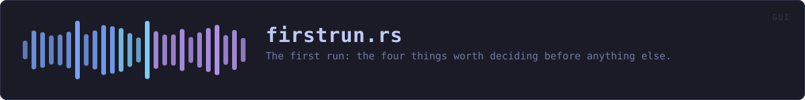
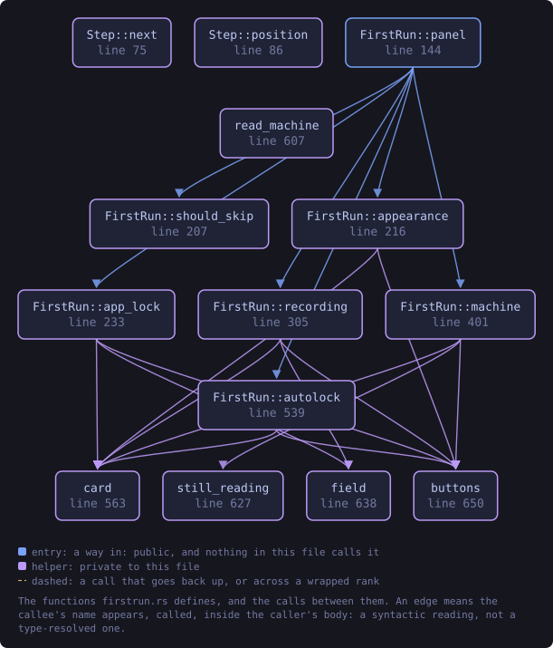

<!-- SPDX-License-Identifier: GPL-3.0-or-later -->
<!-- GENERATED by tools/docs/generate.py from the doc comments in the
     source. Do not edit this file: edit the `//!` and `///` comments in
     the .rs files and run the generator again. CI verifies it with
         python tools/docs/generate.py --check
-->

  

# `crates/veilvoice-gui/src/firstrun.rs`

[`veilvoice-gui`](../../../crates/veilvoice-gui/README.md) &middot; 490 lines &middot; [read the source](https://github.com/tilas01/veilvoice/blob/main/crates/veilvoice-gui/src/firstrun.rs)

## Contents

- [What this replaced](#what-this-replaced)
- [What it asks, and what it will not do](#what-it-asks-and-what-it-will-not-do)
- [In plain words](#in-plain-words)
  - [What this file contains](#what-this-file-contains)
  - [What calls what](#what-calls-what)
  - [Items](#items)

The first run: the four things worth deciding before anything else.

# What this replaced

Two checkboxes about animation. Everything that actually matters -- the app
lock, the passphrase recordings are encrypted with, whether the window locks
itself -- was left to be discovered on a tab most people never opened.

That is a defensible choice for a preference and a bad one for a
protection. A default nobody is shown is not a question, it is an answer,
and for a privacy tool the answer it was quietly giving was "none of it".

# What it asks, and what it will not do

Four cards, each skippable, each stating what it buys before asking for
anything:

1. **Appearance.** The two animation choices, kept from the old panel.
2. **The app lock.** A passphrase for the window, and -- since 0.1.18 --
the key that names and encrypts VeilVoice's own files. The card says
both, and says the sentence that has to be said out loud: forget it and
those files are gone.
3. **The recording passphrase.** What veiled recordings are encrypted
with. Separate from the app lock by default, with the option to use one
passphrase for both and a plain statement of what that trades.
4. **Locking itself.** On at half an hour, with the delay and the off
switch right there.

**Nothing here is a gate.** Every card has a way past it, and skipping all
four leaves VeilVoice exactly as it was before this module existed. A setup
flow that will not let somebody reach the program is a setup flow they
resent; this one is a set of offers made at the moment they make sense.

The tour runs after it, so a person meets the decisions first and the tabs
second, which is the order they matter in.

# In plain words

The first time you open VeilVoice it offers you a password for the app, a
password for your recordings, and a timer that locks the window when you
walk away. You can skip any of them and set them later.

## What this file contains

490 lines defining **11 functions** (1 public), **3 types** and **1 constant**. Everything below is read out of the source, so it cannot disagree with the code.

**The types it owns.**

- `enum Step` (line 49) -- Which card is showing.
- `struct FirstRun` (line 88) -- What the setup is holding while it runs.
- `enum Outcome` (line 105) -- What the panel wants the application to do after drawing.

**What happens when it runs.** These are the ways in: public, and nothing else in this file calls them, so they are what an outside caller reaches first.

- `FirstRun::panel` (line 119) -- Draw the current card.
  - reaches: `app_lock`, `appearance`, `autolock`, `recording`, `should_skip`, `buttons`, `card`, `field`

## What calls what

The functions this file defines, and the calls between them. Both
are read out of the source: an edge means the callee's name appears,
called, inside the caller's body. It is a syntactic reading, not a
type-resolved one, so a call made through a trait object or a macro
will not appear.

_Colour key: **entry** -- a way in: public, and nothing in this file calls it; **helper** -- private to this file._

  

The same graph as Mermaid source

```mermaid
%%{init: {"theme":"base","themeVariables":{"background":"#1a1b26","primaryColor":"#1f2335","primaryTextColor":"#c0caf5","primaryBorderColor":"#7aa2f7","secondaryColor":"#16161e","tertiaryColor":"#16161e","lineColor":"#737aa2","textColor":"#c0caf5","mainBkg":"#1f2335","nodeBorder":"#7aa2f7","clusterBkg":"#16161e","clusterBorder":"#2f3549","fontFamily":"ui-monospace, SFMono-Regular, Consolas, monospace","fontSize":"14px"}}}%%
flowchart TD
    n_next["Step::next<br/>line 64"]
    n_position["Step::position<br/>line 74"]
    n_panel(["FirstRun::panel<br/>line 119"])
    n_should_skip["FirstRun::should_skip<br/>line 180"]
    n_appearance["FirstRun::appearance<br/>line 188"]
    n_app_lock["FirstRun::app_lock<br/>line 203"]
    n_recording["FirstRun::recording<br/>line 273"]
    n_autolock["FirstRun::autolock<br/>line 345"]
    n_card["card<br/>line 369"]
    n_field["field<br/>line 384"]
    n_buttons["buttons<br/>line 396"]
    n_app_lock --> n_buttons
    n_app_lock --> n_card
    n_app_lock --> n_field
    n_appearance --> n_buttons
    n_appearance --> n_card
    n_autolock --> n_buttons
    n_autolock --> n_card
    n_panel --> n_app_lock
    n_panel --> n_appearance
    n_panel --> n_autolock
    n_panel --> n_recording
    n_panel --> n_should_skip
    n_recording --> n_buttons
    n_recording --> n_card
    n_recording --> n_field
    click n_next href "https://github.com/tilas01/veilvoice/blob/main/crates/veilvoice-gui/src/firstrun.rs#L64" "open the source"
    click n_position href "https://github.com/tilas01/veilvoice/blob/main/crates/veilvoice-gui/src/firstrun.rs#L74" "open the source"
    click n_panel href "https://github.com/tilas01/veilvoice/blob/main/crates/veilvoice-gui/src/firstrun.rs#L119" "open the source"
    click n_should_skip href "https://github.com/tilas01/veilvoice/blob/main/crates/veilvoice-gui/src/firstrun.rs#L180" "open the source"
    click n_appearance href "https://github.com/tilas01/veilvoice/blob/main/crates/veilvoice-gui/src/firstrun.rs#L188" "open the source"
    click n_app_lock href "https://github.com/tilas01/veilvoice/blob/main/crates/veilvoice-gui/src/firstrun.rs#L203" "open the source"
    click n_recording href "https://github.com/tilas01/veilvoice/blob/main/crates/veilvoice-gui/src/firstrun.rs#L273" "open the source"
    click n_autolock href "https://github.com/tilas01/veilvoice/blob/main/crates/veilvoice-gui/src/firstrun.rs#L345" "open the source"
    click n_card href "https://github.com/tilas01/veilvoice/blob/main/crates/veilvoice-gui/src/firstrun.rs#L369" "open the source"
    click n_field href "https://github.com/tilas01/veilvoice/blob/main/crates/veilvoice-gui/src/firstrun.rs#L384" "open the source"
    click n_buttons href "https://github.com/tilas01/veilvoice/blob/main/crates/veilvoice-gui/src/firstrun.rs#L396" "open the source"
    classDef entry fill:#1f2335,stroke:#7aa2f7,color:#c0caf5
    class n_panel entry
    classDef helper fill:#1f2335,stroke:#bb9af7,color:#c0caf5
    class n_next,n_position,n_should_skip,n_appearance,n_app_lock,n_recording,n_autolock,n_card,n_field,n_buttons helper
```

## Items

| Item | Line | Documentation |
|---|---:|---|
| `Step` pub enum | [49](https://github.com/tilas01/veilvoice/blob/main/crates/veilvoice-gui/src/firstrun.rs#L49) | Which card is showing. |
| `Step::next` fn | [64](https://github.com/tilas01/veilvoice/blob/main/crates/veilvoice-gui/src/firstrun.rs#L64) |  |
| `Step::position` fn | [74](https://github.com/tilas01/veilvoice/blob/main/crates/veilvoice-gui/src/firstrun.rs#L74) | One-based position, for "step 2 of 4". |
| `Step::COUNT` const | [83](https://github.com/tilas01/veilvoice/blob/main/crates/veilvoice-gui/src/firstrun.rs#L83) |  |
| `FirstRun` pub struct | [88](https://github.com/tilas01/veilvoice/blob/main/crates/veilvoice-gui/src/firstrun.rs#L88) | What the setup is holding while it runs. |
| `Outcome` pub enum | [105](https://github.com/tilas01/veilvoice/blob/main/crates/veilvoice-gui/src/firstrun.rs#L105) | What the panel wants the application to do after drawing. |
| `FirstRun::panel` pub fn | [119](https://github.com/tilas01/veilvoice/blob/main/crates/veilvoice-gui/src/firstrun.rs#L119) | Draw the current card. |
| `FirstRun::should_skip` fn | [180](https://github.com/tilas01/veilvoice/blob/main/crates/veilvoice-gui/src/firstrun.rs#L180) | Whether a card has nothing left to ask. |
| `FirstRun::appearance` fn | [188](https://github.com/tilas01/veilvoice/blob/main/crates/veilvoice-gui/src/firstrun.rs#L188) |  |
| `FirstRun::app_lock` fn | [203](https://github.com/tilas01/veilvoice/blob/main/crates/veilvoice-gui/src/firstrun.rs#L203) |  |
| `FirstRun::recording` fn | [273](https://github.com/tilas01/veilvoice/blob/main/crates/veilvoice-gui/src/firstrun.rs#L273) |  |
| `FirstRun::autolock` fn | [345](https://github.com/tilas01/veilvoice/blob/main/crates/veilvoice-gui/src/firstrun.rs#L345) |  |
| `card` fn | [369](https://github.com/tilas01/veilvoice/blob/main/crates/veilvoice-gui/src/firstrun.rs#L369) | A bordered card, so each step reads as one thing rather than a page of text. |
| `field` fn | [384](https://github.com/tilas01/veilvoice/blob/main/crates/veilvoice-gui/src/firstrun.rs#L384) | A password field with its label, laid out like the rest of the application. |
| `buttons` fn | [396](https://github.com/tilas01/veilvoice/blob/main/crates/veilvoice-gui/src/firstrun.rs#L396) | The row that moves on. |

---

Generated from `crates/veilvoice-gui/src/firstrun.rs`. On the website: [`website/reference/veilvoice-gui/firstrun.html`](../../../website/reference/veilvoice-gui/firstrun.html).

Signing key fingerprint `8101FB3BB28D02FB239E0CDF9CC1C7E7A9B5833A`.
