<!-- SPDX-License-Identifier: GPL-3.0-or-later -->
<!-- GENERATED by tools/docs/generate.py from the doc comments in the
     source. Do not edit this file: edit the `//!` and `///` comments in
     the .rs files and run the generator again. CI verifies it with
         python tools/docs/generate.py --check
-->

  

# `crates/veilvoice-gui/src/group.rs`

[`veilvoice-gui`](../../../crates/veilvoice-gui/README.md) &middot; 1044 lines &middot; [read the source](https://github.com/tilas01/veilvoice/blob/main/crates/veilvoice-gui/src/group.rs)

## Contents

- [The toggle does not persist, and the tick that makes it persist is separate](#the-toggle-does-not-persist-and-the-tick-that-makes-it-persist-is-separate)
- [Colour is assigned, never guessed from the voice](#colour-is-assigned-never-guessed-from-the-voice)
- [Colour is never the only signal](#colour-is-never-the-only-signal)
  - [What this file contains](#what-this-file-contains)
  - [What calls what](#what-calls-what)
  - [Items](#items)

Group mode: several people in one recording, each with a name and a colour.

The engine has handled several speakers since `veilvoice-conversation`
existed. This is the part of it a person can see: who is in the recording,
what each of them is called, what colour each is drawn in, and which
destination voice each becomes.

# The toggle does not persist, and the tick that makes it persist is separate

Group mode changes what a recording is *treated as*. A mode that survives a
restart is a mode somebody eventually forgets is on, and for this tool that
means a single-speaker recording rendered against a plan that does not
describe it — which silences everything the plan does not claim. So the
toggle is per-run and off by default, and there is a second, explicit tick
for "always start in group mode" which is the only thing written to disk.

Two controls where one would do, deliberately. They answer two different
questions: *is this recording a group recording* and *are most of my
recordings group recordings*.

# Colour is assigned, never guessed from the voice

A speaker's colour is a function of their **slot**, exactly as their
destination voice is, and for the same reason: anything chosen by measuring
the input would make an output property a function of the input speaker,
which is the linkage this whole project exists to destroy. Slot 0 and slot 1
are the furthest-apart pair in the table because two people is the common
case; every slot after that is the colour whose nearest neighbour among the
ones already used is furthest away. That order was computed rather than
judged — see `veilvoice_video::palette`.

A colour can be **overridden** per speaker, from any colour in any of the
nine palettes the website offers. An override is a person's choice about
their own recording, made after the fact, and carries none of the linkage
problem above.

# Colour is never the only signal

The name is drawn beside every circle, in the list, and in the subtitles.
Somebody who cannot separate two of these colours has the name, everywhere.
A panel that distinguished speakers by colour alone would be one about eight
per cent of men could not use.

## What this file contains

1044 lines defining **28 functions** (12 public), **3 types** and **0 constants**. Everything below is read out of the source, so it cannot disagree with the code.

**The types it owns.**

- `struct Person` (line 55) -- One person, as the panel holds them.
- `struct Outputs` (line 78) -- What comes out of a group render.
- `struct Group` (line 105) -- The group-mode panel's state.

**What happens when it runs.** These are the ways in: public, and nothing else in this file calls them, so they are what an outside caller reaches first.

- `Outputs::any` (line 99) -- Whether anything at all would be written.
- `Group::start_from` (line 159) -- The panel as it should open, given the saved preference.
  - reaches: `default`
- `Group::len` (line 167) -- How many people are in the recording.
- `Group::is_empty` (line 172) -- Whether there is nobody in it.
- `Group::to_plan` (line 220) -- Build a plan from the panel: names in slot order, no turns.
- `Group::tab` (line 236) -- The whole panel.
  - reaches: `body`, `files_and_theme`, `mode_controls`, `output_controls`, `people_list`, `render_controls`, `strip`, `file_name`, `add`, `colour`, `palette_picker`, `remove`
- `Group::drain` (line 560) -- Take the worker's answer if it has one.

## What calls what

The functions this file defines, and the calls between them. Both
are read out of the source: an edge means the callee's name appears,
called, inside the caller's body. It is a syntactic reading, not a
type-resolved one, so a call made through a trait object or a macro
will not appear.

_22 of 27 functions are drawn; the diagram is bounded at 22 so it
stays readable. The full list is in the table below._

_Colour key: **entry** -- a way in: public, and nothing in this file calls it; **api** -- public, and also used inside this file; **helper** -- private to this file._

  

The same graph as Mermaid source

```mermaid
%%{init: {"theme":"base","themeVariables":{"background":"#1a1b26","primaryColor":"#1f2335","primaryTextColor":"#c0caf5","primaryBorderColor":"#7aa2f7","secondaryColor":"#16161e","tertiaryColor":"#16161e","lineColor":"#737aa2","textColor":"#c0caf5","mainBkg":"#1f2335","nodeBorder":"#7aa2f7","clusterBkg":"#16161e","clusterBorder":"#2f3549","fontFamily":"ui-monospace, SFMono-Regular, Consolas, monospace","fontSize":"14px"}}}%%
flowchart TD
    n_at["Person::at<br/>line 64"]
    n_default["Outputs::default<br/>line 88"]
    n_default["Group::default<br/>line 135"]
    n_start_from(["Group::start_from<br/>line 159"])
    n_colour["Group::colour<br/>line 177"]
    n_add["Group::add<br/>line 190"]
    n_remove["Group::remove<br/>line 206"]
    n_tab(["Group::tab<br/>line 236"])
    n_body["Group::body<br/>line 248"]
    n_mode_controls["Group::mode_controls<br/>line 313"]
    n_strip["Group::strip<br/>line 367"]
    n_people_list["Group::people_list<br/>line 402"]
    n_palette_picker["Group::palette_picker<br/>line 470"]
    n_swatch["Group::swatch<br/>line 509"]
    n_output_controls["Group::output_controls<br/>line 531"]
    n_is_busy["Group::is_busy<br/>line 555"]
    n_files_and_theme["Group::files_and_theme<br/>line 576"]
    n_render_controls["Group::render_controls<br/>line 672"]
    n_start["Group::start<br/>line 728"]
    n_file_name["file_name<br/>line 749"]
    n_render_now["render_now<br/>line 762"]
    n_assigned_colour["assigned_colour<br/>line 856"]
    n_add --> n_at
    n_body --> n_files_and_theme
    n_body --> n_mode_controls
    n_body --> n_output_controls
    n_body --> n_people_list
    n_body --> n_render_controls
    n_body --> n_strip
    n_colour --> n_assigned_colour
    n_files_and_theme --> n_file_name
    n_palette_picker --> n_assigned_colour
    n_palette_picker --> n_swatch
    n_people_list --> n_add
    n_people_list --> n_colour
    n_people_list --> n_palette_picker
    n_people_list --> n_remove
    n_render_controls --> n_is_busy
    n_render_controls --> n_start
    n_render_now --> n_file_name
    n_start --> n_render_now
    n_start_from --> n_default
    n_strip --> n_colour
    n_tab --> n_body
    click n_at href "https://github.com/tilas01/veilvoice/blob/main/crates/veilvoice-gui/src/group.rs#L64" "open the source"
    click n_default href "https://github.com/tilas01/veilvoice/blob/main/crates/veilvoice-gui/src/group.rs#L88" "open the source"
    click n_default href "https://github.com/tilas01/veilvoice/blob/main/crates/veilvoice-gui/src/group.rs#L135" "open the source"
    click n_start_from href "https://github.com/tilas01/veilvoice/blob/main/crates/veilvoice-gui/src/group.rs#L159" "open the source"
    click n_colour href "https://github.com/tilas01/veilvoice/blob/main/crates/veilvoice-gui/src/group.rs#L177" "open the source"
    click n_add href "https://github.com/tilas01/veilvoice/blob/main/crates/veilvoice-gui/src/group.rs#L190" "open the source"
    click n_remove href "https://github.com/tilas01/veilvoice/blob/main/crates/veilvoice-gui/src/group.rs#L206" "open the source"
    click n_tab href "https://github.com/tilas01/veilvoice/blob/main/crates/veilvoice-gui/src/group.rs#L236" "open the source"
    click n_body href "https://github.com/tilas01/veilvoice/blob/main/crates/veilvoice-gui/src/group.rs#L248" "open the source"
    click n_mode_controls href "https://github.com/tilas01/veilvoice/blob/main/crates/veilvoice-gui/src/group.rs#L313" "open the source"
    click n_strip href "https://github.com/tilas01/veilvoice/blob/main/crates/veilvoice-gui/src/group.rs#L367" "open the source"
    click n_people_list href "https://github.com/tilas01/veilvoice/blob/main/crates/veilvoice-gui/src/group.rs#L402" "open the source"
    click n_palette_picker href "https://github.com/tilas01/veilvoice/blob/main/crates/veilvoice-gui/src/group.rs#L470" "open the source"
    click n_swatch href "https://github.com/tilas01/veilvoice/blob/main/crates/veilvoice-gui/src/group.rs#L509" "open the source"
    click n_output_controls href "https://github.com/tilas01/veilvoice/blob/main/crates/veilvoice-gui/src/group.rs#L531" "open the source"
    click n_is_busy href "https://github.com/tilas01/veilvoice/blob/main/crates/veilvoice-gui/src/group.rs#L555" "open the source"
    click n_files_and_theme href "https://github.com/tilas01/veilvoice/blob/main/crates/veilvoice-gui/src/group.rs#L576" "open the source"
    click n_render_controls href "https://github.com/tilas01/veilvoice/blob/main/crates/veilvoice-gui/src/group.rs#L672" "open the source"
    click n_start href "https://github.com/tilas01/veilvoice/blob/main/crates/veilvoice-gui/src/group.rs#L728" "open the source"
    click n_file_name href "https://github.com/tilas01/veilvoice/blob/main/crates/veilvoice-gui/src/group.rs#L749" "open the source"
    click n_render_now href "https://github.com/tilas01/veilvoice/blob/main/crates/veilvoice-gui/src/group.rs#L762" "open the source"
    click n_assigned_colour href "https://github.com/tilas01/veilvoice/blob/main/crates/veilvoice-gui/src/group.rs#L856" "open the source"
    classDef entry fill:#1f2335,stroke:#7aa2f7,color:#c0caf5
    class n_start_from,n_tab entry
    classDef api fill:#1f2335,stroke:#7dcfff,color:#c0caf5
    class n_colour,n_add,n_remove,n_is_busy,n_assigned_colour api
    classDef helper fill:#1f2335,stroke:#bb9af7,color:#c0caf5
    class n_at,n_default,n_default,n_body,n_mode_controls,n_strip,n_people_list,n_palette_picker,n_swatch,n_output_controls,n_files_and_theme,n_render_controls,n_start,n_file_name,n_render_now helper
```

## Items

| Item | Line | Documentation |
|---|---:|---|
| `Person` pub struct | [55](https://github.com/tilas01/veilvoice/blob/main/crates/veilvoice-gui/src/group.rs#L55) | One person, as the panel holds them. |
| `Person::at` fn | [64](https://github.com/tilas01/veilvoice/blob/main/crates/veilvoice-gui/src/group.rs#L64) | A person with the default name for their slot. |
| `Outputs` pub struct | [78](https://github.com/tilas01/veilvoice/blob/main/crates/veilvoice-gui/src/group.rs#L78) | What comes out of a group render. |
| `Outputs::default` fn | [88](https://github.com/tilas01/veilvoice/blob/main/crates/veilvoice-gui/src/group.rs#L88) |  |
| `Outputs::any` pub fn | [99](https://github.com/tilas01/veilvoice/blob/main/crates/veilvoice-gui/src/group.rs#L99) | Whether anything at all would be written. |
| `Group` pub struct | [105](https://github.com/tilas01/veilvoice/blob/main/crates/veilvoice-gui/src/group.rs#L105) | The group-mode panel's state. |
| `Group::default` fn | [135](https://github.com/tilas01/veilvoice/blob/main/crates/veilvoice-gui/src/group.rs#L135) |  |
| `Group::start_from` pub fn | [159](https://github.com/tilas01/veilvoice/blob/main/crates/veilvoice-gui/src/group.rs#L159) | The panel as it should open, given the saved preference. |
| `Group::len` pub fn | [167](https://github.com/tilas01/veilvoice/blob/main/crates/veilvoice-gui/src/group.rs#L167) | How many people are in the recording. |
| `Group::is_empty` pub fn | [172](https://github.com/tilas01/veilvoice/blob/main/crates/veilvoice-gui/src/group.rs#L172) | Whether there is nobody in it. |
| `Group::colour` pub fn | [177](https://github.com/tilas01/veilvoice/blob/main/crates/veilvoice-gui/src/group.rs#L177) | The colour a slot is drawn in: the override, or the one it is given. |
| `Group::add` pub fn | [190](https://github.com/tilas01/veilvoice/blob/main/crates/veilvoice-gui/src/group.rs#L190) | Add a person, if there is room for one. |
| `Group::remove` pub fn | [206](https://github.com/tilas01/veilvoice/blob/main/crates/veilvoice-gui/src/group.rs#L206) | Remove one person, keeping at least two. |
| `Group::to_plan` pub fn | [220](https://github.com/tilas01/veilvoice/blob/main/crates/veilvoice-gui/src/group.rs#L220) | Build a plan from the panel: names in slot order, no turns. |
| `Group::tab` pub fn | [236](https://github.com/tilas01/veilvoice/blob/main/crates/veilvoice-gui/src/group.rs#L236) | The whole panel. |
| `Group::body` fn | [248](https://github.com/tilas01/veilvoice/blob/main/crates/veilvoice-gui/src/group.rs#L248) | Everything inside the scroller. |
| `Group::mode_controls` fn | [313](https://github.com/tilas01/veilvoice/blob/main/crates/veilvoice-gui/src/group.rs#L313) | The two controls that decide whether group mode is on. |
| `Group::strip` fn | [367](https://github.com/tilas01/veilvoice/blob/main/crates/veilvoice-gui/src/group.rs#L367) | The picture: a circle per person, in their colour, with their name. |
| `Group::people_list` fn | [402](https://github.com/tilas01/veilvoice/blob/main/crates/veilvoice-gui/src/group.rs#L402) | One row per person: colour, name, and a way to remove them. |
| `Group::palette_picker` fn | [470](https://github.com/tilas01/veilvoice/blob/main/crates/veilvoice-gui/src/group.rs#L470) | Every colour in every palette, as swatches. |
| `Group::swatch` fn | [509](https://github.com/tilas01/veilvoice/blob/main/crates/veilvoice-gui/src/group.rs#L509) | One clickable colour. |
| `Group::output_controls` fn | [531](https://github.com/tilas01/veilvoice/blob/main/crates/veilvoice-gui/src/group.rs#L531) | What a render writes. |
| `Group::is_busy` pub fn | [555](https://github.com/tilas01/veilvoice/blob/main/crates/veilvoice-gui/src/group.rs#L555) | Whether a render is running, so the window keeps repainting. |
| `Group::drain` pub fn | [560](https://github.com/tilas01/veilvoice/blob/main/crates/veilvoice-gui/src/group.rs#L560) | Take the worker's answer if it has one. |
| `Group::files_and_theme` fn | [576](https://github.com/tilas01/veilvoice/blob/main/crates/veilvoice-gui/src/group.rs#L576) | The recording, the plan, the title and the palette. |
| `Group::render_controls` fn | [672](https://github.com/tilas01/veilvoice/blob/main/crates/veilvoice-gui/src/group.rs#L672) | The button, and what came of pressing it. |
| `Group::start` fn | [728](https://github.com/tilas01/veilvoice/blob/main/crates/veilvoice-gui/src/group.rs#L728) | Start a render on a thread of its own. |
| `file_name` fn | [749](https://github.com/tilas01/veilvoice/blob/main/crates/veilvoice-gui/src/group.rs#L749) | The last component of a path, for showing beside a button. |
| `render_now` fn | [762](https://github.com/tilas01/veilvoice/blob/main/crates/veilvoice-gui/src/group.rs#L762) | Do the render. |
| `with_extension` fn | [844](https://github.com/tilas01/veilvoice/blob/main/crates/veilvoice-gui/src/group.rs#L844) | Replace the last extension, keeping any .veiled before it. |
| `assigned_colour` pub fn | [856](https://github.com/tilas01/veilvoice/blob/main/crates/veilvoice-gui/src/group.rs#L856) | The colour a slot is given, as an egui colour. |

---

Generated from `crates/veilvoice-gui/src/group.rs`. On the website: [`website/reference/veilvoice-gui/group.html`](../../../website/reference/veilvoice-gui/group.html).

Signing key fingerprint `8101FB3BB28D02FB239E0CDF9CC1C7E7A9B5833A`.
