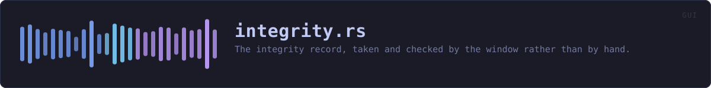
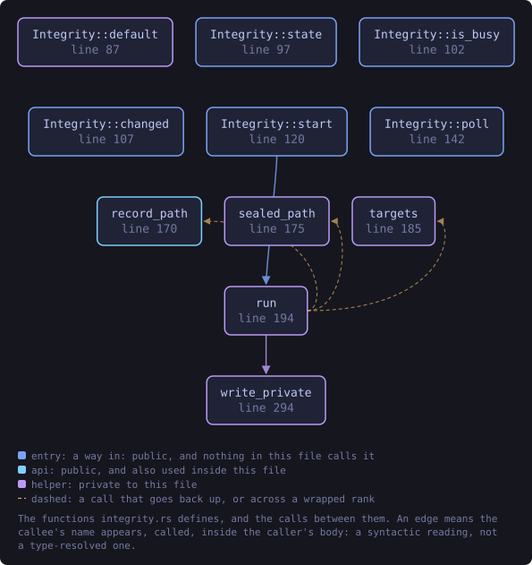

<!-- SPDX-License-Identifier: GPL-3.0-or-later -->
<!-- GENERATED by tools/docs/generate.py from the doc comments in the
     source. Do not edit this file: edit the `//!` and `///` comments in
     the .rs files and run the generator again. CI verifies it with
         python tools/docs/generate.py --check
-->

  

# `crates/veilvoice-gui/src/integrity.rs`

[`veilvoice-gui`](../../../crates/veilvoice-gui/README.md) &middot; 386 lines &middot; [read the source](https://github.com/tilas01/veilvoice/blob/main/crates/veilvoice-gui/src/integrity.rs)

## Contents

- [What this adds to veilvoice-guard](#what-this-adds-to-veilvoice-guard)
- [When it runs](#when-it-runs)
- [Sealing, and the passphrase problem underneath it](#sealing-and-the-passphrase-problem-underneath-it)
- [In plain words](#in-plain-words)
  - [What this file contains](#what-this-file-contains)
  - [What calls what](#what-calls-what)
  - [Items](#items)

The integrity record, taken and checked by the window rather than by hand.

# What this adds to `veilvoice-guard`

Nothing, cryptographically. Every hash, every comparison and every honest
limit is `veilvoice_guard`'s, and `veilvoice_guard::SCOPE` is what the
interface prints. What this module adds is that it happens at all: the
command-line `veilvoice guard init` has always been there and has always
been a thing somebody had to know to run.

# When it runs

At the first launch that finds no record, one is taken. At every launch
after that, the record is checked. Both happen on a worker thread, because
reading and hashing the installed files is disk work and the drawing thread
does none.

# Sealing, and the passphrase problem underneath it

A record written in the clear beside the files it describes is rewritten by
anybody who can change those files. Sealing it under a passphrase raises
that to needing the passphrase as well, which is a real improvement and is
what `veilvoice_guard::Manifest::seal` is for.

The awkward part is which passphrase, and when. A record cannot be sealed
by a program that has no secret, and at the moment a window opens it has
none. So:

* With an app lock set, the record is sealed under the **app-lock
passphrase**, and is taken and checked at the moment of unlocking, which
is the one moment that passphrase exists. That is the arrangement worth
having.
* With no app lock, the record is written **in the clear** and the interface
says so, in those words. It still catches accidental corruption, a failed
update and a careless overwrite. It does not catch somebody who thought to
rewrite it, and pretending otherwise by sealing it under a key stored
beside it would be a decoration, not a protection.

# In plain words

VeilVoice writes down what its own files look like the first time it runs,
and checks them every time after that.

If you have set an app lock, that record is locked with the same passphrase,
so changing the files *and* the record needs your passphrase too. If you have
not, the record is readable, and it will still spot a file that changed by
accident but not one changed by somebody covering their tracks.

## What this file contains

386 lines defining **11 functions** (6 public), **2 types** and **0 constants**. Everything below is read out of the source, so it cannot disagree with the code.

**The types it owns.**

- `enum State` (line 57) -- What the record has to say, as far as this window knows.
- `struct Integrity` (line 81) -- The integrity record as the window drives it.

**What happens when it runs.** These are the ways in: public, and nothing else in this file calls them, so they are what an outside caller reaches first.

- `Integrity::state` (line 97) -- What the last completed check found.
- `Integrity::is_busy` (line 102) -- Whether a check is running, so the window keeps repainting while it is.
- `Integrity::changed` (line 107) -- Whether the record found a difference worth showing the user.
- `Integrity::start` (line 120) -- Take or check the record, off the drawing thread.
  - reaches: `run`, `record_path`, `sealed_path`, `targets`, `write_private`
- `Integrity::poll` (line 142) -- Collect a finished check.

## What calls what

The functions this file defines, and the calls between them. Both
are read out of the source: an edge means the callee's name appears,
called, inside the caller's body. It is a syntactic reading, not a
type-resolved one, so a call made through a trait object or a macro
will not appear.

_Colour key: **entry** -- a way in: public, and nothing in this file calls it; **api** -- public, and also used inside this file; **helper** -- private to this file._

  

The same graph as Mermaid source

```mermaid
%%{init: {"theme":"base","themeVariables":{"background":"#1a1b26","primaryColor":"#1f2335","primaryTextColor":"#c0caf5","primaryBorderColor":"#7aa2f7","secondaryColor":"#16161e","tertiaryColor":"#16161e","lineColor":"#737aa2","textColor":"#c0caf5","mainBkg":"#1f2335","nodeBorder":"#7aa2f7","clusterBkg":"#16161e","clusterBorder":"#2f3549","fontFamily":"ui-monospace, SFMono-Regular, Consolas, monospace","fontSize":"14px"}}}%%
flowchart TD
    n_default["Integrity::default<br/>line 87"]
    n_state(["Integrity::state<br/>line 97"])
    n_is_busy(["Integrity::is_busy<br/>line 102"])
    n_changed(["Integrity::changed<br/>line 107"])
    n_start(["Integrity::start<br/>line 120"])
    n_poll(["Integrity::poll<br/>line 142"])
    n_record_path["record_path<br/>line 166"]
    n_sealed_path["sealed_path<br/>line 171"]
    n_targets["targets<br/>line 181"]
    n_run["run<br/>line 190"]
    n_write_private["write_private<br/>line 283"]
    n_run --> n_record_path
    n_run --> n_sealed_path
    n_run --> n_targets
    n_run --> n_write_private
    n_start --> n_run
    click n_default href "https://github.com/tilas01/veilvoice/blob/main/crates/veilvoice-gui/src/integrity.rs#L87" "open the source"
    click n_state href "https://github.com/tilas01/veilvoice/blob/main/crates/veilvoice-gui/src/integrity.rs#L97" "open the source"
    click n_is_busy href "https://github.com/tilas01/veilvoice/blob/main/crates/veilvoice-gui/src/integrity.rs#L102" "open the source"
    click n_changed href "https://github.com/tilas01/veilvoice/blob/main/crates/veilvoice-gui/src/integrity.rs#L107" "open the source"
    click n_start href "https://github.com/tilas01/veilvoice/blob/main/crates/veilvoice-gui/src/integrity.rs#L120" "open the source"
    click n_poll href "https://github.com/tilas01/veilvoice/blob/main/crates/veilvoice-gui/src/integrity.rs#L142" "open the source"
    click n_record_path href "https://github.com/tilas01/veilvoice/blob/main/crates/veilvoice-gui/src/integrity.rs#L166" "open the source"
    click n_sealed_path href "https://github.com/tilas01/veilvoice/blob/main/crates/veilvoice-gui/src/integrity.rs#L171" "open the source"
    click n_targets href "https://github.com/tilas01/veilvoice/blob/main/crates/veilvoice-gui/src/integrity.rs#L181" "open the source"
    click n_run href "https://github.com/tilas01/veilvoice/blob/main/crates/veilvoice-gui/src/integrity.rs#L190" "open the source"
    click n_write_private href "https://github.com/tilas01/veilvoice/blob/main/crates/veilvoice-gui/src/integrity.rs#L283" "open the source"
    classDef entry fill:#1f2335,stroke:#7aa2f7,color:#c0caf5
    class n_state,n_is_busy,n_changed,n_start,n_poll entry
    classDef api fill:#1f2335,stroke:#7dcfff,color:#c0caf5
    class n_record_path api
    classDef helper fill:#1f2335,stroke:#bb9af7,color:#c0caf5
    class n_default,n_sealed_path,n_targets,n_run,n_write_private helper
```

## Items

| Item | Line | Documentation |
|---|---:|---|
| `State` pub enum | [57](https://github.com/tilas01/veilvoice/blob/main/crates/veilvoice-gui/src/integrity.rs#L57) | What the record has to say, as far as this window knows. |
| `Integrity` pub struct | [81](https://github.com/tilas01/veilvoice/blob/main/crates/veilvoice-gui/src/integrity.rs#L81) | The integrity record as the window drives it. |
| `Integrity::default` fn | [87](https://github.com/tilas01/veilvoice/blob/main/crates/veilvoice-gui/src/integrity.rs#L87) |  |
| `Integrity::state` pub fn | [97](https://github.com/tilas01/veilvoice/blob/main/crates/veilvoice-gui/src/integrity.rs#L97) | What the last completed check found. |
| `Integrity::is_busy` pub fn | [102](https://github.com/tilas01/veilvoice/blob/main/crates/veilvoice-gui/src/integrity.rs#L102) | Whether a check is running, so the window keeps repainting while it is. |
| `Integrity::changed` pub fn | [107](https://github.com/tilas01/veilvoice/blob/main/crates/veilvoice-gui/src/integrity.rs#L107) | Whether the record found a difference worth showing the user. |
| `Integrity::start` pub fn | [120](https://github.com/tilas01/veilvoice/blob/main/crates/veilvoice-gui/src/integrity.rs#L120) | Take or check the record, off the drawing thread. |
| `Integrity::poll` pub fn | [142](https://github.com/tilas01/veilvoice/blob/main/crates/veilvoice-gui/src/integrity.rs#L142) | Collect a finished check. |
| `record_path` pub fn | [166](https://github.com/tilas01/veilvoice/blob/main/crates/veilvoice-gui/src/integrity.rs#L166) | Where the record is kept, beside the app lock and under the same rules. |
| `sealed_path` fn | [171](https://github.com/tilas01/veilvoice/blob/main/crates/veilvoice-gui/src/integrity.rs#L171) | The sealed record sits beside the plain one under the container suffix. |
| `targets` fn | [181](https://github.com/tilas01/veilvoice/blob/main/crates/veilvoice-gui/src/integrity.rs#L181) | The files worth watching: the running program, and nothing assumed. |
| `run` fn | [190](https://github.com/tilas01/veilvoice/blob/main/crates/veilvoice-gui/src/integrity.rs#L190) | The whole of the work, on the worker thread. |
| `write_private` fn | [283](https://github.com/tilas01/veilvoice/blob/main/crates/veilvoice-gui/src/integrity.rs#L283) |  |

---

Generated from `crates/veilvoice-gui/src/integrity.rs`. On the website: [`website/reference/veilvoice-gui/integrity.html`](../../../website/reference/veilvoice-gui/integrity.html).

Signing key fingerprint `8101FB3BB28D02FB239E0CDF9CC1C7E7A9B5833A`.
