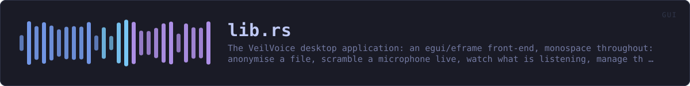

<!-- SPDX-License-Identifier: GPL-3.0-or-later -->
<!-- GENERATED by tools/docs/generate.py from the doc comments in the
     source. Do not edit this file: edit the `//!` and `///` comments in
     the .rs files and run the generator again. CI verifies it with
         python tools/docs/generate.py --check
-->

  

# `crates/veilvoice-gui/src/lib.rs`

[`veilvoice-gui`](../../../crates/veilvoice-gui/README.md) &middot; 80 lines &middot; [read the source](https://github.com/tilas01/veilvoice/blob/main/crates/veilvoice-gui/src/lib.rs)

## Contents

- [The modules](#the-modules)
- [Two rules this crate keeps](#two-rules-this-crate-keeps)
- [In plain words](#in-plain-words)
  - [What calls what](#what-calls-what)
  - [Items](#items)

The VeilVoice desktop application: an egui/eframe front-end, monospace
throughout — anonymise a file, scramble a microphone live, watch what is
listening, manage the app lock, choose how the app looks, and an about
panel that states the honest scope.

The binary lives in `main.rs`; this library exists so the UI logic can be
unit tested without opening a window.

That split is worth stating plainly, because it is the reason this crate has
tests at all: a binary crate cannot be unit tested, so everything with logic
in it -- the app lock's state machine, preference loading, palette
resolution, the reduced-motion decision -- lives here where a test can reach
it without a display server. `main.rs` holds only what genuinely needs a
window.

# The modules

| Module | What it owns |
|---|---|
| `security` | The unlock screen, the lock tab, and the at-rest controls |
| `prefs` | Preferences, and recovering from a corrupt preferences file |
| `policy` | Settings somebody has fixed, and the reason beside each one |
| `settings` | The settings tab |
| `setup` | Installing this copy, and the optional companions |
| `theme` | The palette, shared with the command-line front end |
| `soundbar` | The animated level meter |
| `reduced_motion` | Whether to animate at all |
| `watchfeed` | The device monitor, on a thread that is not this one |

# Two rules this crate keeps

**The user interface never softens a scope note.** Where a control has a
bound -- the app lock is a verifier and not disk encryption, tamper detection
detects rather than prevents -- the interface says so next to the control,
and tests fail the build if that text changes. Documentation nobody opens
does not protect anybody.

**Animation is a preference that is honoured, not a decoration.**
`reduced_motion` resolves the platform's own setting alongside the user's
explicit choice, and the whole interface reads that answer rather than each
widget deciding for itself.

# In plain words

This is the window.

Tabs down the top for the things the program does: disguise a file, scramble a
microphone as you talk, handle a recording with several people, watch for
anything using your microphone, put the app behind a password, check a
download, and change how it looks.

Nine colour schemes, and your own if you write one. It does the slow work on
another thread, so the window keeps answering while it is busy.

## What calls what

This file defines no functions of its own.

## Items

| Item | Line | Documentation |
|---|---:|---|
| `VERSION` pub const | [80](https://github.com/tilas01/veilvoice/blob/main/crates/veilvoice-gui/src/lib.rs#L80) | Crate version string, surfaced in the About panel. |

---

Generated from `crates/veilvoice-gui/src/lib.rs`. On the website: [`website/reference/veilvoice-gui/lib.html`](../../../website/reference/veilvoice-gui/lib.html).

Signing key fingerprint `8101FB3BB28D02FB239E0CDF9CC1C7E7A9B5833A`.
