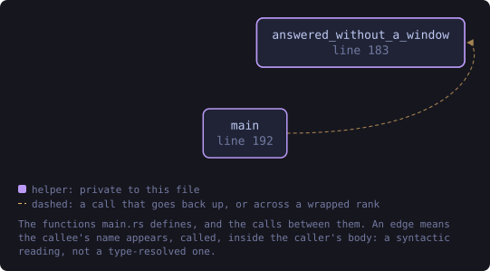
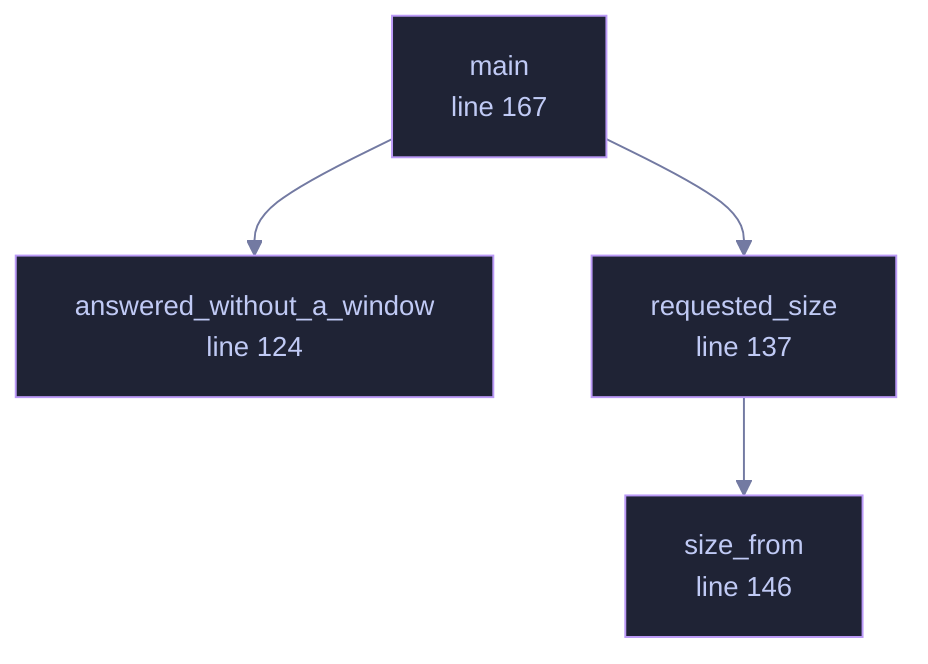

<!-- SPDX-License-Identifier: GPL-3.0-or-later -->
<!-- GENERATED by tools/docs/generate.py from the doc comments in the
     source. Do not edit this file: edit the `//!` and `///` comments in
     the .rs files and run the generator again. CI verifies it with
         python tools/docs/generate.py --check
-->

  

# `crates/veilvoice-gui/src/main.rs`

[`veilvoice-gui`](../../../crates/veilvoice-gui/README.md) &middot; 289 lines &middot; [read the source](https://github.com/tilas01/veilvoice/blob/main/crates/veilvoice-gui/src/main.rs)

## Contents

- [In plain words](#in-plain-words)
  - [What this file contains](#what-this-file-contains)
  - [What calls what](#what-calls-what)
  - [Items](#items)

Entry point for the desktop application: open a window, hand it to
`veilvoice_gui::VeilVoiceApp`, and get out of the way.

Everything of substance is in the library beside this file. That split is
the point: a binary crate cannot be unit tested, so the whole user interface
lives in `lib.rs` and its modules where tests can reach it, and this file
holds only what genuinely needs a window to exist.

Three decisions are made here and nowhere else.

**No console window on Windows, in release only.** A release build sets
`windows_subsystem = "windows"`, so double-clicking the application does not
flash up a terminal behind it. A debug build deliberately keeps the console,
because that is where panics and `eprintln!` go and losing them while
developing costs far more than the flash of a window is worth.

**The icon is raw RGBA, not a PNG.** `assets/generate.py` writes
`icon-32.rgba` beside the PNG it generates from the same pixels, so the
application can set its own title-bar icon without linking an image decoder.
A decoder is a parser, a parser is an attack surface, and this one would
exist solely to draw a 32x32 square. The length is checked before use, and a
mismatch means the window simply opens without an icon rather than panicking
at startup.

**The window has a minimum size, and it is about width.** Every tab is
inside one scroll area, so anything taller than the window can be reached by
scrolling to it and a short window loses nothing. Width is different: the
layout is monospace and column-based, and below roughly 720 across, columns
start overlapping rather than reflowing. So the floor is enforced here
rather than left to produce an unreadable window on somebody else's machine.

It opens at 1100 by 720, which is large enough to read without resizing and
still fits a 1366 by 768 laptop with its taskbar. Anything bigger opens
partly off the bottom of a common screen, which looks like a broken
application rather than a generous one.

# In plain words

Opens the window and hands over to the rest of the application.

Almost nothing happens here. Everything of substance lives beside it in code
that can be tested without a screen, and this file holds only the few things
that genuinely need a window to exist: its size, its icon, and making sure a
failure to open leaves a message behind.

## What this file contains

289 lines defining **5 functions** (0 public), **0 types** and **3 constants**. Everything below is read out of the source, so it cannot disagree with the code.

## What calls what

The functions this file defines, and the calls between them. Both
are read out of the source: an edge means the callee's name appears,
called, inside the caller's body. It is a syntactic reading, not a
type-resolved one, so a call made through a trait object or a macro
will not appear.

_Colour key: **helper** -- private to this file._

  

The same graph as Mermaid source

## Items

| Item | Line | Documentation |
|---|---:|---|
| `ICON_RGBA` const | [58](https://github.com/tilas01/veilvoice/blob/main/crates/veilvoice-gui/src/main.rs#L58) | The window icon, as raw 32x32 RGBA produced by assets/generate.py. |
| `ICON_SIZE` const | [59](https://github.com/tilas01/veilvoice/blob/main/crates/veilvoice-gui/src/main.rs#L59) |  |
| `USAGE` const | [74](https://github.com/tilas01/veilvoice/blob/main/crates/veilvoice-gui/src/main.rs#L74) | What --help prints, on the platforms where printing works. |
| `answered_without_a_window` fn | [109](https://github.com/tilas01/veilvoice/blob/main/crates/veilvoice-gui/src/main.rs#L109) | Answer --help and --version before a window is opened. |
| `answered_without_a_window` fn | [124](https://github.com/tilas01/veilvoice/blob/main/crates/veilvoice-gui/src/main.rs#L124) |  |
| `requested_size` fn | [137](https://github.com/tilas01/veilvoice/blob/main/crates/veilvoice-gui/src/main.rs#L137) | The size asked for by --size <W>x<H>, if one was and it parses. |
| `size_from` fn | [146](https://github.com/tilas01/veilvoice/blob/main/crates/veilvoice-gui/src/main.rs#L146) | The parsing half, separated from the environment so it can be tested. |
| `main` fn | [167](https://github.com/tilas01/veilvoice/blob/main/crates/veilvoice-gui/src/main.rs#L167) |  |

---

Generated from `crates/veilvoice-gui/src/main.rs`. On the website: [`website/reference/veilvoice-gui/main.html`](../../../website/reference/veilvoice-gui/main.html).

Signing key fingerprint `8101FB3BB28D02FB239E0CDF9CC1C7E7A9B5833A`.
