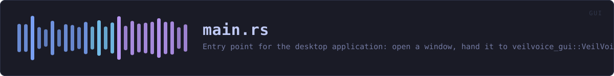

<!-- SPDX-License-Identifier: CC-BY-NC-SA-4.0 -->
<!-- GENERATED by tools/docs/generate.py from the doc comments in the
     source. Do not edit this file: edit the `//!` and `///` comments in
     the .rs files and run the generator again. CI verifies it with
         python tools/docs/generate.py --check
-->

  

# `crates/veilvoice-gui/src/main.rs`

[`veilvoice-gui`](../../../crates/veilvoice-gui/README.md) &middot; 40 lines &middot; [read the source](https://github.com/tilas01/veilvoice/blob/main/crates/veilvoice-gui/src/main.rs)

## Contents

- [What calls what](#what-calls-what)
- [Items](#items)

VeilVoice desktop application entry point.

## What calls what

The functions this file defines, and the calls between them. Both
are read out of the source: an edge means the callee's name appears,
called, inside the caller's body. It is a syntactic reading, not a
type-resolved one, so a call made through a trait object or a macro
will not appear.

```mermaid
%%{init: {"theme":"base","themeVariables":{"background":"#1a1b26","primaryColor":"#1f2335","primaryTextColor":"#c0caf5","primaryBorderColor":"#7aa2f7","secondaryColor":"#16161e","tertiaryColor":"#16161e","lineColor":"#565f89","textColor":"#c0caf5","mainBkg":"#1f2335","nodeBorder":"#7aa2f7","clusterBkg":"#16161e","clusterBorder":"#2f3549","fontFamily":"ui-monospace, SFMono-Regular, Consolas, monospace","fontSize":"14px"}}}%%
flowchart TD
    n_main["main"]
```

## Items

| Item | Line | Documentation |
|---|---:|---|
| `ICON_RGBA` const | [15](https://github.com/tilas01/veilvoice/blob/main/crates/veilvoice-gui/src/main.rs#L15) | The window icon, as raw 32x32 RGBA produced by assets/generate.py. |
| `ICON_SIZE` const | [16](https://github.com/tilas01/veilvoice/blob/main/crates/veilvoice-gui/src/main.rs#L16) |  |
| `main` fn | [18](https://github.com/tilas01/veilvoice/blob/main/crates/veilvoice-gui/src/main.rs#L18) |  |

---

Generated from `crates/veilvoice-gui/src/main.rs`. On the website: [`website/reference/veilvoice-gui/main.html`](../../../website/reference/veilvoice-gui/main.html).

Signing key fingerprint `8101FB3BB28D02FB239E0CDF9CC1C7E7A9B5833A`.
