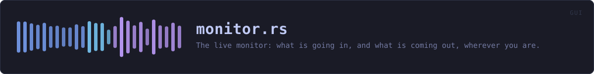
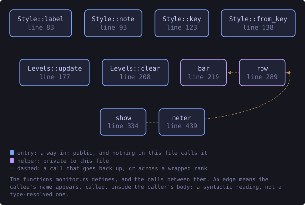
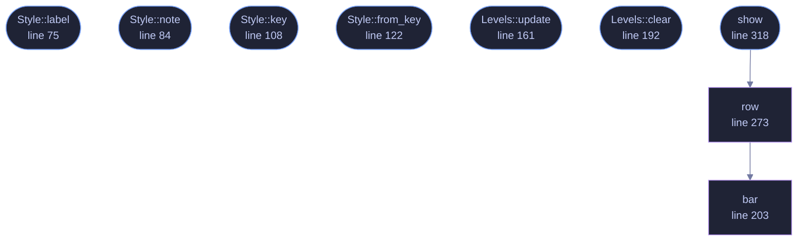

<!-- SPDX-License-Identifier: GPL-3.0-or-later -->
<!-- GENERATED by tools/docs/generate.py from the doc comments in the
     source. Do not edit this file: edit the `//!` and `///` comments in
     the .rs files and run the generator again. CI verifies it with
         python tools/docs/generate.py --check
-->

  

# `crates/veilvoice-gui/src/monitor.rs`

[`veilvoice-gui`](../../../crates/veilvoice-gui/README.md) &middot; 419 lines &middot; [read the source](https://github.com/tilas01/veilvoice/blob/main/crates/veilvoice-gui/src/monitor.rs)

## Contents

- [Why this is not just the meters on the live tab](#why-this-is-not-just-the-meters-on-the-live-tab)
- [Two places it can sit, and one way to switch it off](#two-places-it-can-sit-and-one-way-to-switch-it-off)
- [What it does not claim](#what-it-does-not-claim)
- [In plain words](#in-plain-words)
  - [What this file contains](#what-this-file-contains)
  - [What calls what](#what-calls-what)
  - [Items](#items)

The live monitor: what is going in, and what is coming out, wherever you are.

# Why this is not just the meters on the live tab

The live tab has drawn an input and an output meter for some time, and they
are the right meters. What they were not was *visible*: they are inside one
panel, and the moment somebody switched to Group to set up an interview, or
to Settings, or to Monitor, the only picture of what their microphone was
doing went off screen while the audio carried on.

That is the wrong way round for this feature in particular. Live scramble is
the mode where the thing being protected is happening *now*, in real time,
and where the two questions a person actually has are "is it hearing me" and
"is anything coming out". A meter you have to navigate to in order to answer
them is a meter that answers them late.

So the monitor rides the window. It is on by default, it shows on every tab,
and it shows exactly two things plus their state: the level going in, and
the level coming out.

# Two places it can sit, and one way to switch it off

`Style::Toolbar` docks it to the bottom of the window, where it takes a
strip of height and never covers anything. `Style::Overlay` floats it over
the panel, bottom right, for somebody who would rather keep the full height
for the panel and accept that it sits on top of a corner of it.
`Style::Off` is offered because a strip somebody does not want is a strip
they will resent, and the live tab still has the full meters either way.

The overlay is deliberately **not** click-through and **not** draggable: a
floating thing that moves is a floating thing somebody loses behind the
window edge, and this one has a close button that sets the preference
instead.

# What it does not claim

It shows levels. A level is not proof that the voice is being changed: a
working meter and a bypassed engine look identical, and saying so is the
difference between a monitor and a reassurance. What tells you the engine is
running is that the output is a voice that is not yours, which is what the
preview on the live tab is for.

# In plain words

A small strip along the bottom of the window showing how loud your voice is
going in and how loud the veiled voice is coming out, while live scramble is
running.

It follows you around the application, because the moment you want it is the
moment you are doing something else and are not sure the microphone is still
working.

It cannot tell you that the disguise is working. It can tell you that sound
is arriving and sound is leaving, which is the thing that usually goes
wrong.

## What this file contains

419 lines defining **9 functions** (7 public), **3 types** and **2 constants**. Everything below is read out of the source, so it cannot disagree with the code.

**The types it owns.**

- `enum Style` (line 63) -- Where the monitor sits, or whether it is shown at all.
- `struct Levels` (line 137) -- The smoothed levels the monitor and the live tab both draw.
- `enum Action` (line 259) -- What the reader did with the monitor this frame.

**What happens when it runs.** These are the ways in: public, and nothing else in this file calls them, so they are what an outside caller reaches first.

- `Style::label` (line 75) -- A short name, for a picker.
- `Style::note` (line 84) -- What this choice costs and buys, in the words a front end should show.
- `Style::key` (line 108) -- The identifier written to the settings file.
- `Style::from_key` (line 122) -- Read a style back.
- `Levels::update` (line 161) -- Take a new reading.
- `Levels::clear` (line 192) -- Back to nothing, for when a session stops.
- `show` (line 318) -- Draw the monitor for this frame.
  - reaches: `row`, `bar`

## What calls what

The functions this file defines, and the calls between them. Both
are read out of the source: an edge means the callee's name appears,
called, inside the caller's body. It is a syntactic reading, not a
type-resolved one, so a call made through a trait object or a macro
will not appear.

_Colour key: **entry** -- a way in: public, and nothing in this file calls it; **helper** -- private to this file._

  

The same graph as Mermaid source

## Items

| Item | Line | Documentation |
|---|---:|---|
| `Style` pub enum | [63](https://github.com/tilas01/veilvoice/blob/main/crates/veilvoice-gui/src/monitor.rs#L63) | Where the monitor sits, or whether it is shown at all. |
| `Style::label` pub fn | [75](https://github.com/tilas01/veilvoice/blob/main/crates/veilvoice-gui/src/monitor.rs#L75) | A short name, for a picker. |
| `Style::note` pub fn | [84](https://github.com/tilas01/veilvoice/blob/main/crates/veilvoice-gui/src/monitor.rs#L84) | What this choice costs and buys, in the words a front end should show. |
| `Style::ALL` pub const | [105](https://github.com/tilas01/veilvoice/blob/main/crates/veilvoice-gui/src/monitor.rs#L105) | Every style, in the order a picker should offer them. |
| `Style::key` pub fn | [108](https://github.com/tilas01/veilvoice/blob/main/crates/veilvoice-gui/src/monitor.rs#L108) | The identifier written to the settings file. |
| `Style::from_key` pub fn | [122](https://github.com/tilas01/veilvoice/blob/main/crates/veilvoice-gui/src/monitor.rs#L122) | Read a style back. |
| `Levels` pub struct | [137](https://github.com/tilas01/veilvoice/blob/main/crates/veilvoice-gui/src/monitor.rs#L137) | The smoothed levels the monitor and the live tab both draw. |
| `HOLD` const | [157](https://github.com/tilas01/veilvoice/blob/main/crates/veilvoice-gui/src/monitor.rs#L157) | How long a held peak stays up before it falls back to the current level. |
| `Levels::update` pub fn | [161](https://github.com/tilas01/veilvoice/blob/main/crates/veilvoice-gui/src/monitor.rs#L161) | Take a new reading. |
| `Levels::clear` pub fn | [192](https://github.com/tilas01/veilvoice/blob/main/crates/veilvoice-gui/src/monitor.rs#L192) | Back to nothing, for when a session stops. |
| `bar` fn | [203](https://github.com/tilas01/veilvoice/blob/main/crates/veilvoice-gui/src/monitor.rs#L203) | A compact bar, for the strip. |
| `Action` pub enum | [259](https://github.com/tilas01/veilvoice/blob/main/crates/veilvoice-gui/src/monitor.rs#L259) | What the reader did with the monitor this frame. |
| `row` fn | [273](https://github.com/tilas01/veilvoice/blob/main/crates/veilvoice-gui/src/monitor.rs#L273) | Draw the row itself. |
| `show` pub fn | [318](https://github.com/tilas01/veilvoice/blob/main/crates/veilvoice-gui/src/monitor.rs#L318) | Draw the monitor for this frame. |

---

Generated from `crates/veilvoice-gui/src/monitor.rs`. On the website: [`website/reference/veilvoice-gui/monitor.html`](../../../website/reference/veilvoice-gui/monitor.html).

Signing key fingerprint `8101FB3BB28D02FB239E0CDF9CC1C7E7A9B5833A`.
