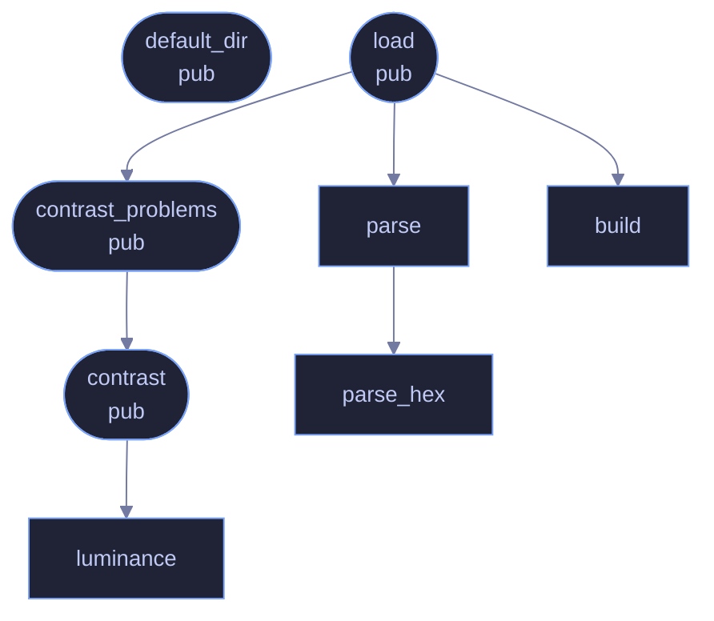

<!-- SPDX-License-Identifier: CC-BY-NC-SA-4.0 -->
<!-- GENERATED by tools/docs/generate.py from the doc comments in the
     source. Do not edit this file: edit the `//!` and `///` comments in
     the .rs files and run the generator again. CI verifies it with
         python tools/docs/generate.py --check
-->

  

# `crates/veilvoice-gui/src/palettes.rs`

[`veilvoice-gui`](../../../crates/veilvoice-gui/README.md) &middot; 691 lines &middot; [read the source](https://github.com/tilas01/veilvoice/blob/main/crates/veilvoice-gui/src/palettes.rs)

## Contents

- [A palette file is untrusted input](#a-palette-file-is-untrusted-input)
- [Contrast is computed, not trusted](#contrast-is-computed-not-trusted)
  - [What calls what](#what-calls-what)
  - [Items](#items)

User-defined colour schemes, and the contrast check that keeps them usable.

A reader can drop a small text file into a `palettes/` directory beside the
preferences file and have it appear in the theme picker alongside the nine
built-in schemes. The format is the same `key = value` shape
`crate::prefs` already uses, for the same reason: it is trivial to write
by hand, trivial to parse without a dependency, and has no syntax in which
something surprising can hide.

# A palette file is untrusted input

It arrives from the filesystem, it may have been written by hand at two in
the morning, and it may have been copied from a web page by somebody who has
never seen a hex colour. So it is parsed like anything else this project
reads: every field validated, every failure named, and **refused rather than
patched up**.

Refusing matters more here than it first appears. The obvious lenient design
is to fill in whatever is missing from the default theme -- and that produces
a palette which is *mostly* the user's, with a few colours from somewhere
else, and no indication which. The user sees an application that looks
subtly wrong and has nothing to go on. An error naming the missing token is
worth more than a window that opens.

# Contrast is computed, not trusted

The request that prompted this asked for "whatever colour with correct
contrast to read". Correct contrast is not an aesthetic judgement, it is
arithmetic: WCAG 2.1 defines relative luminance and a contrast ratio, and a
ratio below 4.5 means body text a substantial number of people cannot read.

So a palette whose foreground fails against its own background is **refused
with the measured ratio in the message**, rather than accepted and left to
produce an application nobody can use. It is the one validation here that
is about the user rather than about the parser, and it is the reason this
module exists at all rather than the fields being read straight into a
struct.

The thresholds are stated where they are enforced, and they are the
standard's, not invented here:

| Pair | Minimum | Why |
|---|---|---|
| `fg` on `bg` | 4.5 | Body text, WCAG AA |
| `fg` on `bg_soft` | 4.5 | The same text on a raised surface |
| `muted` on `bg` | 3.0 | Secondary text, AA large-text threshold |
| `accent` on `bg` | 3.0 | Links and controls, AA non-text contrast |
| `err` on `bg` | 3.0 | A warning nobody can read is worse than none |

`muted` is deliberately held to 3.0 rather than 4.5. It is used for
secondary text that is meant to recede, every built-in theme would fail at
4.5, and pretending otherwise would mean shipping a rule the project's own
themes break.

## What calls what

The functions this file defines, and the calls between them. Both
are read out of the source: an edge means the callee's name appears,
called, inside the caller's body. It is a syntactic reading, not a
type-resolved one, so a call made through a trait object or a macro
will not appear.

## Items

| Item | Line | Documentation |
|---|---:|---|
| `REQUIRED` pub const | [64](https://github.com/tilas01/veilvoice/blob/main/crates/veilvoice-gui/src/palettes.rs#L64) | Every token a palette file has to define. |
| `MAX_PALETTES` pub const | [75](https://github.com/tilas01/veilvoice/blob/main/crates/veilvoice-gui/src/palettes.rs#L75) | The most palette files that will be read from the directory. |
| `MAX_BYTES` pub const | [78](https://github.com/tilas01/veilvoice/blob/main/crates/veilvoice-gui/src/palettes.rs#L78) | The largest palette file that will be read. |
| `luminance` fn | [85](https://github.com/tilas01/veilvoice/blob/main/crates/veilvoice-gui/src/palettes.rs#L85) | Relative luminance, as defined by WCAG 2.1. |
| `contrast` pub fn | [101](https://github.com/tilas01/veilvoice/blob/main/crates/veilvoice-gui/src/palettes.rs#L101) | The WCAG contrast ratio between two colours, from 1.0 to 21.0. |
| `PAIRS` const | [108](https://github.com/tilas01/veilvoice/blob/main/crates/veilvoice-gui/src/palettes.rs#L108) | The contrast pairs a palette has to satisfy, with the reason for each. |
| `contrast_problems` pub fn | [121](https://github.com/tilas01/veilvoice/blob/main/crates/veilvoice-gui/src/palettes.rs#L121) | Check a palette's contrast, returning one message per failing pair. |
| `Parsed` struct | [147](https://github.com/tilas01/veilvoice/blob/main/crates/veilvoice-gui/src/palettes.rs#L147) | One parsed colour scheme, before it is accepted. |
| `parse_hex` fn | [154](https://github.com/tilas01/veilvoice/blob/main/crates/veilvoice-gui/src/palettes.rs#L154) |  |
| `parse` fn | [171](https://github.com/tilas01/veilvoice/blob/main/crates/veilvoice-gui/src/palettes.rs#L171) | Parse a palette file's text. |
| `build` fn | [249](https://github.com/tilas01/veilvoice/blob/main/crates/veilvoice-gui/src/palettes.rs#L249) |  |
| `default_dir` pub fn | [282](https://github.com/tilas01/veilvoice/blob/main/crates/veilvoice-gui/src/palettes.rs#L282) | Where palettes live, beside the preferences file. |
| `load` pub fn | [309](https://github.com/tilas01/veilvoice/blob/main/crates/veilvoice-gui/src/palettes.rs#L309) | Read every palette in dir, returning the usable ones and every complaint. |

---

Generated from `crates/veilvoice-gui/src/palettes.rs`. On the website: [`website/reference/veilvoice-gui/palettes.html`](../../../website/reference/veilvoice-gui/palettes.html).

Signing key fingerprint `8101FB3BB28D02FB239E0CDF9CC1C7E7A9B5833A`.
