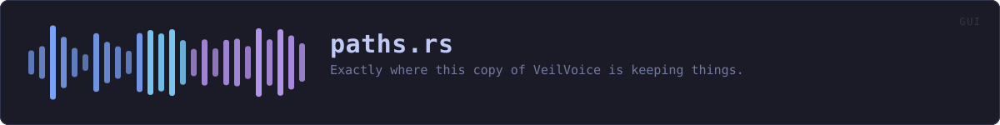
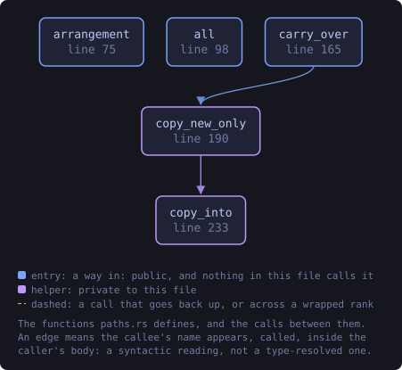
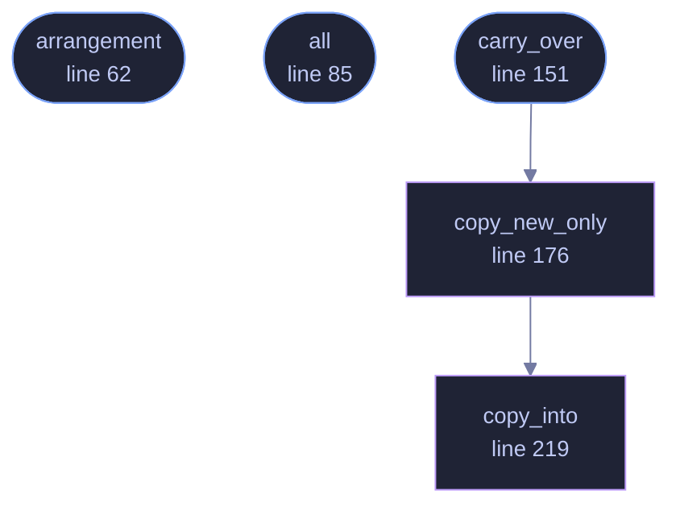

<!-- SPDX-License-Identifier: GPL-3.0-or-later -->
<!-- GENERATED by tools/docs/generate.py from the doc comments in the
     source. Do not edit this file: edit the `//!` and `///` comments in
     the .rs files and run the generator again. CI verifies it with
         python tools/docs/generate.py --check
-->

  

# `crates/veilvoice-gui/src/paths.rs`

[`veilvoice-gui`](../../../crates/veilvoice-gui/README.md) &middot; 234 lines &middot; [read the source](https://github.com/tilas01/veilvoice/blob/main/crates/veilvoice-gui/src/paths.rs)

## Contents

- [Why the About tab prints these](#why-the-about-tab-prints-these)
- [Derived, not listed](#derived-not-listed)
- [The one path deliberately not shown](#the-one-path-deliberately-not-shown)
- [In plain words](#in-plain-words)
  - [What this file contains](#what-this-file-contains)
  - [What calls what](#what-calls-what)
  - [Items](#items)

Exactly where this copy of VeilVoice is keeping things.

# Why the About tab prints these

Every one of these locations is derived on the machine it runs on, from the
environment the platform provides, and every one of them is different on
Windows, macOS and Linux. Somebody backing up a vault, moving a settings
file, or wondering why a palette they wrote is not in the picker has one
question, and until now the honest answer was "read the source".

A guess is worse than nothing here. A person told the wrong directory
deletes the wrong directory.

# Derived, not listed

Each entry calls the function the rest of the application calls, so this
panel cannot say one thing while the program does another. The list is not a
second description of where things live; it is the same one, read out.

A test reads the crate's own source for every `default_path` and
`default_dir` and fails naming any this panel does not show, so a location
added tomorrow cannot quietly stop being reported.

# The one path deliberately not shown

The app lock's own files. `veilvoice_crypto::vault` gives them names
derived from an index rather than a fixed name, which is obscurity and is
described as obscurity there: what it buys is that a search of a disk for a
known filename misses, and that a backup rule written against one does too.
Printing the names in a window would hand both back to anybody standing
behind the person reading it. The directory is shown, which is the part that
answers "what do I back up".

# In plain words

The About tab lists the folders VeilVoice is actually using on this
computer, so you can find your settings, your vaults and your palettes
without guessing.

## What this file contains

234 lines defining **5 functions** (3 public), **1 type** and **0 constants**. Everything below is read out of the source, so it cannot disagree with the code.

**The types it owns.**

- `struct Where` (line 44) -- One place VeilVoice keeps something, and what it keeps there.

**What happens when it runs.** These are the ways in: public, and nothing else in this file calls them, so they are what an outside caller reaches first.

- `arrangement` (line 62) -- Which of the two arrangements this copy is using, in one sentence.
- `all` (line 85) -- Every location, in the order the About tab shows them.
- `carry_over` (line 151) -- Copy a portable copy's state into the platform's own configuration directory, without overwriting anything already there.
  - reaches: `copy_new_only`, `copy_into`

## What calls what

The functions this file defines, and the calls between them. Both
are read out of the source: an edge means the callee's name appears,
called, inside the caller's body. It is a syntactic reading, not a
type-resolved one, so a call made through a trait object or a macro
will not appear.

_Colour key: **entry** -- a way in: public, and nothing in this file calls it; **helper** -- private to this file._

  

The same graph as Mermaid source

## Items

| Item | Line | Documentation |
|---|---:|---|
| `Where` pub struct | [44](https://github.com/tilas01/veilvoice/blob/main/crates/veilvoice-gui/src/paths.rs#L44) | One place VeilVoice keeps something, and what it keeps there. |
| `arrangement` pub fn | [62](https://github.com/tilas01/veilvoice/blob/main/crates/veilvoice-gui/src/paths.rs#L62) | Which of the two arrangements this copy is using, in one sentence. |
| `all` pub fn | [85](https://github.com/tilas01/veilvoice/blob/main/crates/veilvoice-gui/src/paths.rs#L85) | Every location, in the order the About tab shows them. |
| `carry_over` pub fn | [151](https://github.com/tilas01/veilvoice/blob/main/crates/veilvoice-gui/src/paths.rs#L151) | Copy a portable copy's state into the platform's own configuration directory, without overwriting anything already there. |
| `copy_new_only` fn | [176](https://github.com/tilas01/veilvoice/blob/main/crates/veilvoice-gui/src/paths.rs#L176) | Everything in from that is not already in into, and a line about each. |
| `copy_into` fn | [219](https://github.com/tilas01/veilvoice/blob/main/crates/veilvoice-gui/src/paths.rs#L219) | One file or one whole directory, recursively. |

---

Generated from `crates/veilvoice-gui/src/paths.rs`. On the website: [`website/reference/veilvoice-gui/paths.html`](../../../website/reference/veilvoice-gui/paths.html).

Signing key fingerprint `8101FB3BB28D02FB239E0CDF9CC1C7E7A9B5833A`.
