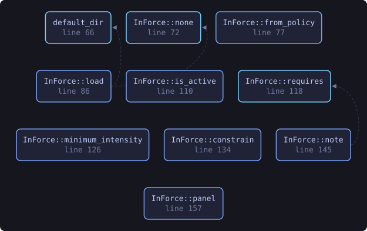

<!-- SPDX-License-Identifier: GPL-3.0-or-later -->
<!-- GENERATED by tools/docs/generate.py from the doc comments in the
     source. Do not edit this file: edit the `//!` and `///` comments in
     the .rs files and run the generator again. CI verifies it with
         python tools/docs/generate.py --check
-->

  

# `crates/veilvoice-gui/src/policy.rs`

[`veilvoice-gui`](../../../crates/veilvoice-gui/README.md) &middot; 320 lines &middot; [read the source](https://github.com/tilas01/veilvoice/blob/main/crates/veilvoice-gui/src/policy.rs)

## Contents

- [A control that is disabled without a reason is a bug report](#a-control-that-is-disabled-without-a-reason-is-a-bug-report)
- [Enforcement is not the drawing code](#enforcement-is-not-the-drawing-code)
- [Reading it costs nothing, and proves nothing](#reading-it-costs-nothing-and-proves-nothing)
- [In plain words](#in-plain-words)
  - [What this file contains](#what-this-file-contains)
  - [What calls what](#what-calls-what)
  - [Items](#items)

The policy in force, and what the interface does about it.

A thin layer over `veilvoice_policy`: read the plain file once at startup,
hand the answers to the controls it fixes, and draw the reason beside each
one.

# A control that is disabled without a reason is a bug report

Every requirement carries its own sentence
(`veilvoice_policy::Requirement::describe`), and this module draws it
under the control it has taken away. That is the whole user-facing point:
somebody who cannot turn encryption off should be able to see, without
asking anybody, that it was fixed deliberately and by what.

# Enforcement is not the drawing code

Disabling a checkbox is a claim about pixels. The values a job actually uses
come from `crate::VeilVoiceApp`'s constrained posture, so a policy holds
even if a control is drawn wrongly, and the tests assert the behaviour
rather than the layout, the same rule the at-rest dialogue follows.

# Reading it costs nothing, and proves nothing

`InForce::load` never asks for a passphrase and never blocks. It can
therefore say only that a policy is in force, not that it is the one
somebody sealed; `veilvoice policy verify` is where that question is asked.
The reason it is safe to apply an unverified policy is the one-way property
`veilvoice_policy` is built around, and `InForce::panel` states it
rather than leaving the reader to infer it.

# In plain words

Reads the rules that say which settings must stay on, and makes the window obey
them.

The controls show the value that will actually be used, rather than one that
silently changes when you press the button. A slider showing something a job
will not honour is worse than a slider you cannot move.

## What this file contains

320 lines defining **10 functions** (10 public), **1 type** and **0 constants**. Everything below is read out of the source, so it cannot disagree with the code.

**The types it owns.**

- `struct InForce` (line 48) -- The policy this machine is running under, if any.

**What happens when it runs.** These are the ways in: public, and nothing else in this file calls them, so they are what an outside caller reaches first.

- `InForce::from_policy` (line 77) -- A policy supplied directly, for tests.
- `InForce::load` (line 86) -- Read the plain policy from the usual place.
  - reaches: `default_dir`, `none`
- `InForce::is_active` (line 110) -- Whether anything is fixed.
- `InForce::minimum_intensity` (line 126) -- The intensity floor, or 0.0 when none is set.
- `InForce::constrain` (line 134) -- Apply the policy to a posture.
- `InForce::note` (line 145) -- Draw the reason a control is fixed, under that control.
  - reaches: `requires`
- `InForce::panel` (line 157) -- The summary panel, for the about tab.

## What calls what

The functions this file defines, and the calls between them. Both
are read out of the source: an edge means the callee's name appears,
called, inside the caller's body. It is a syntactic reading, not a
type-resolved one, so a call made through a trait object or a macro
will not appear.

_Colour key: **entry** -- a way in: public, and nothing in this file calls it; **api** -- public, and also used inside this file._

  

The same graph as Mermaid source

```mermaid
%%{init: {"theme":"base","themeVariables":{"background":"#1a1b26","primaryColor":"#1f2335","primaryTextColor":"#c0caf5","primaryBorderColor":"#7aa2f7","secondaryColor":"#16161e","tertiaryColor":"#16161e","lineColor":"#737aa2","textColor":"#c0caf5","mainBkg":"#1f2335","nodeBorder":"#7aa2f7","clusterBkg":"#16161e","clusterBorder":"#2f3549","fontFamily":"ui-monospace, SFMono-Regular, Consolas, monospace","fontSize":"14px"}}}%%
flowchart TD
    n_default_dir["default_dir<br/>line 66"]
    n_none["InForce::none<br/>line 72"]
    n_from_policy(["InForce::from_policy<br/>line 77"])
    n_load(["InForce::load<br/>line 86"])
    n_is_active(["InForce::is_active<br/>line 110"])
    n_requires["InForce::requires<br/>line 118"]
    n_minimum_intensity(["InForce::minimum_intensity<br/>line 126"])
    n_constrain(["InForce::constrain<br/>line 134"])
    n_note(["InForce::note<br/>line 145"])
    n_panel(["InForce::panel<br/>line 157"])
    n_load --> n_default_dir
    n_load --> n_none
    n_note --> n_requires
    click n_default_dir href "https://github.com/tilas01/veilvoice/blob/main/crates/veilvoice-gui/src/policy.rs#L66" "open the source"
    click n_none href "https://github.com/tilas01/veilvoice/blob/main/crates/veilvoice-gui/src/policy.rs#L72" "open the source"
    click n_from_policy href "https://github.com/tilas01/veilvoice/blob/main/crates/veilvoice-gui/src/policy.rs#L77" "open the source"
    click n_load href "https://github.com/tilas01/veilvoice/blob/main/crates/veilvoice-gui/src/policy.rs#L86" "open the source"
    click n_is_active href "https://github.com/tilas01/veilvoice/blob/main/crates/veilvoice-gui/src/policy.rs#L110" "open the source"
    click n_requires href "https://github.com/tilas01/veilvoice/blob/main/crates/veilvoice-gui/src/policy.rs#L118" "open the source"
    click n_minimum_intensity href "https://github.com/tilas01/veilvoice/blob/main/crates/veilvoice-gui/src/policy.rs#L126" "open the source"
    click n_constrain href "https://github.com/tilas01/veilvoice/blob/main/crates/veilvoice-gui/src/policy.rs#L134" "open the source"
    click n_note href "https://github.com/tilas01/veilvoice/blob/main/crates/veilvoice-gui/src/policy.rs#L145" "open the source"
    click n_panel href "https://github.com/tilas01/veilvoice/blob/main/crates/veilvoice-gui/src/policy.rs#L157" "open the source"
    classDef entry fill:#1f2335,stroke:#7aa2f7,color:#c0caf5
    class n_from_policy,n_load,n_is_active,n_minimum_intensity,n_constrain,n_note,n_panel entry
    classDef api fill:#1f2335,stroke:#7dcfff,color:#c0caf5
    class n_default_dir,n_none,n_requires api
```

## Items

| Item | Line | Documentation |
|---|---:|---|
| `InForce` pub struct | [48](https://github.com/tilas01/veilvoice/blob/main/crates/veilvoice-gui/src/policy.rs#L48) | The policy this machine is running under, if any. |
| `default_dir` pub fn | [66](https://github.com/tilas01/veilvoice/blob/main/crates/veilvoice-gui/src/policy.rs#L66) | Where the policy files live, beside everything else VeilVoice keeps. |
| `InForce::none` pub fn | [72](https://github.com/tilas01/veilvoice/blob/main/crates/veilvoice-gui/src/policy.rs#L72) | No policy. |
| `InForce::from_policy` pub fn | [77](https://github.com/tilas01/veilvoice/blob/main/crates/veilvoice-gui/src/policy.rs#L77) | A policy supplied directly, for tests. |
| `InForce::load` pub fn | [86](https://github.com/tilas01/veilvoice/blob/main/crates/veilvoice-gui/src/policy.rs#L86) | Read the plain policy from the usual place. |
| `InForce::is_active` pub fn | [110](https://github.com/tilas01/veilvoice/blob/main/crates/veilvoice-gui/src/policy.rs#L110) | Whether anything is fixed. |
| `InForce::requires` pub fn | [118](https://github.com/tilas01/veilvoice/blob/main/crates/veilvoice-gui/src/policy.rs#L118) | Whether a particular requirement is in force. |
| `InForce::minimum_intensity` pub fn | [126](https://github.com/tilas01/veilvoice/blob/main/crates/veilvoice-gui/src/policy.rs#L126) | The intensity floor, or 0.0 when none is set. |
| `InForce::constrain` pub fn | [134](https://github.com/tilas01/veilvoice/blob/main/crates/veilvoice-gui/src/policy.rs#L134) | Apply the policy to a posture. |
| `InForce::note` pub fn | [145](https://github.com/tilas01/veilvoice/blob/main/crates/veilvoice-gui/src/policy.rs#L145) | Draw the reason a control is fixed, under that control. |
| `InForce::panel` pub fn | [157](https://github.com/tilas01/veilvoice/blob/main/crates/veilvoice-gui/src/policy.rs#L157) | The summary panel, for the about tab. |

---

Generated from `crates/veilvoice-gui/src/policy.rs`. On the website: [`website/reference/veilvoice-gui/policy.html`](../../../website/reference/veilvoice-gui/policy.html).

Signing key fingerprint `8101FB3BB28D02FB239E0CDF9CC1C7E7A9B5833A`.
